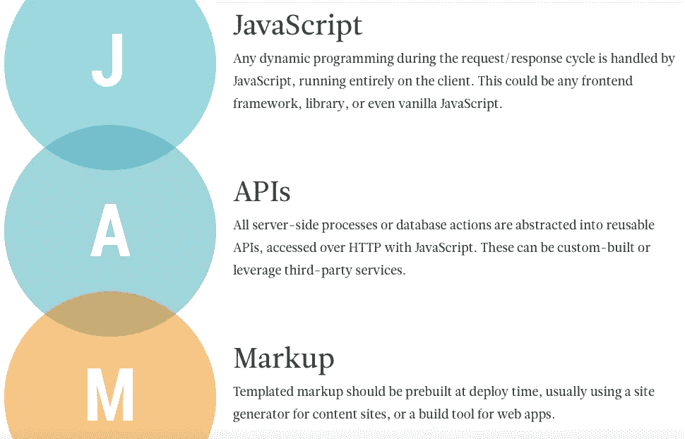
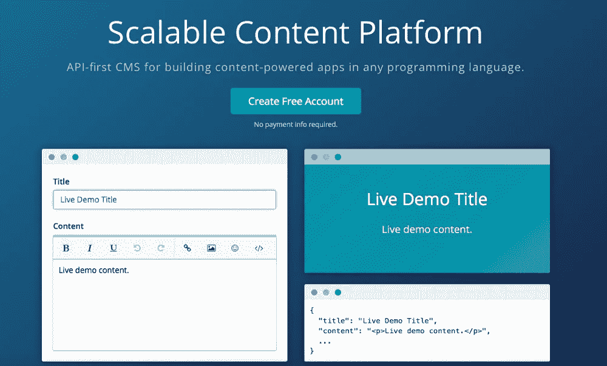
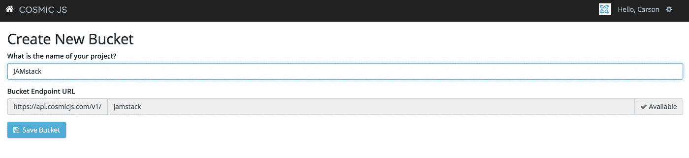
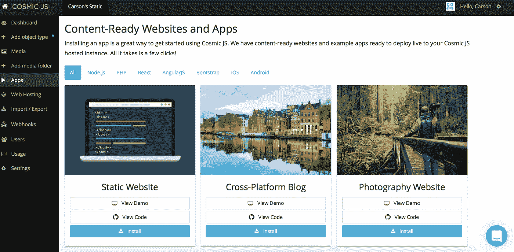
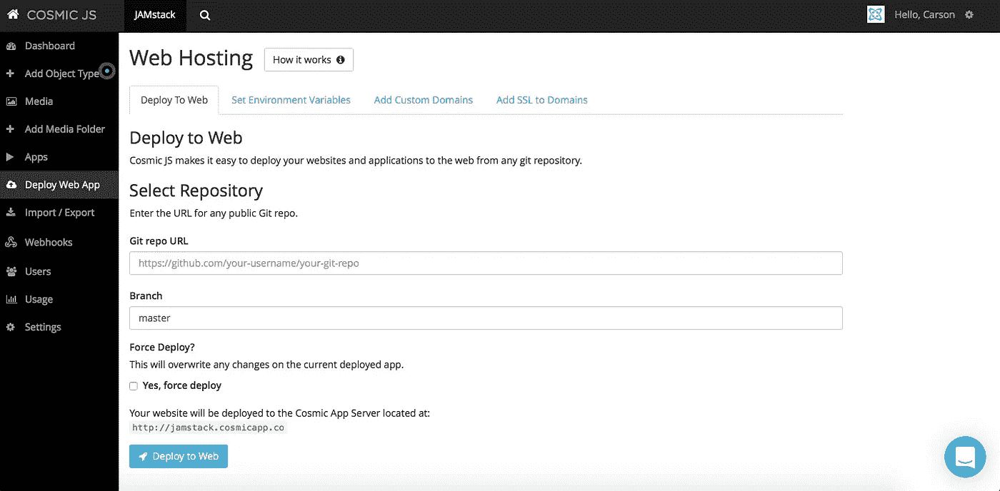

# 用 4 个步骤构建一个基于 JAMstack 的网站

> 原文：<https://medium.com/hackernoon/build-a-jamstack-powered-website-in-4-steps-b1282d545197>

根据[jamstack.org](https://jamstack.org/)的说法，当谈论 [JAMstack](https://jamstack.org/) 时，我们不再谈论操作系统、特定的 web 服务器、后端编程语言或数据库。JAMstack 不是关于特定的技术。这是一种构建网站和应用的新方式，能够提供更好的性能、更高的安全性、更低的扩展成本和更好的开发人员体验。这需要什么？

## -Javascript
-API
-标记

如果你想知道你目前是否运行在 JAMstack 上，有几个致命的错误是你正在使用一个已安装的内容管理系统，如 WordPress、Drupal、Joomla，甚至是一个浏览器构建器，如 SquareSpace 或 Wix。支持 JAMstack 的系统的一个很好的例子是 [Cosmic JS](https://cosmicjs.com/) ，这是一个 API 第一的基于云的内容管理平台，它通过将内容与代码分离来工作，并且是与编程语言无关的。

在这篇博客中，我将详细介绍如何用 4 个步骤构建一个基于 JAMstack 的静态网站。这个强大的网站给你提供了管理来自宇宙 JS API 的内容的灵活性和静态 HTML 的速度。一旦内容通过 [Cosmic JS 内容管理 API](https://cosmicjs.com/) 发生动态变化，静态网站将使用 Webhooks 和 Markdown 自动重建自身。虽然我只是从 [Cosmic JS Apps 页面](https://cosmicjs.com/apps)中挑选了一个内容就绪的静态网站，但是您可以通过阅读[如何构建一个 API 驱动的静态网站](https://cosmicjs.com/blog/how-to-build-an-api-powered-static-website-the-best-of-both-worlds)来了解如何使用 [Node.js](https://cosmicjs.com/carson-gibbons/edit-object/Node.js) (特别是 Express 框架)构建 API 驱动的静态网站。

对于这个示例应用程序，我将使用 [Cosmic JS](https://cosmicjs.com/) 。 [Cosmic JS](https://cosmicjs.com/) 是一个 API 优先的 CMS，使得管理和构建网站和应用程序更快更直观。通过将内容与代码分离， [Cosmic JS](https://cosmicjs.com/) 赋予开发者灵活性，同时确保内容编辑能够以最适合他们的方式规划和部署内容。我们将使用 Cosmic JS 来安装我们的示例应用程序，部署和更新基于云的内容管理平台的内容。

# **资源**

> [点击此处查看静态网站演示](http://static-website.cosmicapp.co/)。
> 
> [在这里查看 GitHub 上的静态网站代码库](https://github.com/cosmicjs/static-website)。
> 
> [查看 Cosmic JS 上的静态网站 App 页面](https://cosmicjs.com/apps/static-website)。

# 1.用宇宙 JS 创建一个新桶

[注册](https://cosmicjs.com/signup)参加 [Cosmic JS](https://cosmicjs.com/) 或导航至您的 Cosmic JS 仪表盘添加新的存储桶。

添加新的存储桶后，系统会提示您创建存储桶的名称。这将分配将用于应用程序的 API 端点的 bucket slug。

我将我的桶命名为“JAMstack ”,作为这个博客的例子。

# 2.安装 Cosmic JS API 驱动的静态网站

一旦我保存了我的 bucket，我将可以选择安装一个应用程序或者直接创建我的对象类型。我正在从[宇宙 JS 应用页面](https://cosmicjs.com/apps)安装 [API 驱动的静态网站](https://cosmicjs.com/apps/static-website)。

一旦你选择了应用程序，你会在你的宇宙 JS 仪表板中看到[应用程序页面](https://cosmicjs.com/apps)。您可以在 Node.js、PHP、React 以及其他标签之间进行过滤，以在[内容就绪网站和应用](https://cosmicjs.com/apps)之间进行过滤。

我安装了[静态网站](https://cosmicjs.com/apps/static-website),然后看到一个部署到 Web 模式。我喜欢在安装应用程序的那一刻部署它们，这样我就可以在[宇宙 JS CMS](https://cosmicjs.com/) 中编辑我的 web 应用程序，并在 API 立即更新我的应用程序时实时刷新以查看我的结果。

# 3.部署静态网站

一旦选择部署到 Web，您将可以选择设置环境变量以及添加[托管功能](https://cosmicjs.com/features)，如[自定义域](https://youtu.be/xlphcQ32YHM)和[一键式 SSL](https://cosmicjs.com/blog/video-tutorial-one-click-ssl) 。

点击 Deploy to Web，会出现一个“Deploy Web App”模式，澄清我的 GitHub 分支、部署位置等等。在[宇宙 JS](https://cosmicjs.com/) 上的平均部署需要 2 分钟。我收到一封电子邮件，里面有我静态网站的实时链接。

# 4.管理动态内容和审查

静态 HTML 和 Markdown 相结合的快速体验。[宇宙 JS API](https://cosmicjs.com/) 为 [API 驱动的静态网站](https://cosmicjs.com/blog/how-to-build-an-api-powered-static-website-the-best-of-both-worlds)提供动态内容，通过[宇宙 JS 内容管理平台](https://cosmicjs.com/)控制。

编辑对象，添加新媒体和发布内容到您的静态网站。静态网站在页面加载时会随着内容的变化而自动重建，因此您可以实时地维护静态网站。

[Cosmic JS](https://cosmicjs.com/) 是一个 [API 第一的基于云的内容管理平台](https://cosmicjs.com/)，使得管理应用和内容变得容易。如果您对 Cosmic JS API 有任何疑问，请通过 [Twitter](https://twitter.com/cosmic_js) 或 [Slack](https://cosmicjs.com/community) 联系我们。

> [黑客中午](http://bit.ly/Hackernoon)是黑客如何开始他们的下午。我们是 [@AMI](http://bit.ly/atAMIatAMI) 家庭的一员。我们现在[接受投稿](http://bit.ly/hackernoonsubmission)，并乐意[讨论广告&赞助](mailto:partners@amipublications.com)机会。
> 
> 如果你喜欢这个故事，我们推荐你阅读我们的[最新科技故事](http://bit.ly/hackernoonlatestt)和[趋势科技故事](https://hackernoon.com/trending)。直到下一次，不要把世界的现实想当然！

