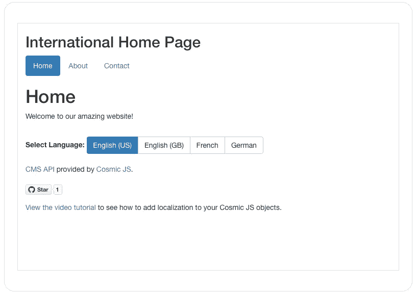
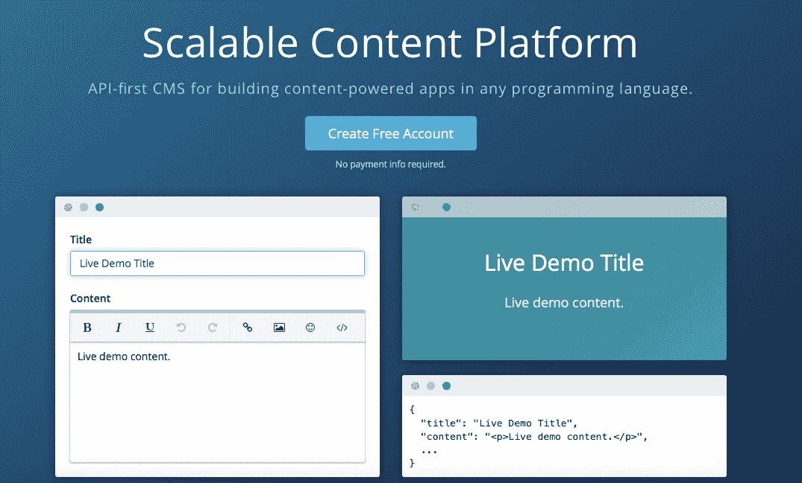
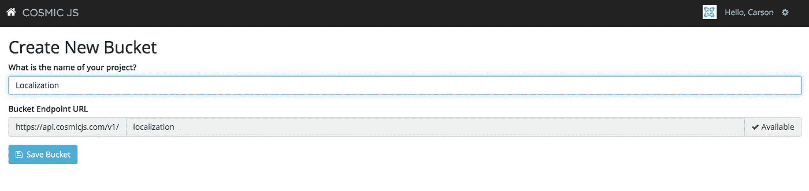
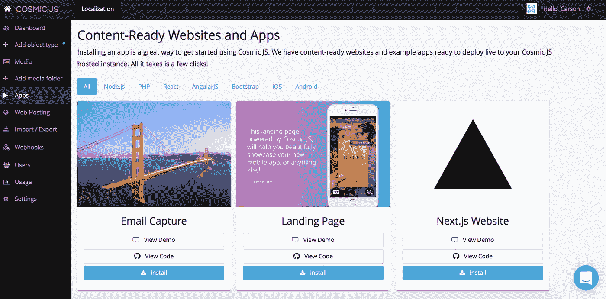
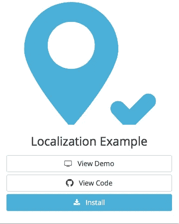
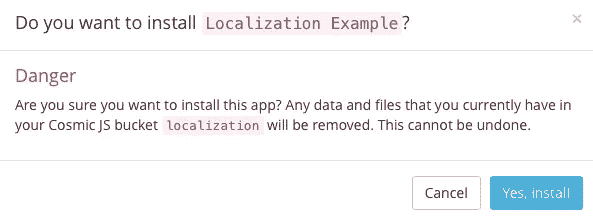
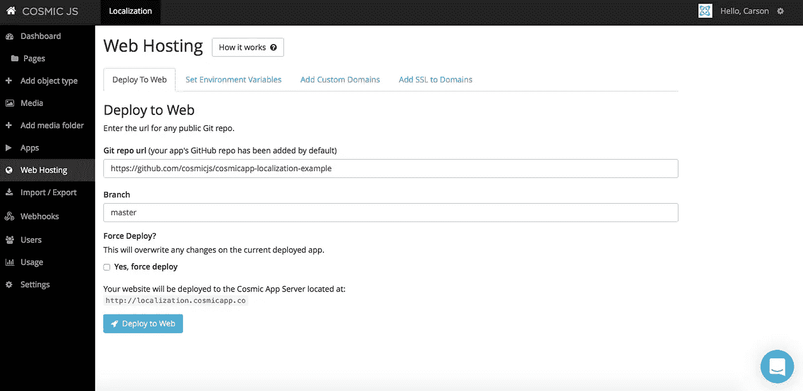
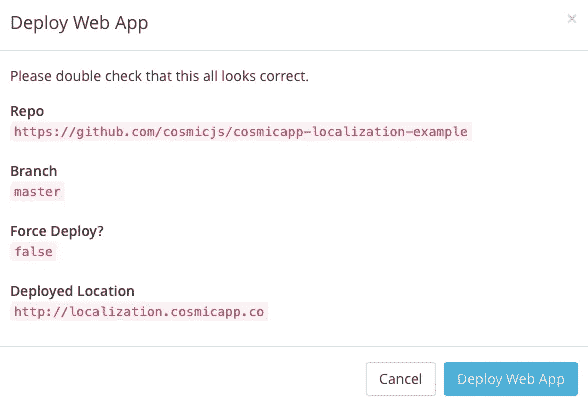
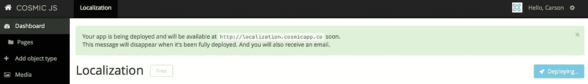
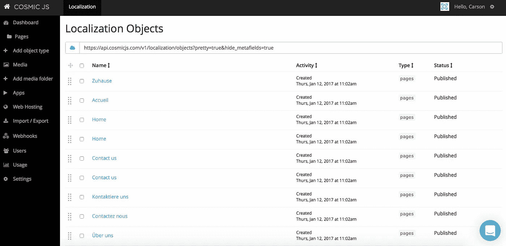

# 用 4 个步骤构建本地化应用程序

> 原文：<https://medium.com/hackernoon/build-a-localized-application-in-4-steps-3e87f1a595d8>

在当今的技术领域，全球化的影响无处不在——从大多数国家购买产品的能力，与来自另一个大陆的商业伙伴(虚拟地)互动的能力，甚至实时社交媒体对新闻的关注，无论它发生在哪里。在全球化的背景下，通过一个叫做“本地化”的术语，重心的转移又转回到超本地化的消费者社区。

虽然被抛出的词语是崇高的和更大的讨论主题，但就本博客的目的而言，本地化将被描述为以指定的本地化语言向不同地理位置的众多消费者提供相同的原始内容。相同的内容经过适当的本地化后，就像是量身定制的体验。

今天，我将演示如何使用由 [Cosmic JS CMS API](https://cosmicjs.com/) 提供的内容构建一个本地化应用程序的基本示例。为您的 Cosmic JS 对象类型添加本地化允许您添加不同语言和地区的内容版本，方法是使用简单的 Ajax 请求在不同的地理位置之间切换内容。我将使用的[本地化示例应用](https://cosmicjs.com/apps/localization-example)是来自 [Cosmic JS](https://cosmicjs.com/) 的一个内容就绪的 web 应用。

对于这个示例应用程序，我将使用 [Cosmic JS](https://cosmicjs.com/) 。Cosmic JS 是一个 [API 优先的 CMS](https://cosmicjs.com/) ，它使得管理和构建网站和应用程序更加快速和直观。通过将内容从代码中分离出来，Cosmic JS 增强了开发人员的灵活性，同时确保内容编辑人员能够以最适合他们的方式规划和部署内容。我们将使用 Cosmic JS 来安装我们的示例应用程序，部署和更新来自基于云的内容管理平台的内容。

如果你还没有，那就从[报名](https://cosmicjs.com/signup)参加[宇宙 JS](https://cosmicjs.com/) 开始吧。下面提供了有用的资源来简化您的开发操作。

> [本地化实例 App 页面](https://cosmicjs.com/apps/localization-example)
> [本地化实例 App 演示](https://cosmicjs.com/apps/localization-example/demo)
> [本地化实例 App Codebase on GitHub](https://github.com/cosmicjs/cosmicapp-localization-example)
> [视频教程:本地化](https://cosmicjs.com/blog/video-tutorial-localization)

# 1.创建新的存储桶

您的 bucket 的名称是您正在构建的网站、项目、客户端或 web 应用程序的名称。为了保持示例博客的简洁，我将我的博客命名为“本地化”。

# 2.安装本地化示例应用程序

一旦你注册并命名了你的桶，你将被提示从头开始或者“查看一些应用”。在这篇博客中，我简单地点击了右键“查看一些应用程序”，这样我就可以开始安装 [Cosmic JS 本地化示例应用程序了。](https://cosmicjs.com/apps/localization-example)

# 应用程序安装选项

[Cosmic JS](https://cosmicjs.com/) 让你能够在编程语言之间进行过滤，比如 [Node.js](https://cosmicjs.com/apps) 、 [PHP](https://cosmicjs.com/apps) 、 [React](https://cosmicjs.com/apps) 、 [AngularJS](https://cosmicjs.com/apps) 等等。

只需点击[本地化示例](https://cosmicjs.com/apps/localization-example)图标下的“安装”即可开始，或者访问 [Cosmic JS Apps 页面](https://cosmicjs.com/apps)。

# 3.部署到 Web

我点击了“部署到 Web”。然后，我可以在部署 web 应用程序时编辑对象。您将收到一封电子邮件，确认您的 web 应用程序的部署。如果您在部署过程中遇到任何问题，您可能会被转到 [Cosmic JS 故障排除页面](https://cosmicjs.com/troubleshooting)。

# 确认部署位置和分支

# 部署分支机构确认模式

我从一个回购中提取，我的分支被澄清，我有一个与我在步骤 1 中创建的 slug / bucket 名称相匹配的部署位置。

# 展开，展开

给你一点保证，让你很快就能在网上活得好好的。:)

# 4.编辑全局对象

现在你可以编辑全局对象、文件、用户、媒体等等。编辑是在宇宙 JS 仪表盘中实现的梦想。要了解更多关于如何在编辑内容的情况下构建 [Cosmic JS](https://cosmicjs.com/) 的信息，请阅读在内容编辑器的情况下构建。

# 应用部署确认

您将收到一封电子邮件，确认您已部署的 web 应用程序，以及用于访问您的实时应用程序和管理其内容的链接和说明。就像注册、创建新的存储桶、安装 web 应用程序、编辑对象和部署一样简单！我收到了访问我的 web 应用程序的确认电子邮件，还看到了我的桶升级选项，如自定义域、一键式 SSL、webhooks 和本地化。

[Cosmic JS](https://cosmicjs.com/) 是一个 API 第一的基于云的内容管理平台，使管理应用和内容变得容易。如果你有关于 Cosmic JS API 的问题，请在 [Twitter](https://twitter.com/cosmic_js) 或 [Slack](https://cosmicjs.com/community) 上联系创始人。

[卡森·吉本斯](https://twitter.com/carsoncgibbons)是[宇宙 JS](https://cosmicjs.com/) 的联合创始人& CMO，宇宙 JS 是一个 API 第一的基于云的[内容管理平台](https://cosmicjs.com/)，它将内容与代码分离，允许开发者用他们想要的任何编程语言构建流畅的应用和网站。

> [黑客中午](http://bit.ly/Hackernoon)是黑客如何开始他们的下午。我们是 AMI 家庭的一员。我们现在[接受投稿](http://bit.ly/hackernoonsubmission)并乐意[讨论广告&赞助](mailto:partners@amipublications.com)机会。
> 
> 如果你喜欢这个故事，我们推荐你阅读我们的[最新科技故事](http://bit.ly/hackernoonlatestt)和[趋势科技故事](https://hackernoon.com/trending)。直到下一次，不要把世界的现实想当然！

