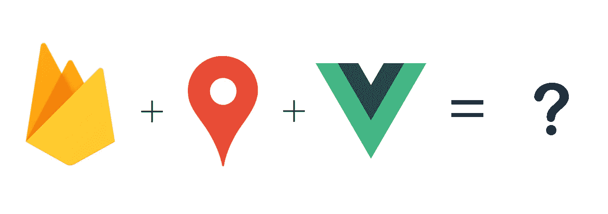
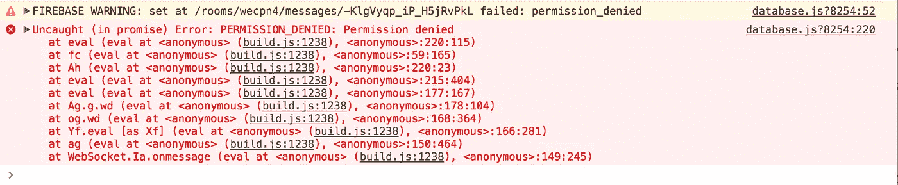
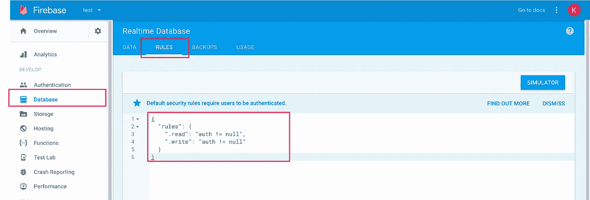
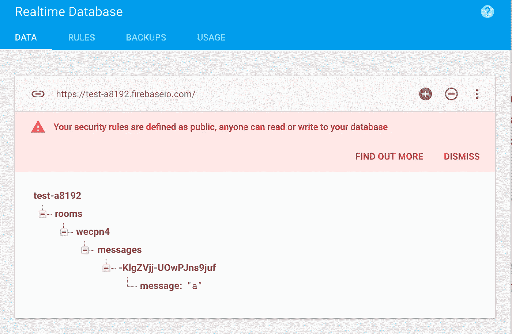
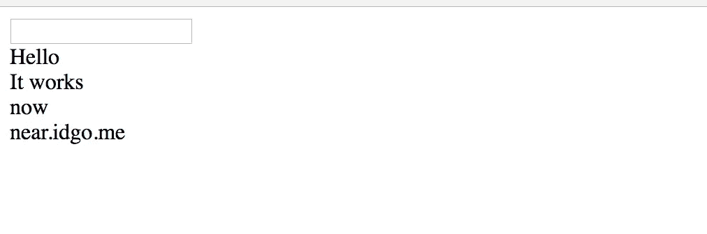

# 用 Firebase 和 Vue.js 建立一个基于位置的聊天室

> 原文：<https://medium.com/hackernoon/build-a-location-based-chatroom-with-firebase-and-vue-js-part-1-27e7f777d1ac>



# **简介**

最近，我和我的朋友在**(**[**https://Near . idgo . me)**附近建立了一个基于位置的聊天室，名为—](https://near.idgo.me.) [**。**](https://near.idgo.me)人们可以通过网络应用在附近相互交谈。我们愿意分享我们做了什么，以及如何做到这一点。请随时回复这篇文章给我们反馈。

# 先决条件

1.  Geohash 的基础知识
2.  火碱的基本知识
3.  Vue.js 组件的基础知识

# 我们想要实现什么？

在本教程中，我们会尽量使**简单**，这样你可以很快看到效果。所以，今天我们将介绍以下步骤。

1.  通过地理定位 API 获取用户的位置，并将纬度和经度转换为 geohash
2.  向房间发送消息
3.  显示消息

# 什么是 Geohash？

在谈论如何做到这一点之前，我们想简单介绍一下什么是 geohash。Geohash 是一个地理编码系统，它将在本教程中用来定义一个聊天室。

比如 **wecnvgm2re3u** 代表香港尖沙咀(经纬度= 22.29818732，114.16646970)。每个 geohash 字符代表世界上的一个区域，更多的字符意味着对一个地方更具体。你可以使用这个[工具](http://geohash.co/)来了解它是如何工作的。

在该应用中，geohash 是基于用户位置定义房间 ID 并使用 geohash 精度(geohash 的长度)定义区域覆盖的理想机制。

# 创建一个 Vue 项目

在本文中，我们使用 [vue-cli](https://github.com/vuejs/vue-cli) 来生成一个 Vue seed 项目。

安装 **vue-cli**

可能需要 Root 权限

```
npm install -g vue-cli
```

通过 **vue-cli** 初始化一个 vue 项目

```
vue init webpack-simple my-project
```

在本教程中，我们使用 **webpack-simple** 模板作为演示。有关 vue-cli 的更多详细信息，请参见此处的。

通过以下命令安装依赖项并运行项目

```
cd my-project
npm install
npm run dev
```

现在，您可以在 **localhost:8080** 上访问您的项目

在我们创建了一个 Vue 项目并安装了依赖项之后，我们就可以开始处理 Vue 组件了(***my-project/src/app . Vue***)。如果不熟悉 Vue 单文件组件，可以看一下[官网](https://vuejs.org/v2/guide/single-file-components.html)。

接下来，尝试修改您的脚本，使其成为以下结构。在组件内部，添加一些数据变量来存储聊天室信息。

**房间** —代表房间的 Firebase 参考对象

**精度**-geo hash 的精度(在本教程中默认为 6)

**db** —用于与 Firebase 通信的 Firebase SDK

**安装 Firebase 和 Geohash 编码器**

除了 Vue.js，我们还需要 [Firebase SDK](https://www.npmjs.com/package/firebase) 与 Firebase 通信，并使用 [geohash converter](https://github.com/chrisveness/latlon-geohash) 包将经纬度编码为 geohash(房间 ID)。您可以通过以下命令安装这两个包。

```
npm install --save firebase latlon-geohash
```

安装完这两个包后，可以在 **App.vue** 中的 script 标签内导入。对于 **Geohash** 包，我们稍后会解释。

```
import * as Firebase from 'firebase'
import Geohash from 'latlon-geohash'export default{// ....
}
```

**当组件准备好时初始化 Firebase**

当 Vue 组件准备就绪时，[安装钩](https://vuejs.org/v2/api/#mounted)将被调用。因此，我们可以初始化一个 Firebase 客户端对象，并将其分配给一个名为— **db 的变量。**记得把你的 Firebase 凭证比如 **apiKey、** **authDomain** 、 **databaseURL** 和 **projectId** 作为参数。我们假设您知道如何设置 Firebase 项目并获得证书。如果你不知道如何设置，请访问 [Firebase 入门指南](https://firebase.google.com/docs/web/setup)。

# 依赖关系准备好了。是时候建设了。

## 1.获取用户的位置，并将纬度和经度转换为 geohash

在这一步，我们将创建一个名为— **init()** 的方法，通过[地理定位 API](https://developer.mozilla.org/en-US/docs/Web/API/Geolocation/Using_geolocation) 访问用户的位置，并将其转换为 geohash，以便我们可以定义他们应该去哪个房间。

获得地理位置后，我们使用之前导入的 Geohash 编码器将位置转换为 geohash。

例如:

地点: **22.29818732，114.16646970**=>**wecnvg(geo hash)**

由于我们设置默认精度为 6，编码器只返回 6 个字符。当我们获得 geohash 时，我们用房间 ID (geohash)初始化一个 Firebase 引用，并将该引用分配给**房间**变量，该变量可以在以后重用。

好的。 **init** 方法已经完成，但是我们仍然需要在组件准备好的时候调用它。所以，调用**挂载钩子**内部的 **init** 方法。比如下面的代码。然后，当组件准备好时，组件将尝试访问用户的位置。

## 2.创建一个输入元素来发送消息

在组件(App.vue)的*模板*标签内创建一个 input 元素。我们使用 v-model **messageInput** 来存储消息，并使用 *trim* 来删除输入的前导空格。当用户在输入元素中按回车键时。将调用方法 **send(messageInput)** 。记得在数据部分创建一个 **messageInput** 键。

现在，我们将实现 **send(messageInput)** 方法来处理来自 Input 元素的事件。在这个方法中，我们简单地创建一个临时对象，用一个名为— **message** 的键来存储消息体。之后，调用 **push()** 来获得一个键，然后在那个键上设置值。

发送消息时，记得清除 **messageInput** 值。否则，你的输入总是在那里。

当你按下回车键时，你的浏览器控制台可能会出现一个错误。下图来自 Chrome 控制台。



别担心。因为 Firebase 默认情况下只允许授权用户访问，所以您需要为此启用权限。

按照以下步骤启用权限:

1.  转到 Firebase 控制台
2.  选择您的项目
3.  选择数据库部分



你可以在**规则**部分看到 JSON 并看到默认设置。

```
{
  "rules": {
    ".read": "auth != null",
    ".write": "auth != null"
  }
}
```

我们想快速看到效果。我们通过以下设置使任何人都可以访问 Firebase。 ***(此方法仅供演示。不要在生产中做)。***

```
{
  "rules": {
    ".read": true,
    ".write": true
  }
}
```

发布规则后，您可以尝试再次发送消息。再也没有错误了。如果您可以访问 Firebase 控制台，您可以看到输入的数据(如下图所示)。



***注意* :** 由于地理定位是一个异步过程(在步骤 1 中)，地理定位不能立即获得。因此，最好添加一个标志来指示地理定位就绪。否则，当您发送消息时，将会因为房间 ID (Geohash)未准备好而引发错误。

## 3.显示消息

我们已经知道如何向 Firebase 发送消息。现在，我们将创建一个监听器来监听来自 Firebase 的事件，并在消息到来时显示消息。

下面的代码显示了如何创建一个事件监听器，并在选择房间后激活事件监听器。当一个新消息添加到 Firebase 中时，一个事件 **child_added** 将被触发，并使用快照数据运行回调方法。如果你不知道 Firebase 如何工作，很好地阅读教程[这里](https://firebase.google.com/docs/reference/js/firebase.database.Reference#on)。在回调方法内部，数据的快照将被推入**消息**变量。

接下来，当**消息**变量改变时，我们需要以 HTML 级别呈现数据。将下面的代码添加到模板标记内。

```
<div v-for="msg in messages">{{msg.message}}</div>
```

因为步骤 2 中 Firebase 中消息的基本数据结构如下:

```
{
  "message":"my message"
}
```

因此，在 HTML 级别，我们可以访问 **msg.message** 来显示数据。当您发送消息时，将会显示一条新消息。

# **结合在一起**

## 最终视图



# 结论

最后，本教程中有一些要点:

1.  请确保您有权限访问 Firebase
2.  由于获取地理位置是一个异步过程，所以在向 Firebase 发送消息之前，请确保您已经获取了地理位置。
3.  在每个部分创建适当的变量
4.  激活事件监听器以监听新消息

有一个已经完成的应用—[**https://near . idgo . me**](https://near.idgo.me)

请随时给我们反馈。不管是好是坏。此外，我们将准备第二部分，使聊天室更有趣。

[](http://bit.ly/HackernoonFB)[](https://goo.gl/k7XYbx)[](https://goo.gl/4ofytp)

> 黑客中午是黑客如何开始他们的下午。我们是这个家庭的一员。我们现在[接受投稿](http://bit.ly/hackernoonsubmission)并乐意[讨论广告&赞助](mailto:partners@amipublications.com)机会。
> 
> 如果你喜欢这个故事，我们推荐你阅读我们的[最新科技故事](http://bit.ly/hackernoonlatestt)和[趋势科技故事](https://hackernoon.com/trending)。直到下一次，不要把世界的现实想当然！

