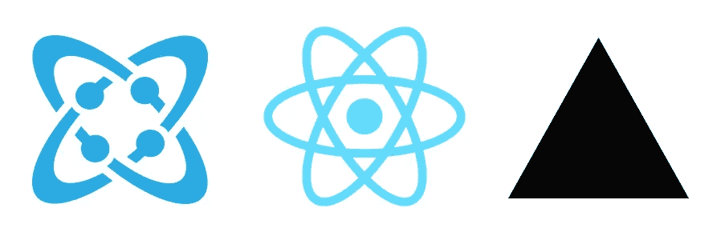
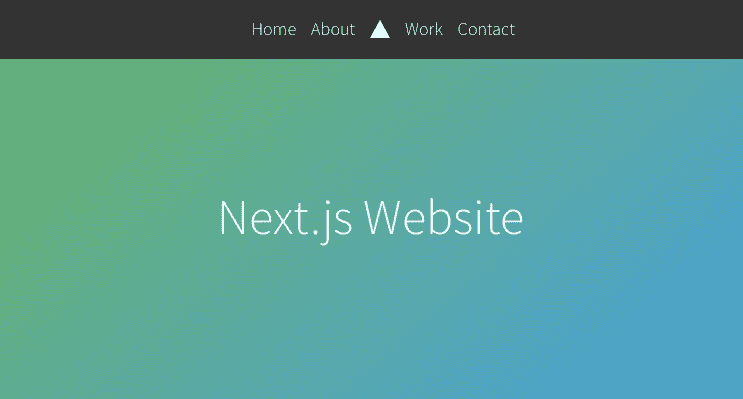
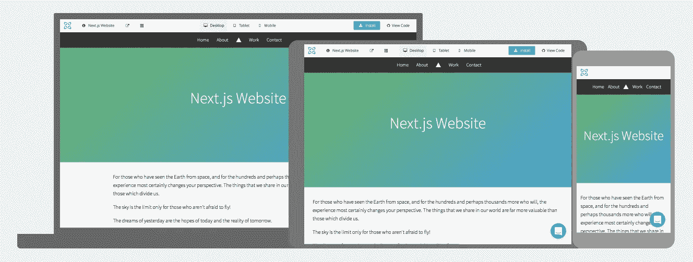
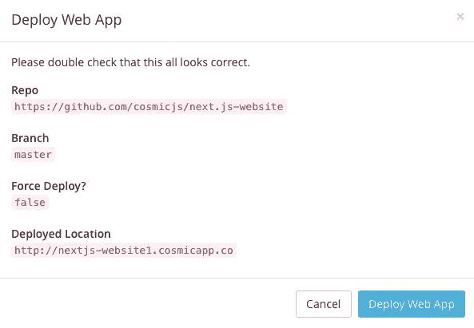
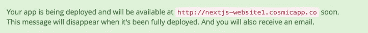
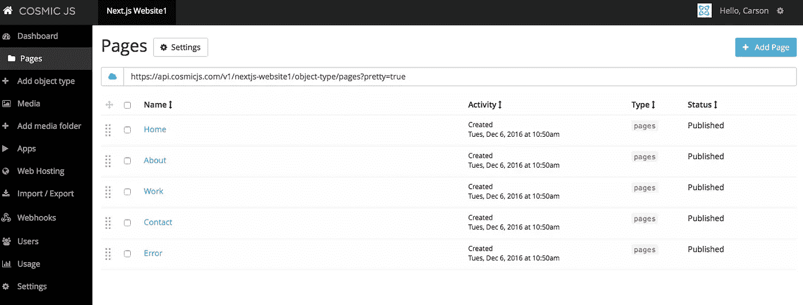
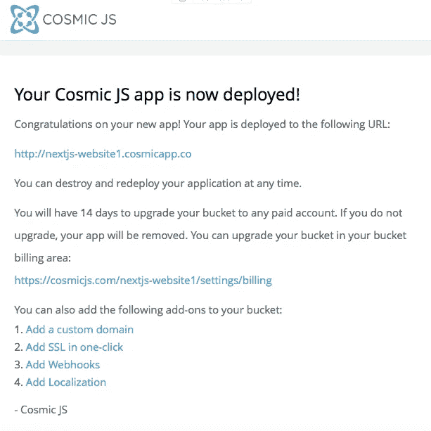

# 用 4 个步骤建立一个 Next.js 网站

> 原文：<https://medium.com/hackernoon/build-a-next-js-website-in-4-steps-ce0072c3bb6e>

> 卡森·吉本斯是 [Cosmic JS](https://cosmicjs.com) 的联合创始人和 CMO，这是一个 API 第一的基于云的[内容管理平台](https://cosmicjs.com)，它将内容与代码分离，允许开发人员用他们想要的任何编程语言构建流畅的应用程序和网站。

在这篇博客中，我将向你展示如何选取一个现有的网站实例，并将其缩减为你自己的、漂亮的 Next.js 网站，用于发布内容和方便更新。这个 [React 通用网站](https://cosmicjs.com/apps/nextjs-website)是使用 [Next.js 框架](https://github.com/zeit/next.js)构建的。代码在客户机和服务器之间共享，使得开发变得轻而易举。添加 Cosmic JS 驱动的内容，你将把你的网站带到下一个. JS 级别。

Next.js 是 React 开源生态系统中令人惊叹的新成员。它是“通用服务器渲染的 React 应用程序的极简框架”，使得构建这类应用程序的过程更快更容易。

如果你还没有，那就从[注册](https://cosmicjs.com/signup)参加[宇宙 JS](https://cosmicjs.com/) 开始吧。下面提供了有用的资源来简化您的开发操作。

*   [Next.js 网站页面](https://cosmicjs.com/apps/nextjs-website)
*   [Next.js 网站演示](https://cosmicjs.com/apps/nextjs-website/demo)
*   [GitHub 上的 Next.js 代码库](https://github.com/cosmicjs/next.js-website)

# 1.创建新的存储桶

您的 bucket 的名称是您正在构建的网站、项目、客户端或 web 应用程序的名称。

# 2.安装下一个。JS 应用程序

一旦你注册并命名了你的桶，你将被提示从头开始或者“查看一些应用”。对于这个博客，我简单地点击了右键“查看一些应用程序”,这样我就可以开始安装 [Next.js 网站了。](https://cosmicjs.com/apps/nextjs-website)

# 应用程序安装选项

[Cosmic JS](https://cosmicjs.com/) 让你能够在编程语言之间进行过滤，比如 [Node.js、PHP、React、AngularJS](https://cosmicjs.com/apps) 等等。只需点击 Next.js 网站图标下方的“安装”即可开始，或者访问[宇宙 js 应用页面](https://cosmicjs.com/apps)。

# 3.部署到 WEB

我点击了“部署到 Web”。然后，在部署 web 应用程序时，我可以开始编辑我的全局对象、对象类型和页面。您将收到一封电子邮件，确认您的 web 应用程序的部署。如果您在部署期间遇到任何问题，您可能会被转到 [Cosmic JS 故障排除页面](https://cosmicjs.com/troubleshooting)。

# 确认部署位置和分支

我从一个回购中提取，我的分支被澄清，我有一个与我在步骤 1 中创建的 slug / bucket 名称相匹配的部署位置。

# 展开，展开

给你一点保证，让你很快就能在网上活得好好的。:)

# 4.编辑全局对象、对象类型和对象

编辑是在宇宙 JS 仪表盘中实现的梦想。要了解更多关于如何在编辑内容的情况下构建 Cosmic JS 的信息，请阅读[构建内容编辑器。](https://cosmicjs.com/blog/building-with-the-content-editor-in-mind)

# 应用部署确认

就像注册、创建新桶、安装 web 应用程序、编辑内容和部署一样简单！我收到了访问我的 web 应用程序的确认电子邮件，还看到了我的桶升级选项，如自定义域、一键式 SSL、webhooks 和本地化。

[Cosmic JS](https://cosmicjs.com/) 是一个 [API 第一的基于云的内容管理平台](https://cosmicjs.com/)，使得管理应用和内容变得容易。如果你对 Cosmic JS API 有任何疑问，请联系 Twitter 或 Slack 的创始人。

# 阅读更多

1.  [如何使用 React Native 和 Node.js 构建跨平台博客](https://cosmicjs.com/blog/how-to-build-a-cross-platform-blog-using-react-native-and-nodejs)
2.  [如何搭建一个 Next.js React 通用 App](https://cosmicjs.com/blog/how-to-build-a-nextjs-react-universal-app)
3.  [使用 React | MobX | Bootstrap](https://hackernoon.com/how-to-build-a-node-js-user-management-app-12d900695ef6#.f4t9xjcps) 构建投票应用
4.  [宇宙堆栈](/cosmicjs/the-cosmic-stack-30ae4a55dff5?source=user_profile---------9---------)

> [黑客中午](http://bit.ly/Hackernoon)是黑客如何开始他们的下午。我们是 [@AMI](http://bit.ly/atAMIatAMI) 家庭的一员。我们现在[接受投稿](http://bit.ly/hackernoonsubmission)并乐意[讨论广告&赞助](mailto:partners@amipublications.com)机会。
> 
> 如果你喜欢这个故事，我们推荐你阅读我们的[最新科技故事](http://bit.ly/hackernoonlatestt)和[趋势科技故事](https://hackernoon.com/trending)。直到下一次，不要把世界的现实想当然！

