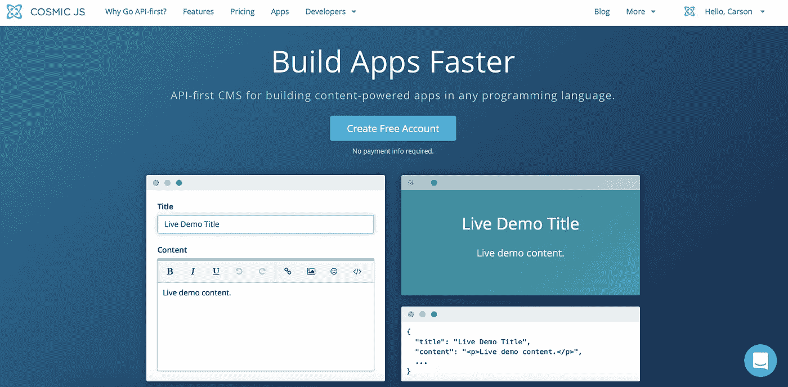
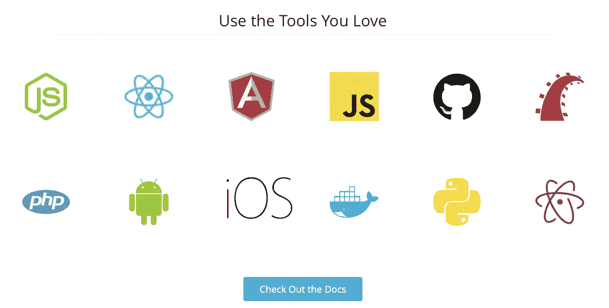
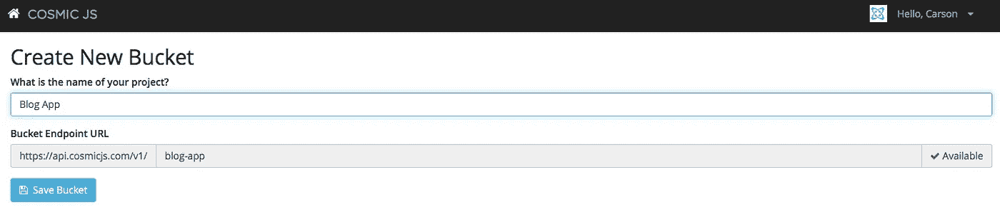
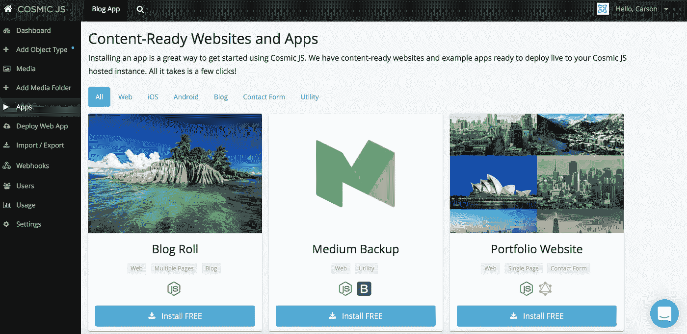
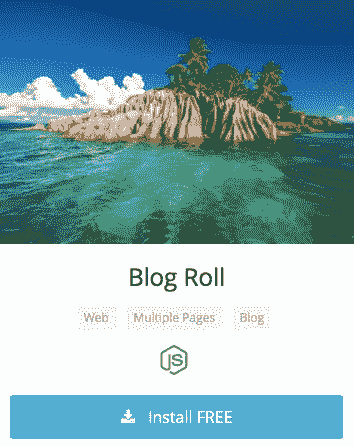
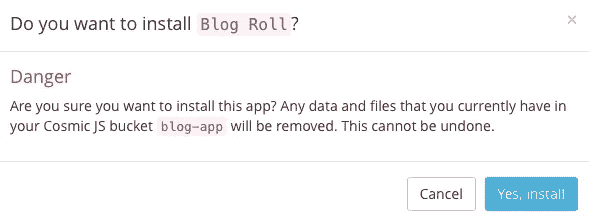
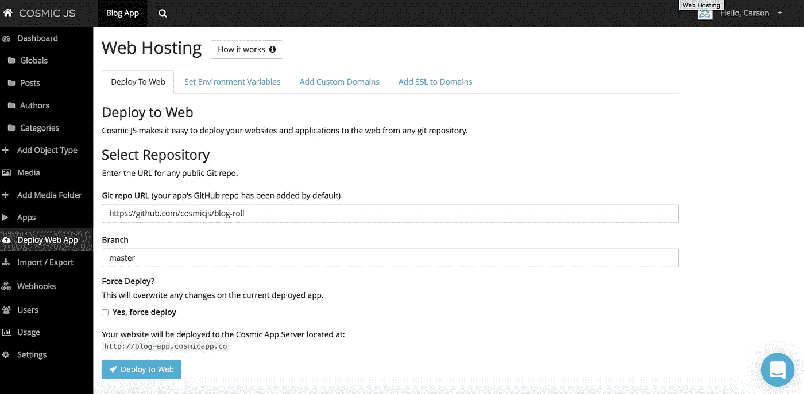
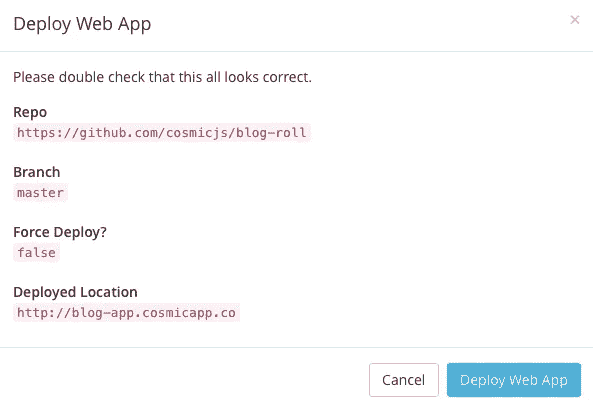
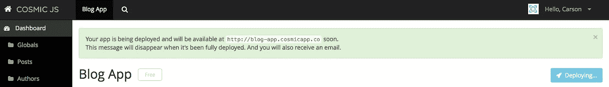
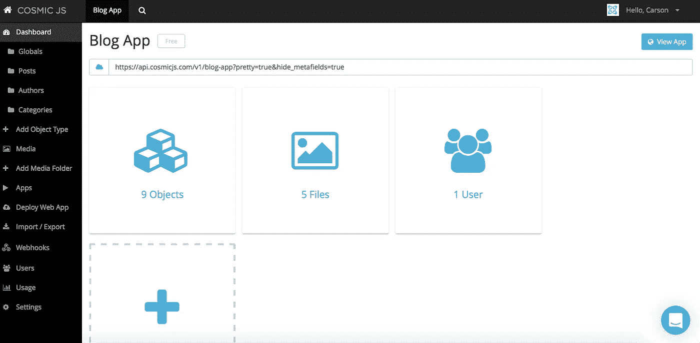

# 用 4 个步骤构建一个简单的 Node.js 博客

> 原文：<https://medium.com/hackernoon/build-a-node-js-blog-roll-app-in-4-steps-61e1a6d0c292>

我们在[宇宙 JS](https://cosmicjs.com/) 构建了许多[示例应用](https://cosmicjs.com/apps)，我们这样做是为了支持我们展示而不仅仅是讲述的口号。开发人员希望可视化用例场景，并与其他开发人员的工作进行协作，因此我们作为联合创始人，总是会了解我们的[宇宙 JS 社区](https://cosmicjs.com/community)接下来希望看到什么类型的网站和应用程序——本周的获胜者是一个简单的 [Node.js 博客应用程序](https://cosmicjs.com/apps/simple-blog)，它可以在几分钟内安装和部署，准备好内容。在本教程中，我将向你展示如何使用 Node.js 和 Cosmic JS 创建一个简单的博客。这将是你创建的最快、最轻量级的博客。让我们开始吧。

我们将挑选一个现有的代码库来构建你自己的漂亮的 [Node.js 博客应用](https://cosmicjs.com/apps/simple-blog)。Cosmic JS 为旅行者和故事讲述者提供了一个简单的博客。轻松添加和编辑作者，创建博客文章和分配类别。在几分钟内部署此应用程序，开始记录您的旅程。

在这个示例博客中，我将使用 [Cosmic JS](https://cosmicjs.com/) 。Cosmic JS 是一个 [API 优先的 CMS](https://cosmicjs.com/) ，它使得管理和构建网站和应用程序更加快速和直观。通过将内容与代码分离， [Cosmic JS](https://cosmicjs.com/) 增强了开发人员的灵活性，同时确保内容编辑人员能够以最适合他们的方式规划和部署内容。Cosmic JS 允许开发人员使用他们喜欢的工具，如 Node.js、GitHub、Docker 等等。我们将使用 [Cosmic JS](https://cosmicjs.com/) 来安装我们的示例应用程序，部署和更新来自[基于云的内容管理平台](https://cosmicjs.com/)的内容。

如果你还没有，那就从[报名](https://cosmicjs.com/signup)参加[宇宙 JS](https://cosmicjs.com/) 开始吧。下面提供了有用的资源来简化您的开发操作。

> [如何使用 Node.js 建立一个简单的博客](https://cosmicjs.com/blog/how-to-build-a-simple-blog-using-nodejs)
> 
> [博客滚动 App 页面](https://cosmicjs.com/apps/simple-blog)
> 
> [博客滚动 App 演示](https://cosmicjs.com/apps/simple-blog/demo)
> 
> [基于 GitHub 的博客滚动应用代码库](https://github.com/cosmicjs/simple-blog)

# 1.创建新的存储桶

您的 bucket 的名称是您正在构建的网站、项目、客户端或 web 应用程序的名称。我将我的命名为“Blog App ”,以保持示例博客的简洁。

# 2.安装宇宙 JS 博客卷 App

一旦你注册并命名了你的桶，你将被提示从头开始或者“查看一些应用”。对于这个博客，我只需点击右键“查看一些应用程序”，这样我就可以开始安装[博客滚动应用程序](https://cosmicjs.com/apps/simple-blog)。

# 应用程序安装选项

[Cosmic JS](https://cosmicjs.com/) 让你能够在编程语言和实用程序之间进行过滤，比如博客、联系表单等等。

只需点击[博客滚动应用](https://cosmicjs.com/apps/simple-blog)图标下的“安装”即可开始，或者访问[宇宙 JS 应用页面](https://cosmicjs.com/apps)。

# 3.部署到 Web

我点击了“部署到 Web”。然后，我可以在部署 web 应用程序时编辑对象。您将收到一封电子邮件，确认您的 web 应用程序的部署。如果您在部署过程中遇到任何问题，您可能会被转到 [Cosmic JS 故障排除页面](https://cosmicjs.com/troubleshooting)。

# 确认部署位置和分支

# 部署分支机构确认模式

我从一个回购中提取，我的分支被澄清，我有一个与我在步骤 1 中创建的 slug / bucket 名称相匹配的部署位置。

# 展开，展开

一个小小的保证，让你很快就能在网上活得好好的。:)

# 4.编辑全局对象

编辑是在宇宙 JS 仪表盘中实现的梦想。要了解更多关于如何在考虑编辑内容的情况下构建 [Cosmic JS](https://cosmicjs.com/) 的信息，请阅读[在考虑内容编辑器的情况下构建](https://cosmicjs.com/blog/building-with-the-content-editor-in-mind)。

# 应用部署确认

就像注册、创建新的存储桶、安装 web 应用程序、编辑对象和部署一样简单！我收到了访问我的 web 应用程序的确认电子邮件，还看到了我的桶升级选项，如[自定义域、一键式 SSL、webhooks 和本地化](https://cosmicjs.com/features)。

[Cosmic JS](https://cosmicjs.com/) 是一个 API 第一的基于云的内容管理平台，使管理应用程序和内容变得容易。如果你对 Cosmic JS API 有任何疑问，请通过 [Twitter](https://twitter.com/cosmic_js) 或 [Slack](https://cosmicjs.com/community) 联系创始人。

[卡森·吉本斯](https://twitter.com/carsoncgibbons)是 [Cosmic JS](https://cosmicjs.com/) 的联合创始人& CMO，这是一个 API 第一的基于云的[内容管理平台](https://cosmicjs.com/)，它将内容与代码分离，允许开发人员用他们想要的任何编程语言构建流畅的应用程序和网站。

> [黑客中午](http://bit.ly/Hackernoon)是黑客如何开始他们的下午。我们是阿妹家庭的一员。我们现在[接受投稿](http://bit.ly/hackernoonsubmission)并乐意[讨论广告&赞助](mailto:partners@amipublications.com)的机会。
> 
> 如果你喜欢这个故事，我们推荐你阅读我们的[最新科技故事](http://bit.ly/hackernoonlatestt)和[趋势科技故事](https://hackernoon.com/trending)。直到下一次，不要把世界的现实想当然！

