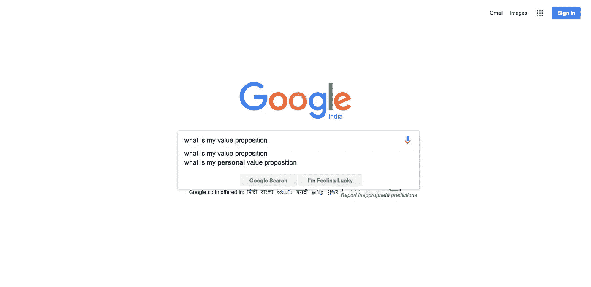
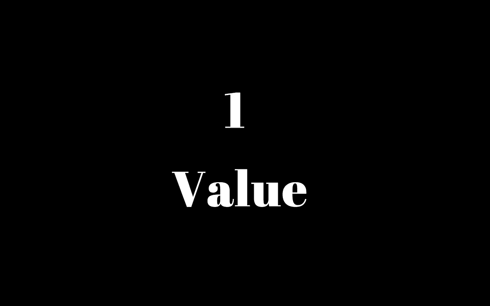
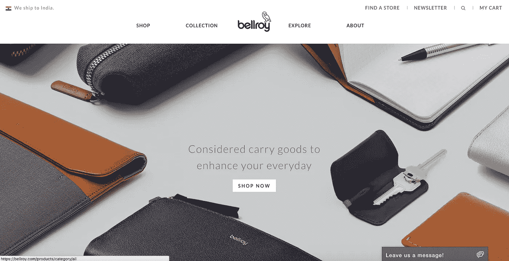
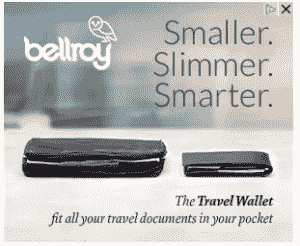
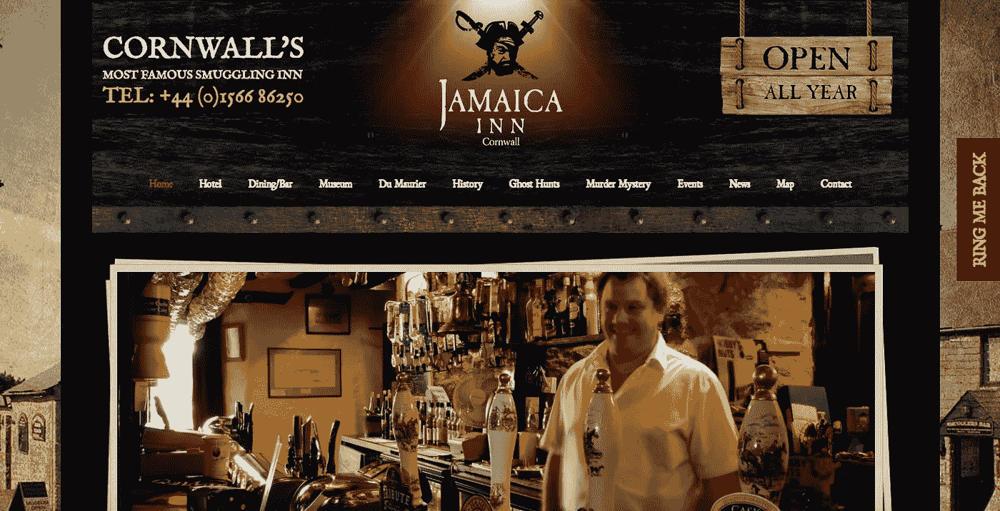
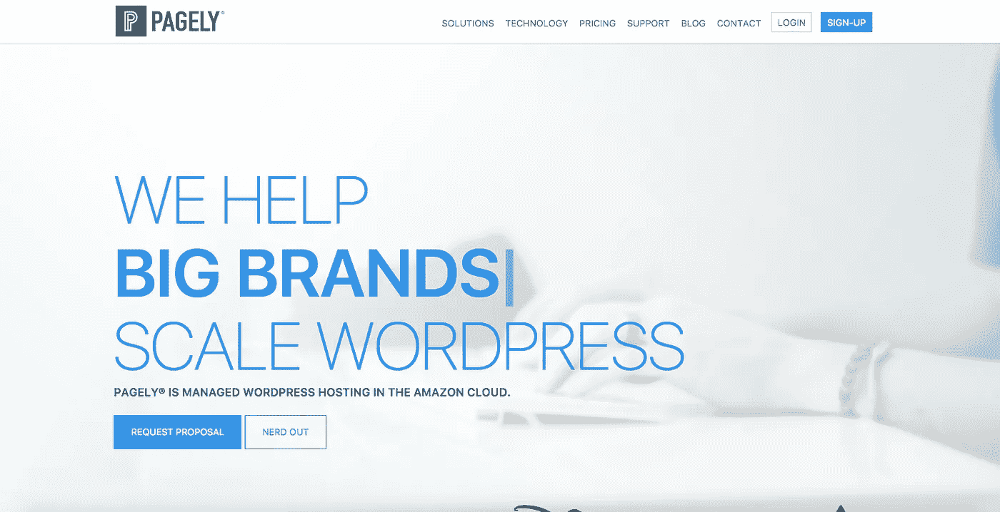

# 打造一款独立销售的产品

> 原文：<https://medium.com/hackernoon/build-a-product-that-sells-on-its-own-df01c999672f>

**价值主张**或 **(USP)** 是你的用户/客户唯一会关心你的产品的东西。一个人所能提供的价值将决定他们是否会和你在一起并继续使用你的服务。

*已经说出了一些关于 USP 及其重要性的要点…*

用户 1: 我对你的故事不满意！

用户 2: 想让我试试你的产品吗？展示它如何破解我在困境中 24/7/365 的痛苦。

**用户 3:** 有什么可以提升我业务的东西吗？真的吗？如果是的话，我会回来的。

> 以前听过吗？

这些是人们用来赶走企业的一些陈词滥调。我们知道，人们不会立即在选项之间切换。即使给予**高级**，**专为用户制造**类型的产品。毫无疑问，我们作为用户也不例外。一旦我们觉得某个产品是智慧，企业肯定很难说服我们放弃这笔交易。

为了跨越这个障碍，在自己的领域创造历史，一个企业必须有一个强有力的副总裁(价值主张)。

> “如果你的副总裁推销自己，你的产品也会如此”

## 如何知道自己的价值主张到底是什么？

What is your service’s value proposition?

确定一个**独特的**和**高效的** **价值主张**首先要弄清楚 ***一个你的竞争对手没有的特殊价值*** 。

围绕简单而有效的 **3 步自我审问。**

*   我解决了哪些竞争对手没有解决的痛点？
*   我提供什么额外的东西让用户忍不住要买？
*   我的服务有多上瘾？

> 虽然提供每一个价值是你的目标，但必须有一个****精确的** **价值**每个产品/业务都应该**超越**。**

****

**One utmost value**

**为你的每项服务提供一个这样的主要价值将帮助你超越市场上现有的其他竞争对手。**

> **“有助于吸引理想的用户群/客户”**

****在许多情况下**，公司和产品的价值主张会有所不同。解决这两个问题会强化你的成长策略，并从旁观者(亲爱的潜在客户)那里获得巨大的信任。**

**使用即将推出的**1–5 价值主张预测量表**，为您的企业和产品确定一个合格的独特价值主张。**

## ****4 关键因素**评估、**

*   **市场价值**
*   **市场尺寸**
*   **竞争水平和**
*   **访问障碍的级别**

## ****标记 1****

***小市场*会有*少价值*与*少阻碍*进入但*过度竞争。***

## **马克 2**

***中型市场*在可承受的阻碍水平下将有相当大的价值。*有限竞争。***

## **马克 3**

***不同的服务*总共会有*很少的竞争*，从而*更少的进入阻碍*。**

## **马克 4**

**一个*独特的服务/产品*与*高价值*，为大市场制造，持有高层次的进入障碍。属于此类别的服务/产品应*申请专利*或禁止具有有限可及性的访问。**

## **马克 5**

**为*更广阔的市场*打造的*独特服务/产品*，具有高价值，为*专属受众*提供。**

**考虑到解释 **5 个典型价值主张措施**的推荐量表，如果您的服务看不到 **3 个或更多刻度**，则非常需要**检修**。现在你已经找到了你独特的价值主张，你将如何向你的用户阐述它！**

> **“只有你的价值到达你的用户手中，你所有的努力才有意义”**

## **如何传达你的服务/产品的价值主张？**

****

**Image Credit: Hearing Review**

**传达一个人的价值主张总是通过**营销**进行。价值主张越好，你的营销人员就应该更好地传达信息。**

**像其他企业一样，如果你所做的只是发布消息，然后坐等神奇的事情发生？你投入的金钱和努力永远得不到回报。**

> ****因为？****
> 
> **人们最不了解你的服务所提供的价值。如果你不向他们展示**采取**某些行动**的重大理由**，你的结果将**低如低音**！**

> **“只有当人们了解你的服务的价值，并且相信你的服务时，它才是一个成功的副总裁”**

**对于一些公司来说，传达他们的价值主张变得更加容易。原因是，他们的服务/产品脱颖而出，独一无二。**

**但到目前为止，通过分析**简单与复杂产品的价值主张表现**，很明显，即使是一个简单的袜子销售公司也必须有一个**卓越的 USP** (独特的卖点)。**

## **有些公司做得非常好！**

## **他们在这里，**

## **贝勒罗伊——销售钱包**

****

**USP of BELLROY**

**看看他们如何推销他们的**可操作的目标广告。****

************

## ****牙买加酒店——随时入住****

****

## **MAILCHIMP —帮助发送自动商务电子邮件**

****

## **PAGELY——充分利用 WordPress 的存在！**

****

**好吧，去弄清楚你的**独特销售主张**是什么。**

**凭借这一令人难以置信的发现，继续在你的用户群和行业内取得成功。**

## **好运狂热者！**