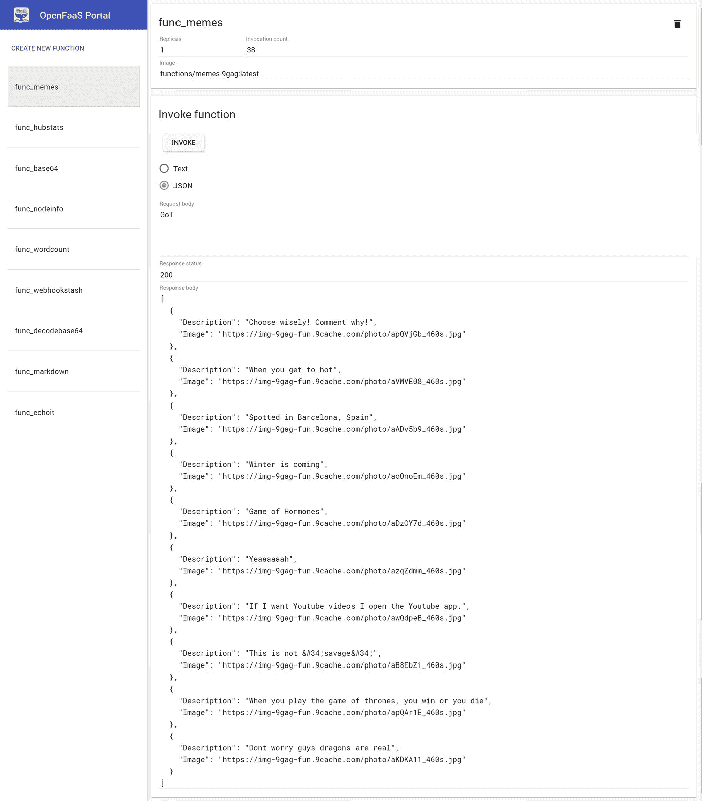

# 用 OpenFaaS 构建一个无服务器的 Memes 函数

> 原文：<https://medium.com/hackernoon/build-a-serverless-memes-function-with-openfaas-f4210a53abe8>

在这篇快速的帖子中，我将向你展示如何在 **Go** 中构建一个**无服务器**函数来使用 [OpenFaaS](https://github.com/openfaas/faas) 获取最新的 **9Gag Memes** 。

本教程假设您已经:

*   **faas-cli** 已安装——安装 **faas-cli** 最简单的方法是通过 **cURL** :

> https://cli.openfaas.com| sudo sh

*   **Swarm** 或 **Kubernetes** 环境配置——参见[文档](https://github.com/openfaas/faas/blob/master/guide/deployment_swarm.md)。

**1 —创建功能**

创建一个“ **handler.go** ”文件，内容如下:

代码是不言自明的，它使用 [**9Gag 网络爬虫**](https://github.com/mlabouardy/9gag) 来解析网站并通过标签获取迷因。

**2 — Docker 图像**

我写了一个简单的 **Dockerfile** 使用[多阶段构建](https://docs.docker.com/engine/userguide/eng-image/multistage-build/)技术来缩小图像尺寸:

**3 —配置文件**

注意:如果推送至远程注册表，将名称从 *mlabouardy* 更改为您自己的 **Hub** 帐户。

**4 —构建**

发出以下命令:

> faas-cli build -f ./stack.yml

**5 —展开**

> faas-cli 推-f ./stack.yml
> 
> faas-cli deploy -f ./stack.yml

**6 —测试**

部署后，您可以通过以下方式调用该函数:

**卷曲:**

> curl[http://localhost:8080/function/memes-9 gag](http://localhost:8080/function/memes-9gag)-d " GoT "

FaaS CLI:

> echo“得到”| faas-cli 调用 memes-9gag

**用户界面:**

**JSON 示例:**

注意:本演示中使用的所有代码都可以在我的 [Github](https://github.com/mlabouardy/memes-faas) 上获得

**更进一步？**

您可以构建一个使用函数 JSON response 的 Android 应用程序,如下所示:

