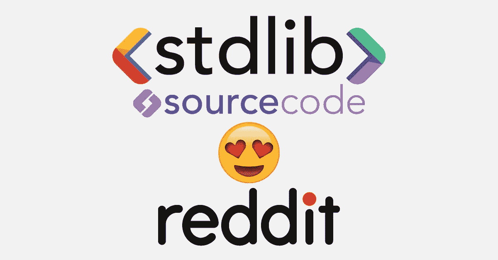
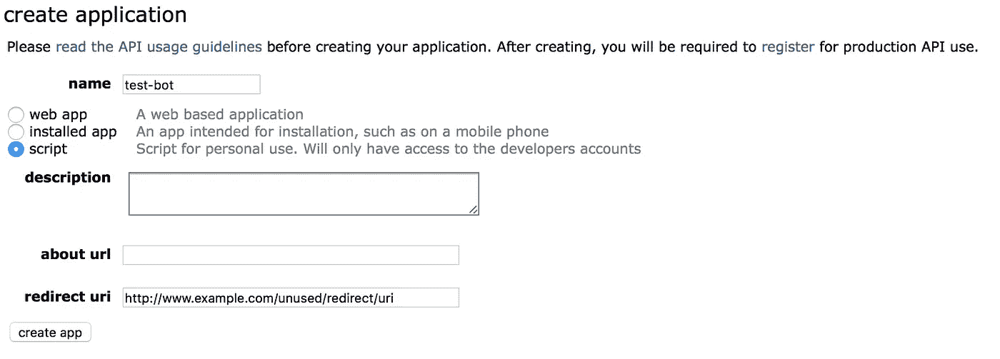
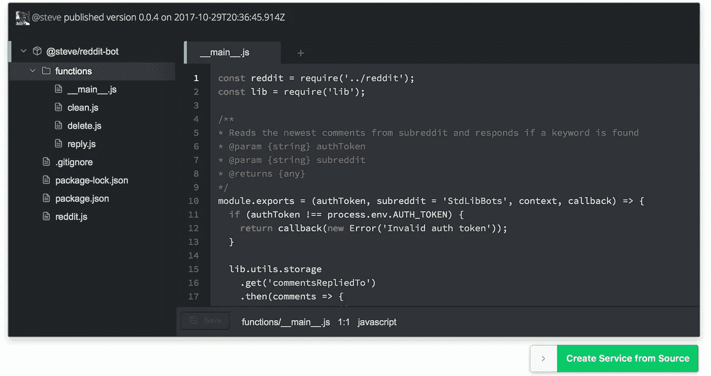
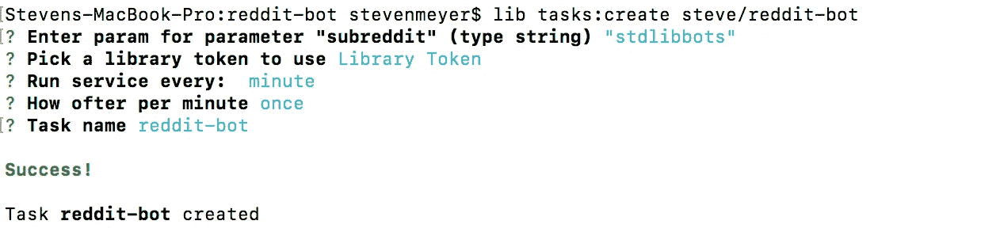

# 用 Node.js 和 StdLib 源代码分三步构建一个“无服务器”Reddit 机器人

> 原文：<https://medium.com/hackernoon/build-a-serverless-reddit-bot-in-3-steps-with-node-js-and-stdlib-sourcecode-e5296b78fc64>

在 [StdLib](https://stdlib.com) ，我们是 Reddit 的忠实粉丝。如果你花时间浏览 Reddit，毫无疑问你会遇到一些机器人。他们有许多不同的目的，从调节子主题到总结文章。不管他们的目标是什么，许多机器人只执行两个基本任务:阅读评论和回复符合特定标准的评论。



在本指南中，您将了解如何仅从您的浏览器部署一个无限可扩展的“无服务器”Reddit 机器人。最终，你将拥有一个机器人，它会阅读并回复包含“嘿[马文](https://en.wikipedia.org/wiki/Marvin_(character))”的评论，但你将完全能够定制你的机器人所回复的内容。您需要做的唯一配置是指定您想要扫描的子编辑和您的 reddit 凭证。

本指南由 [StdLib 源代码](https://stdlib.com/sourcecode)提供支持。你可以在这里阅读 StdLib 源代码[的介绍。简而言之，sourcecode 是使用新的无服务器技术](/stdlibhq/introducing-stdlib-sourcecode-share-your-node-js-serverless-code-with-developers-worldwide-b8fd5714e430)[开始构建和](https://hackernoon.com/tagged/technology)[部署](https://hackernoon.com/tagged/deploying) web 应用的最简单的方法。通过利用 StdLib 的合作伙伴和社区构建的模板，除了这个 Reddit bot 之外，您还可以直接从浏览器部署各种项目，如 Slack 应用程序、Stripe 商店和 Twilio 消息中心。

## 第一步:注册一个 Reddit 应用

登录 Reddit，前往 [Reddit 应用偏好页面](https://www.reddit.com/prefs/apps/)，点击“创建应用”。



Creating a Reddit App

给它起一个你喜欢的名字，然后选择脚本类型。一个基于脚本的应用程序将发布创建它的帐户的评论。所以，如果你不想在你的普通帐户下发布这个 bot，你应该创建一个新的。拥有验证电子邮件的帐户可以发布更多内容，因此如果您使用新帐户，请确保添加电子邮件。最后，Reddit 应用程序需要一个重定向 URI。但是您不会使用它，所以只需放入一个虚拟的，比如`[http://www.example.com/](http://www.example.com/)`

## 步骤 2:部署 Reddit 应用程序



Reddit Bot Sourcecode

保持应用程序首选项页面打开，导航到 [Reddit Bot 源代码页面](https://stdlib.com/@steve/src/reddit-bot/)并向下滚动到行内编辑器。打开 functions 文件夹，您会发现四个文件:

*   `__main__`:从子编辑中读取最近的评论，寻找关键词，并对包含它们的评论做出响应。
*   `clean`:接受一个数字，删除任何分数(投票数加投票数)低于该数字的评论。这使得阅读子编辑的用户可以删除不想要的评论。
*   `reply`:由`__main__`使用，此功能回复帖子或评论。记住，Reddit 支持 markdown，所以你可以在这里真正发挥创造力。
*   `delete`:由`clean`使用，该函数用于删除机器人发布的帖子。

现在，您可以单击“从源创建服务”,系统会提示您输入一些环境变量。前两个，`REDDIT_SECRET`和`REDDIT_KEY`可以在 Reddit [应用偏好页面](https://www.reddit.com/prefs/apps/)找到。最后两个只是 Reddit 帐户的用户名和密码。填写完这些内容后，您可以单击 Deploy，您的 bot 将在开发环境中投入使用。

我们可以直接从命令行测试这个机器人。如果您没有 [StdLib 命令行工具](http://github.com/stdlib/lib)，那么您可以通过运行:

```
$ npm install lib.cli -g
```

使用`$ lib init`导航到 StdLib 工作区或在空目录中创建一个工作区。您需要通过身份验证才能运行此服务，这可以防止其他人从您的 Reddit 帐户发帖。你可以在这里得到一个库令牌[。现在您可以运行:](https://dashboard.stdlib.com/dashboard/#/tokens)

```
$ lib <username>.reddit-bot[@dev] stdlibbots -t <library token>
```

转到[这个帖子](https://www.reddit.com/r/StdLibBots/comments/796n4l/hello_world/)，你应该会看到一个来自你的机器人的帖子。

## 步骤 3:运行机器人



Creating a Scheduled Task from the Command Line

有了读取和回复帖子的 API，您现在要做的就是让它保持运行。这是 StdLib 的[预定任务](http://docs.stdlib.com/main/#/scheduled-tasks)的一个很好的用例。您只能使用服务的不可变发布版本运行计划任务。要获得 bot 的代码并发布它的发布版本，请运行:

```
$ lib get <username>/reddit-bot
$ cd <username>/reddit-bot
$ lib release
```

现在，您可以使用以下选项设置计划任务:

```
$ lib tasks:create <username>/reddit-bot 
```

结果提示将要求您提供一个 StdLib 库标记。您的 Reddit bot 将只响应使用您的库令牌之一进行身份验证的请求，在此处指定一个令牌允许计划任务正确触发您的 bot。接下来，提示符将询问您希望您的 bot 运行在哪个子目录中。最后，您需要指定希望任务运行的频率。根据 subreddit 的受欢迎程度，你可以少运行一次，但是每五分钟一次(或者一小时十二次)应该可以。

现在，您应该设置一个计划任务来删除不想要的注释，方法是:

```
$ lib tasks:create <username>/reddit-bot clean
```

提示将询问您希望为删除设置什么阈值，以及应该多长时间运行一次。类似于-5 和每小时一次将是一个很好的开始。

就是这样！现在你有了一个 Reddit 机器人来监控一个 subreddit 并自动回复评论。

## 添加功能

既然您已经有了一个简单的机器人，您可能会对创建更复杂的工作流感兴趣。正如我前面提到的，您可以使用`$ lib get <username>/reddit-bot`来检索您可以获得的服务代码。您可以使用`$ lib up dev`修改代码并将其发布到开发环境中，或者使用`$ lib release`创建一个新的发布版本。

如果您创建了自己喜欢的东西，您可以使用`$ lib source`将您的服务转换成新的源代码。这将在一个新的目录中创建一个新的代码副本。你可以发布这个源代码供其他人使用`$ lib source:publish`。

就是这样！感谢阅读！希望本指南已经向您展示了 [Stdlib 源代码](https://stdlib.com/sourcecode)的一些功能。构建一个 Reddit 机器人只是开始使用源代码的众多方法之一。如果你有好主意想分享，请直接通过电子邮件联系我:**steven@stdlib.com**，或者在 Twitter 上关注[我](https://twitter.com/notoriaga)和 [StdLib](https://twitter.com/stdlibhq) 团队。

一如既往，我们期待着您和快乐大厦的来信