# 使用 Node.js 和 StdLib 在 5 分钟内构建一个“无服务器”条带存储

> 原文：<https://medium.com/hackernoon/build-a-serverless-stripe-store-in-5-minutes-with-node-js-and-stdlib-d90352c89227>

Stripe 正在重新定义电子商务。帕特里克和约翰·科利森对互联网业务的未来有着非常具体的见解:首先，它们是由构建它们的软件开发商 T2 驱动的。他们和硅谷最有[天赋的](https://stripe.com/us/sigma)、[创意](https://stripe.com/radar)团队一起，创造了一个[、价值 92 亿美元的企业](https://www.bloomberg.com/news/features/2017-08-01/how-two-brothers-turned-seven-lines-of-code-into-a-9-2-billion-startup)，以强大的财务 API 为核心。

在 [StdLib("标准库")](https://stdlib.com)，我们对商业的未来有着相似的愿景。我们的目标是降低创建基于新的“无服务器”技术的网络产品的门槛。我们让更广泛的开发人员更容易构建后端服务，并与像 [Slack 这样的公司集成以构建机器人](/slack-developer-blog/build-a-serverless-slack-bot-in-9-minutes-with-node-js-and-stdlib-b993cfa15358)，与 [Twilio 集成以构建消息中心](https://hackernoon.com/build-a-serverless-twilio-sms-call-forwarding-bot-in-7-minutes-using-node-js-stdlib-411697c3cc1b)。今天，我们很高兴向您展示如何在几分钟内，使用 StdLib 构建一个完全可定制的生产就绪型条带驱动商店。

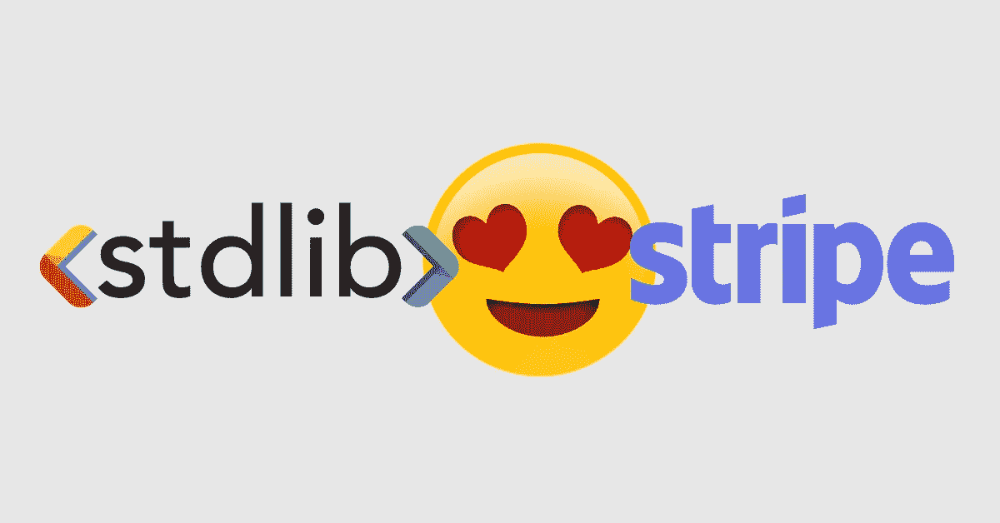

StdLib ❤ Stripe

我们认为使用 StdLib，您会发现管理 web 服务从未像现在这样简单。你只需要考虑功能，我们有一套[强大的命令行工具，允许快速的本地开发和测试](https://github.com/stdlib/lib)。

一旦你在**分钟 5** 内创建了你的 StdLib 服务，你将得到一个`README.md`文件，但是你也可以通过 [GitHub 在 stdlib/utils.templates 条带文件夹](https://github.com/stdlib/utils.templates/blob/master/templates/stripe/_files/README.md)中继续操作。

# 你事先需要什么

*   1x 条纹账号(我们推荐一个 [**新账号**](https://dashboard.stripe.com/register) )
*   1x 命令行终端
*   5 分钟(或 300 秒)

# 第 1 分钟:准备您的 Stripe 帐户

首先，确保你已经创建了一个新的 Stripe 账户 。我们建议您创建一个新帐户，因为您的 StdLib 存储将自动创建新产品，并根据您设置的配置更新您的 Stripe 产品信息。为了防止对现有帐户产生副作用，使用新帐户最为安全。

拥有 Stripe 帐户后，请访问 [Stripe Dashboard](https://dashboard.stripe.com/test/dashboard) 。您还不需要激活的帐户，只需使用测试数据即可启动并运行。点击菜单左下方 **API** ，进入 [API 密钥页面](https://dashboard.stripe.com/account/apikeys)，然后**展现测试密钥令牌**。保持这个页面打开，你会很快需要这些 API 密钥。

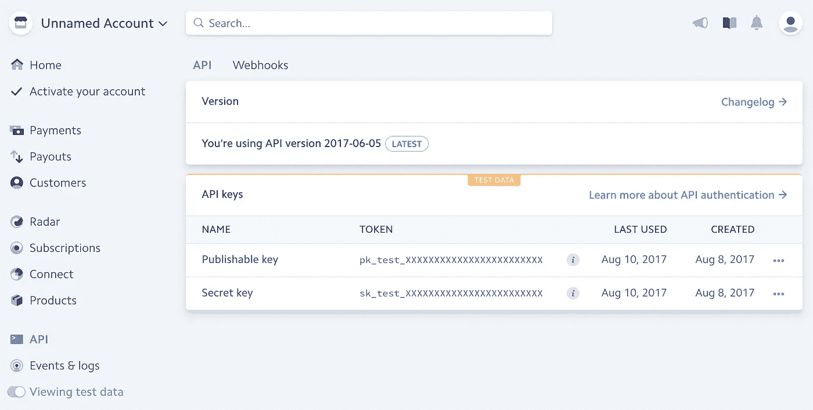

# 第 2 分钟:创建 StdLib 帐户

现在，您需要一个 [StdLib 帐户](https://stdlib.com)来创建您的“无服务器”条带存储。我们不需要任何东西，除了 StdLib 帐户和 Stripe 帐户创建一个商店，因为 Stripe 为我们存储产品信息。导航至[https://stdlib.com](https://stdlib.com)，点击**注册**创建账户。

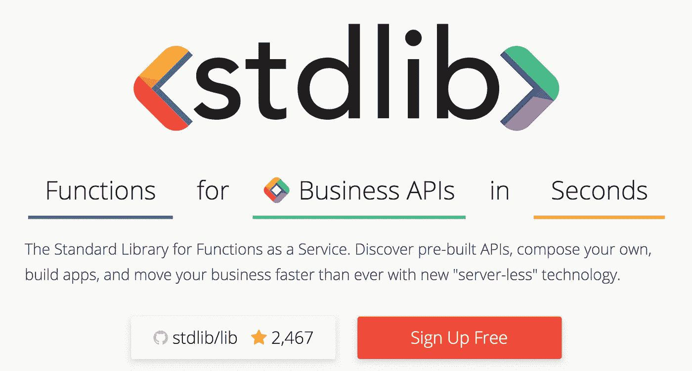

Click “Sign Up” to Proceed

# 第 3 分钟:初始化 StdLib 工作区

要使用 StdLib，我们建议使用 Node.js 的最新稳定版本，最好是从[官方 Node.js 网站](https://nodejs.org)安装 8.2.x 或更高版本。完成后，打开终端或命令行并安装 [StdLib 命令行工具](https://github.com/stdlib/lib)，如下所示:

```
$ npm install lib.cli -g
```

**请确保运行的是最新版本。**至少`3.1.1`可以跟`lib version`核对。现在，您应该可以访问终端中的`lib`命令。你可以用它为你的 StdLib 服务创建一个`stdlib`目录。

```
$ mkdir stdlib
$ cd stdlib
$ lib init
```

使用上一步中创建的 StdLib 凭据登录。就这样，你完蛋了！

# 第 4 分钟:创建条带存储

下一步是使用 StdLib 创建条带存储。您可以使用`stripe`模板为您自动生成您的 Stripe Store。

```
$ lib create -s @stripe/store
```

当你继续时，你会被要求输入一个`Service Name`，我们建议输入`stripe-store`，但是你可以随意命名。

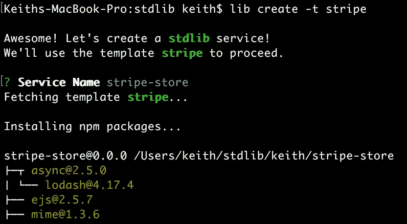

通过指定`-s @stripe/store`，您告诉标准库模板服务使用 Stripe 样板(其他选项包括`@slack/app`)。这将自动为您的服务填充运行您的商店所需的代码，并且是完全可破解的。

要访问您刚刚创建的服务，请在终端中输入以下内容:

```
$ cd <username>/stripe-store
```

要确保条带存储按预期工作，请尝试在本地为 StdLib 函数运行 HTTP 网关:

```
$ lib http
```

您将看到以下内容:

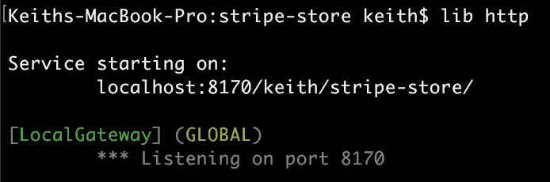

要访问您的 Stripe 商店并确保其正常工作，请将提供的网址`localhost:8170/<username>/stripe-store/`复制并粘贴到您的网络浏览器中:

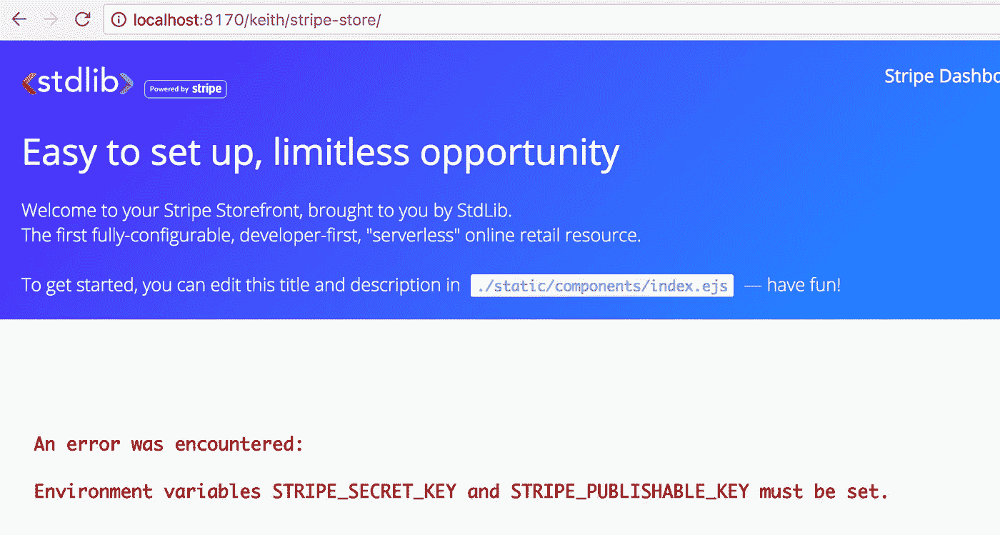

厉害！你的条纹商店几乎准备好了。您可以通过在终端中按下`ctrl+C`或`ctrl+D`随时停止您的 HTTP 服务器。

# 第 5 分钟:设置条带凭据并部署

还记得你从**分钟 1** 开始的条纹凭证吗？您需要确保调出该窗口或再次打开 [API 键页面](https://dashboard.stripe.com/account/apikeys)。在您的服务目录中打开`./env.json`，并将您的凭证输入到`"local"`和`"dev"`环境中。

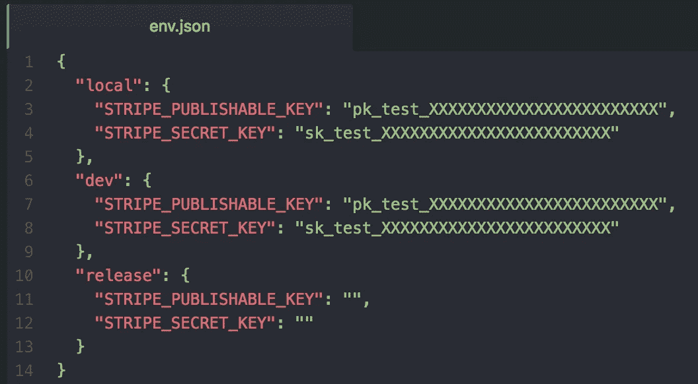

Enter Your Credentials

当您准备好部署到生产时，您可以将您的生产凭证放在`"release"`中，但是现在没有必要。

现在，您已经准备好部署您的条带存储了！只需打开您的终端并键入:

```
$ lib up dev
```

您会注意到类似于以下输出的内容:

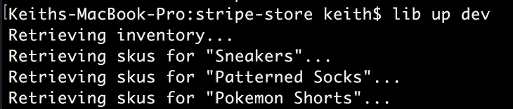

在`./stripe/scripts/`中有一个部署脚本，它将自动从`./stripe/products.json`中读取数据，并根据 JSON 配置相应地更新您的条带产品线。它运行一个 diff 算法，以确保没有任何东西被删除，只有被停用，更新或创建。

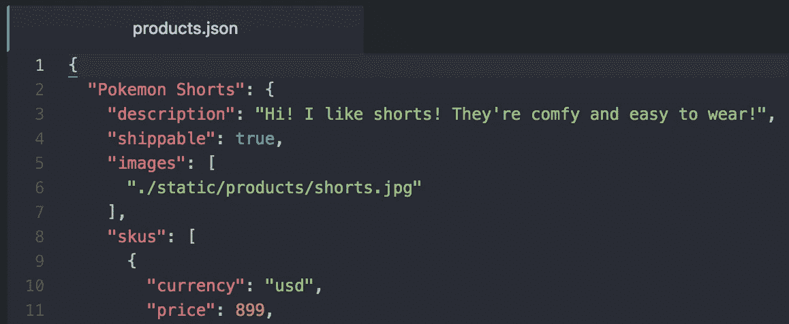

products.json contains your Stripe Products

部署后，您将获得一个指向新商店的链接:

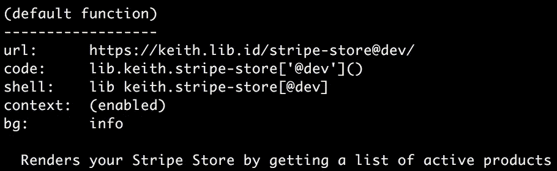

A link to your Store via HTTPS

这是您访问条带商店所需的最后一样东西。

# 就是这样！你的条纹商店是活的！

复制上一步提供的链接，通常是`https://<username>.lib.id/stripe-store@dev/`，访问您的条带商店。您将看到`products.json`中的默认产品已经准备就绪！

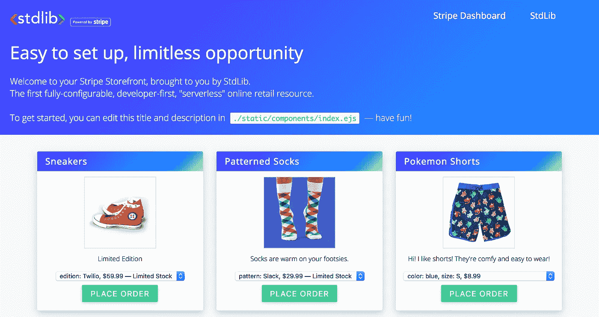

Your Stripe Store is Live!

您可以使用任何电子邮件、姓名、地址和信用卡号`4242 4242 4242 4242`以及任何到期日(未来的*)和任何 CVV 来测试下单。您可以在[条纹产品仪表板页面](https://dashboard.stripe.com/test/products)的条纹仪表板中随时查看您的产品。您可以手动更新这些，或者在您的`./stripe/products.json`文件中进行新的部署。*

*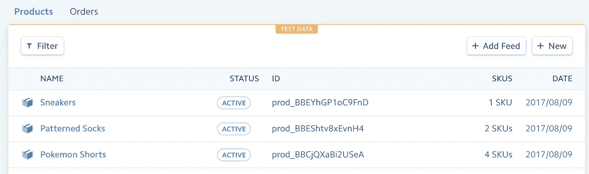*

*Your Products on your Stripe Dashboard*

*要发布到生产环境，[从您的 Stripe 仪表板](https://dashboard.stripe.com/)激活您的 Stripe 帐户，将您的环境切换到`live`，并将您的新 API 密钥复制到您在`./env.json`的`"release"`密钥中。你必须使用`$ lib release`命令，而不是`$ lib up dev`。*

*此外，您的条纹商店是完全可黑客攻击的！更改任何 HTML、样式等。尽情享受。只需修改服务包中的任何文件，用`$ lib http`进行本地测试，并部署新产品等。当你准备好的时候。*

# *谢谢大家！*

*感谢您的阅读，我们对您可以使用 Stripe 和 StdLib 创建的事物的可能性感到兴奋！如有建议或问题，欢迎在此评论或访问 GitHub 上的 stdlib/lib 库。如果你有一个好主意，直接通过电子邮件联系我:**Keith[at]stdlib[dot]com**，在 Twitter 上给我发推文， [@keithwhor](https://twitter.com/keithwhor) ，或者[在 Twitter 上关注我们，@StdLibHQ](https://twitter.com/stdlibhq) 。*

*我们期待着您的回音，并快乐建设！*