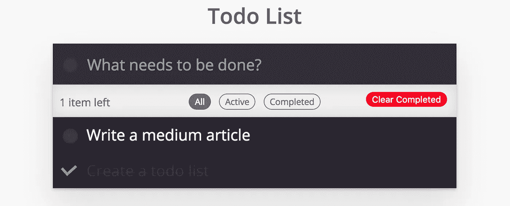
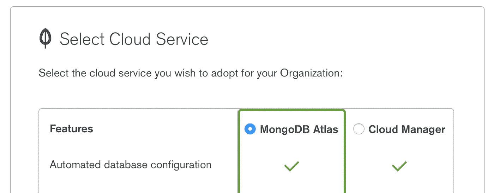
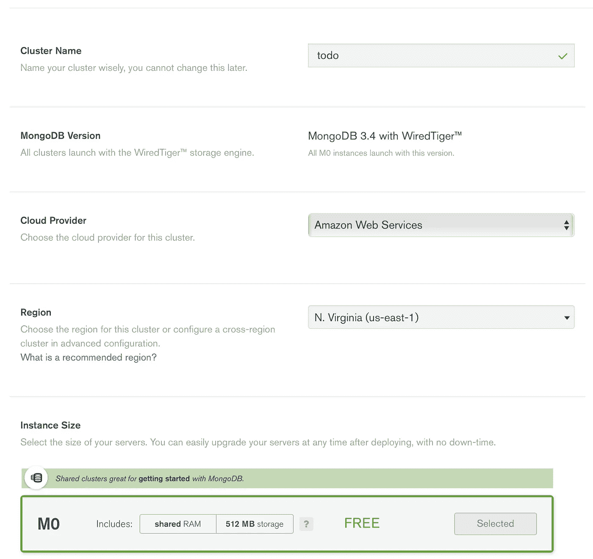
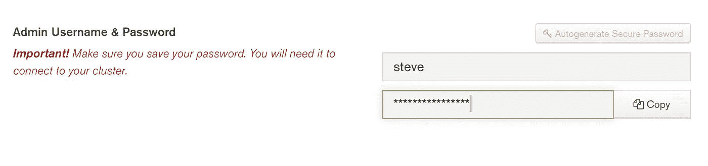
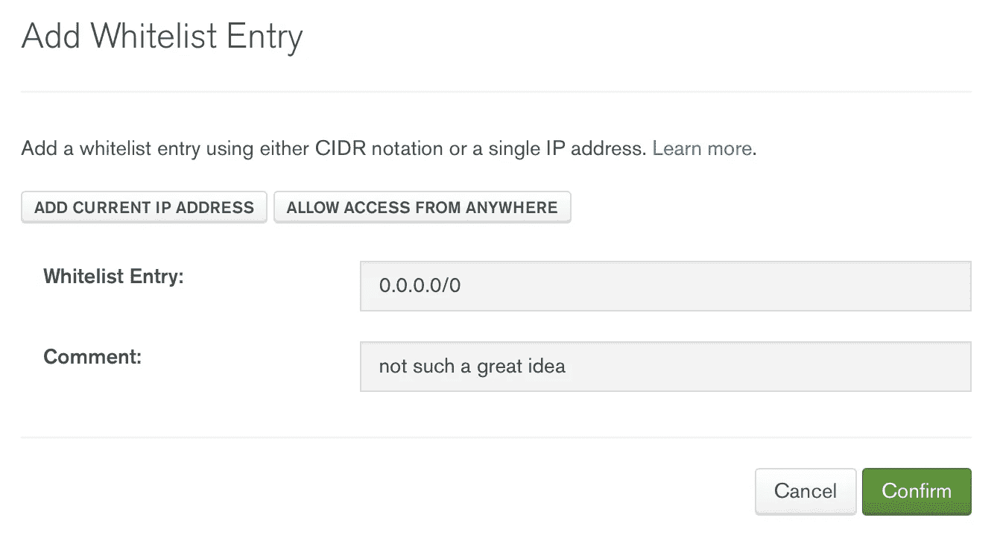
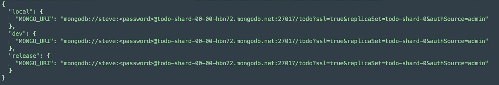

# 用 StdLib 和 MongoDB 在 5 分钟内建立一个“无服务器”的待办事项列表

> 原文：<https://medium.com/hackernoon/build-a-serverless-todo-list-in-5-minutes-with-stdlib-and-mongodb-1240e92f5cfb>

在 StdLib，我们的开发人员经常问我们关于将持久存储集成到 StdLib 函数中的问题。虽然构建和发布 StdLib 函数就像打开一个文本编辑器并编写 Node.js 函数一样简单，但开发人员在尝试遵循 ExpressJS 或其他教程时，并不总是清楚他们如何集成持久层。我们想让它变得更简单，并向您展示如何用 StdLib 和 MongoDB 在五分钟内构建一个待办事项列表——祝您愉快！



The finished product — a simple todo list

如果你以前没有听说过 StdLib，我们是构建后端 web 服务和实现真正商业价值的最快方式。构建在“无服务器”架构上，您永远不必担心管理服务器或为扩展分配资源。编写一个函数，部署，你就可以开始了！我们还有一个由其他开发者贡献的易于使用的[集成](http://www.stdlib.com/sourcecode)生态系统。

## 第一分钟:注册 StdLib


开始使用 StdLib 很容易——进入我们的[网站](https://stdlib.com)，选择选择一个用户名并点击“声明名称空间”。稍后，您将了解如何获得我们的 [CLI](https://github.com/stdlib/lib) 并部署服务。但是首先，您需要为这个应用程序设置数据库。

## 第 2 分钟:设置 MongoDB

如果您还没有 MongoDB 帐户，现在就在这里[创建一个帐户](https://cloud.mongodb.com/user?nds=true&_ga=2.18468849.910430582.1511808066-1384778459.1511498990&nds=true#/register/accountProfile)。当你创建一个新账户时，确保选择 MongoDB Atlas 而不是 Cloud Manager。



现在您已经设置了一个帐户，您需要创建一个集群。单击“构建新集群”,并使用以下信息填写模型。



请注意，为了使用免费层，您需要将 AWS 作为您的云提供商，并且您需要将 N. Virginia 作为区域。最后，在部署集群之前，您需要创建一个管理员用户。



部署集群可能需要几分钟的时间，因此在此期间，我们还需要采取一些步骤来准备 MongoDB。单击“安全”选项卡，然后单击“IP 白名单”并添加 IP 地址。出于本演示的目的，您可以将所有 IP 地址列入白名单，尽管这对于生产应用程序来说不是一个好主意。



您的集群现在应该已经部署好了。为了将 StdLib 服务连接到 MongoDB，您需要 URI 连接字符串。单击“连接”并选择“连接您的应用程序”。记下 URI 弦，因为你以后会用到它。

## 第三分钟:分叉待办事项列表

为了使用 StdLib，你需要获得命令行工具[和](https://hackernoon.com/tagged/tools)，可以从 GitHub 上的[获得。首先，如果你没有安装 Node.js，你可以下载最新版本，还有 npm，这里是](https://github.com/stdlib/lib)。现在安装了 Node，您可以通过打开终端并运行以下命令来获得 StdLib CLI:

```
$ npm install lib.cli -g
```

现在创建一个工作区，并使用以下命令导航到该工作区:

```
$ mkdir stdlib-workspace
$ cd stdlib-workspace
$ lib init
```

接下来，通过运行以下命令获取 todo 列表的代码:

```
$ lib create -s @steve/todo-mongo
```

您将被提示给新服务命名，本教程的其余部分假设它仍然是`todo-mongo`。现在，您可以通过以下方式导航到新服务:

```
$ cd <username>/todo-mongo
```

现在您可以打开在根目录中找到的`env.json`文件。有三个字段，都有相同的关键字。将上面的蒙戈 URI 复制并粘贴到所有三个字段中。记得把`<password>`改成你上面创建的管理员密码。



现在只需运行:

```
$ lib up dev
```

有了这个命令，您待办事项列表就处于一个可变的开发环境中。要查看它，你可以去`[https://<username>.api.stdlib.com/todo-mongo@dev/](https://notoriaga.lib.id/todo-mongo@dev/)`，这里`<username>`是你的 StdLib 用户名。要发布到不可变的发布环境，请运行:

```
$ lib release
```

从那里你可以看到`[https://<username>.api.stdlib.com/todo-mongo/](https://notoriaga.lib.id/todo-mongo@dev/)`的服务。而 StdLib 和 MongoDB 入门就是这么简单！

## 理解你的待办事项

源代码被设计成可扩展的——您可以调整提供的模板或函数来添加您想要的任何功能。您可以在本地进行更改，然后在本地运行更改并运行`$ lib up dev`来查看您的更改。您还可以运行`$ lib http`，它会启动我们网关的本地版本，这样您就可以在本地主机上进行测试。

在其当前版本中，该服务有五个主要端点。

*   `__main__.js`:这个端点为应用程序提供 HTML、CSS 和 [Javascript](https://hackernoon.com/tagged/javascript) 。它只是用 `‘Content-Type’: ‘text/html’`将`static`文件夹中的所有内容作为缓冲区返回。
*   `create.js`:向 MongoDB 集群添加一个新条目。它接受一个字符串(todo)并返回集群中新项目的 id。
*   `read.js`:不接受参数，返回集群中的所有项目。
*   `update.js`:接受单个 ID 或 ID 数组(由 create 返回的 ID)和一个布尔值。数据库中的每个 todo 都将其完成状态设置为该布尔值。
*   `destroy.js`:获取单个 ID 或 ID 数组，并将其从集群中移除。

## 谢谢你

就这些了，感谢阅读！希望您能够学习一点关于 StdLib 和 MongoDB 的知识。构建 todo 列表只是使用 StdLib 增强 web 应用程序的众多方法之一。如果你有好主意想分享，请直接通过电子邮件联系我:【steven@stdlib.comT4，或者在 Twitter 上关注[我](https://twitter.com/notoriaga)和 [StdLib](https://twitter.com/stdlibhq) 团队。

一如既往，我们期待您和快乐大厦的回音！

*史蒂夫·迈耶(Steve Meyer)是奥柏林学院的应届毕业生，也是*[*StdLib*](https://stdlib.com)*的软件工程师。当他不编程的时候，你会发现他在烹饪、烘焙或者玩《野性的呼吸》。*