# 使用 Node.js + StdLib 在 7 分钟内构建一个“无服务器”Twilio SMS +呼叫转移机器人

> 原文：<https://medium.com/hackernoon/build-a-serverless-twilio-sms-call-forwarding-bot-in-7-minutes-using-node-js-stdlib-411697c3cc1b>

自 2009 年以来， [Twilio](https://twilio.com/) 已经使开发人员能够将短信和语音技术无缝地构建到他们的应用程序中，处理从基本的用户通知、在优步和 Lyft 等应用程序中连接司机和乘客到电话会议等一切事情。如果您还没有机会将 Twilio 的服务整合到您的产品中，现在您有机会开始了！我们很高兴与 Twilio 的功能合作，向您展示如何使用 StdLib 在几分钟内将语音+ SMS 引入您的产品或公司！


也许你以前用过 Twilio，也许你没有，但你对使用可编程电话技术并将其引入你的团队或公司非常感兴趣。凭借我们过去成功的“构建”文章(如[在 9 分钟内构建一个 Slack Bot](/slack-developer-blog/build-a-serverless-slack-bot-in-9-minutes-with-node-js-and-stdlib-b993cfa15358))，我们很高兴分享 StdLib 迄今为止最快的文章——我们很高兴地向您介绍如何使用 StdLib 在 7 分钟内构建一个 Twilio 消息传递中心！

如果你还没有使用过 StdLib，那么 [StdLib 是通过代码](https://stdlib.com/)传递商业价值的最快方式。它实际上是一个基于新的“无服务器”架构的 API 包管理器，这意味着您永远不必担心管理服务器或为扩展分配资源。编写一个函数，部署，你就可以开始了！我们还有一个由其他开发人员贡献的不断增长的集成生态系统，非常容易插入。

一旦你在**分钟 4** 内创建了你的 StdLib 服务，你将得到一个`README.md`文件，向你展示如何根据你自己的需要来破解你的 Twilio + StdLib 消息中心。

# 你事先需要什么

*   1x [Twilio 账户](https://twilio.com/)
*   1x 命令行终端
*   7x 分钟(或 420x 秒)

# 第 1 分钟:创建您的 Twilio 电话号码

要让你的 Stdlib + Twilio 消息中心投入运行，你要做的第一件事就是为你的 Twilio 帐户获取一个新的电话号码。首先，确保你在[https://www.twilio.com/login](https://www.twilio.com/login)登录了你的 Twilio 账户。


Log In to Twilio

从这里开始，你将到达你的 [Twilio 控制台](https://www.twilio.com/console)。如果这是你第一次使用 Twilio，你会看到一个如下图所示的屏幕。在左侧菜单中，点击带有圆圈和省略号“ **(…)** ”的按钮:

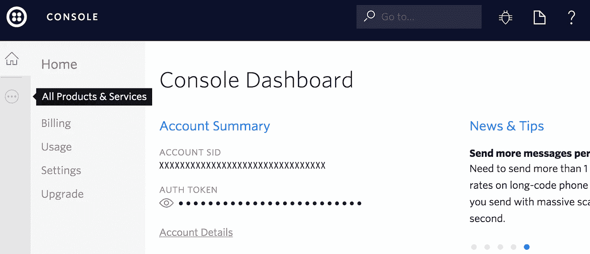

You want to select “All Products and Services” on the grey bar on the left

从这里，会弹出一个滑动菜单。你想在*超级网络*标题下选择*电话号码*:

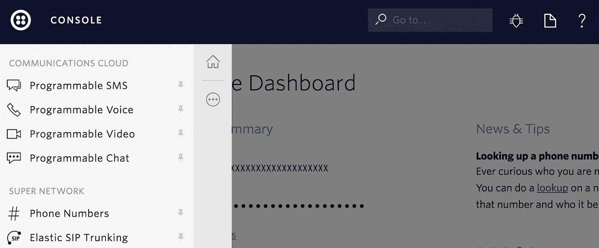

Click “# Phone Numbers”

要添加您的第一个电话号码，请点击“**开始使用**”:

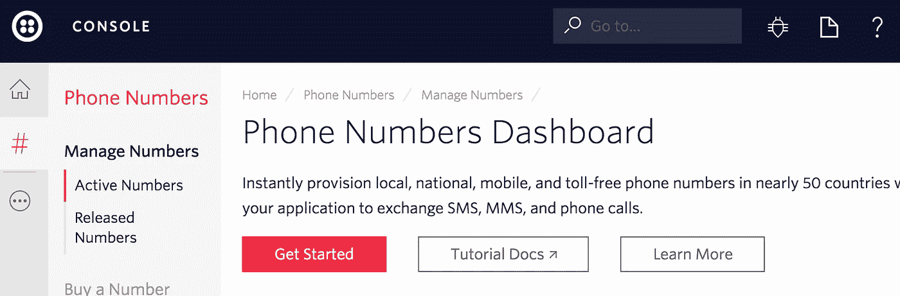

然后“**获得你的第一个 Twilio 电话号码**”:

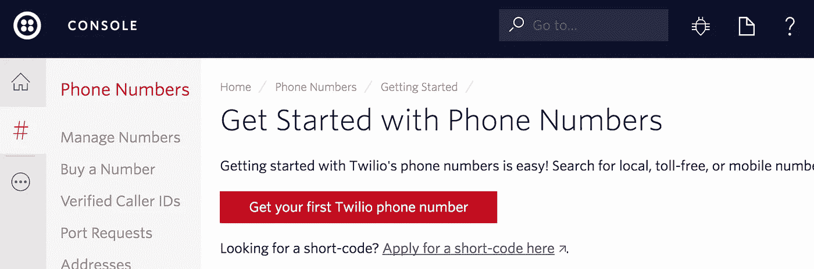

您将看到一个弹出窗口，提示您地理位置的一个随机数，在本例中，415 是旧金山。点击**选择此号码**快速继续。(以后可以买其他号。)

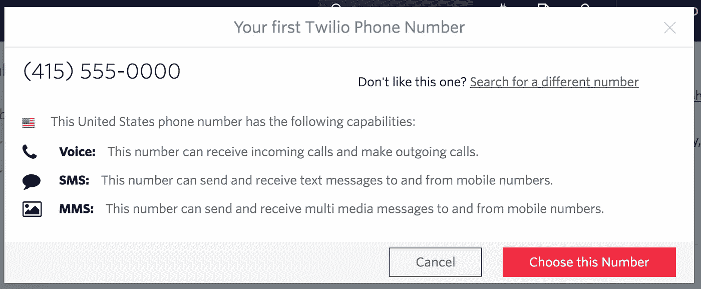

你会收到一条成功的信息。厉害！

# 第 2 分钟:StdLib 帐户设置

为了创建一个健壮的消息中心，你接下来需要设置你的 [StdLib](https://stdlib.com/) 账户。您将使用 StdLib 托管您的 Twilio Hub，从一个单一的、可维护的代码库中使用无限可扩展的“无服务器”架构，并挂钩到 StdLib 上的其他集成(例如，使用 [utils.image](https://stdlib.com/utils/image) 格式化您通过 MMS 接收的图像，或使用 [devin.income-predictor](https://stdlib.com/devin/income-predictor) 查看与来电号码相关联的邮政编码的收入范围)。只需访问[https://stdlib.com](https://stdlib.com)并点击“免费注册”来创建您的帐户。


Click “Sign Up” to Create an Account

# 第 3 分钟:创建一个 StdLib 工作区

[StdLib 原生运行 Node.js 8.0.0(是的，最新版本)](/stdlibhq/stdlib-updates-node-8-0-0-platform-support-new-faaslang-function-definitions-b33ffe5633b8)所以为了确保不存在兼容性问题，您可能希望运行它(尽管 Node 6 和 7 在本例中也适用)。可以从[官方 Node.js 网站](https://nodejs.org)安装 Node 的最新版本。完成后，打开您的终端或命令行，安装 [StdLib 命令行工具](https://github.com/stdlib/lib)，如下所示:

```
$ npm install lib.cli -g
```

这使您可以访问用于服务管理和执行的`lib`命令。接下来，为 StdLib 服务创建一个`stdlib`目录。

```
$ mkdir stdlib
$ cd stdlib
$ lib init
```

使用您在上一步中创建的凭据登录。就是这样！

# 第 4 分钟:StdLib 服务创建

接下来，您将从命令行创建 StdLib 服务。我们已经创建了一个特殊的`twilio`模板，让你可以在几秒钟内发送你自己的 Twilio Hub 原型。

```
$ lib create -t twilio
```

您将被要求输入一个`Service Name`，对于本教程，我们推荐使用`twilio-hub`。您将看到一些 NPM 软件包正在本地安装，您的服务目录正在创建:

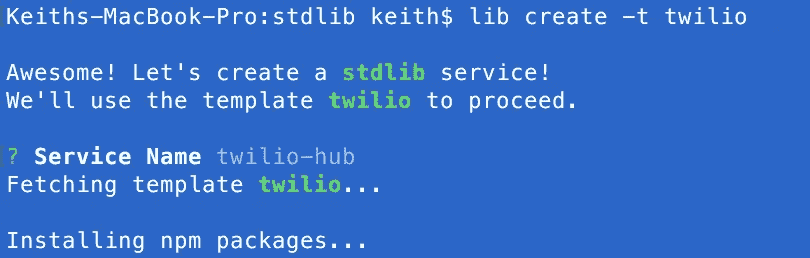

一旦完成，您将被告知进入您的服务目录。使用以下命令执行此操作:

```
$ cd user/twilio-hub
```

其中`user`当然是你的 StdLib 用户名。(我的情况是`keith`。)

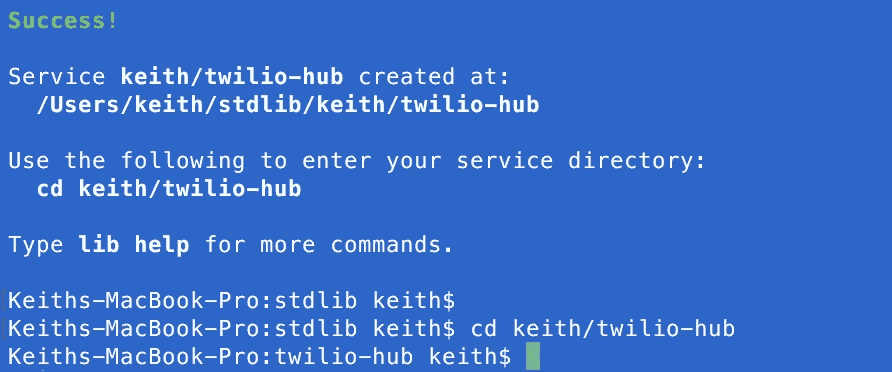

在这里，您可以尝试运行一些短信命令(这些将是发送到您 Twilio 号码的*【更多】*或*【whoami】*的回复):

```
$ lib .messaging.more
```

看看结果:


The SMS response to people who message your number with the text “more.”

或者，用`-d`打开调试模式，看看幕后发生了什么:

```
$ lib .messaging.whoami -d
```

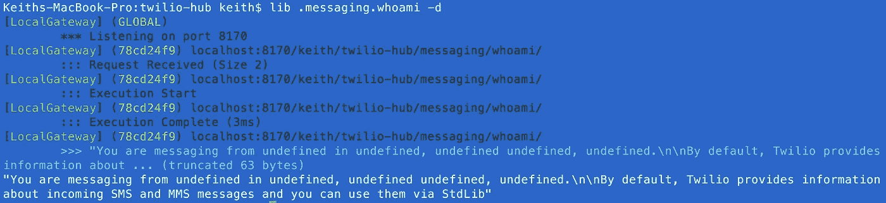

因为这实际上不是由 Twilio 的 webhook 触发的，执行信息(zipcode，city)读起来像`undefined`，所以这是意料之中的。

# **第 5 分钟:配置您的 StdLib 环境**

下一步，我们要确保 StdLib 知道我们所有的 Twilio 帐户细节。要正确设置，首先打开刚刚创建的 StdLib 服务目录中的`env.json`，`user/twilio-hub/env.json`，其中`user`是您的用户名。

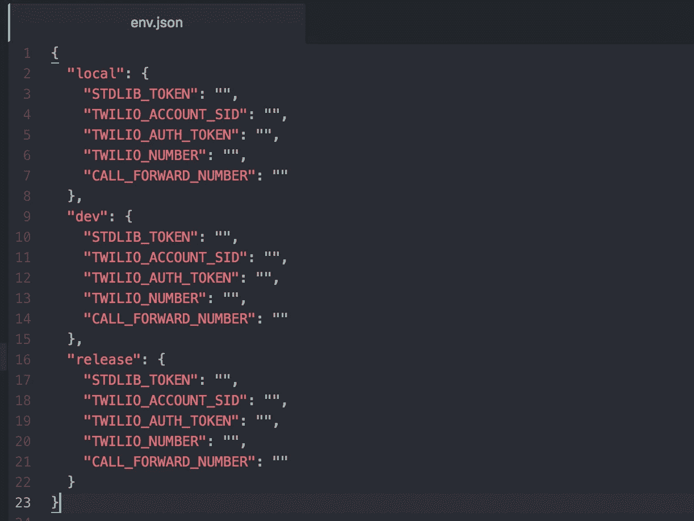

可以看到三种不同的环境:`local`、`dev`和`release`。这些适用于不同的执行上下文——在本地运行时，使用`local`中的环境变量，您可以部署到云中的`dev`环境，或者生产`release`环境。我们通常建议至少使用不同的电话号码。

**确保在本教程中，您使用相同的值填写** `**dev**` **和** `**local**` **变量。**

填写`"STDLIB_TOKEN"`访问[https://dashboard.stdlib.com/dashboard/](https://dashboard.stdlib.com/dashboard/)，登录，点击左侧**图书馆代币**，然后**显示代币**显示您的代币。将其复制并粘贴到您的环境变量中。

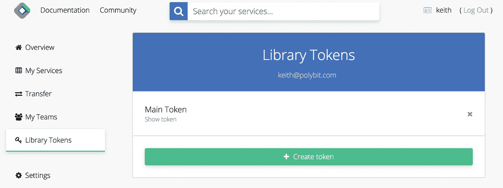

Click “Show Token” to reveal your token, then copy it.

接下来，`"TWILIO_ACCOUNT_SID"`、`"TWILIO_AUTH_TOKEN"`和`"TWILIO_NUMBER"`——这些都可以从你在[https://www.twilio.com/console](https://www.twilio.com/console)的 Twilio 控制台获得。直接复制你的**账号 SID** ，点击你的**认证令牌**旁边的眼球，显示出来，同样复制。

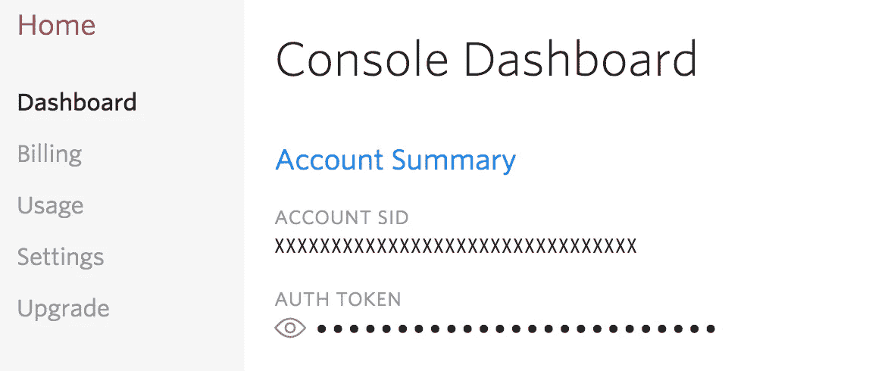

Copy your Account SID and your Twilio Auth Token into your Environment Variables

要查找您之前创建的 Twilio 电话号码，请访问[https://www.twilio.com/console/phone-numbers/incoming](https://www.twilio.com/console/phone-numbers/incoming)。点击您在**分钟 1** 中创建的红色高亮数字。

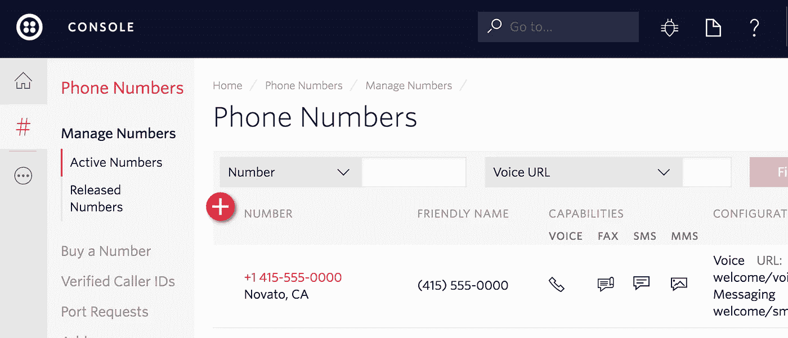

Click on the Red Text to Configure Your Number

在下一个屏幕中，将格式为`+1234567890`的**电话号码**值复制并粘贴到您的`"TWILIO_NUMBER"`值中。

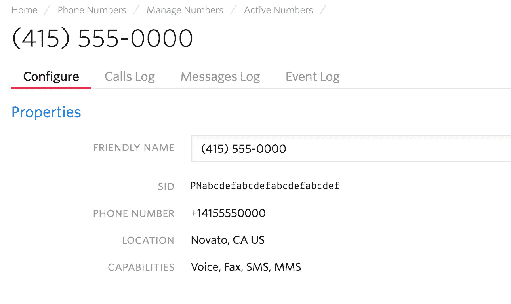

Copy the “PHONE NUMBER” value

**最后**,`"CALL_FORWARD_NUMBER"`值可以填入**您选择的任何电话号码，它是您的 Twilio Hub 会自动将来电转接到**的号码。再次使用格式`+1234567890`(确保它在引号中)。出于演示目的，最好使用个人电话号码。

# 第 6 分钟:部署和配置 Webhooks

你快完成了！最后一步是部署 StdLib Twilio Hub(上面设置了适当的环境变量),然后配置 Twilio Webhooks 指向 StdLib。

要在`dev`环境中部署 StdLib Twilio Hub，只需在服务目录中打开命令行并键入:

```
$ lib up dev
```

您将看到您的服务部署到开发环境的进度，并且会看到与您的`functions/`目录中的所有内容相对应的可用 HTTP 端点列表。

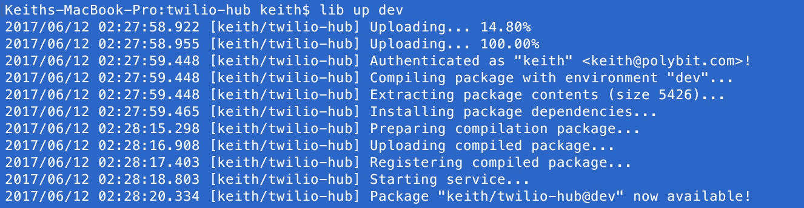

现在您的服务已上线，请返回 Twilio 管理号码面板[https://www.twilio.com/console/phone-numbers/incoming](https://www.twilio.com/console/phone-numbers/incoming)并再次选择您的电话号码。先向下滚动到**语音&传真**:

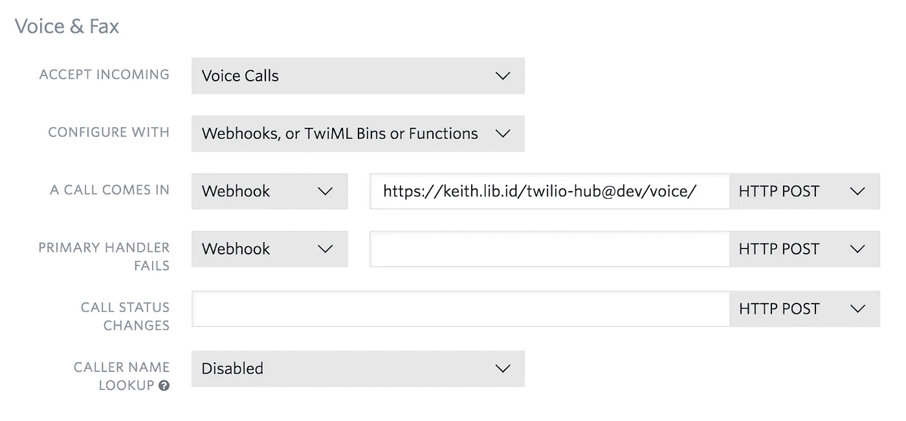

Enter in your “voice” endpoint to Voice & Fax

在这个表单中，除了**之外，还有一个来电**，确保在下拉列表中选择 **Webhook** ，并使用值`https://<user>.api.stdlib.com/twilio-hub@dev/voice/`(其中`<user>`当然是您的用户名)。请注意，主机名`api.stdlib.com`是我们的功能网关，您所有的服务和功能都将部署到这里。

接下来，向下滚动到**消息**并在**中输入`https://<user>.api.stdlib.com/twilio-hub@dev/messaging/`一条消息进入** Webhook 处理程序。

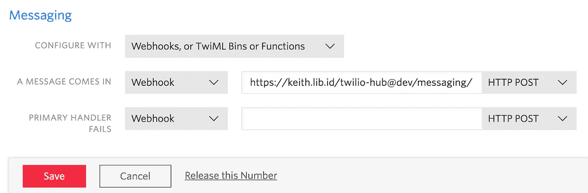

Enter in your Messaging Handler details, and hit **Save**

最后，点击左下方的**保存**。

# 第 7 分钟:添加已验证的电话号码

如果这是你第一次注册 Twilio，你将使用一个试用帐户。试用帐户对可以发送信息或转移来电的号码有限制。为了确保您在 StdLib 上的 Twilio Messaging Hub 如您所愿地工作，请使用**已验证的电话号码**列表来添加您想要转发呼叫或发送消息的任何电话号码。

[https://twilio.com/user/account/phone-numbers/verified](https://twilio.com/user/account/phone-numbers/verified.)

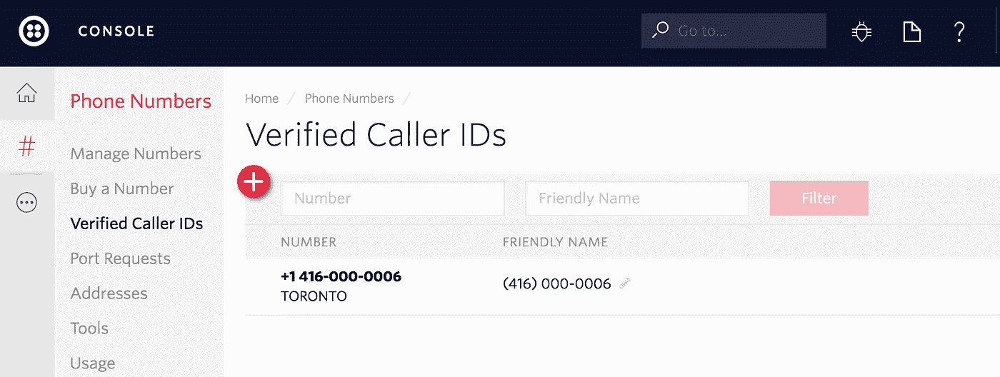

默认情况下，您注册帐户时使用的电话号码应该已经列在这里了。

# 就是这样！

您在 StdLib 上的 Twilio 消息中心已上线！现在，您可以向您的 Twilio 号码发送短信以接收自动回复，并拨打您的号码进行转发。如果你使用的是 Twilio 试用账户，请确保你在第 7 分钟内添加了经过验证的号码。否则，你就可以走了！

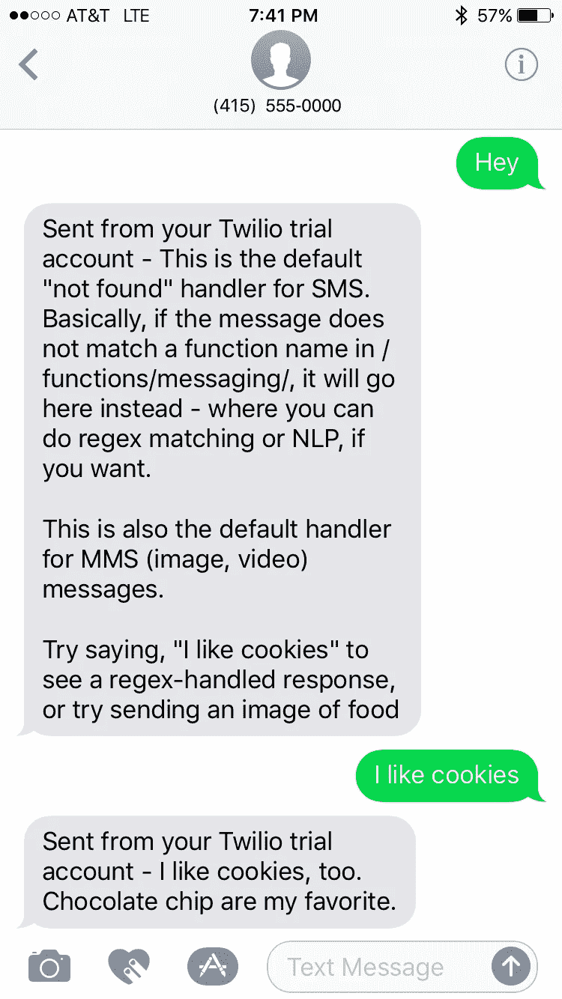

A Twilio Bot Interaction using StdLib

您可以通过访问 StdLib 服务中的`/functions/messaging/`目录来修改 SMS Bot 的行为。默认回答是“whoami”和“more”这个消息中心还处理 MMS(媒体、图片)上传。

## 陷阱和生产版本

如果在任何时候您忘记了您的 StdLib 用户名或者您的 webhook 回调应该是什么，当您使用`$ lib up dev`部署服务时，它们会被列出。

如果你在玩的时候没有得到预期的响应，Twilio 在 https://www.twilio.com/console/dev-tools/debugger 有一个惊人的调试器。

要将 bot / messaging hub 投入生产，我们建议使用不同的电话号码。将您在`env.json`中的`release`环境变量配置为适当的设置，将您在`package.json`中的`version`设置为`1.0.0`(或者您喜欢的任何东西)，发布一个带有`$ lib release`的版本，然后您可以使用`https://<user>.api.stdlib.com/twilio-hub@1.0.0/voice/`和`https://<user>.api.stdlib.com/twilio-hub@1.0.0/messaging/`作为您生产电话号码的语音和消息端点。

# 谢谢大家！

如果你想跟踪未来的 StdLib 更新和更多 Twilio 乐趣，请在 Twitter 上关注我们，地址是[@ StdLibHQ](https://twitter.com/StdLibHQ)——或者你可以关注我，特别是在 [@keithwhor。](https://twitter.com/keithwhor)感谢阅读！

在 StdLib，我们专注于让软件开发人员的生活变得更轻松，让他们重新做他们最喜欢的事情——编写代码和开发出色的产品。如果你愿意帮助我们完成任务，请联系[*careers@stdlib.com*](mailto:careers@stdlib.com)*了解一下你自己吧！*

[](http://bit.ly/HackernoonFB)[](https://goo.gl/k7XYbx)[](https://goo.gl/4ofytp)

> 黑客中午是黑客如何开始他们的下午。我们是这个家庭的一员。我们现在[接受投稿](http://bit.ly/hackernoonsubmission)并乐意[讨论广告&赞助](mailto:partners@amipublications.com)机会。
> 
> 如果你喜欢这个故事，我们推荐你阅读我们的[最新科技故事](http://bit.ly/hackernoonlatestt)和[趋势科技故事](https://hackernoon.com/trending)。直到下一次，不要把世界的现实想当然！

