# 用 4 个步骤构建一个 API 驱动的静态网站

> 原文：<https://medium.com/hackernoon/build-a-static-website-in-4-steps-3f39b8d97ad3>

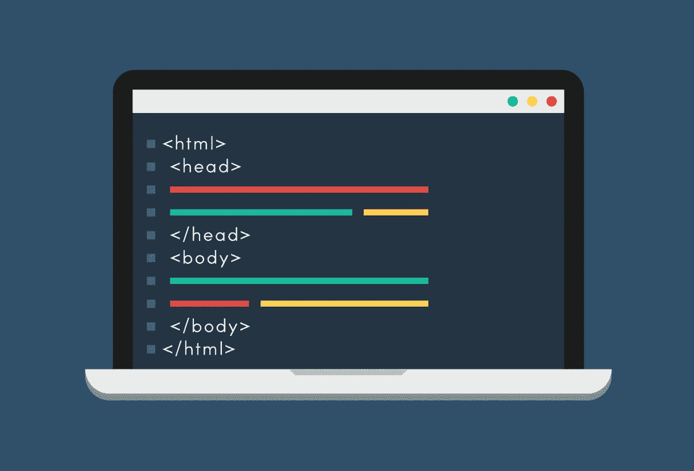

> 卡森·吉本斯是 [Cosmic JS](https://cosmicjs.com) 的联合创始人和 CMO，这是一个 API 第一的基于云的[内容管理平台](https://cosmicjs.com)，它将内容与代码分离，允许开发人员用他们想要的任何编程语言构建流畅的应用程序和网站。

在这篇博客中，我将详细介绍如何用 4 个步骤构建一个 API 驱动的静态网站。静态网站将使用 Webhooks 和 Markdown，在内容通过 Cosmic JS 内容管理 API 动态更改后自动重建。虽然我只是从 [Cosmic JS Apps 页面](https://cosmicjs.com/apps)中挑选了一个内容就绪的静态网站，但是通过阅读[如何构建一个 API 驱动的静态网站](https://cosmicjs.com/blog/how-to-build-an-api-powered-static-website-the-best-of-both-worlds)，你可以看到 API 驱动的静态网站是如何用 Node.js 构建的，特别是 Express 框架。

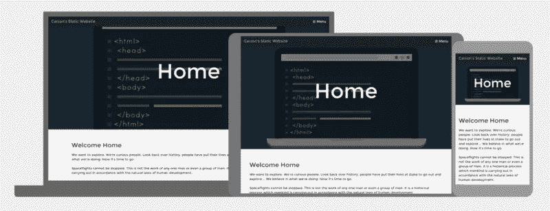

# 1.用宇宙 JS 创建一个新桶

[注册](https://cosmicjs.com/signup)参加 [Cosmic JS](https://cosmicjs.com/) 或导航至您的 Cosmic JS 仪表盘添加新的存储桶。添加新的存储桶后，系统会提示您创建存储桶的名称。这将分配将用于应用程序的 API 端点的 bucket slug。

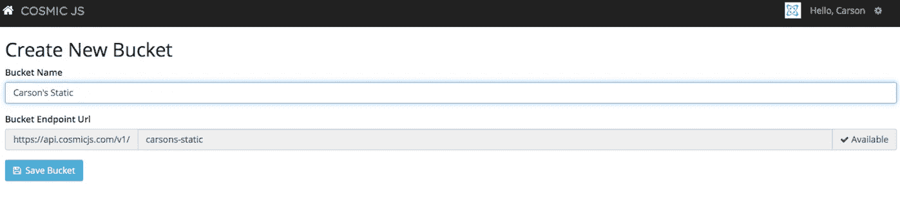

我将我的桶命名为“卡森的静态”，作为这个博客的例子。

# 2.安装 COSMIC JS API 驱动的静态网站

一旦我保存了我的 bucket，我将可以选择安装一个应用程序或者直接创建我的对象类型。我正在从[宇宙 JS 应用页面](https://cosmicjs.com/apps)安装 [API 驱动的静态网站](https://cosmicjs.com/apps/static-website)。

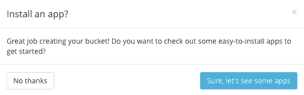

一旦你选择了应用程序，你会在你的宇宙 JS 仪表板中看到[应用程序页面](https://cosmicjs.com/apps)。您可以在 Node.js、PHP、React 以及其他标签之间进行过滤，以在[内容就绪网站和应用](https://cosmicjs.com/apps)之间进行过滤。

我安装了[静态网站](https://cosmicjs.com/apps/static-website),然后看到一个部署到 Web 模式。我喜欢在安装应用程序的那一刻部署它们，这样我就可以在[宇宙 JS CMS](https://cosmicjs.com/) 中编辑我的 web 应用程序，并在 API 立即更新我的应用程序时实时刷新以查看我的结果。

# 3.部署静态网站

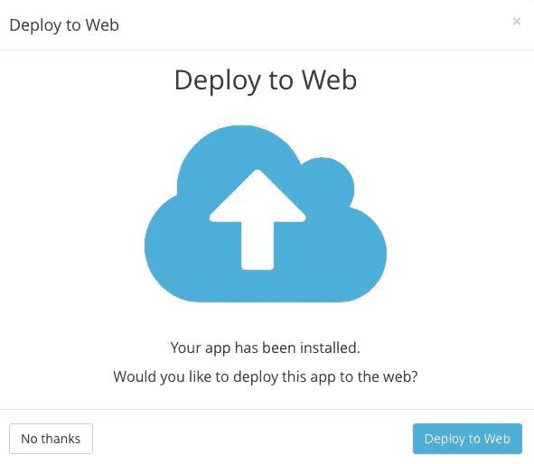

一旦选择部署到 Web，您将可以选择设置环境变量以及添加[托管功能](https://cosmicjs.com/features)，如[自定义域](https://youtu.be/xlphcQ32YHM)和[一键式 SSL](https://cosmicjs.com/blog/video-tutorial-one-click-ssl) 。

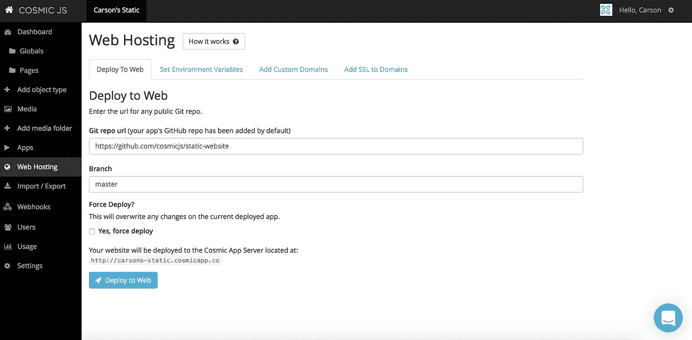

点击 Deploy to Web，会出现一个“Deploy Web App”模式，澄清我的 GitHub 分支、部署位置等等。

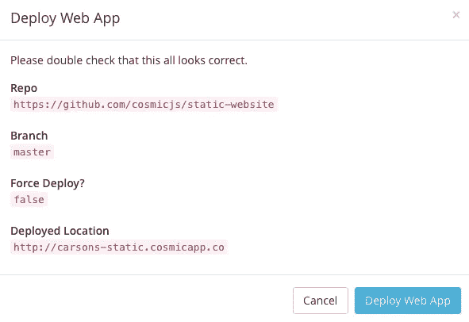

开始倒计时，直到你的静态网站上线，但不要让它阻止你编辑全局、页面、内容、媒体或任何你想要的东西:)

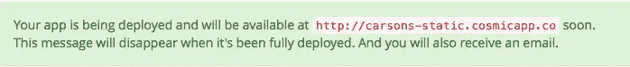

在[宇宙 JS](https://cosmicjs.com/) 上的平均部署需要 2 分钟。我收到一封电子邮件，里面有我静态网站的实时链接。

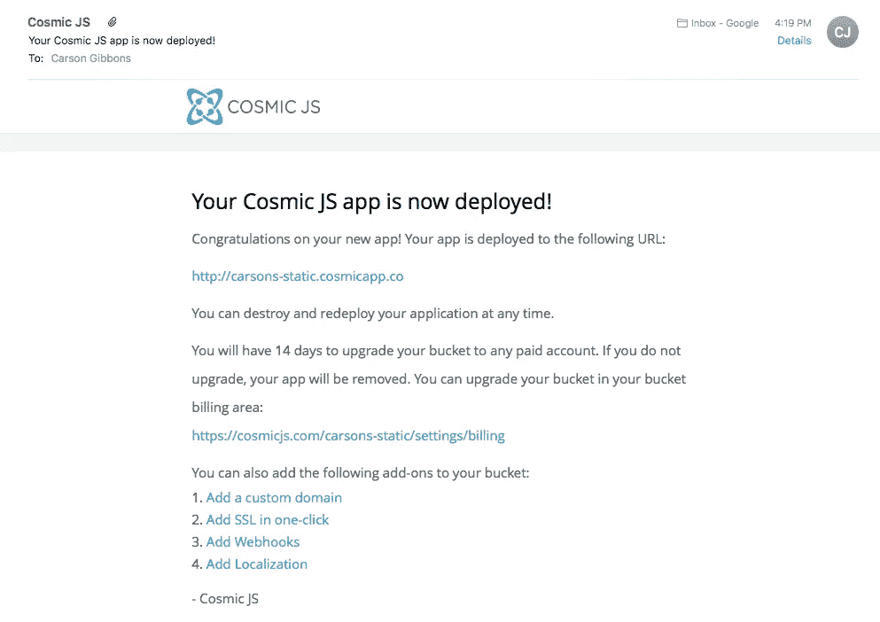

# 4.管理动态内容和审查

自然地，我点击查看我的静态网站，它在[http://carsons-static.cosmicapp.co](http://carsons-static.cosmicapp.co/)直播。

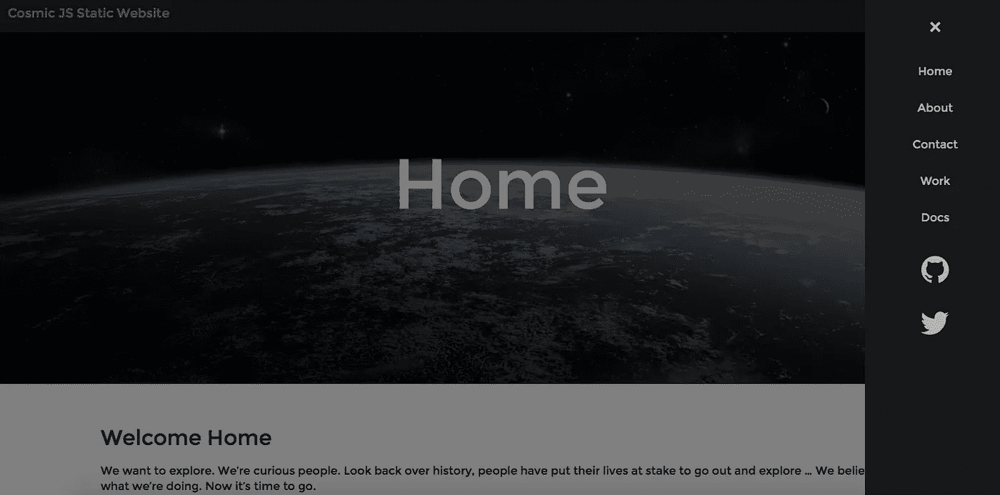

静态 HTML 和 Markdown 相结合的快速体验。[宇宙 JS API](https://cosmicjs.com/) 为 [API 驱动的静态网站](https://cosmicjs.com/blog/how-to-build-an-api-powered-static-website-the-best-of-both-worlds)提供动态内容，通过[宇宙 JS 内容管理平台](https://cosmicjs.com/)控制。

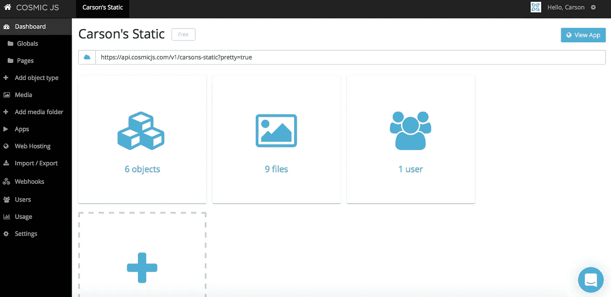

编辑对象，添加新媒体和发布内容到您的静态网站。静态网站在页面加载时会随着内容的变化而自动重建，因此您可以实时地维护静态网站。

部署成功后一分钟，我使用了谷歌的开发者页面速度洞察,我的静态网站已经启动了 zippy HTML，加上静态网站的降价文件，实现了快速加载体验。

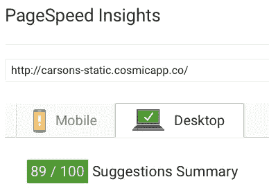

> [点击这里查看静态网站演示](http://static-website.cosmicapp.co/)。
> 
> [点击此处](https://github.com/cosmicjs/static-website)查看 GitHub 上的静态网站代码库。
> 
> [查看宇宙 JS](https://cosmicjs.com/apps/static-website) 上的静态网站 App 页面。

[Cosmic JS](https://cosmicjs.com/) 是一个 [API 第一的基于云的内容管理平台](https://cosmicjs.com/)，使得管理应用和内容变得容易。如果你有关于 Cosmic JS API 的问题，请通过 [Twitter](https://twitter.com/cosmic_js) 或 [Slack](https://cosmicjs.com/community) 联系我们。

> [黑客中午](http://bit.ly/Hackernoon)是黑客如何开始他们的下午。我们是 AMI 家庭的一员。我们现在[接受投稿](http://bit.ly/hackernoonsubmission)并乐意[讨论广告&赞助](mailto:partners@amipublications.com)机会。
> 
> 如果你喜欢这个故事，我们推荐你阅读我们的[最新科技故事](http://bit.ly/hackernoonlatestt)和[趋势科技故事](https://hackernoon.com/trending)。直到下一次，不要把世界的现实想当然！

