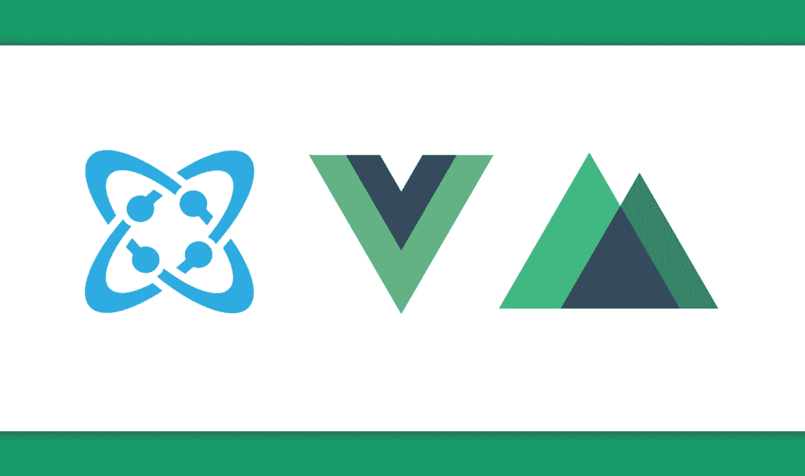
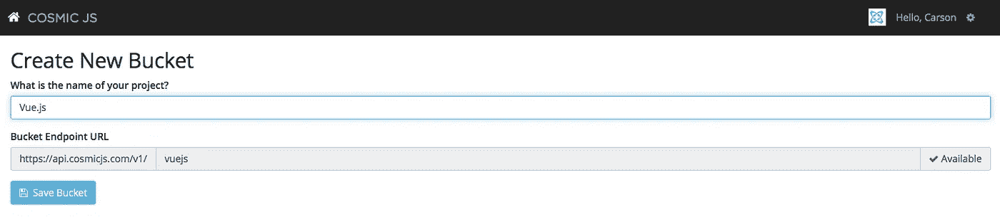
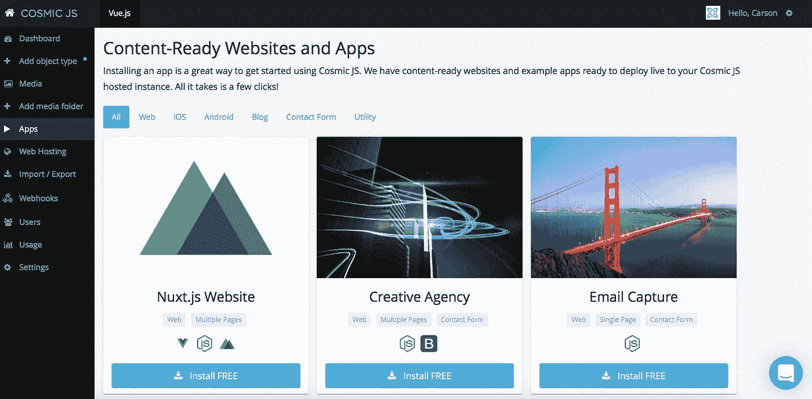
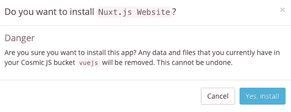
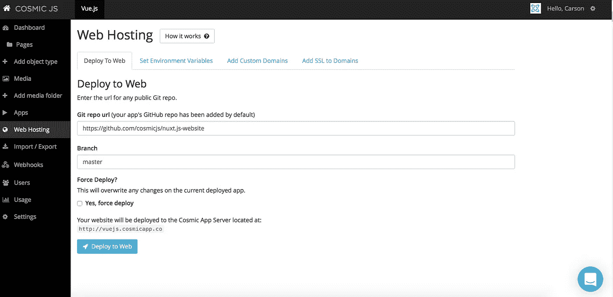
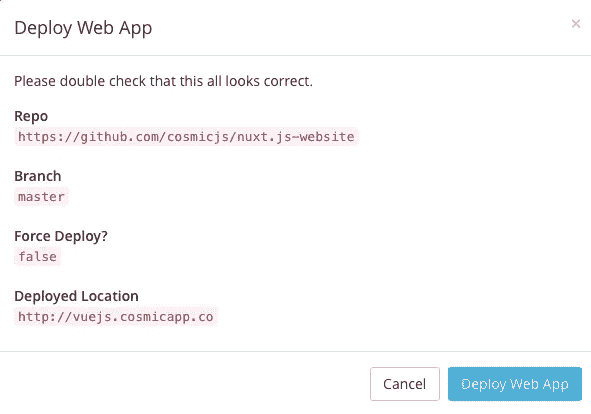

# 用 4 个步骤建立一个 Vue.js 网站

> 原文：<https://medium.com/hackernoon/build-a-vue-js-website-in-4-steps-56dc5db8012b>

许多想要构建应用程序的开发人员不需要完整的引擎/库来完成它。与 AngularJS 类似，Vue.js 不是一个“成熟的框架”，它旨在成为一个简单灵活的视图层，适用于数据模型简单的应用程序和网站，并与应用程序的表示层更加匹配。

在这篇博客中，我将向你展示如何利用现有的代码库例子来构建你自己的漂亮的 [Vue.js / Nuxt.js 网站](https://cosmicjs.com/apps/nuxtjs-website)。 [Cosmic JS](https://cosmicjs.com) 有一个使用 [Nuxt.js 框架](https://nuxtjs.org/)构建的 Vue 通用网站的例子。它是由一个月前[宇宙 JS](https://cosmicjs.com) 发布的 [Next.js 网站](https://cosmicjs.com/apps/nextjs-website)改编的[塞巴斯蒂安肖邦](https://github.com/Atinux)。代码在客户机和服务器之间共享，使得开发变得轻而易举。添加 [Cosmic JS 驱动的内容](https://cosmicjs.com)，你就把你的网站提升到了 Nuxt.js 的水平。

在这个示例博客中，我将使用 [Cosmic JS](https://cosmicjs.com/) 。Cosmic JS 是一个 [API 优先的 CMS](https://cosmicjs.com/) ，它使得管理和构建网站和应用程序更加快速和直观。

如果你还没有，那就从[报名](https://cosmicjs.com/signup)参加[宇宙 JS](https://cosmicjs.com/) 开始吧。下面提供了有用的资源来简化您的开发操作。

 [## Nuxt.js 网站|宇宙 js 应用程序

### Cosmic JS 是一个云托管的内容平台，提供了一个灵活而直观的 CMS API。建立网站和…

cosmicjs.com](https://cosmicjs.com/apps/nuxtjs-website)  [## cosmicjs/nuxt . js-网站

### 使用 Cosmic JS 的 nuxt.js 网站示例

github.com](https://github.com/cosmicjs/nuxt.js-website) 

# 1.创建新的存储桶

您的 bucket 的名称是您正在构建的网站、项目、客户端或 web 应用程序的名称。我将我的博客命名为“Vue.js ”,以保持示例博客的简洁。

# 2.安装 Cosmic JS Nuxt.js 网站

一旦你注册并命名了你的桶，你将被提示从头开始或者“查看一些应用”。对于这个博客，我简单地点击了右键“查看一些应用”，这样我就可以开始安装 [Nuxt.js 网站](https://cosmicjs.com/apps/nuxtjs-website)了。

# 应用程序安装选项

[Cosmic JS](https://cosmicjs.com/) 让你能够在编程语言之间进行过滤，比如 [Node.js](https://cosmicjs.com/apps) 、 [PHP](https://cosmicjs.com/apps) 、 [React](https://cosmicjs.com/apps) 、 [AngularJS](https://cosmicjs.com/apps) 等等。

只需点击 [Nuxt.js 网站](https://cosmicjs.com/apps/nuxtjs-website)图标下的“安装”即可开始，或者访问 [Cosmic JS 应用页面](https://cosmicjs.com/apps)。

# 3.部署到 Web

我点击了“部署到 Web”。然后，我可以在部署 web 应用程序时编辑对象。您将收到一封电子邮件，确认您的 web 应用程序的部署。如果您在部署过程中遇到任何问题，您可能会被转到 [Cosmic JS 故障排除页面](https://cosmicjs.com/troubleshooting)。

# 确认部署位置和分支

# 部署分支机构确认模式

编辑是在宇宙 JS 仪表盘中实现的梦想。要了解更多关于如何在考虑编辑内容的情况下构建 [Cosmic JS](https://cosmicjs.com/) 的信息，请阅读[在考虑内容编辑器的情况下构建](https://cosmicjs.com/blog/building-with-the-content-editor-in-mind)。

# 应用部署确认

现在您的应用程序已经部署到了 Cosmic JS 应用程序服务器，您可以从一个位置自由地完全管理您的 Vue.js 网站及其所有内容。

就像注册、创建新的存储桶、安装 web 应用程序、编辑对象和部署一样简单！我收到了访问我的 web 应用程序的确认电子邮件，还看到了我的桶升级选项，如[自定义域、一键式 SSL、webhooks 和本地化](https://cosmicjs.com/features)。

# 其他 Vue.js 文章

 [## 如何用 Vue.js 和 Vuex 搭建一个菜谱 app

### 在本教程中，我将向你展示如何使用 Vue2，Vuex，Vuetify 和 Cosmic JS 创建一个优雅的食谱应用程序…

hackernoon.com](https://hackernoon.com/how-to-build-a-recipe-app-using-vue-js-and-vuex-7830998050b9)  [## 如何建立 Vue.js 图片库

### 在本教程中，我将向你展示如何从 HTML5UP，powered…

hackernoon.com](https://hackernoon.com/how-to-build-a-vue-js-photo-gallery-a0d4a1ec298d) 

[Cosmic JS](https://cosmicjs.com/) 是一个 API 首创的基于云的内容管理平台，可以轻松管理应用和内容。如果你对 Cosmic JS API 有任何疑问，请通过 [Twitter](https://twitter.com/cosmic_js) 或 [Slack](https://cosmicjs.com/community) 联系创始人。

[卡森·吉本斯](https://twitter.com/carsoncgibbons)是[宇宙 JS](https://cosmicjs.com/) 的联合创始人& CMO，宇宙 JS 是一个 API 第一的基于云的[内容管理平台](https://cosmicjs.com/)，它将内容与代码分离，允许开发者用他们想要的任何编程语言构建流畅的应用和网站。

> [黑客中午](http://bit.ly/Hackernoon)是黑客如何开始他们的下午。我们是 AMI 家庭的一员。我们现在[接受投稿](http://bit.ly/hackernoonsubmission)并乐意[讨论广告&赞助](mailto:partners@amipublications.com)机会。
> 
> 如果你喜欢这个故事，我们推荐你阅读我们的[最新科技故事](http://bit.ly/hackernoonlatestt)和[趋势科技故事](https://hackernoon.com/trending)。直到下一次，不要把世界的现实想当然！

