# 用 Node.js 和 StdLib 在 7 分钟内建立 Alexa 技能

> 原文：<https://medium.com/hackernoon/build-an-alexa-skill-in-7-minutes-flat-with-node-js-and-stdlib-70611f58c37f>

在 [StdLib("标准库")](https://stdlib.com)我们允许开发人员将 Node.js 中编写的函数部署为无限可扩展的 API 端点，然后他们可以通过我们的库与他人共享。这一功能，加上我们的其他功能，如自动 SDK 生成和文档，使 StdLib 与我们在参加 AWS re:Invent 时收到的[亚马逊 Echo Dot](https://www.amazon.com/dp/B015TJD0Y4) 完美匹配。我们很高兴与你分享我们的产品——StdLib 是从新手到经验丰富的开发者开始构建 Alexa 技能的*最快、最简单的*方式。


StdLib + Echo Dot = ❤

我们对 Echo Dot 的热情首先在西部世界第四季大结局的 Dolores Abernathy Alexa 技能演示中达到高潮。由于那个视频，我们收到了很多来自开发者的问题，询问如何实现他们自己的 Alexa 技能。基于开发人员社区的强烈反应，我们认为最好是就如何用 StdLib 构建 Alexa 技能编写一个 7 分钟的指南。我们开始吧！

# 你事先需要什么

*   1x 亚马逊回声或亚马逊回声点
*   1x Alexa 应用程序和注册([遵循这些官方说明](https://www.amazon.com/gp/help/customer/display.html?nodeId=201994280))
*   1x 访问 [Alexa 开发者门户](https://developer.amazon.com/alexa)
*   7x 分钟(或 420x 秒)

# 第 1 分钟:准备你的 Alexa 技能

首先，我们将在亚马逊 Alexa 开发者门户网站上准备您的 Alexa 技能。访问[developer.amazon.com/alexa](https://developer.amazon.com/alexa)并签到开始。点击顶部的“Alexa”按钮找到该页面:

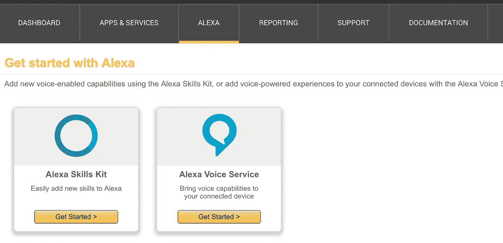

Get Started with the Alexa Skills Kit

点击 Alexa 技能套装下的 ***入门>*** 开始。接下来，在屏幕右上角的**上，点击 ***添加新技能*** 。**

## 技能信息

这是用于识别您的技能以及您的技能将如何与 Alexa 交互的信息。开始时非常简单。


按照上面的指示填写这些字段；**技能类型**是“自定义交互模型”，因此我们可以定义技能行为，**名称**是“测试”，以方便识别技能，**调用名称**，或我们将用来让 Alexa 执行我们技能的短语是“测试机器人”，即*“嘿，Alexa，问测试机器人[一个短语]”*准备好后按下右下方的 ***下一个*** 。

# 第二分钟:准备你的互动模型

接下来，交互模型定义了 Alexa 将如何解释你向她提出的问题。我们现在来看看如何定义*“嘿，Alexa，问测试机器人[你想要什么]”*结尾的短语、句子或问题，以及我们希望 Alexa 如何解析它。

## 意图

**意图**可以被认为是你的技能可以涉及的不同功能。他们可以根据**话语**(见下文)解释句子，并从这些话语中填充**槽**(变量)。我们将在以后的教程中介绍**插槽**，现在让我们先设置好**意图**和**发声**:

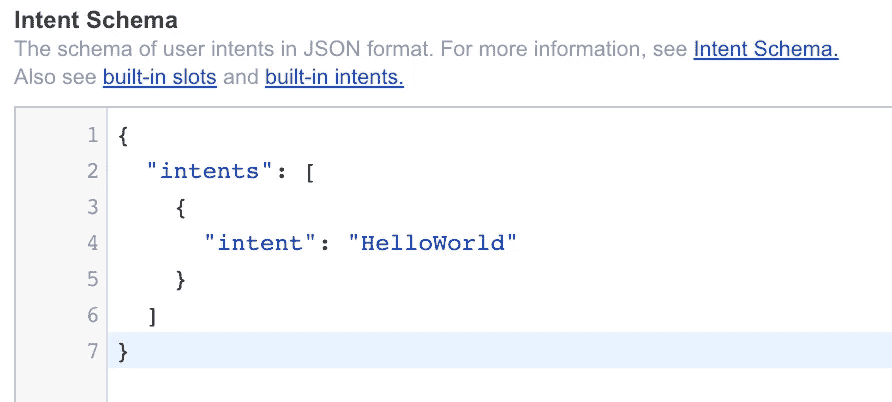

我们的意图需要一个**意图模式**，所以我们将创建一个只有“HelloWorld”意图的基本模式。你可以复制左边的设置。这将与一个非常简单的**话语**(功能触发)联系起来。

## **话语**

话语是要求 Alexa 提及特定意图的触发短语。为了触发我们的 *HelloWorld* 意图，我们将使用短语*“你好。”*

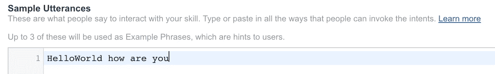

Very Simple Utterance Example

这就是我们开始建立交互模型真正需要的。我们现在已经准备好为我们的 Alexa 技能编写代码了。

# 第 3 分钟:StdLib 帐户设置

要构建一个函数并将其部署为无限可伸缩的 web 服务，您首先需要设置一个 StdLib 帐户，您可以通过在 [StdLib 主页](https://stdlib.com)上注册来完成。只要点击“注册”,一旦你注册，你就可以开始了！

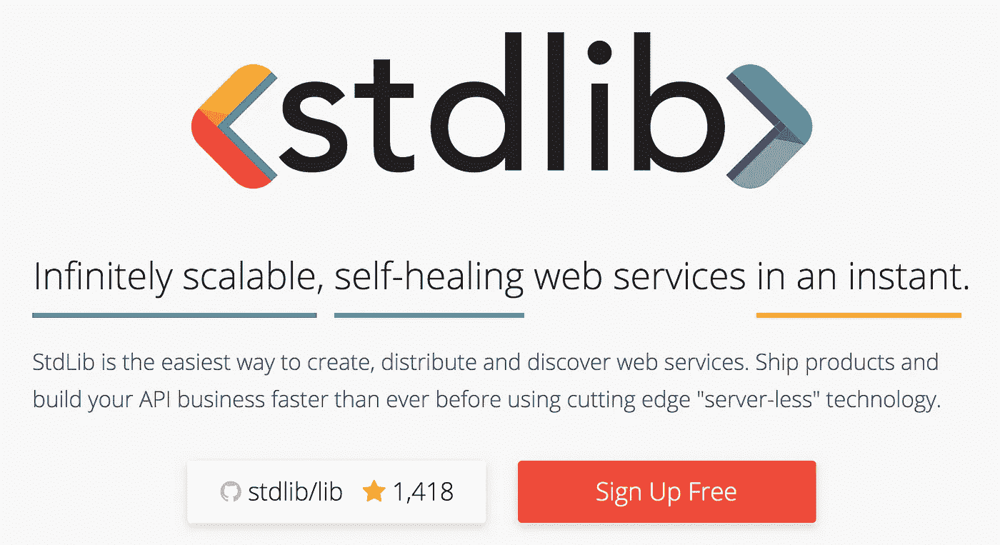

Click “Sign Up” to Create an Account — Takes Less than a Minute!

# 第 4 分钟:创建一个 StdLib 工作区

如果没有安装 Node.js，从[官方 Node.js 网站](https://nodejs.org)下载 6.9.x 或更高版本。完成后，打开您的终端或命令行并安装 [StdLib 命令行工具，可从 GitHub: stdlib/lib](https://github.com/stdlib/lib) 获得(完整文档可用)。

```
$ npm install lib.cli -g
```

现在，您将使用 StdLib 命令行工具来创建一个 Alexa 技能。首先，为您的 StdLib 服务创建一个目录并初始化一个工作区——您将被要求使用您已经注册的帐户登录。

```
$ mkdir stdlib
$ cd stdlib
$ lib init
```

一旦您的工作空间被初始化，您就可以创建您的 StdLib 服务了。

# 第 5 分钟:StdLib 服务创建和部署

你现在已经准备好创建你的 Alexa 技能了。StdLib 提供了非常简单的*服务模板*，让你不用写任何额外的代码就可以使用 Alexa。通过键入以下内容，使用“alexa”模板创建一个服务:

```
$ lib create -t alexa
```

按照屏幕上的说明继续，并输入与您的技能相关的目录。

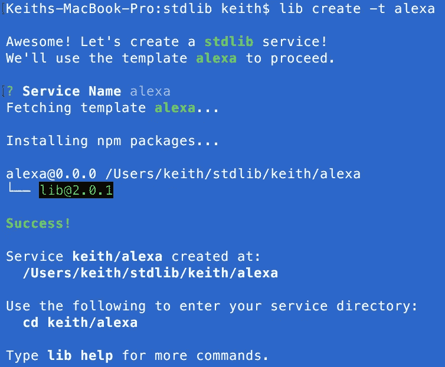

Alexa Skill Function Creation Workflow

您可以通过以下方式立即测试您的技能:

```
$ lib .
```

但是，您将得到一个错误，指出“需要 Intent 名称”——执行“HelloWorld”意图，具体如下:

```
$ lib .intents.HelloWorld
```

响应应该是这样的；

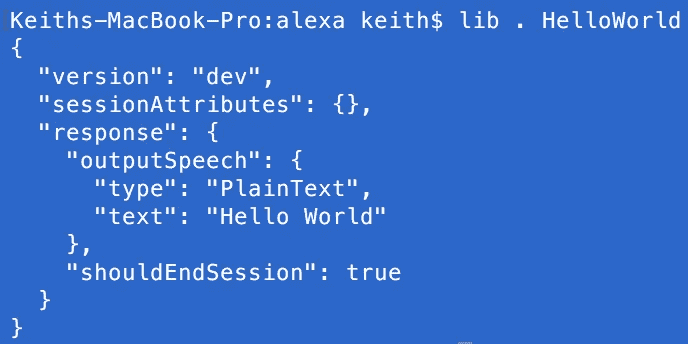

HelloWorld Intent Response

厉害！你看到的 JSON 响应就是 Alexa 期望的，以便在你的技能被访问时与你交谈。如果您想对技能或意图进行任何修改，只需查看`/functions/intents/HelloWorld.js`文件夹。您现在可以使用以下命令部署到 StdLib:

```
$ lib up dev
```

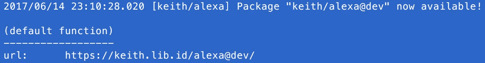

An example output showing where your Alexa Skill is Available via HTTPS

部署完成后，您将看到上面的消息(带有您的用户名和服务名),并可以使用提供的 URL 实时(在云端)执行它，或者您可以使用以下命令从命令行测试它:

```
$ lib <username>.<service>[@dev].intents.HelloWorld
```

太好了！让我们将这个端点与我们之前生成的**交互模型**结合起来。

# 第 6 分钟:将 StdLib 端点分配给 Alexa

现在，您已经在 StdLib 上部署了一个功能作为无限可伸缩的 web 服务，您已经准备好将它连接到 Alexa。返回亚马逊开发者门户，在技能的 ***配置*** 选项中，输入以下内容:

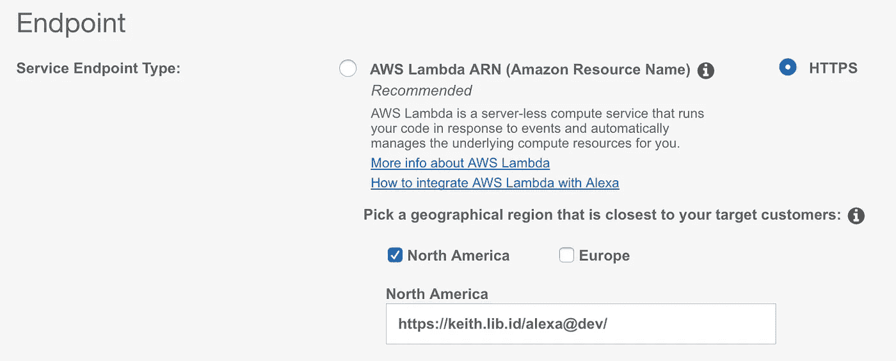

Endpoint Setup via HTTPS

请注意，您将用上一步中检索到的端点来替换*https://keith.lib.id/alexa@dev/*—**请在末尾加上斜杠！**完成后，点击右下角的 ***下一步*** ，您将进入 SSL 配置选项。选择“*我的开发端点是拥有来自证书颁发机构的通配符证书的域的子域*”以继续(StdLib 会为您处理 SSL)。

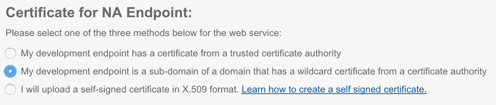

Development Endpoint is a StdLib Subdomain

再次点击右下角的 ***下一个*** 完成技能准备。

# 第 7 分钟:祝贺你！你的 Alexa 技能准备好了！

剩下要做的就是测试你的技能——你应该已经在**测试**页面上了。首先，确保你的技能可以进行测试:


On the “Test” Page, make sure your skill is enabled

向下滚动一点，输入一个**示例话语。**

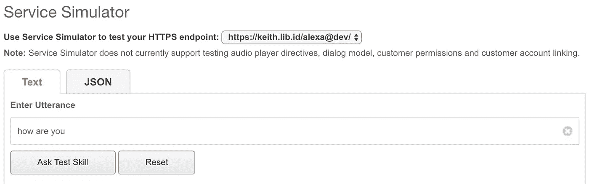

“how are you” is one of our Utterances

键入“你好吗”(我们在之前的步骤中已经设置好了)，然后点击**询问测试**。您应该会看到以下结果:

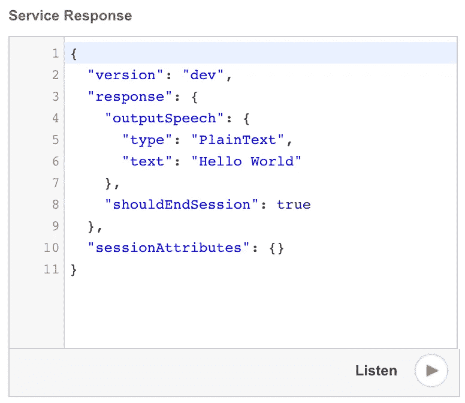

点击“听”来听听你的回答的声音演示！你的技能现在通过你的个人回声或回声点进行测试。如果您的 Dot 已开机、连接到 WiFi 并正在收听，只需问它:

> 嘿 Alexa，问测试机器人你好吗？

您应该会得到如下响应，如本演示所示:

Alexa “Test Bot” Skill Demo

是的——就这么简单！这就是你开始自己玩和测试 Alexa 技能所需要的全部，我们当然希望你发现它是有帮助的！

# 就是这样！你的 Alexa 技能准备好了！

感谢您的关注！我们很高兴能够分享在 StdLib 上构建 Alexa 技能是多么快速和简单，我们很高兴看到你将构建什么。通过[在 StdLib](https://stdlib.com) 注册，在 stdlib/lib 的 [GitHub 上为我们点赞，或者](https://github.com/stdlib/lib)[在 Twitter 上关注@ StdLibHQ](https://twitter.com/stdlibhq)，继续关注更多更新。

我们计划在短期内发布更多材料，向您展示如何构建更深入的 Alexa 技能。与其他 StdLib 服务或第三方工具的集成非常简单，只需几行代码，您就可以使用 Echo Dot 实现更强大的功能。[阅读我们在 GitHub](https://github.com/stdlib/lib) 上的文档，同时熟悉自己，点击[stdlib.com](https://stdlib.com)上的**社区> Slack** 加入我们的开发者社区 Slack。

保持联系，如果你有什么特别想知道的，请在这里评论或发电子邮件给我！让我们知道，如果你已经建立了任何令人兴奋的，你希望我们的功能或分享。你也可以在推特上关注我。

[](http://bit.ly/HackernoonFB)[](https://goo.gl/k7XYbx)[](https://goo.gl/4ofytp)

> [黑客中午](http://bit.ly/Hackernoon)是黑客如何开始他们的下午。我们是 T21 家庭的一员。我们现在[接受投稿](http://bit.ly/hackernoonsubmission)并乐意[讨论广告&赞助](mailto:partners@amipublications.com)机会。
> 
> 如果你喜欢这个故事，我们推荐你阅读我们的[最新科技故事](http://bit.ly/hackernoonlatestt)和[趋势科技故事](https://hackernoon.com/trending)。直到下一次，不要把世界的现实想当然！

