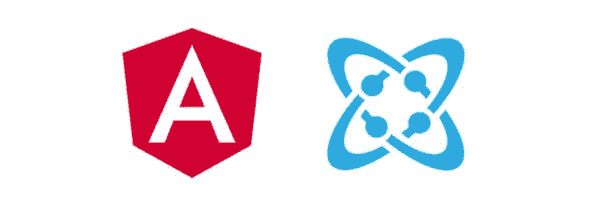
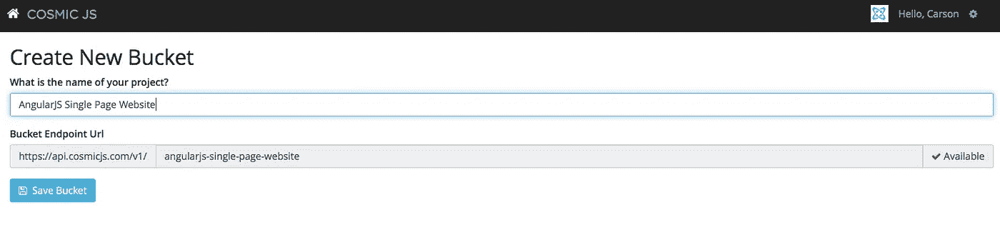
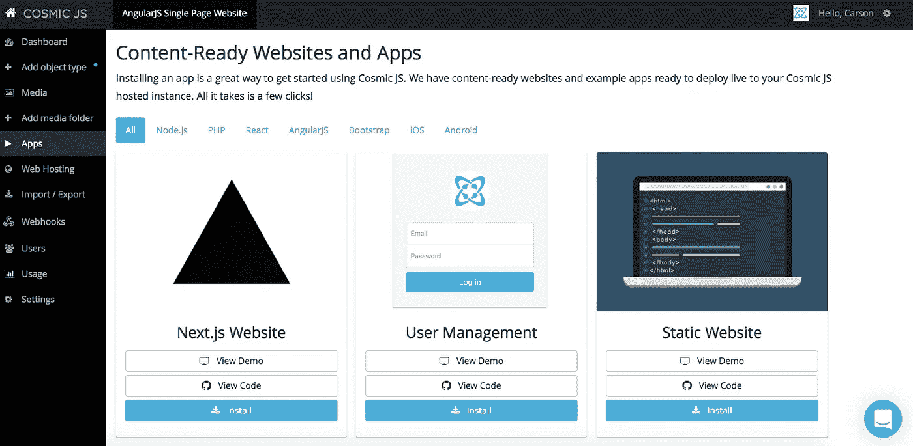
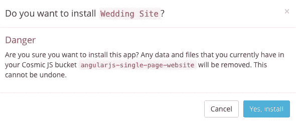
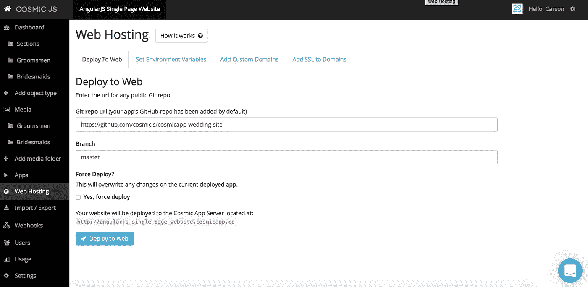
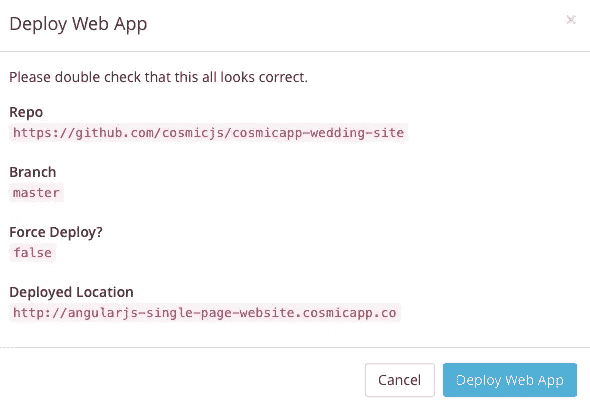
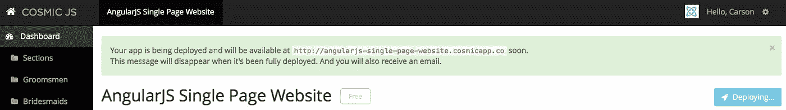
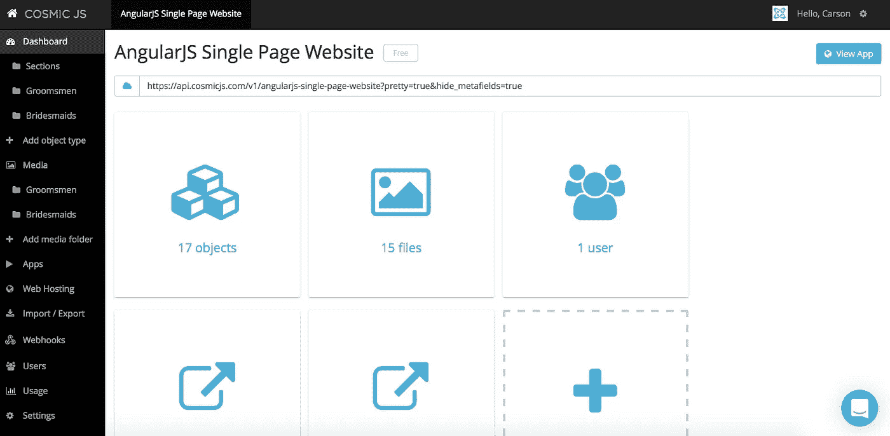
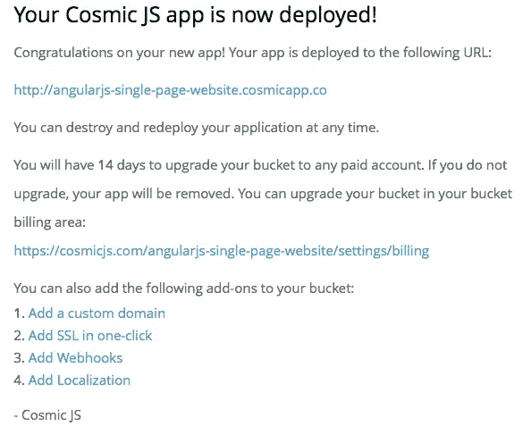

# 用 4 个步骤建立一个 AngularJS 网站

> 原文：<https://medium.com/hackernoon/build-an-angularjs-website-in-4-steps-afd2e83abe1>

在这篇博客中，我将向你展示如何利用现有的代码库例子来构建你自己的漂亮的单页网站。我们的[示例应用](https://wedding-site.cosmicapp.co/)肯定会令人高兴，因为它面向婚礼策划市场。这个棱角分明的 JS 单页婚礼网站可以轻松编辑内容，更新照片和计划大日子。这个示例应用程序使用 AngularJS 构建，并使用 [Cosmic JS API](https://cosmicjs.com/) 进行内容管理和更新。

在这个示例博客中，我将使用 [Cosmic JS](https://cosmicjs.com/) 。Cosmic JS 是一个 [API 优先的 CMS](https://cosmicjs.com/) ，它使得管理和构建网站和应用程序更加快速和直观。通过将内容从代码中分离出来，Cosmic JS 增强了开发人员的灵活性，同时确保内容编辑人员能够以最适合他们的方式规划和部署内容。我们将使用 Cosmic JS 来安装我们的示例应用程序，部署和更新来自基于云的内容管理平台的内容。

如果你还没有，那就从[报名](https://cosmicjs.com/signup)参加[宇宙 JS](https://cosmicjs.com/) 开始吧。下面提供了有用的资源来简化您的开发操作。

> [AngularJS 网站页面](https://cosmicjs.com/apps/wedding-site)
> 
> [AngularJS 网站演示](https://cosmicjs.com/apps/wedding-site/demo)
> 
> 基于 GitHub 的 AngularJS 网站代码库

# 1.创建新的存储桶

您的 bucket 的名称是您正在构建的网站、项目、客户端或 web 应用程序的名称。我将我的网站命名为“AngularJS 单页网站”,以保持示例博客的简洁。

# 2.安装宇宙 JS AngularJS 网站(婚礼网站)

一旦你注册并命名了你的桶，你将被提示从头开始或者“查看一些应用”。对于这个博客，我只需点击右键“查看一些应用程序”，这样我就可以开始安装 [AngularJS 单页网站](https://cosmicjs.com/apps/wedding-site)。

# 应用程序安装选项

[Cosmic JS](https://cosmicjs.com/) 让你能够在编程语言之间进行过滤，比如 [Node.js](https://cosmicjs.com/apps) 、 [PHP](https://cosmicjs.com/apps) 、 [React](https://cosmicjs.com/apps) 、 [AngularJS](https://cosmicjs.com/apps) 等等。

只需点击 [AngularJS 网站](https://cosmicjs.com/apps/wedding-site)图标下的“安装”即可开始，或者访问[宇宙 JS 应用页面](https://cosmicjs.com/apps)。

# 3.部署到 Web

我点击了“部署到 Web”。然后，我可以在部署 web 应用程序时编辑对象。您将收到一封电子邮件，确认您的 web 应用程序的部署。如果您在部署过程中遇到任何问题，您可能会被转到 [Cosmic JS 故障排除页面](https://cosmicjs.com/troubleshooting)。

# 确认部署位置和分支

部署分支机构确认模式

我从一个回购中提取，我的分支被澄清，我有一个与我在步骤 1 中创建的 slug / bucket 名称相匹配的部署位置。

# 展开，展开

一个小小的保证，让你很快就能在网上活得好好的。:)

# 4.编辑全局对象

编辑是在宇宙 JS 仪表盘中实现的梦想。要了解更多关于如何在考虑编辑内容的情况下构建 [Cosmic JS](https://cosmicjs.com/) 的信息，请阅读[在考虑内容编辑器的情况下构建](https://cosmicjs.com/blog/building-with-the-content-editor-in-mind)。

# 应用部署确认

就像注册、创建新的存储桶、安装 web 应用程序、编辑对象和部署一样简单！我收到了访问我的 web 应用程序的确认电子邮件，还看到了我的桶升级选项，如自定义域、一键式 SSL、webhooks 和本地化。

Cosmic JS 是一个 API 第一的基于云的内容管理平台，使管理应用程序和内容变得容易。如果你有关于 Cosmic JS API 的问题，请在 [Twitter](https://twitter.com/cosmic_js) 或 [Slack](https://cosmicjs.com/community) 上联系创始人。

> 卡森·吉本斯是 [Cosmic JS](https://cosmicjs.com) 的联合创始人和 CMO，这是一个 API 第一的基于云的[内容管理平台](https://cosmicjs.com)，它将内容与代码分离，允许开发人员用他们想要的任何编程语言构建流畅的应用程序和网站。

> [黑客中午](http://bit.ly/Hackernoon)是黑客如何开始他们的下午。我们是 [@AMI](http://bit.ly/atAMIatAMI) 家庭的一员。我们现在[接受投稿](http://bit.ly/hackernoonsubmission)并乐意[讨论广告&赞助](mailto:partners@amipublications.com)机会。
> 
> 如果你喜欢这个故事，我们推荐你阅读我们的[最新科技故事](http://bit.ly/hackernoonlatestt)和[趋势科技故事](https://hackernoon.com/trending)。直到下一次，不要把世界的现实想当然！

