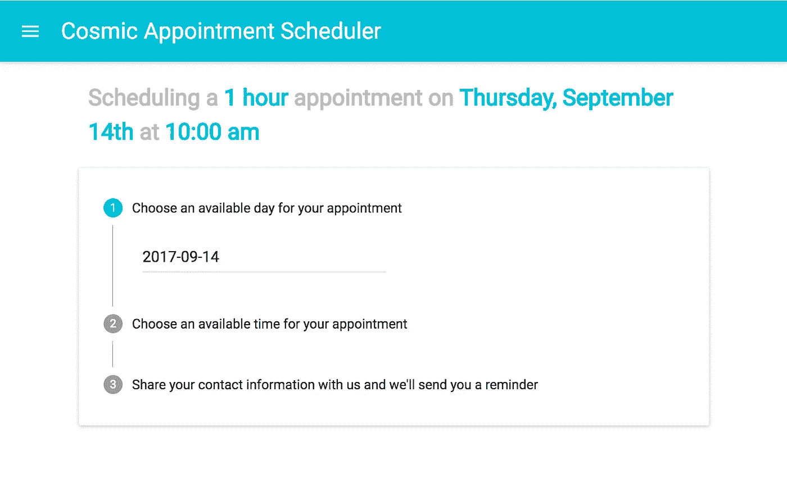
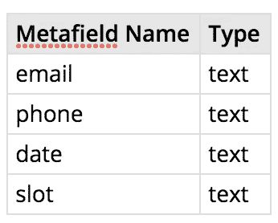
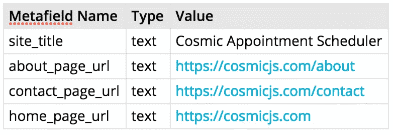

# 使用 React、Twilio 和 Cosmic JS 构建约会日程安排程序

> 原文：<https://medium.com/hackernoon/build-an-appointment-scheduler-using-react-twilio-and-cosmic-js-95377f6d1040>


# TL；速度三角形定位法(dead reckoning)

[查看演示](https://cosmicjs.com/apps/appointment-scheduler/demo)
[安装 App](https://cosmicjs.com/apps/appointment-scheduler)
[查看代码库](https://github.com/cosmicjs/appointment-scheduler)

你的时间很宝贵，但你不能浪费一秒钟。人们需要见你，因为有工作要做，有合作要做。我们将使用 [Cosmic JS](https://cosmicjs.com) 来构建一个约会日程安排程序，而不是让人们直接与你交流来安排他们对你时间的使用——这只会浪费更多的时间。这样，需要和你说话的人只需要说一次。

Cosmic JS 是一个 API 优先的 CMS，这意味着它独立于语言、独立于数据库，并且几乎独立于其他任何东西。这对于像这样的小项目来说非常棒，因为我们可以在未来用任何语言或框架快速扩展它，我们可以定义我们需要的复杂的数据结构。

我们的预约时间表将让用户选择一天和一个小时的时间在上午 9 点到下午 5 点之间与我们见面。然后，我们会将我们的应用程序与 Twilio 集成，向他们发送一条确认文本，告知他们的约会已经安排好。最后，我们将构建一个 Cosmic JS 扩展，这样我们就可以直接在 Cosmic JS 仪表板中管理约会。



What our appointment scheduler app will look like

我们将分三个主要部分完成我们的项目:

1.  借助 Material UI 组件库，在 React 和 Webpack 中构建前端
2.  将其连接到一个简单的 Express 后端，该后端将用于对 Twilio 进行 API 调用，并将我们的约会对象暴露给前端(本着将我们的宇宙桶键保留在我们的前端代码之外的精神)
3.  在 React 中构建扩展，再次使用材质 UI 库

但是，在此之前，我们需要准备好我们的宇宙桶来存储和提供数据。

# 第 0 部分:设置 Cosmic JS

我们将使用两种类型的对象来存储数据:一种用于约会，另一种用于站点配置。在 Cosmic JS 中，首先用指定的元字段创建`Appointments`对象类型。然后，我们将创建一个没有默认元字段的`Configs`对象类型和一个`Site`对象，我们将在其中定义特定于对象的元字段。

**约会**



这里，`email`和`phone`将是用户的元数据——我们将使用他们的名字作为约会对象的标题。`Date`将以`YYYY-DD-MM`的格式保存约会日期，而`slot`将是从上午 9 点开始的几个小时后的约会。

**配置** / **站点**



我们使用`Config`对象来定义关于应用程序的细节，我们希望能够即时更改，而不是重新部署。

有了简单的数据方案，我们就可以开始构建了。

# 第 1 部分:构建前端

# 1.样板设置

1.  首先，我们将创建我们的`appointment-scheduler`目录，运行`yarn init`(随意使用 npm)，并如下设置项目结构:

```
appointment-scheduler
|
|--dist
|--src
|. |--Components
|. |. |--App.js
|. |--index.html
|. |--index.js
|--.babelrc
|--.gitignore
|--package.json
|--webpack.config.js
```

1.  然后，我们将制作我们的 HTML 模板:

```
<!-- ./src/index.html --><!DOCTYPE html>
<html>
  <head>
    <meta charset="utf-8">
    <meta name="viewport" content="width=device-width, initial-scale=1, maximum-scale=1">
    <link href="https://fonts.googleapis.com/css?family=Roboto" rel="stylesheet">
    <title>Appointment Scheduler</title>
  </head>
  <body>
    <div id="root"></div>
  </body>
</html>
```

1.  接下来，我们将安装我们需要的包。有趣的是，除了在 ES6 中开发 React 应用程序所需的任何标准包，我们还将使用:

*   `async`一种简单的方法来进行 ajax 调用
*   作为一个有用的 ajax 工具
*   `babel-preset-stage-3`利用`const { property } = object`析构模式
*   `material-ui`获取一组方便的反应构建材料设计组件
*   `moment`为解析次数
*   `normalize.css`清除浏览器默认样式
*   `react-tap-event-plugin`—`material-ui`的必备伴侣

1.  要安装我们需要的一切，运行`yarn add async axios babel-preset-stage-3 material-ui moment normalze.css react react-dom react-tap-event-plugin`，对于我们的开发依赖项，运行`yarn add babel-core babel-loader babel-preset-env babel-preset-react css-loader eslint file-loader html-webpack-plugin path style-loader webpack`
2.  安装了我们需要的 Babel 包后，我们将告诉 Babel 在它的配置文件中使用它们，并告诉 git 忽略我们刚刚安装的所有东西:

*   // ./.babelrc { "presets": ["env "，" react "，" stage-3"] }
*   `# ./.gitignore node_modules`

1.  最后，我们将设置 Webpack，以便构建时一切就绪

*   const path = require(' path ')const HtmlWebpackPlugin = require(' html-web pack-plugin ')const web pack = require(' web pack ')模块。/src/index.js '，输出:{ path: path.resolve('dist ')，文件名:' bundle.js '，source mapfilename:' bundle . map . js ' }，devtool: 'source-map '，devServer: { port: 8080 }，模块:{ rules: [{ test: /\。js$/，use: { loader: 'babel-loader' }，exclude:path . resolve(' node _ modules ')}，{ test: [/\。scss$/，/\。css$/]，loader: ['style-loader '，' css-loader '，' sass-loader'] }，{ test: /\。(png|jpg|gif|svg)$/，使用:[ { loader: 'file-loader' } ] }，插件:[new HtmlWebpackPlugin({ template:'。/src/index.html '，文件名:' index.html '，inject: true，xhtml: true })，新建 webpack。define plugin({ PRODUCTION:process . ENV . node _ ENV = = = ' PRODUCTION ' })]}

我们已经配置了 Webpack 来输出`bundle.js`，它是源地图，以及`index.html`(根据`src`中的模板)到`dist`关于建筑。您还可以选择在整个项目中使用 SCSS，并在构建时通过`window.PRODUCTION`访问您的节点环境。

# 2.创建一个入口点

在我们继续之前，我们需要为我们的应用程序定义一个入口点。这里，我们将导入任何必要的全局库或包装组件。我们还将使用它作为 React 应用程序的渲染点。这将是我们的`src/index.js`文件，看起来像这样:

```
// ./src/index.jsimport React from 'react'
import ReactDom from 'react-dom'
import App from './Components/App'
import MuiThemeProvider from 'material-ui/styles/MuiThemeProvider'import 'normalize.css'require('./scss/app.scss')window.React = ReactReactDom.render(
  <MuiThemeProvider>
    <App />
  </MuiThemeProvider>,
  document.getElementById('root')
)// MuiThemeProvider is a wrapper component for MaterialUI's components
```

# 3.画出骨架

让我们的应用程序运行的一切都准备好了，在我们开始构建应用程序之前，我们需要考虑一些事情，做出一些选择。为了帮助我们思考，我们将构建一个我们需要的基本框架:

```
// ./src/Components/App.jsimport { Component } from 'react'
import injectTapEventPlugin from 'react-tap-event-plugin'injectTapEventPlugin()export default class App extends Component {
    constructor() {
    super()
      this.state = {
            // initial state
        }

  //method bindings
    }

  //component methods?

  //lifecycle methods
componentWillMount() {
        //fetch data from cosmic, watch window width
    }
  componentWillUnmount() {
        //remove window width event listener
    }
  render() {
     //define variables
      return (
        <div>
          </div>
        )
    }
}
```

首先，我们需要考虑应用程序的状态会是什么样子。以下是一些注意事项:

*   该应用程序从外部服务器加载数据，所以当这种情况发生时，向我们的用户显示是有用的
*   材料设计实现了抽屉风格的导航，所以我们需要跟踪它何时打开
*   为了在提交之前确认用户的预约细节，我们将向他们展示一个确认模式，对于其他通知，我们将使用 Material Design 的 snackbar，它在页面底部显示小通知。我们需要跟踪这两者的打开状态。
*   我们的预约安排过程将分三步进行:选择日期、选择时间段和填写个人信息。我们需要跟踪用户正在进行的步骤，他们选择的日期和时间，他们的联系方式，我们还需要验证他们的电子邮件地址和电话号码。
*   我们将加载配置数据和日程安排约会，我们将受益于状态缓存。
*   当我们的用户进行 3 个计划步骤时，我们将显示一个友好的句子来跟踪他们的进度。(例如:“安排一个 1 小时的约会，时间是……下午 3 点”)。我们需要知道是否应该显示。
*   当用户选择预约时段时，他们将能够按 AM/PM 进行过滤，因此我们需要跟踪他们在寻找哪个时段。
*   最后，我们将为我们的样式添加一些响应，我们需要跟踪屏幕宽度。

然后我们到达这作为我们的初始状态:

```
// ./src/Components/App.js// ...
this.state = {
  loading: true,
  navOpen: false,
  confirmationModalOpen: false,
  confirmationTextVisible: false,
  stepIndex: 0,
  appointmentDateSelected: false,
  appointmentMeridiem: 0,
  validEmail: false,
  validPhone: false,
  smallScreen: window.innerWidth < 768,
  confirmationSnackbarOpen: false
}
```

注意`appointmentMeridiem`承担`0`或`1`，这样`0 => 'AM'`和`1 => 'PM'`。

# 4.草稿功能

我们已经为我们的应用程序定义了一个初始状态，但是在我们用材料组件构建一个视图之前，我们会发现头脑风暴一下需要对我们的数据做什么是很有用的。我们的应用程序将归结为以下功能:

*   正如上一步所决定的，我们的导航将在一个抽屉中，所以我们需要一个`handleNavToggle()`方法来显示/隐藏它
*   在完成前一步后，三个调度步骤会依次显示给用户，因此我们需要一个`handleNextStep()`方法来处理用户输入流
*   我们将使用一个材料 UI 日期选择器来设置我们的约会日期，我们需要一个`handleSetAppointmentDate()`方法来处理来自该组件的数据。同样，我们需要一个`handleSetAppointmentSlot()`和`handleSetAppointmentMeridiem()`方法。我们不希望日期选择器显示不可用的日子(包括`today`)，所以我们需要向它传递一个`checkDisableDate()`方法。
*   在`componentWillMount()`生命周期方法中，我们将从后端获取数据，然后用单独的`handleFetch()`方法处理这些数据。对于获取错误，我们需要一个`handleFetchError()`方法。
*   提交约会数据后，我们将使用`handleSubmit()`将其发送到我们的后端。当用户填写联系信息时，我们需要一个`validateEmail()`和`validatePhone()`方法。
*   表单上方的用户友好字符串将使用`renderConfirmationString()`在单独的方法中呈现。可用的预约时间和分别带有`renderAppointmentTimes()`和`renderAppointmentConfirmation()`的确认模式也是如此。
*   最后，我们将使用一个方便的`resize()`方法来响应浏览器窗口的宽度变化

总而言之，包括未写的方法，我们的`App.js`现在看起来像这样(包括方法绑定):

```
// ./src/Components/App.jsimport { Component } from 'react'
import injectTapEventPlugin from 'react-tap-event-plugin'injectTapEventPlugin()export default class App extends Component {
    constructor() {
    super()
      this.state = {
          loading: true,
          navOpen: false,
          confirmationModalOpen: false,
          confirmationTextVisible: false,
          stepIndex: 0,
          appointmentDateSelected: false,
          appointmentMeridiem: 0,
          validEmail: false,
          validPhone: false,
          smallScreen: window.innerWidth < 768,
          confirmationSnackbarOpen: false
        }

      //method bindings
      this.handleNavToggle = this.handleNavToggle.bind(this)
      this.handleNextStep = this.handleNextStep.bind(this)
      this.handleSetAppointmentDate = this.handleSetAppointmentDate.bind(this)
      this.handleSetAppointmentSlot = this.handleSetAppointmentSlot.bind(this)
      this.handleSetAppointmentMeridiem = this.handleSetAppointmentMeridiem.bind(this)
      this.handleSubmit = this.handleSubmit.bind(this)
      this.validateEmail = this.validateEmail.bind(this)
      this.validatePhone = this.validatePhone.bind(this)
      this.checkDisableDate = this.checkDisableDate.bind(this)
      this.renderAppointmentTimes = this.renderAppointmentTimes.bind(this)
      this.renderConfirmationString = this.renderConfirmationString.bind(this)
      this.renderAppointmentConfirmation = this.renderAppointmentConfirmation.bind(this)
      this.resize = this.resize.bind(this)
    }

  handleNavToggle() {

   }

  handleNextStep() {

    }

  handleSetAppointmentDate(date) {

    }

  handleSetAppointmentSlot(slot) {

    }

  handleSetAppointmentMeridiem(meridiem) {

    }

  handleFetch(response) {

    }

  handleFetchError(err) {

    }

  handleSubmit() {

    }

  validateEmail(email) {

    }

  validatePhone(phoneNumber) {

    }

  checkDisableDate(date) {

    }

  renderConfirmationString() {

    }

  renderAppointmentTimes() {

    }

  renderAppointmentConfirmation() {

    }

  resize() {

    }

  //lifecycle methods
componentWillMount() {
        //fetch data from cosmic, watch window width
    }
  componentWillUnmount() {
        //remove window width event listener
    }
  render() {
     //define variables
      return (
        <div>
          </div>
        )
    }
}
```

# 5.扩大视野

对我们的应用程序如何运行有了一个基本的想法，我们就可以开始构建它的 UI 了。除了几个包装器和一些自定义样式，我们应用程序的大部分将由预打包的材料 UI 组件构成。

为了做到这一点，我们需要:

*   一个充当主工具栏的`AppBar`
*   一个`Drawer`，从`AppBar`的主按钮打开，作为应用的导航，遵循材质设计。
*   在`Drawer`、`MenuItem`内显示链接
*   一个`Card`作为主要内容容器
*   A `Stepper`将日程安排过程分为 3 个谨慎的步骤。活动步骤将被展开，而其他步骤将被折叠。如果`state.loading`为真，第一步将被禁用，只要用户没有填写前一步，后两步将被禁用。
*   嵌套在`Stepper`中的三个`Steps`包含`StepButton`和`StepContent`组件。
*   在第一个`Step`中，我们将使用一个`DatePicker`来让用户选择约会日期。不可用天数将根据`checkDisableDate()`的返回值禁用。日期的选择将由`handleSetAppointmentDate()`处理
*   在第二个`Step`中，我们希望用户能够从可用的时间段中为他们选择的一天选择一个时间段。我们还希望他们能够根据上午/下午过滤时间。我们将使用一个`SelectField`用于过滤器，一个`RadioButtonGroup`用于保持时隙按钮。我们需要额外的逻辑来呈现单选按钮，所以将在`renderAppointmentTimes()`方法中完成。那将返回一组`RadioButton` s。
*   最后一个`Step`将要求用户使用`TextField`组件输入他们的姓名、电子邮件地址和电话号码。将使用一个`RaisedButton`提交按钮来打开确认`Dialog`。用户输入的电话号码和电子邮件地址将分别通过`validatePhone()`和`validateEmail()`进行验证。
*   最后，我们将包含一个方便的`SnackBar`来在页面底部显示关于加载状态和提交的通知。
    总而言之，在写出了`render()`方法之后，我们的应用程序将如下所示:

```
// ./src/Components/App.js// .. previous importsimport AppBar from 'material-ui/AppBar'
import Drawer from 'material-ui/Drawer'
import Dialog from 'material-ui/Dialog'
import Divider from 'material-ui/Divider'
import MenuItem from 'material-ui/MenuItem'
import Card from 'material-ui/Card'
import DatePicker from 'material-ui/DatePicker'
import TimePicker from 'material-ui/TimePicker'
import TextField from 'material-ui/TextField'
import SelectField from 'material-ui/SelectField'
import SnackBar from 'material-ui/Snackbar'
import {
  Step,
  Stepper,
  StepLabel,
  StepContent,
  StepButton
} from 'material-ui/stepper'
import {
  RadioButton,
  RadioButtonGroup
} from 'material-ui/RadioButton'
import RaisedButton from 'material-ui/RaisedButton';
import FlatButton from 'material-ui/FlatButton'
import logo from './../../dist/assets/logo.svg'export default class App extends Component {
    // ... component methods, lifecycle methods
  render() {
    const { stepIndex, loading, navOpen, smallScreen, confirmationModalOpen, confirmationSnackbarOpen, ...data } = this.state
    const contactFormFilled = data.firstName && data.lastName && data.phone && data.email && data.validPhone && data.validEmail
    const modalActions = [
      <FlatButton
        label="Cancel"
        primary={false}
        onClick={() => this.setState({ confirmationModalOpen : false})} />,
      <FlatButton
        label="Confirm"
        primary={true}
        onClick={() => this.handleSubmit()} />
    ]
    return (
      <div>
        <AppBar
          title={data.siteTitle}
          onLeftIconButtonTouchTap={() => this.handleNavToggle() }/>
        <Drawer
          docked={false}
          width={300}
          open={navOpen}
          onRequestChange={(navOpen) => this.setState({navOpen})} >
          
          <a style={{textDecoration: 'none'}} href={this.state.homePageUrl}><MenuItem>Home</MenuItem></a>
          <a style={{textDecoration: 'none'}} href={this.state.aboutPageUrl}><MenuItem>About</MenuItem></a>
          <a style={{textDecoration: 'none'}} href={this.state.contactPageUrl}><MenuItem>Contact</MenuItem></a> <MenuItem disabled={true}
                    style={{
                      marginLeft: '50%',
                      transform: 'translate(-50%)'
                    }}>
            {"© Copyright " + moment().format('YYYY')}</MenuItem>
        </Drawer>
        <section style={{
            maxWidth: !smallScreen ? '80%' : '100%',
            margin: 'auto',
            marginTop: !smallScreen ? 20 : 0,
          }}>
          {this.renderConfirmationString()}
          <Card style={{
              padding: '10px 10px 25px 10px',
              height: smallScreen ? '100vh' : null
            }}>
            <Stepper
              activeStep={stepIndex}
              linear={false}
              orientation="vertical">
              <Step disabled={loading}>
                <StepButton onClick={() => this.setState({ stepIndex: 0 })}>
                  Choose an available day for your appointment
                </StepButton>
                <StepContent>
                  <DatePicker
                      style={{
                        marginTop: 10,
                        marginLeft: 10
                      }}
                      value={data.appointmentDate}
                      hintText="Select a date"
                      mode={smallScreen ? 'portrait' : 'landscape'}
                      onChange={(n, date) => this.handleSetAppointmentDate(date)}
                      shouldDisableDate={day => this.checkDisableDate(day)}
                       />
                  </StepContent>
              </Step>
              <Step disabled={ !data.appointmentDate }>
                <StepButton onClick={() => this.setState({ stepIndex: 1 })}>
                  Choose an available time for your appointment
                </StepButton>
                <StepContent>
                  <SelectField
                    floatingLabelText="AM or PM"
                    value={data.appointmentMeridiem}
                    onChange={(evt, key, payload) => this.handleSetAppointmentMeridiem(payload)}
                    selectionRenderer={value => value ? 'PM' : 'AM'}>
                    <MenuItem value={0}>AM</MenuItem>
                    <MenuItem value={1}>PM</MenuItem>
                  </SelectField>
                  <RadioButtonGroup
                    style={{ marginTop: 15,
                             marginLeft: 15
                           }}
                    name="appointmentTimes"
                    defaultSelected={data.appointmentSlot}
                    onChange={(evt, val) => this.handleSetAppointmentSlot(val)}>
                    {this.renderAppointmentTimes()}
                  </RadioButtonGroup>
                </StepContent>
              </Step>
              <Step disabled={ !Number.isInteger(this.state.appointmentSlot) }>
                <StepButton onClick={() => this.setState({ stepIndex: 2 })}>
                  Share your contact information with us and we'll send you a reminder
                </StepButton>
                <StepContent>
                  <section>
                    <TextField
                      style={{ display: 'block' }}
                      name="first_name"
                      hintText="First Name"
                      floatingLabelText="First Name"
                      onChange={(evt, newValue) => this.setState({ firstName: newValue })}/>
                    <TextField
                      style={{ display: 'block' }}
                      name="last_name"
                      hintText="Last Name"
                      floatingLabelText="Last Name"
                      onChange={(evt, newValue) => this.setState({ lastName: newValue })}/>
                    <TextField
                      style={{ display: 'block' }}
                      name="email"
                      hintText="name@mail.com"
                      floatingLabelText="Email"
                      errorText={data.validEmail ? null : 'Enter a valid email address'}
                      onChange={(evt, newValue) => this.validateEmail(newValue)}/>
                    <TextField
                      style={{ display: 'block' }}
                      name="phone"
                      hintText="(888) 888-8888"
                      floatingLabelText="Phone"
                      errorText={data.validPhone ? null: 'Enter a valid phone number'}
                      onChange={(evt, newValue) => this.validatePhone(newValue)} />
                    <RaisedButton
                      style={{ display: 'block' }}
                      label={contactFormFilled ? 'Schedule' : 'Fill out your information to schedule'}
                      labelPosition="before"
                      primary={true}
                      fullWidth={true}
                      onClick={() => this.setState({ confirmationModalOpen: !this.state.confirmationModalOpen })}
                      disabled={!contactFormFilled || data.processed }
                      style={{ marginTop: 20, maxWidth: 100}} />
                  </section>
                </StepContent>
              </Step>
            </Stepper>
          </Card>
          <Dialog
            modal={true}
            open={confirmationModalOpen}
            actions={modalActions}
            title="Confirm your appointment">
            {this.renderAppointmentConfirmation()}
          </Dialog>
          <SnackBar
            open={confirmationSnackbarOpen || loading}
            message={loading ? 'Loading... ' : data.confirmationSnackbarMessage || ''}
            autoHideDuration={10000}
            onRequestClose={() => this.setState({ confirmationSnackbarOpen: false })} />
        </section>
      </div>
    )
  }
}
```

在继续之前，请注意，因为它们需要一些额外的逻辑来呈现，所以我们将用它们自己的方法来处理时间段的单选按钮和确认字符串。

视图组件就绪后，我们的最后一个重要步骤是编写我们已经规划好的所有功能。

# 6.组件生命周期方法

## `componentWillMount()`

添加功能的第一步是写出`componentWillMount()`方法。在`componentWillMount()`中，我们将使用`axios`从后端获取我们的配置和约会数据。同样，我们使用我们的后端作为中间人，所以我们可以有选择地向我们的前端公开数据，并省略像用户的联系信息这样的事情。

```
// ./src/Components/App.js// previous imports
import async from 'async'
import axios from 'axios'export default class App extends Component {
constructor() {}

  componentWillMount() {
    async.series({
        configs(callback) {
          axios.get(HOST + 'api/config').then(res =>
            callback(null, res.data.data)
          )
        },
        appointments(callback) {
          axios.get(HOST + 'api/appointments').then(res => {
            callback(null, res.data.data)
          })
       }
      }, (err,response) => {
        err ? this.handleFetchError(err) : this.handleFetch(response)
    })
    addEventListener('resize', this.resize)
    }

 // rest...
}
```

我们使用`async`来进行连续的`axios`调用，并将它们命名为`handleFetch()`中的`response.configs`和`response.appointments`。我们还使用`componentWillMount`开始用`resize()`跟踪窗口宽度。

## `componentWillUnmount()`

练习好格式，我们将删除`componentWillUnmount()`中的事件监听器。

```
// ./src/Components/App.js// previous imports
import async from 'async'
import axios from 'axios'export default class App extends Component {
constructor() {}

  componentWillUnmount() {
removeEventListener('resize', this.resize)
    }

 // rest...
}
```

# 7.处理数据

获取了我们需要的数据后，我们将用`handleFetch()`处理一个成功的获取，并用`handleFetchError()`处理一个错误。在`handleFetch()`中，我们将构建一个存储在状态中的约会时间表，这样`schedule = { appointmentDate: [slots] }`。我们还使用这个方法将应用程序的配置数据存储在状态中。

## `handleFetch()`

```
handleFetch(response) {
const { configs, appointments } = response
    const initSchedule = {}
    const today = moment().startOf('day')
    initSchedule[today.format('YYYY-DD-MM')] = true
    const schedule = !appointments.length ? initSchedule : appointments.reduce((currentSchedule, appointment) => {
      const { date, slot } = appointment
      const dateString = moment(date, 'YYYY-DD-MM').format('YYYY-DD-MM')
      !currentSchedule[date] ? currentSchedule[dateString] = Array(8).fill(false) : null
      Array.isArray(currentSchedule[dateString]) ?
        currentSchedule[dateString][slot] = true : null
      return currentSchedule
    }, initSchedule) for (let day in schedule) {
      let slots = schedule[day]
      slots.length ? (slots.every(slot => slot === true)) ? schedule[day] = true : null : null
    } this.setState({
      schedule,
      siteTitle: configs.site_title,
      aboutPageUrl: configs.about_page_url,
      contactPageUrl: configs.contact_page_url,
      homePageUrl: configs.home_page_url,
      loading: false
    })
  }
```

## `handleFetchError()`

为了处理错误，我们将简单地在`SnackBar`中向用户显示一条错误消息。

```
handleFetchError(err) {
console.log('Error fetching data:' + err)
    this.setState({ confirmationSnackbarMessage: 'Error fetching data', confirmationSnackbarOpen: true })
}
```

# 8.处理用户界面更改

每当用户打开`Drawer`，移动到另一个步骤，或者浏览器宽度改变时，我们都需要管理状态。首先，我们将处理抽屉开关。

```
handleNavToggle() {
  return this.setState({ navOpen: !this.state.navOpen })
}
```

然后，只要用户不在最后一步，我们将处理增加步骤。

```
handleNextStep() {
  const { stepIndex } = this.state
  return (stepIndex < 3) ? this.setState({ stepIndex: stepIndex + 1}) : null
}
```

最后，如果窗口宽度小于 768 像素，我们将简单地改变 resize 的状态。

```
resize() {
  this.setState({ smallScreen: window.innerWidth < 768 })
}
```

# 9.处理设置约会数据

当用户在第一步和第二步中选择约会选项时，我们需要三个简单的设置器来改变状态以反映这些选择。

```
handleSetAppointmentDate(date) {
  this.handleNextStep()
  this.setState({ appointmentDate: date, confirmationTextVisible: true })
}handleSetAppointmentSlot(slot) {
  this.handleNextStep()
  this.setState({ appointmentSlot: slot })
}handleSetAppointmentMeridiem(meridiem) {
  this.setState({ appointmentMeridiem: meridiem})
}
```

# 10.处理验证

我们需要验证用户输入的电子邮件地址，电话号码，我们需要给`DatePicker`组件一个函数来检查哪一天应该被禁用。虽然有些幼稚，但为了简单起见，我们将使用正则表达式来检查输入。

```
validateEmail(email) {
  const regex = /^(([^<>()\[\]\.,;:\s@\"]+(\.[^<>()\[\]\.,;:\s@\"]+)*)|(\".+\"))@(([^<>()[\]\.,;:\s@\"]+\.)+[^<>()[\]\.,;:\s@\"]{2,})$/i
  return regex.test(email) ? this.setState({ email: email, validEmail: true }) : this.setState({ validEmail: false })
}validatePhone(phoneNumber) {
  const regex = /^(1\s|1|)?((\(\d{3}\))|\d{3})(\-|\s)?(\d{3})(\-|\s)?(\d{4})$/
  return regex.test(phoneNumber) ? this.setState({ phone: phoneNumber, validPhone: true }) : this.setState({ validPhone: false })
}
```

为了检查日期是否应该被禁用，我们需要检查`DatePicker`传递的日期是在`state.schedule`还是今天。

```
checkDisableDate(day) {
    const dateString = moment(day).format('YYYY-DD-MM')
    return this.state.schedule[dateString] === true || moment(day).startOf('day').diff(moment().startOf('day')) < 0
  }
```

# 11.为确认字符串和时间段单选按钮构建呈现方法

在我们的`render()`生命周期方法中，我们抽象出了在`Card`上方显示动态确认字符串的逻辑，我们将在确认模式中显示的确认细节，以及用于选择时间段的单选按钮。

从确认字符串开始，我们将只显示与输入的数据相对应的部分。

```
renderConfirmationString() {
  const spanStyle = {color: '#00bcd4'}
  return this.state.confirmationTextVisible ? <h2 style={{ textAlign: this.state.smallScreen ? 'center' : 'left', color: '#bdbdbd', lineHeight: 1.5, padding: '0 10px', fontFamily: 'Roboto'}}>
    { <span>
     Scheduling a <span style={spanStyle}> 1 hour </span>appointment {this.state.appointmentDate && <span>
  on <span style={spanStyle}>{moment(this.state.appointmentDate).format('dddd[,] MMMM Do')}</span>
             </span>} {Number.isInteger(this.state.appointmentSlot) && <span>at <span style={spanStyle}>{moment().hour(9).minute(0).add(this.state.appointmentSlot, 'hours').format('h:mm a')}</span></span>}
             </span>}
             </h2> : null
}
```

然后，类似地，我们将让用户在确认提交之前验证他们的数据。

```
renderAppointmentConfirmation() {
  const spanStyle = { color: '#00bcd4' }
  return <section>
    <p>Name: <span style={spanStyle}>{this.state.firstName} {this.state.lastName}</span></p>
      <p>Number: <span style={spanStyle}>{this.state.phone}</span></p>
        <p>Email: <span style={spanStyle}>{this.state.email}</span></p>
          <p>Appointment: <span style={spanStyle}>{moment(this.state.appointmentDate).format('dddd[,] MMMM Do[,] YYYY')}</span> at <span style={spanStyle}>{moment().hour(9).minute(0).add(this.state.appointmentSlot, 'hours').format('h:mm a')}</span></p>
  </section>
}
```

最后，我们将编写呈现约会窗口单选按钮的方法。为此，我们首先必须根据可用性以及是选择 AM 还是 PM 来过滤时隙。两者都是简单的检查；首先，我们查看它是否存在于`state.schedule`中，对于后者，我们使用`moment().format('a')`检查 meridiem 部分。为了计算 12 小时格式的时间字符串，我们以小时为单位将该时间段添加到 9AM。

```
renderAppointmentTimes() {
  if (!this.state.loading) {
    const slots = [...Array(8).keys()]
    return slots.map(slot => {
      const appointmentDateString = moment(this.state.appointmentDate).format('YYYY-DD-MM')
      const t1 = moment().hour(9).minute(0).add(slot, 'hours')
      const t2 = moment().hour(9).minute(0).add(slot + 1, 'hours')
      const scheduleDisabled = this.state.schedule[appointmentDateString] ? this.state.schedule[moment(this.state.appointmentDate).format('YYYY-DD-MM')][slot] : false
      const meridiemDisabled = this.state.appointmentMeridiem ? t1.format('a') === 'am' : t1.format('a') === 'pm'
      return <RadioButton
      label={t1.format('h:mm a') + ' - ' + t2.format('h:mm a')}
      key={slot}
      value={slot}
      style={{marginBottom: 15, display: meridiemDisabled ? 'none' : 'inherit'}}
                     disabled={scheduleDisabled || meridiemDisabled}/>
                     })
  } else {
    return null
  }
}
```

# 13.处理表单提交

一旦我们向用户展示了确认模式，在最终提交时，我们会用一个`axios` POST 将数据发送到我们的后端。我们不会告诉他们是成功还是错误。

```
handleSubmit() {
    const appointment = {
      date: moment(this.state.appointmentDate).format('YYYY-DD-MM'),
      slot: this.state.appointmentSlot,
      name: this.state.firstName + ' ' + this.state.lastName,
      email: this.state.email,
      phone: this.state.phone
    }
    axios.post(HOST + 'api/appointments', )
    axios.post(HOST + 'api/appointments', appointment)
    .then(response => this.setState({ confirmationSnackbarMessage: "Appointment succesfully added!", confirmationSnackbarOpen: true, processed: true }))
    .catch(err => {
      console.log(err)
      return this.setState({ confirmationSnackbarMessage: "Appointment failed to save.", confirmationSnackbarOpen: true })
    })
  }
```

# 14.结论:看到所有这些

在继续构建后端之前，这里是我们的最终产品。

```
// ./src/Components/App.jsimport { Component } from 'react'
import injectTapEventPlugin from 'react-tap-event-plugin'
import axios from 'axios'
import async from 'async'
import moment from 'moment'
import AppBar from 'material-ui/AppBar'
import Drawer from 'material-ui/Drawer'
import Dialog from 'material-ui/Dialog'
import Divider from 'material-ui/Divider'
import MenuItem from 'material-ui/MenuItem'
import Card from 'material-ui/Card'
import DatePicker from 'material-ui/DatePicker'
import TimePicker from 'material-ui/TimePicker'
import TextField from 'material-ui/TextField'
import SelectField from 'material-ui/SelectField'
import SnackBar from 'material-ui/Snackbar'
import {
  Step,
  Stepper,
  StepLabel,
  StepContent,
  StepButton
} from 'material-ui/stepper'
import {
  RadioButton,
  RadioButtonGroup
} from 'material-ui/RadioButton'
import RaisedButton from 'material-ui/RaisedButton';
import FlatButton from 'material-ui/FlatButton'
import logo from './../../dist/assets/logo.svg'injectTapEventPlugin()
const HOST = PRODUCTION ? '/' : 'http://localhost:3000/'export default class App extends Component {
  constructor() {
    super()
    this.state = {
      loading: true,
      navOpen: false,
      confirmationModalOpen: false,
      confirmationTextVisible: false,
      stepIndex: 0,
      appointmentDateSelected: false,
      appointmentMeridiem: 0,
      validEmail: true,
      validPhone: true,
      smallScreen: window.innerWidth < 768,
      confirmationSnackbarOpen: false
    } this.handleNavToggle = this.handleNavToggle.bind(this)
    this.handleNextStep = this.handleNextStep.bind(this)
    this.handleSetAppointmentDate = this.handleSetAppointmentDate.bind(this)
    this.handleSetAppointmentSlot = this.handleSetAppointmentSlot.bind(this)
    this.handleSetAppointmentMeridiem = this.handleSetAppointmentMeridiem.bind(this)
    this.handleSubmit = this.handleSubmit.bind(this)
    this.validateEmail = this.validateEmail.bind(this)
    this.validatePhone = this.validatePhone.bind(this)
    this.checkDisableDate = this.checkDisableDate.bind(this)
    this.renderAppointmentTimes = this.renderAppointmentTimes.bind(this)
    this.renderConfirmationString = this.renderConfirmationString.bind(this)
    this.renderAppointmentConfirmation = this.renderAppointmentConfirmation.bind(this)
    this.resize = this.resize.bind(this)
  } handleNavToggle() {
    return this.setState({ navOpen: !this.state.navOpen })
  } handleNextStep() {
    const { stepIndex } = this.state
    return (stepIndex < 3) ? this.setState({ stepIndex: stepIndex + 1}) : null
  } handleSetAppointmentDate(date) {
    this.handleNextStep()
    this.setState({ appointmentDate: date, confirmationTextVisible: true })
  } handleSetAppointmentSlot(slot) {
    this.handleNextStep()
    this.setState({ appointmentSlot: slot })
  } handleSetAppointmentMeridiem(meridiem) {
    this.setState({ appointmentMeridiem: meridiem})
  } handleFetch(response) {
    const { configs, appointments } = response
    const initSchedule = {}
    const today = moment().startOf('day')
    initSchedule[today.format('YYYY-DD-MM')] = true
    const schedule = !appointments.length ? initSchedule : appointments.reduce((currentSchedule, appointment) => {
      const { date, slot } = appointment
      const dateString = moment(date, 'YYYY-DD-MM').format('YYYY-DD-MM')
      !currentSchedule[date] ? currentSchedule[dateString] = Array(8).fill(false) : null
      Array.isArray(currentSchedule[dateString]) ?
        currentSchedule[dateString][slot] = true : null
      return currentSchedule
    }, initSchedule) for (let day in schedule) {
      let slots = schedule[day]
      slots.length ? (slots.every(slot => slot === true)) ? schedule[day] = true : null : null
    } this.setState({
      schedule,
      siteTitle: configs.site_title,
      aboutPageUrl: configs.about_page_url,
      contactPageUrl: configs.contact_page_url,
      homePageUrl: configs.home_page_url,
      loading: false
    })
  } handleFetchError(err) {
    console.log('Error fetching data:' + err)
    this.setState({ confirmationSnackbarMessage: 'Error fetching data', confirmationSnackbarOpen: true })
  } handleSubmit() {
    const appointment = {
      date: moment(this.state.appointmentDate).format('YYYY-DD-MM'),
      slot: this.state.appointmentSlot,
      name: this.state.firstName + ' ' + this.state.lastName,
      email: this.state.email,
      phone: this.state.phone
    }
    axios.post(HOST + 'api/appointments', )
    axios.post(HOST + 'api/appointments', appointment)
    .then(response => this.setState({ confirmationSnackbarMessage: "Appointment succesfully added!", confirmationSnackbarOpen: true, processed: true }))
    .catch(err => {
      console.log(err)
      return this.setState({ confirmationSnackbarMessage: "Appointment failed to save.", confirmationSnackbarOpen: true })
    })
  } validateEmail(email) {
    const regex = /^(([^<>()\[\]\.,;:\s@\"]+(\.[^<>()\[\]\.,;:\s@\"]+)*)|(\".+\"))@(([^<>()[\]\.,;:\s@\"]+\.)+[^<>()[\]\.,;:\s@\"]{2,})$/i
    return regex.test(email) ? this.setState({ email: email, validEmail: true }) : this.setState({ validEmail: false })
  } validatePhone(phoneNumber) {
    const regex = /^(1\s|1|)?((\(\d{3}\))|\d{3})(\-|\s)?(\d{3})(\-|\s)?(\d{4})$/
    return regex.test(phoneNumber) ? this.setState({ phone: phoneNumber, validPhone: true }) : this.setState({ validPhone: false })
  } checkDisableDate(day) {
    const dateString = moment(day).format('YYYY-DD-MM')
    return this.state.schedule[dateString] === true || moment(day).startOf('day').diff(moment().startOf('day')) < 0
  } renderConfirmationString() {
    const spanStyle = {color: '#00bcd4'}
    return this.state.confirmationTextVisible ? <h2 style={{ textAlign: this.state.smallScreen ? 'center' : 'left', color: '#bdbdbd', lineHeight: 1.5, padding: '0 10px', fontFamily: 'Roboto'}}>
      { <span>
        Scheduling a <span style={spanStyle}> 1 hour </span> appointment {this.state.appointmentDate && <span>
          on <span style={spanStyle}>{moment(this.state.appointmentDate).format('dddd[,] MMMM Do')}</span>
      </span>} {Number.isInteger(this.state.appointmentSlot) && <span>at <span style={spanStyle}>{moment().hour(9).minute(0).add(this.state.appointmentSlot, 'hours').format('h:mm a')}</span></span>}
      </span>}
    </h2> : null
  } renderAppointmentTimes() {
    if (!this.state.loading) {
      const slots = [...Array(8).keys()]
      return slots.map(slot => {
        const appointmentDateString = moment(this.state.appointmentDate).format('YYYY-DD-MM')
        const t1 = moment().hour(9).minute(0).add(slot, 'hours')
        const t2 = moment().hour(9).minute(0).add(slot + 1, 'hours')
        const scheduleDisabled = this.state.schedule[appointmentDateString] ? this.state.schedule[moment(this.state.appointmentDate).format('YYYY-DD-MM')][slot] : false
        const meridiemDisabled = this.state.appointmentMeridiem ? t1.format('a') === 'am' : t1.format('a') === 'pm'
        return <RadioButton
          label={t1.format('h:mm a') + ' - ' + t2.format('h:mm a')}
          key={slot}
          value={slot}
          style={{marginBottom: 15, display: meridiemDisabled ? 'none' : 'inherit'}}
          disabled={scheduleDisabled || meridiemDisabled}/>
      })
    } else {
      return null
    }
  } renderAppointmentConfirmation() {
    const spanStyle = { color: '#00bcd4' }
    return <section>
      <p>Name: <span style={spanStyle}>{this.state.firstName} {this.state.lastName}</span></p>
      <p>Number: <span style={spanStyle}>{this.state.phone}</span></p>
      <p>Email: <span style={spanStyle}>{this.state.email}</span></p>
      <p>Appointment: <span style={spanStyle}>{moment(this.state.appointmentDate).format('dddd[,] MMMM Do[,] YYYY')}</span> at <span style={spanStyle}>{moment().hour(9).minute(0).add(this.state.appointmentSlot, 'hours').format('h:mm a')}</span></p>
    </section>
  } resize() {
    this.setState({ smallScreen: window.innerWidth < 768 })
  } componentWillMount() {
    async.series({
      configs(callback) {
        axios.get(HOST + 'api/config').then(res =>
          callback(null, res.data.data)
        )
      },
      appointments(callback) {
        axios.get(HOST + 'api/appointments').then(res => {
          callback(null, res.data.data)
        })
      }
    }, (err,response) => {
      err ? this.handleFetchError(err) : this.handleFetch(response)
    })
    addEventListener('resize', this.resize)
  } componentWillUnmount() {
    removeEventListener('resize', this.resize)
  } render() {
    const { stepIndex, loading, navOpen, smallScreen, confirmationModalOpen, confirmationSnackbarOpen, ...data } = this.state
    const contactFormFilled = data.firstName && data.lastName && data.phone && data.email && data.validPhone && data.validEmail
    const modalActions = [
      <FlatButton
        label="Cancel"
        primary={false}
        onClick={() => this.setState({ confirmationModalOpen : false})} />,
      <FlatButton
        label="Confirm"
        primary={true}
        onClick={() => this.handleSubmit()} />
    ]
    return (
      <div>
        <AppBar
          title={data.siteTitle}
          onLeftIconButtonTouchTap={() => this.handleNavToggle() }/>
        <Drawer
          docked={false}
          width={300}
          open={navOpen}
          onRequestChange={(navOpen) => this.setState({navOpen})} >
          
          <a style={{textDecoration: 'none'}} href={this.state.homePageUrl}><MenuItem>Home</MenuItem></a>
          <a style={{textDecoration: 'none'}} href={this.state.aboutPageUrl}><MenuItem>About</MenuItem></a>
          <a style={{textDecoration: 'none'}} href={this.state.contactPageUrl}><MenuItem>Contact</MenuItem></a> <MenuItem disabled={true}
                    style={{
                      marginLeft: '50%',
                      transform: 'translate(-50%)'
                    }}>
            {"© Copyright " + moment().format('YYYY')}</MenuItem>
        </Drawer>
        <section style={{
            maxWidth: !smallScreen ? '80%' : '100%',
            margin: 'auto',
            marginTop: !smallScreen ? 20 : 0,
          }}>
          {this.renderConfirmationString()}
          <Card style={{
              padding: '10px 10px 25px 10px',
              height: smallScreen ? '100vh' : null
            }}>
            <Stepper
              activeStep={stepIndex}
              linear={false}
              orientation="vertical">
              <Step disabled={loading}>
                <StepButton onClick={() => this.setState({ stepIndex: 0 })}>
                  Choose an available day for your appointment
                </StepButton>
                <StepContent>
                  <DatePicker
                      style={{
                        marginTop: 10,
                        marginLeft: 10
                      }}
                      value={data.appointmentDate}
                      hintText="Select a date"
                      mode={smallScreen ? 'portrait' : 'landscape'}
                      onChange={(n, date) => this.handleSetAppointmentDate(date)}
                      shouldDisableDate={day => this.checkDisableDate(day)}
                       />
                  </StepContent>
              </Step>
              <Step disabled={ !data.appointmentDate }>
                <StepButton onClick={() => this.setState({ stepIndex: 1 })}>
                  Choose an available time for your appointment
                </StepButton>
                <StepContent>
                  <SelectField
                    floatingLabelText="AM or PM"
                    value={data.appointmentMeridiem}
                    onChange={(evt, key, payload) => this.handleSetAppointmentMeridiem(payload)}
                    selectionRenderer={value => value ? 'PM' : 'AM'}>
                    <MenuItem value={0}>AM</MenuItem>
                    <MenuItem value={1}>PM</MenuItem>
                  </SelectField>
                  <RadioButtonGroup
                    style={{ marginTop: 15,
                             marginLeft: 15
                           }}
                    name="appointmentTimes"
                    defaultSelected={data.appointmentSlot}
                    onChange={(evt, val) => this.handleSetAppointmentSlot(val)}>
                    {this.renderAppointmentTimes()}
                  </RadioButtonGroup>
                </StepContent>
              </Step>
              <Step disabled={ !Number.isInteger(this.state.appointmentSlot) }>
                <StepButton onClick={() => this.setState({ stepIndex: 2 })}>
                  Share your contact information with us and we'll send you a reminder
                </StepButton>
                <StepContent>
                  <section>
                    <TextField
                      style={{ display: 'block' }}
                      name="first_name"
                      hintText="First Name"
                      floatingLabelText="First Name"
                      onChange={(evt, newValue) => this.setState({ firstName: newValue })}/>
                    <TextField
                      style={{ display: 'block' }}
                      name="last_name"
                      hintText="Last Name"
                      floatingLabelText="Last Name"
                      onChange={(evt, newValue) => this.setState({ lastName: newValue })}/>
                    <TextField
                      style={{ display: 'block' }}
                      name="email"
                      hintText="name@mail.com"
                      floatingLabelText="Email"
                      errorText={data.validEmail ? null : 'Enter a valid email address'}
                      onChange={(evt, newValue) => this.validateEmail(newValue)}/>
                    <TextField
                      style={{ display: 'block' }}
                      name="phone"
                      hintText="(888) 888-8888"
                      floatingLabelText="Phone"
                      errorText={data.validPhone ? null: 'Enter a valid phone number'}
                      onChange={(evt, newValue) => this.validatePhone(newValue)} />
                    <RaisedButton
                      style={{ display: 'block' }}
                      label={contactFormFilled ? 'Schedule' : 'Fill out your information to schedule'}
                      labelPosition="before"
                      primary={true}
                      fullWidth={true}
                      onClick={() => this.setState({ confirmationModalOpen: !this.state.confirmationModalOpen })}
                      disabled={!contactFormFilled || data.processed }
                      style={{ marginTop: 20, maxWidth: 100}} />
                  </section>
                </StepContent>
              </Step>
            </Stepper>
          </Card>
          <Dialog
            modal={true}
            open={confirmationModalOpen}
            actions={modalActions}
            title="Confirm your appointment">
            {this.renderAppointmentConfirmation()}
          </Dialog>
          <SnackBar
            open={confirmationSnackbarOpen || loading}
            message={loading ? 'Loading... ' : data.confirmationSnackbarMessage || ''}
            autoHideDuration={10000}
            onRequestClose={() => this.setState({ confirmationSnackbarOpen: false })} />
        </section>
      </div>
    )
  }
}
```

# 第 2 部分:构建后端

# 1.安装和目录结构

我们的后端将是简单的。它需要做的只是充当我们的前端和 Cosmic 之间的中介，并处理与 Twilio 的接口。

首先，我们将建立目录结构。

```
AppointmentScheduler
|
|--public
|--app.js
|--.gitignore
|--package.json
```

`public`将是我们为我们建造的前端服务的地方，`.gitignore`将隐藏`node_modules`。

```
# .gitignorenode_modules
```

我们将使用以下软件包:

*   `axios`用于将`Appointment`物体推向宇宙
*   服务器件的`body-parser`、`cors`、`http`、`morgan`、`path`和`express`
*   `cosmicjs` -官方客户端，用于从 Cosmic 获取对象
*   `twilio` -官方客户端，用于发送确认文本
*   `moment`为解析次数

运行`yarn init`，然后用启动脚本编辑`package.json`，这样我们就可以在 Cosmic 上部署了。

```
{
    // etc...
  "scripts": {
        "start": "node app.js"
    }
}
```

然后，在我们开始工作之前:

`yarn add axios body-parser cors cosmicjs express express-session http moment morgan path twilio`

# 2.概述后端的结构

就配置和中间件而言，我们的 Express 应用程序相当简单。对于`Appointment`提交，我们将在`/api/appointments`处理帖子请求。我们将分别从`/api/config`和`/api/appointments`提供我们的站点配置和预约。最后，由于我们的前端是一个 SPA，我们将服务来自`/`的`index.html`,并将所有其他请求重定向到那里。

在进入更多的逻辑之前，我们的服务器将看起来像这样:

```
const express = require('express')
const path = require('path')
const morgan = require('morgan')
const bodyParser = require('body-parser')
const cors = require('cors')
const config = require('./config')
const http = require('http')
const Cosmic = require('cosmicjs')
const twilio = require('twilio')
const moment = require('moment')
const axios = require('axios')const config = {
  bucket: {
    slug: process.env.COSMIC_BUCKET,
    read_key: process.env.COSMIC_READ_KEY,
    write_key: process.env.COSMIC_WRITE_KEY
  },
  twilio: {
    auth: process.env.TWILIO_AUTH,
    sid: process.env.TWILIO_SID,
    number: process.env.TWILIO_NUMBER
  }
}const app = express()
const env = process.env.NODE_ENV || 'development'
const twilioSid = config.twilio.sid
const twilioAuth = config.twilio.auth
const twilioClient = twilio(twilioSid, twilioAuth)
const twilioNumber = config.twilio.numberapp.set('trust proxy', 1)
app.use(session({
  secret: 'sjcimsoc',
  resave: false,
  saveUninitialized: true,
  cookie: { secure: false }
}))
app.use(cors())
app.use(morgan('dev'))
app.use(bodyParser.json())
app.use(bodyParser.urlencoded({ extended: true }))
app.use(express.static(path.join(__dirname, 'public')))
app.set('port', process.env.PORT || 3000)app.post('/api/appointments', (req, res) => {
    //handle posting new appointments to Cosmic
  //and sending a confirmation text with Twilio
})app.get('/api/config', (req, res) => {
    //fetch configs from Cosmic, expose to frontend
})app.get('/api/appointments', (req, res) => {
    //fetch appointments from Cosmic, expose to frontend without personal data
})app.get('/', (req, res) => {
    res.send('index.html')
})app.get('*', (req, res) => {
    res.redirect('/')
})http.createServer(app).listen(app.get('port'), () =>
  console.log('Server running at: ' + app.get('port'))
)
```

注意:我们将在部署 Cosmic 时提供所有的`process.env`变量。宇宙特定变量是自动提供的。

# 3.处理发布请求

这里需要做两件事。我们将使用官方的 Twilio 客户端向用户发送文本，并使用`axios`向 Cosmic JS API 发出 POST 请求。在进行这两项操作之前，我们将去掉用户输入的任何非数字的电话号码，并从选定的时间段计算时间。我们有:

```
app.post('/api/appointments', (req, res) => {
  const appointment = req.body
  appointment.phone = appointment.phone.replace(/\D/g,'')
  const date = moment(appointment.date, 'YYYY-DD-MM').startOf('day')
  const time = date.hour(9).add(appointment.slot, 'hours')
  const smsBody = `${appointment.name}, this message is to confirm your appointment at ${time.format('h:mm a')} on ${date.format('dddd MMMM Do[,] YYYY')}.`
  //send confirmation message to user
  twilioClient.messages.create({
    to: '+1' + appointment.phone,
    from: twilioNumber,
    body: smsBody
  }, (err, message) => console.log(message, err))
  //push to cosmic
  const cosmicObject = {
    "title": appointment.name,
    "type_slug": "appointments",
    "write_key": config.bucket.write_key,
    "metafields": [
      {
        "key": "date",
        "type": "text",
        "value": date.format('YYYY-DD-MM')
      },
      {
        "key": "slot",
        "type": "text",
        "value": appointment.slot
      },
      {
        "key": "email",
        "type": "text",
        "value": appointment.email
      },{
        "key": "phone",
        "type": "text",
        "value": appointment.phone //which is now stripped of all non-digits
      }
    ]
  }
  axios.post(`https://api.cosmicjs.com/v1/${config.bucket.slug}/add-object`, cosmicObject)
  .then(response => res.json({ data: 'success' })).catch(err => res.json({ data: 'error '}))
})
```

# 4.公开站点配置

我们将简单地使用`cosmicjs`来获取前端显示导航中的链接所需的`site-config`对象。

```
app.get('/api/config', (req,res) => {
  Cosmic.getObject(config, { slug: 'site-config' }, (err, response) => {
    const data = response.object.metadata
    err ? res.status(500).json({ data: 'error' }) : res.json({ data })
  })
})
```

# 5.公开约会

通过我们的后端 API 公开站点配置绝对是多余的，我们用`Appointment`对象来做这件事绝对是重要的。首先，我们可以方便地重新组织数据，只暴露我们需要的，但是第二，更重要的是，我们不会公开暴露用户的个人信息。我们将使用`cosmicjs`来获取所有的`Appointment`对象，但是只公开一个形式为`{ date, slot }`的对象数组。

```
app.get('/api/appointments', (req, res) => {
  Cosmic.getObjectType(config, { type_slug: 'appointments' }, (err, response) => {
    const appointments = response.objects.all ? response.objects.all.map(appointment => {
      return {
        date: appointment.metadata.date,
        slot: appointment.metadata.slot
      }
    }) : {}
    res.json({ data: appointments })
  })
})
```

# 6.成品

几分钟之内，完全归功于 Express(CosmicJs 的官方客户端)和 Twilio 的官方客户端的简单性，我们有了一个后端，它做了我们想要它做的一切，仅此而已。纯禅。

```
const express = require('express')
const path = require('path')
const morgan = require('morgan')
const bodyParser = require('body-parser')
const cors = require('cors')
const config = require('./config')
const http = require('http')
const Cosmic = require('cosmicjs')
const twilio = require('twilio')
const moment = require('moment')
const axios = require('axios')const config = {
  bucket: {
    slug: process.env.COSMIC_BUCKET,
    read_key: process.env.COSMIC_READ_KEY,
    write_key: process.env.COSMIC_WRITE_KEY
  },
  twilio: {
    auth: process.env.TWILIO_AUTH,
    sid: process.env.TWILIO_SID,
    number: process.env.TWILIO_NUMBER
  }
}const app = express()
const env = process.env.NODE_ENV || 'development'
const twilioSid = config.twilio.sid
const twilioAuth = config.twilio.auth
const twilioClient = twilio(twilioSid, twilioAuth)
const twilioNumber = config.twilio.numberapp.set('trust proxy', 1)
app.use(session({
  secret: 'sjcimsoc',
  resave: false,
  saveUninitialized: true,
  cookie: { secure: false }
}))
app.use(cors())
app.use(morgan('dev'))
app.use(bodyParser.json())
app.use(bodyParser.urlencoded({ extended: true }))
app.use(express.static(path.join(__dirname, 'public')))
app.set('port', process.env.PORT || 3000)app.post('/api/appointments', (req, res) => {
  const appointment = req.body
  appointment.phone = appointment.phone.replace(/\D/g,'')
  const date = moment(appointment.date, 'YYYY-DD-MM').startOf('day')
  const time = date.hour(9).add(appointment.slot, 'hours')
  const smsBody = `${appointment.name}, this message is to confirm your appointment at ${time.format('h:mm a')} on ${date.format('dddd MMMM Do[,] YYYY')}.`
  //send confirmation message to user
  twilioClient.messages.create({
    to: '+1' + appointment.phone,
    from: twilioNumber,
    body: smsBody
  }, (err, message) => console.log(message, err))
  //push to cosmic
  const cosmicObject = {
    "title": appointment.name,
    "type_slug": "appointments",
    "write_key": config.bucket.write_key,
    "metafields": [
      {
        "key": "date",
        "type": "text",
        "value": date.format('YYYY-DD-MM')
      },
      {
        "key": "slot",
        "type": "text",
        "value": appointment.slot
      },
      {
        "key": "email",
        "type": "text",
        "value": appointment.email
      },{
        "key": "phone",
        "type": "text",
        "value": appointment.phone //which is now stripped of all non-digits
      }
    ]
  }
  axios.post(`https://api.cosmicjs.com/v1/${config.bucket.slug}/add-object`, cosmicObject)
  .then(response => res.json({ data: 'success' })).catch(err => res.json({ data: 'error '}))
})app.get('/api/config', (req,res) => {
  Cosmic.getObject(config, { slug: 'site-config' }, (err, response) => {
    const data = response.object.metadata
    err ? res.status(500).json({ data: 'error' }) : res.json({ data })
  })
})app.get('/api/appointments', (req, res) => {
  Cosmic.getObjectType(config, { type_slug: 'appointments' }, (err, response) => {
    const appointments = response.objects.all ? response.objects.all.map(appointment => {
      return {
        date: appointment.metadata.date,
        slot: appointment.metadata.slot
      }
    }) : {}
    res.json({ data: appointments })
  })
})app.get('/', (req, res) => {
    res.send('index.html')
})app.get('*', (req, res) => {
    res.redirect('/')
})http.createServer(app).listen(app.get('port'), () =>
  console.log('Server running at: ' + app.get('port'))
)
```

# 第 3 部分:构建和部署

在我们构建一个扩展来管理我们的约会之前，我们将捆绑前端并将应用程序部署到 Cosmic，这样我们甚至可以管理一些约会。

在前端目录`appointment-scheduler`，运行`webpack`构建成`dist`。然后将`dist`的内容移动到后端的公共文件夹- `AppointmentScheduler/public`。Webpack 构建的`index.html`将是我们从`/`开始服务的`index.html`。

从`AppointmentScheduler`开始，将应用提交到新的 Github repo。然后，创建一个试用 Twilio 帐户，并在 Cosmic JS 仪表板中，从 deploy 菜单添加以下`env`变量。

*   `TWILIO_AUTH` -您的 Twilio 认证密钥
*   你的特维里奥·希德
*   `TWILIO_NUMBER` -您与 Twilio 试验相关的电话号码。

现在继续部署并添加一些示例约会，我们可以用它们来测试我们的扩展。

# 第四部分。构建扩展

Cosmic JS 允许您上传 SPA，您可以使用它在 Cosmic JS 仪表板中访问和操作您的 bucket 数据。这些被称为扩展，我们将构建一个能够查看所有预定约会的表，并为我们提供一个简单的方法来删除它们。

就像前端一样，我们将使用 React with Material UI，这里的步骤与第 1 部分类似。

# 1.样板设置

1.  首先，创建我们的`appointment-scheduler-extension`目录，运行`yarn init`，并创建下面的项目结构。

```
appointment-scheduler-extension
|
|--dist
|--src
|. |--Components
|. |. |--App.js
|. |--index.html
|. |--index.js
|--.babelrc
|--.gitignore
|--package.json
|--webpack.config.js
```

1.  使用与前端完全相同的`index.html`模板。

```
<!-- ./src/index.html --><!DOCTYPE html>
<html>
  <head>
    <meta charset="utf-8">
    <meta name="viewport" content="width=device-width, initial-scale=1, maximum-scale=1">
    <link href="https://fonts.googleapis.com/css?family=Roboto" rel="stylesheet">
    <title>Appointment Scheduler</title>
  </head>
  <body>
    <div id="root"></div>
  </body>
</html>
```

1.  我们将使用几乎所有与前端相同的包。安装参考第 1 部分，包括增加`lodash`和`query-string`。我们将使用`lodash`来过滤数据，使用`query-string`来方便地获得我们的宇宙键，宇宙键作为 url 参数提供。
2.  同样，`webpack.config.js`、`.gitignore`和`.babelrc`将与第 1 部分完全相同。
3.  `index.js`除了配置变量的新方案外，也不会改变:

*   从“React”导入 ReactDom 从“react-dom”导入应用程序。/Components/App '从' material-ui/styles/MuiThemeProvider '导入 MuiThemeProvider '从' query-string '导入 QueryString '导入' normalize.css '窗口。React = React const URL = query string . parse(location . search)const config = { bucket:{ slug:URL . bucket _ slug，write_key: url.write_key，read _ key:URL . read _ key } } React DOM . render(<muithemeprovider></muithemeprovider>，document.getElementById('root '))

# 3.画出骨架

从这里，我们的外延和前端开始分叉。

最简单的情况是，我们的扩展看起来像这样:

```
import { Component } from 'react'
import injectTapEventPlugin from 'react-tap-event-plugin'injectTapEventPlugin()export default class App extends Component {
    constructor(props) {
        super(props)
      // set initial state
      // bind component methods
    }

  // component methods, lifecycle methods

  render() {
        return (
        //Material UI components 
        )
    }
}
```

思考我们需要什么样的初始状态:

*   我们从`index.js`的 url 参数中获取宇宙配置变量，并将它们作为道具传递给`App`，因此我们需要将它们转移到它的状态。
*   我们将像在前端一样使用一个`SnackBar`,所以我们需要跟踪它的状态和消息。我们也将使用`DatePicker`并需要类似的策略。
*   我们将有一个下拉工具栏，让用户选择列出所有约会，按天过滤。我们将通过在选择第一个变量时将`1`赋给一个状态变量来跟踪哪一个正在被完成，对于后者将`0`。
*   我们正在从 Cosmic 加载我们的约会数据，因此缓存它们会很有用。我们还需要单独完成这项工作，以便按日期过滤约会。
*   我们可以选择约会表中的行，并需要跟踪哪些行被选中。跟踪所有被选择的*行的状态也是有用的。*

因此，对于初始状态，我们有:

```
this.state = {
  config: props.config,
  snackbarDisabled: false,
  snackbarMessage: 'Loading...',
  toolbarDropdownValue: 1,
  appointments: {},
  filteredAppointments: {},
  datePickerDisabled: true,
  selectedRows: [],
  deleteButtonDisabled: true,
  allRowsSelected: false
}
```

## 4.草稿功能

我们的扩展需要具有以下功能，以使它按照我们需要的方式工作:

*   在`componentWillMount()`中从 Cosmic JS 获取数据，并在一个单独的`handleFetchMethod`(和它的同伴`handleFetchError()`)中处理它
*   使用`handleToobarDropdownChange()`改变过滤器选项时的状态
*   用`handleRowSelection()`覆盖默认材料 UI `Table`选择
*   用`handleDelete()`处理删除`Appointment`对象
*   用`checkDisableDate()`将禁用日期馈送到`DatePicker`
*   用`filterAppointments()`过滤约会
*   使用`setTableChildren()`将约会呈现为`TableRow`

包括我们扩展框架中的那些，我们现在有:

```
import { Component } from 'react'
import injectTapEventPlugin from 'react-tap-event-plugin'injectTapEventPlugin()export default class App extends Component {
    constructor(props) {
        super(props)
      this.state = {
          config: props.config,
          snackbarDisabled: false,
          snackbarMessage: 'Loading...',
          toolbarDropdownValue: 1,
          appointments: {},
          filteredAppointments: {},
          datePickerDisabled: true,
          selectedRows: [],
          deleteButtonDisabled: true,
          allRowsSelected: false
        }
    }

  handleFetchError(err) {
        //handle errors fetching data from Cosmic JS
    }

  handleFetch(response) {
        //process data fetched from Cosmic JS
    }

  handleToolbarDropdownChange(val) {
        // set the dropdown value and clear filteredAppointments() if
      // "List All" is selected. (State 1). 
    }

  handleRowSelection(rowsToSelect) {
        // Table returns 'all' if the select-all button was used, an array of selected
      // row numbers, otherwise. We need to make sense of this.
    }

  handleDelete(selectedRows) {
        //send a post request to Cosmic JS's api to get rid of unwanted appointments
    }

  checkDisableDate(date) {
        //feed the DatePicker days based on availability determined by appointments
      //retrieved from Cosmic
    }

  filterAppointments(date) {
        //Only show appointments occuring on date
    }

 setTableChildren(selectedRows = this.state.selectedRows, appointments = this.state.appointments) {
        //render a TableRow for each appointment loaded
    }

  componentWillMount() {
        //fetch data immediately
    }

  render() {
        return (
        //Material UI components 
        )
    }
}
```

# 5.扩大视野

像前端一样，我们将使用所有材料 UI 组件来显示我们的数据。

```
render() {
  const { snackbarDisabled, appointments, datePickerDisabled, deleteButtonDisabled, ...data } = this.state
  return (
    <div style={{ fontFamily: 'Roboto' }}>
      <AppBar
        showMenuIconButton={false}
        title="Appointment Manager"/>
      <SnackBar
        message={data.snackbarMessage}
        open={!snackbarDisabled} />
      <Toolbar>
        <ToolbarGroup firstChild={true}>
          <DropDownMenu
            value={data.toolbarDropdownValue}
            onChange={(evt, key, val) => this.handleToolbarDropdownChange(val)}>
            <MenuItem value={0} primaryText="Filter Appointments By Date" />
            <MenuItem value={1} primaryText="List All Appointments" />
          </DropDownMenu>
          <DatePicker
            hintText="Select a date"
            autoOk={true}
            disabled={datePickerDisabled}
            name="date-select"
            onChange={(n, date) => this.filterAppointments(date)}
            shouldDisableDate={(day) => this.checkDisableDate(day)} />
        </ToolbarGroup>
        <ToolbarGroup lastChild={true}>
          <RaisedButton
            primary={true}
            onClick={() => this.handleDelete(data.selectedRows)}
            disabled={deleteButtonDisabled}
            label={`Delete Selected ${data.selectedRows.length ? '(' + data.selectedRows.length + ')' : ''}`} />
        </ToolbarGroup>
      </Toolbar>
      <Table
        onRowSelection={rowsToSelect => this.handleRowSelection(rowsToSelect)}
        multiSelectable={true} >
        <TableHeader>
          <TableRow>
            <TableHeaderColumn>ID</TableHeaderColumn>
            <TableHeaderColumn>Name</TableHeaderColumn>
            <TableHeaderColumn>Email</TableHeaderColumn>
            <TableHeaderColumn>Phone</TableHeaderColumn>
            <TableHeaderColumn>Date</TableHeaderColumn>
            <TableHeaderColumn>Time</TableHeaderColumn>
          </TableRow>
        </TableHeader>
        <TableBody
          children={data.tableChildren}
          allRowsSelected={data.allRowsSelected}>
        </TableBody>
      </Table>
    </div>
  )
}
```

# 6.获取约会数据

不像前端，我们不必担心将敏感数据暴露给公众，所以我们可以很容易地使用`cosmicjs`来处理读取。我们将在`componentWillMount()`中这样做。

```
componentWillMount() {
  Cosmic.getObjectType(this.state.config, { type_slug: 'appointments' }, (err, response) => err ? this.handleFetchError(err) : this.handleFetch(response)
  )
}
```

我们将使用`handleFetchError()`处理错误，这将向用户显示在`SnackBar`中发生了错误。

```
handleFetchError(err) {
  console.log(err)
  this.setState({ snackbarMessage: 'Error loading data' })
}
```

如果数据成功返回，我们将使用`handleFetch()`进行处理。

```
handleFetch(response) {
  const appointments = response.objects.all ? response.objects.all.reduce((currentAppointments, appointment) => {
    const date = appointment.metadata.date
    if (!currentAppointments[date]) currentAppointments[date] = []
    const appointmentData = {
      slot: appointment.metadata.slot,
      name: appointment.title,
      email: appointment.metadata.email,
      phone: appointment.metadata.phone,
      slug: appointment.slug
    }
    currentAppointments[date].push(appointmentData)
    currentAppointments[date].sort((a,b) => a.slot - b.slot)
    return currentAppointments
  }, {}) : {} this.setState({ appointments, snackbarDisabled: true, tableChildren: this.setTableChildren([], appointments) })
}
```

从我们的 bucket 发送的`Appointment`对象数组中，我们创建了一个所有已加载约会的时间表，`appointments`。然后，我们将它保存到状态，并将其传递给`setTableChildren()`以用于呈现`Table`。

# 7.处理用户界面更改

我们需要一些简单的方法来处理工具栏中的过滤器下拉列表，选择行，过滤约会，向`DatePicker`提供禁用日期的检查。从处理下拉过滤器开始，`0`映射到按日期过滤约会，`1`映射到列出所有约会。为了列出所有内容，我们重置了`state.filteredAppointments`。

```
handleToolbarDropdownChange(val) {
  //0: filter by date, 1: list all
  val ? this.setState({ filteredAppointments: {}, datePickerDisabled: true, toolbarDropdownValue: 1 }) : this.setState({ toolbarDropdownValue: 0, datePickerDisabled: false })
}
```

对于处理行选择，我们将所选的行保存到状态，根据所选的行设置表的子项，如果至少选择了一行，则启用删除按钮。

```
handleRowSelection(rowsToSelect) {
  const allRows = [...Array(this.state.tableChildren.length).keys()]
  const allRowsSelected = rowsToSelect === 'all'
  const selectedRows = Array.isArray(rowsToSelect) ? rowsToSelect : allRowsSelected ? allRows : []
  const appointments = _.isEmpty(this.state.filteredAppointments) ? this.state.appointments : this.state.filteredAppointments
  const deleteButtonDisabled = selectedRows.length == 0
  const tableChildren = allRowsSelected ? this.setTableChildren([], appointments) : this.setTableChildren(selectedRows, appointments)
  this.setState({ selectedRows, deleteButtonDisabled, tableChildren })
}
```

对于禁用日期，我们仅在`date = 'YYYY-DD-MM'`所在的`state.appointments.date`存在时将其激活。

```
checkDisableDate(day) {
  return !this.state.appointments[moment(day).format('YYYY-DD-MM')]
}
```

# 8.过滤约会并呈现表格

当用户将过滤器下拉列表更改为`Filter By Date`时，他们会从日期选择器中选择一个日期。选择日期后，日期选择器触发`filterAppointments()`将`state.filteredAppoitments`设置为子计划`state.appointments[selectedDate]`，并传递子计划`setTableChildren()`。

```
filterAppointments(date) {
  const dateString = moment(date).format('YYYY-DD-MM')
  const filteredAppointments = {}
  filteredAppointments[dateString] = this.state.appointments[dateString]
  this.setState({ filteredAppointments, tableChildren: this.setTableChildren([], filteredAppointments) })
}
```

当`filterAppointments()`(或任何其他方法)调用`setTableChildren()`时，我们可以选择性地传递一个选定行的数组和一个`appointments`对象，或者让它默认为`state.selectedRows`和`state.appointments`。如果约会被过滤，我们在呈现之前按时间排序。

```
setTableChildren(selectedRows = this.state.selectedRows, appointments = this.state.appointments) {
  const renderAppointment = (date, appointment, index) => {
    const { name, email, phone, slot } = appointment
    const rowSelected = selectedRows.includes(index)
    return <TableRow key={index} selected={rowSelected}>
      <TableRowColumn>{index}</TableRowColumn>
      <TableRowColumn>{name}</TableRowColumn>
      <TableRowColumn>{email}</TableRowColumn>
      <TableRowColumn>{phone}</TableRowColumn>
      <TableRowColumn>{moment(date, 'YYYY-DD-MM').format('M[/]D[/]YYYY')}</TableRowColumn>
      <TableRowColumn>{moment().hour(9).minute(0).add(slot, 'hours').format('h:mm a')}</TableRowColumn>
    </TableRow>
  }
  const appointmentsAreFiltered = !_.isEmpty(this.state.filteredAppointments)
  const schedule = appointmentsAreFiltered ? this.state.filteredAppointments : appointments
  const els = []
  let counter = 0
  appointmentsAreFiltered ?
    Object.keys(schedule).forEach(date => {
    schedule[date].forEach((appointment, index) => els.push(renderAppointment(date, appointment, index)))
  }) :
  Object.keys(schedule).sort((a,b) => moment(a, 'YYYY-DD-MM').isBefore(moment(b, 'YYYY-MM-DD')))
    .forEach((date, index) => {
    schedule[date].forEach(appointment => {
      els.push(renderAppointment(date, appointment, counter))
      counter++
    })
  })
  return els
}
```

# 9.删除约会

我们需要处理的最后一件事是让用户删除约会，根据`selectedRows`利用`cosmicjs`从`state.appointments`中删除使用`lodash`找到的对象。

```
handleDelete(selectedRows) {
  const { config } = this.state
  return selectedRows.map(row => {
    const { tableChildren, appointments } = this.state
    const date = moment(tableChildren[row].props.children[4].props.children, 'M-D-YYYY').format('YYYY-DD-MM')
    const slot = moment(tableChildren[row].props.children[5].props.children, 'h:mm a').diff(moment().hours(9).minutes(0).seconds(0), 'hours') + 1
    return _.find(appointments[date], appointment =>
                  appointment.slot === slot
                 )
  }).map(appointment => appointment.slug).forEach(slug =>
                                                  Cosmic.deleteObject(config, { slug, write_key: config.bucket.write_key }, (err, response) => {
    if (err) {
      console.log(err)
      this.setState({ snackbarDisabled: false, snackbarMessage: 'Failed to delete appointments' })
    } else {
      this.setState({ snackbarMessage: 'Loading...', snackbarDisabled: false })
      Cosmic.getObjectType(this.state.config, { type_slug: 'appointments' }, (err, response) =>
                           err ? this.handleFetchError(err) : this.handleFetch(response)
                          )}
  }
                                                                     )
                                                 )
  this.setState({ selectedRows: [], deleteButtonDisabled: true})
}
```

# 10.把所有的放在一起

此时，包括所有必要的导入，我们完成的扩展如下所示:

```
// ./src/Components/App.jsimport { Component } from 'react'
import injectTapEventPlugin from 'react-tap-event-plugin'
import axios from 'axios'
import async from 'async'
import _ from 'lodash'
import moment from 'moment'
import Cosmic from 'cosmicjs'
import AppBar from 'material-ui/AppBar'
import FlatButton from 'material-ui/FlatButton'
import RaisedButton from 'material-ui/RaisedButton'
import SnackBar from 'material-ui/SnackBar'
import DropDownMenu from 'material-ui/DropDownMenu'
import MenuItem from 'material-ui/MenuItem'
import DatePicker from 'material-ui/DatePicker'
import {
  Toolbar,
  ToolbarGroup
} from 'material-ui/Toolbar'
import {
  Table,
  TableBody,
  TableHeader,
  TableHeaderColumn,
  TableRow,
  TableRowColumn,
} from 'material-ui/Table';injectTapEventPlugin()export default class App extends Component {
  constructor(props) {
    super(props)
    this.state = {
      config: props.config,
      snackbarDisabled: false,
      snackbarMessage: 'Loading...',
      toolbarDropdownValue: 1,
      appointments: {},
      filteredAppointments: {},
      datePickerDisabled: true,
      selectedRows: [],
      deleteButtonDisabled: true,
      allRowsSelected: false
    }
    this.handleFetchError = this.handleFetchError.bind(this)
    this.handleFetch = this.handleFetch.bind(this)
    this.handleRowSelection = this.handleRowSelection.bind(this)
    this.handleToolbarDropdownChange = this.handleToolbarDropdownChange.bind(this)
    this.handleDelete = this.handleDelete.bind(this)
    this.checkDisableDate = this.checkDisableDate.bind(this)
    this.setTableChildren = this.setTableChildren.bind(this)
  } handleFetchError(err) {
    console.log(err)
    this.setState({ snackbarMessage: 'Error loading data' })
  } handleFetch(response) {
    const appointments = response.objects.all ? response.objects.all.reduce((currentAppointments, appointment) => {
      const date = appointment.metadata.date
      if (!currentAppointments[date]) currentAppointments[date] = []
      const appointmentData = {
        slot: appointment.metadata.slot,
        name: appointment.title,
        email: appointment.metadata.email,
        phone: appointment.metadata.phone,
        slug: appointment.slug
      }
      currentAppointments[date].push(appointmentData)
      currentAppointments[date].sort((a,b) => a.slot - b.slot)
      return currentAppointments
    }, {}) : {} this.setState({ appointments, snackbarDisabled: true, tableChildren: this.setTableChildren([], appointments) })
  } handleToolbarDropdownChange(val) {
    //0: filter by date, 1: list all
    val ? this.setState({ filteredAppointments: {}, datePickerDisabled: true, toolbarDropdownValue: 1 }) : this.setState({ toolbarDropdownValue: 0, datePickerDisabled: false })
  } handleRowSelection(rowsToSelect) {
    const allRows = [...Array(this.state.tableChildren.length).keys()]
    const allRowsSelected = rowsToSelect === 'all'
    const selectedRows = Array.isArray(rowsToSelect) ? rowsToSelect : allRowsSelected ? allRows : []
    const appointments = _.isEmpty(this.state.filteredAppointments) ? this.state.appointments : this.state.filteredAppointments
    const deleteButtonDisabled = selectedRows.length == 0
    const tableChildren = allRowsSelected ? this.setTableChildren([], appointments) : this.setTableChildren(selectedRows, appointments)
    this.setState({ selectedRows, deleteButtonDisabled, tableChildren })
  } handleDelete(selectedRows) {
    const { config } = this.state
    return selectedRows.map(row => {
      const { tableChildren, appointments } = this.state
      const date = moment(tableChildren[row].props.children[4].props.children, 'M-D-YYYY').format('YYYY-DD-MM')
      const slot = moment(tableChildren[row].props.children[5].props.children, 'h:mm a').diff(moment().hours(9).minutes(0).seconds(0), 'hours') + 1
      return _.find(appointments[date], appointment =>
        appointment.slot === slot
      )
    }).map(appointment => appointment.slug).forEach(slug =>
      Cosmic.deleteObject(config, { slug, write_key: config.bucket.write_key }, (err, response) => {
        if (err) {
          console.log(err)
          this.setState({ snackbarDisabled: false, snackbarMessage: 'Failed to delete appointments' })
        } else {
          this.setState({ snackbarMessage: 'Loading...', snackbarDisabled: false })
          Cosmic.getObjectType(this.state.config, { type_slug: 'appointments' }, (err, response) =>
            err ? this.handleFetchError(err) : this.handleFetch(response)
          )}
        }
      )
    )
    this.setState({ selectedRows: [], deleteButtonDisabled: true})
  } checkDisableDate(day) {
    return !this.state.appointments[moment(day).format('YYYY-DD-MM')]
  } filterAppointments(date) {
    const dateString = moment(date).format('YYYY-DD-MM')
    const filteredAppointments = {}
    filteredAppointments[dateString] = this.state.appointments[dateString]
    this.setState({ filteredAppointments, tableChildren: this.setTableChildren([], filteredAppointments) })
  } setTableChildren(selectedRows = this.state.selectedRows, appointments = this.state.appointments) {
    const renderAppointment = (date, appointment, index) => {
      const { name, email, phone, slot } = appointment
      const rowSelected = selectedRows.includes(index)
      return <TableRow key={index} selected={rowSelected}>
        <TableRowColumn>{index}</TableRowColumn>
        <TableRowColumn>{name}</TableRowColumn>
        <TableRowColumn>{email}</TableRowColumn>
        <TableRowColumn>{phone}</TableRowColumn>
        <TableRowColumn>{moment(date, 'YYYY-DD-MM').format('M[/]D[/]YYYY')}</TableRowColumn>
        <TableRowColumn>{moment().hour(9).minute(0).add(slot, 'hours').format('h:mm a')}</TableRowColumn>
      </TableRow>
    }
    const appointmentsAreFiltered = !_.isEmpty(this.state.filteredAppointments)
    const schedule = appointmentsAreFiltered ? this.state.filteredAppointments : appointments
    const els = []
    let counter = 0
    appointmentsAreFiltered ?
      Object.keys(schedule).forEach(date => {
        schedule[date].forEach((appointment, index) => els.push(renderAppointment(date, appointment, index)))
      }) :
      Object.keys(schedule).sort((a,b) => moment(a, 'YYYY-DD-MM').isBefore(moment(b, 'YYYY-MM-DD')))
      .forEach((date, index) => {
        schedule[date].forEach(appointment => {
          els.push(renderAppointment(date, appointment, counter))
          counter++
        })
      })
    return els
  } componentWillMount() {
    Cosmic.getObjectType(this.state.config, { type_slug: 'appointments' }, (err, response) =>
      err ? this.handleFetchError(err) : this.handleFetch(response)
    )
  } render() {
    const { snackbarDisabled, appointments, datePickerDisabled, deleteButtonDisabled, ...data } = this.state
    return (
      <div style={{ fontFamily: 'Roboto' }}>
        <AppBar
          showMenuIconButton={false}
          title="Appointment Manager"/>
        <SnackBar
          message={data.snackbarMessage}
          open={!snackbarDisabled} />
        <Toolbar>
          <ToolbarGroup firstChild={true}>
            <DropDownMenu
              value={data.toolbarDropdownValue}
              onChange={(evt, key, val) => this.handleToolbarDropdownChange(val)}>
              <MenuItem value={0} primaryText="Filter Appointments By Date" />
              <MenuItem value={1} primaryText="List All Appointments" />
            </DropDownMenu>
            <DatePicker
              hintText="Select a date"
              autoOk={true}
              disabled={datePickerDisabled}
              name="date-select"
              onChange={(n, date) => this.filterAppointments(date)}
              shouldDisableDate={(day) => this.checkDisableDate(day)} />
          </ToolbarGroup>
          <ToolbarGroup lastChild={true}>
            <RaisedButton
              primary={true}
              onClick={() => this.handleDelete(data.selectedRows)}
              disabled={deleteButtonDisabled}
              label={`Delete Selected ${data.selectedRows.length ? '(' + data.selectedRows.length + ')' : ''}`} />
          </ToolbarGroup>
        </Toolbar>
        <Table
          onRowSelection={rowsToSelect => this.handleRowSelection(rowsToSelect)}
          multiSelectable={true} >
          <TableHeader>
            <TableRow>
              <TableHeaderColumn>ID</TableHeaderColumn>
              <TableHeaderColumn>Name</TableHeaderColumn>
              <TableHeaderColumn>Email</TableHeaderColumn>
              <TableHeaderColumn>Phone</TableHeaderColumn>
              <TableHeaderColumn>Date</TableHeaderColumn>
              <TableHeaderColumn>Time</TableHeaderColumn>
            </TableRow>
          </TableHeader>
          <TableBody
            children={data.tableChildren}
            allRowsSelected={data.allRowsSelected}>
          </TableBody>
        </Table>
      </div>
    )
  }
}
```

# 第五部分:结论

一旦你在`appointment-scheduler-extension`中运行`webpack`，在`dist`中创建`extension.json`使宇宙识别它:

```
// appointment-scheduler-extension/dist/extension.json{
  "title": "Appointment Manager",
  "font_awesome_class": "fa-calendar",
  "image_url": ""
}
```

然后，压缩`dist`，上传到 Cosmic，我们就可以开始管理约会了。

使用 Cosmic JS、Twilio、Express 和 React，我们已经建立了一个模块化的、易于扩展的约会日程安排程序，既可以让其他人轻松访问我们的时间，又可以为我们自己节省更多时间。我们部署应用程序的速度和管理数据的简单性进一步证明了使用 Cosmic JS 进行 CMS 和部署是一个显而易见的选择。虽然我们的预约日程安排肯定会在未来为我们节省时间，但可以肯定的是，它永远无法与 Cosmic 在未来项目上为我们节省的时间相竞争。

Matt Cain 构建了智能 web 应用程序，并介绍了构建这些应用程序所使用的技术。你可以在他的 [*作品集*](http://mattcain.io/) 上了解更多关于他的信息。