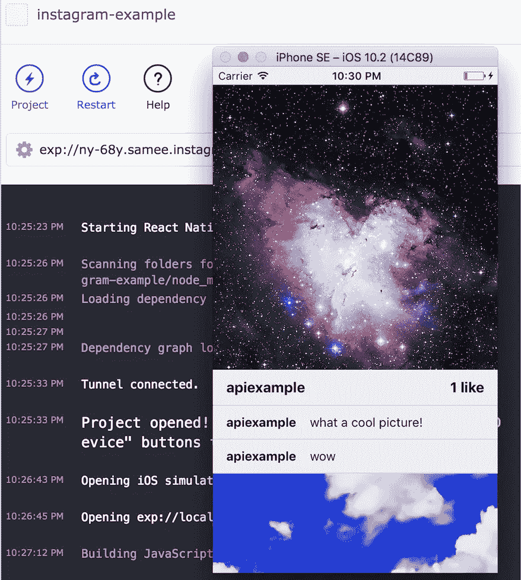

# 仅用 javascript 构建一个 Instagram feed 应用程序(使用 Expo & React Native)

> 原文：<https://medium.com/hackernoon/build-an-instagram-feed-app-with-just-javascript-using-expo-react-native-97c0e799b5cf>

我想从事移动开发已经有一段时间了，但是每当我开始做一些其他的事情时，我都会遇到同样令人烦恼的问题:

*   我浪费时间做乏味的事情。制作一个 hello world 应用程序需要大量的样板代码和随机安装
*   我的网络知识没有转移。Android 和 iOS 完全不同，两者都和 web 完全不同。

在浏览了一些互联网后，脸书似乎用 React Native(一个基于 React.js 制作原生应用的库)解决了这个问题，但在尝试后，我发现设置和以前一样乏味。主要问题仍然存在:我需要编写一堆样板 Java / C#代码。

我已经准备好承认在移动设备上建设，但是我发现了一个叫做 Expo 的东西。Expo 有几个库和工具以一些有意义的方式建立在 React Native 的成功之上:

*   您可以立即启动并运行，无需下载任何内容
*   独立的应用程序可以 100%在 [javascript](https://hackernoon.com/tagged/javascript) 中制作
*   它与 API 捆绑在一起，简化了应用程序中的常见任务

我最近的创作是一个 Instagram feed 应用程序，这是我们将要做的。你可以关注[世博小吃](https://snack.expo.io/)(一个玩世博的网络界面)。你也可以在 github 上查看[源码或者观看我的](https://github.com/sameesiddiqui/instagram-example)[视频教程。](https://www.youtube.com/watch?v=aJhJCc8lrC8)我们开始吧。



Finished app

从高层次来看，我们可以看到该应用程序由帖子列表、关于帖子的元数据以及帖子评论组成。我们需要使用 Instagram api 来获取这些信息，然后以列表格式显示出来。

让我们设置一个 Instagram 客户端应用程序，这样我们就可以发出 api 请求。


填写完创建客户端应用程序的信息后，取消选中复选框以禁用隐式 OAuth。为了简化我们的演示应用程序，我们将获得没有任何服务器端代码的访问令牌。

现在，单击“管理客户端”,并在新创建的客户端上进行管理。点击安全，并在“有效重定向”字段中输入任何 url(我输入了 http://www.google.com)。

快好了。为了获得我们的访问令牌，我们使用 Instagram 的身份验证 api 进行 api 调用。api 将把我们重定向到指定的 url，但是使用我们的访问令牌作为 url 参数。以下是您需要粘贴到浏览器中的内容:

```
https://api.instagram.com/oauth/authorize/?client_id=CLIENT-ID&redirect_uri=REDIRECT-URI&response_type=token&scope=public_content
```

其中客户端 ID 和重定向 URI 是各自的值。批准应用程序访问您的 Instagram 帐户后，您应该会被重定向。这是我获取访问令牌的地方(请为您的应用创建一个唯一的令牌)。


很好。我们终于可以开始编码了。

以下是任何世博会项目的框架:

```
import React, { Component } from 'react';
import { Text, View, StyleSheet } from 'react-native';export default class App extends Component {
  render() {
    return (
      <View>
        <Text>Hi</Text>
      </View>
    )
  }
}const styles = StyleSheet.create({})
```

html 风格的标签被称为 JSX，是 React 的一个特性。我们可以用它来定义我们的布局，并将 javascript 逻辑嵌入其中。

让我们从 [React Native](https://hackernoon.com/tagged/react-native) 和 Expo 再导入一些组件。

*   FlatList 组件将是我们 UI 的主要构建块，因为它通过调用 renderItem 函数来呈现列表中的每个项目。
*   AppLoading 用于在我们渲染部分应用程序时向用户显示一个加载图标(否则他们会看到一个空白屏幕，一旦加载就会闪烁并显示我们的内容)
*   样式表就像一个 css 文件，我们可以将样式应用于应用程序视图

我们还需要我们的访问令牌和存储每个帖子数据的地方。在 React Native 中，这是通过称为 state 的东西来完成的。UI 需要访问的任何数据都应该存储在这里。这很方便，因为无论何时状态改变，我们的应用程序都会重新呈现。

```
import React, { Component } from 'react'
import {
  Text,
  View,
  StyleSheet,
  Image,
  Dimensions,
  FlatList,
} from 'react-native'
import { Constants, AppLoading } from 'expo'access_token = '6626870867.cbba754.83fa37c865314df8be5c52347e3e4987'state = {
    loaded: false,
    data: null,
    comments: [],
}export default class App extends Component {
  render() {
    return (
      <View style={styles.container}>
        <FlatList
          data={this.state.data}
          renderItem={({ item, index }) => this.createPost(item, index)}
          keyExtractor={(item) => item.id}
        />
      </View>
    )
  }
}const styles = StyleSheet.create({
  container: {
    flex: 1,
    alignItems: 'center',
    paddingTop: Constants.statusBarHeight,
    backgroundColor: '#ecf0f1',
  }
})
```

FlatList 的数据属性是一个数组，其中的每一项都作为参数传递给 renderItem 函数。我们将把我们的 Instagram 帖子存储在这个数组中。

因此，让我们使用我们的 access_token 来获取我们的 post 数据。我们使用 fetch api 向 Instagram 的 api 端点发出 GET 请求。然后，我们将这些值存储在应用程序状态中。

```
async fetchFeed () {
    let response = await fetch(
      '[https://api.instagram.com/v1/users/self'](https://api.instagram.com/v1/users/') + 
      '/media/recent/?access_token=' +
      this.access_token
    )
    let posts = await response.json()
    let comments = await this.makeCommentsList(posts.data)this.setState({
        data: posts.data,
        comments: comments,
        loaded: true
    })
  }
```

我们有最近的帖子列表，但是对于每个帖子，我们需要获得评论和相关元数据的列表。这意味着我们正在发出一系列网络请求，这些请求可能会以错误的顺序返回。我们的计划是通过返回一组承诺来处理这个问题，这些承诺将在帖子评论被检索到时得到解决。我们还通过在帖子没有评论时不发出请求来节省一些加载时间，只显示一个显示“没有评论”的视图

```
async makeCommentsList(posts) {
    let postsArray = posts.map(async (post) => {
      let postId = post.id if (post.comments.count === 0) {
        return (
          <View style={styles.comment} key={postId}>
            <Text>No Comments!</Text>
          </View>
        )
      } else { let response = await fetch(
          '[https://api.instagram.com/v1/media/'](https://api.instagram.com/v1/media/') +
            postId +
            '/comments?access_token=' +
            this.access_token
        ) let comments = await response.json()
        let commentsArray = comments.data

        let commentsList = commentsArray.map(commentInfo => {
          return (
            <View style={styles.comment} key={commentInfo.id}>
              <Text style={styles.commentText}>{commentInfo.from.username}</Text>
              <Text>{commentInfo.text}</Text>
            </View>
          )
        }) return commentsList
      } }) postsArray = await Promise.all(postsArray)
    return postsArray
  }
```

我们添加了一些样式使评论看起来更好:

```
const styles = StyleSheet.create({
  container: {
    flex: 1,
    alignItems: 'center',
    paddingTop: Constants.statusBarHeight,
    backgroundColor: '#ecf0f1',
  },
  comment: {
    flexDirection: 'row',
    padding: 10,
    paddingLeft: 15,
    borderBottomWidth: 1,
    borderColor: '#d8d8d8',
  },
  commentText: {
    paddingRight: 15,
    fontWeight: 'bold',
  }
})
```

现在我们已经有了所有的评论和帖子数据，我们需要制作时间线并用我们得到的数据填充它。createPost 函数使用这些值来显示文章、元数据和评论。

```
createPost(postInfo, index) {
    let imageUri = postInfo.images.standard_resolution.url
    let username = postInfo.user.username
    let numLikes = postInfo.likes.countreturn (
      <View>
        <Image style={styles.image} source={{ uri: imageUri }} />
        <View style={styles.info}> <Text style={styles.infoText}>{username}</Text>
          <Text style={styles.infoText}>
            {numLikes + (numLikes !== 1 ? ' likes' : ' like')}
          </Text> </View> <View>
          {this.state.comments[index]}
        </View>
      </View>
    )
  }
```

imageUri、username 和 numLikes 都是从我们对 Instagram api 的 fetch 请求返回的 JSON 中检索的。返回值的例子可以在 Instagram 开发者文档中找到。

我们再一次在样式表中添加了一些样式，使我们的帖子看起来更漂亮。

```
 image: {
    width: Dimensions.get('window').width,
    height: Dimensions.get('window').width,
  },
  info: {
    flexDirection: 'row',
    justifyContent: 'space-between',
    padding: 10,
    paddingLeft: 15,
    paddingRight: 15,
    borderBottomWidth: 1,
    borderColor: '#d8d8d8',
  },
  infoText: {
    fontSize: 16,
    fontWeight: 'bold',
  }
```

为了添加一些收尾工作，让我们在应用程序启动时获取我们的 Instagram 信息，并显示一个加载图标以获得最佳用户体验。

```
componentDidMount () {
    this.fetchFeed()
}render () {
    if (!this.state.loaded) {
      return (
        <AppLoading />
      )
    } return (
      <View style={styles.container}>
        <FlatList
          data={this.state.data}
          renderItem={({ item, index }) => this.createPost(item, index)}
          keyExtractor={(item) => item.id}
        />
      </View>
    )
  }
```

就这样，你完成了！约 150 行的移动 Instagram feed 查看器。你可以在这里查看完整的工作点心例子。

由于本教程是在没有任何安装的情况下完成的，我们还没有完成制作一个独立的 Android 或 iOS 应用程序的过程。幸运的是，你就在几步之外。

1.  确保您拥有 Apple 开发者帐户和 Google Play 帐户。
2.  下载博览会的工具 [XDE](https://docs.expo.io/versions/latest/introduction/installation.html) ，点击零食中的“出口到 XDE”。
3.  遵循 Expo 的[独立应用页面](https://docs.expo.io/versions/latest/guides/building-standalone-apps.html)上的构建说明(主要是向你的应用添加元数据)
4.  恭喜你！你已经为 iOS 和 Android 开发了一个本地应用