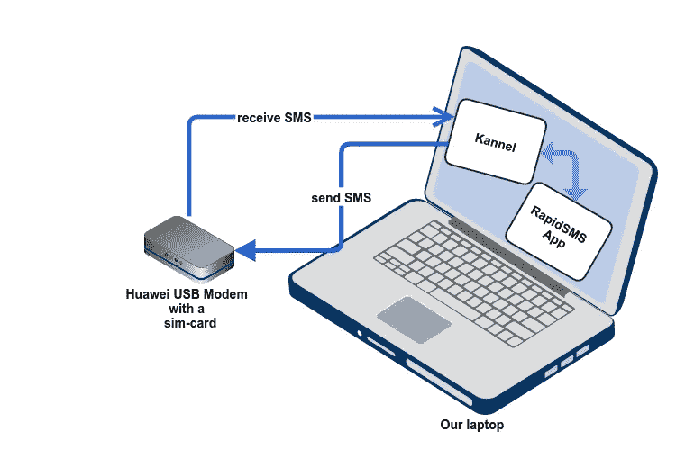
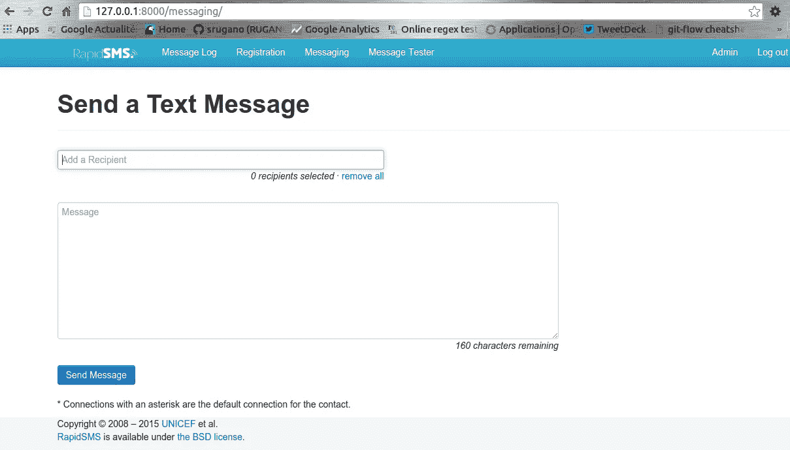
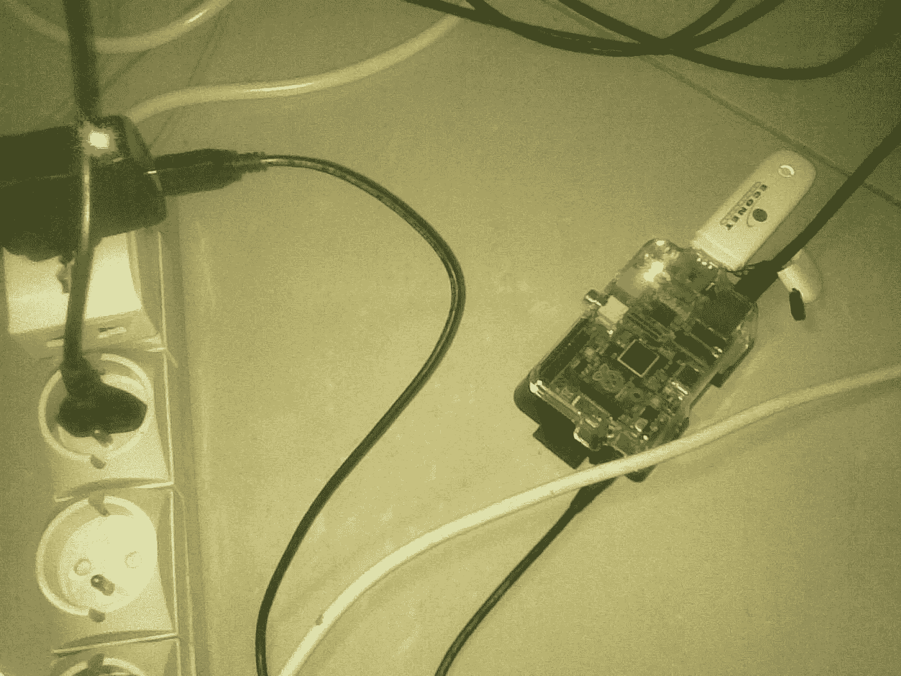

# 用 Python、Kannel 和 GSM 调制解调器建立一个“短信中心”

> 原文：<https://medium.com/hackernoon/build-an-sms-center-with-python-kannel-and-a-gsm-modem-9c0d29560d82>

我一直想知道，在一个只有 6.50%的人口用上电的国家，电信公司是如何设法开展业务，并使移动电话渗透到 T2 40%的人口中的！

如果你像我一样生活在撒哈拉以南的国家(布隆迪)，你知道我们是如何给手机供电的，对吗？

总之。


Dumb phones ( opposed to Smartphones)

这意味着我们大量使用“哑手机”，这种手机不会消耗我们所拥有的稀缺能源，这与现在全世界都知道的智能手机相反。

这也意味着，即使互联网覆盖很弱，在全国范围内使用手机短信也有很大的潜力。

这就是我自 2013 年以来在联合国儿童基金会一直在做的事情，为……青年参与( [U-report](https://github.com/unicefburundi/ureport-project/commits?author=srugano) )或收集疾病数据([霍乱应用](http://goo.gl/jyzeA7))或卫生系统([母亲和儿童健康周](http://goo.gl/lN03BC))、[急性营养不良、](http://goo.gl/Td5gt4)……

许多年轻人不理解使用可用/负担得起的技术(例如在非洲的短信)的必要性，而是继续等待期待已久的光纤革命，届时互联网将随处可用。

但是，…考虑到 M-Pesa 的成功(2 . 37 亿人对人交易！伙计。)，我们最好重新考虑一下我们对这个问题的看法。

***如果你和我一样是 Python/Django 开发人员*** 并且喜欢开源软件，让我向你展示如何构建一个“短信网关”来开始“涉足”Python 中基于短信的应用程序，这样你就可以以一种方便的方式发送和接收短信，并且熟悉…**ntumbase**！

我们将要使用的技术非常“简单”,而且价格低廉，因为它们都是开源的。我在我的第一篇文章中提到了他们。

## 安装要求

让我们假设您有一台拥有 root 权限的计算机。首选基于 Debian 的发行版(…已经使用 Ubuntu/Linux 7 年了！).

**安装 virtualenvs**

Virtualenvs 帮助您在同一台机器上拥有同一 Python 包的多个版本，而不会出现不兼容问题。Virtualenv 易于安装:

```
$ sudo apt-get install python-virtualenv
```

创建一个目录来保存你在 *mysmsapp* 和 *cd* 中的应用

```
$ mkdir mysmsapp && cd mysmsapp
```

## 构建 RapidSMS 应用程序

接下来是构建您的 web 应用程序。让我们使用 RapidSMS，它是一个用于与 SMS 交互的 Django 框架。你只需要做好这些[教程 1](http://rapidsms.readthedocs.org/en/develop/tutorial/tutorial01.html#tutorial01) 、[教程 2](http://rapidsms.readthedocs.org/en/develop/tutorial/tutorial02.html#tutorial02) 、[教程 3](http://rapidsms.readthedocs.org/en/develop/tutorial/tutorial03.html#tutorial03) 里的内容。如果你懂 Python 或者 Django，那就太简单了。

在教程 3 的最后，你需要选择一个后端，这样我们的应用程序就可以发送和接收真实世界的文本消息。我们将在我们的机器上使用一个 Kannel 后端。我喜欢它，因为我知道很多电信公司在他们的大型服务器上使用它。我们将在我们的小机器上使用，它实际上工作得很好…甚至在树莓派上！

## 通道和调制解调器

把一个装有 sim 卡的 GSM 调制解调器连接到你的机器上。建议不要将其连接到互联网，因为有些调制解调器被配置为不能同时发送短信和上网。



Gear we’ll use!

还建议使用使用“at”协议的调制解调器。有些是在这里找到的。

Kannel 帮助我们的应用程序分发收到或发出的短信。

你现在可以安装 kannel 并配置使用我们的应用程序，就像这里的**中解释的那样，但是请记住，你必须修改 kannel 配置的某些部分，就像这里的** [**要点**](https://gist.github.com/srugano/90f5ec9f8a1a1634f624) 。

最后，您会看到一个发送短信的界面，如下所示:



RapidSMS interface


Message logs

Fini！

我们创建了短信中心来发送和接收一些消息。

作为奖励，我在这里做了一个很酷的“基于树莓的”短信中心，它实际上模仿了我们在办公室用 64GB/ram 服务器做的事情！



Raspberry ($35) + ZTE Modem and sim-card ($25) = 518Mb sms-server-center

酷毙了。2016 新年快乐。

[](http://bit.ly/HackernoonFB)[](https://goo.gl/k7XYbx)[](https://goo.gl/4ofytp)

> [黑客中午](http://bit.ly/Hackernoon)是黑客如何开始他们的下午。我们是 [@AMI](http://bit.ly/atAMIatAMI) 家庭的一员。我们现在[接受投稿](http://bit.ly/hackernoonsubmission)，并乐意[讨论广告&赞助](mailto:partners@amipublications.com)机会。
> 
> 如果你喜欢这个故事，我们推荐你阅读我们的[最新科技故事](http://bit.ly/hackernoonlatestt)和[趋势科技故事](https://hackernoon.com/trending)。直到下一次，不要把世界的现实想当然！

[](https://goo.gl/Ahtev1)