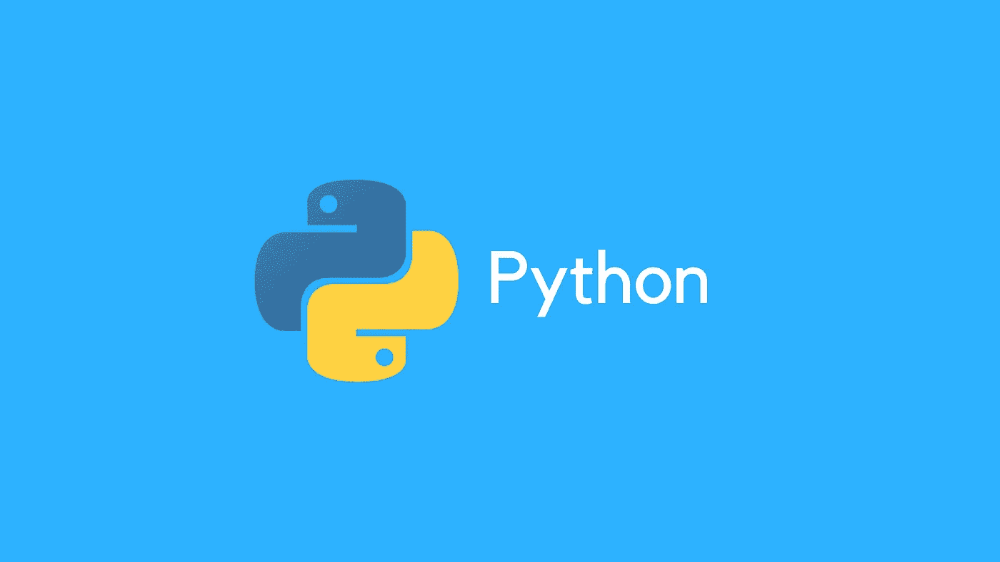

# python 和构建 11 个项目的完整指南

> 原文：<https://medium.com/hackernoon/build-professional-rest-apis-with-python-and-flask-29498d337396>

这个课程对于初学 [**学 python**](http://gainfromhere.com/python-programming-language/) 的人来说绝对是惊艳。很容易跟上，节奏也不太快，教练的工作非常出色。

本课程面向那些希望学习完整的 python 基础知识并在以后过渡到数据科学或 web 开发的人。本课程也面向 python 新手或完全的编程初学者。 [**查看此处**](http://gainfromhere.com/python-programming-language/)

该课程由 Ziyad Yehia 创建，评分为 4.6 分(满分为 5 分)。已经有超过 32，950 名学生注册了这门课程。它长达 9 小时的课程有两篇文章

[**view here**](http://gainfromhere.com/python-programming-language/)

**本课程教你以下内容:-**

*   您可以构建 11 个简单的 python 3 项目
*   您可以通过构建自定义 python 函数来自动化编码任务
*   你可以通过理解面向对象编程来学习 python 3
*   如何在 python 程序中使用变量跟踪数据
*   如何创建能够使用逻辑和数据结构的程序。
*   如何使用循环来提高效率，节省时间和最大限度地提高生产力
*   更多