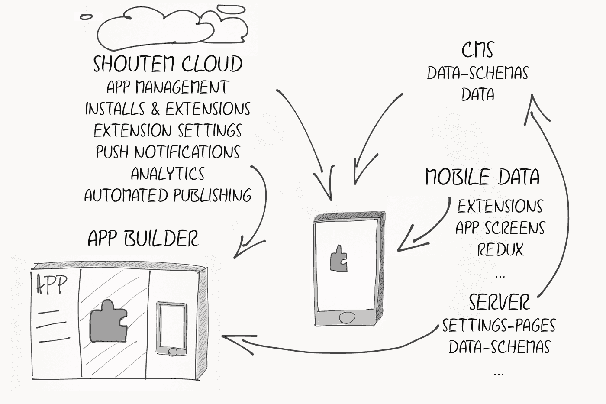
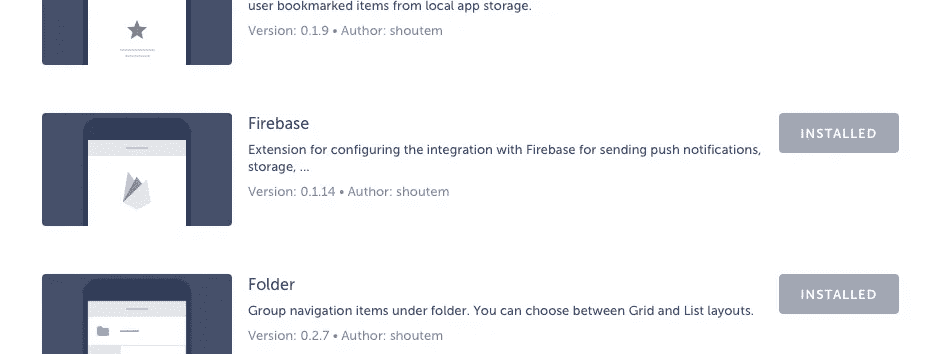

# 轻松构建、发布和管理 React 本机应用

> 原文：<https://medium.com/hackernoon/build-publish-and-manage-react-native-apps-with-ease-5e4529b812f9>

> 如何利用 React Native 上的 [Shoutem](https://new.shoutem.com/) 平台

来自 Cordova/Ionic & AngularJS 的背景，我有机会成为 Shoutem 平台测试阶段的首批开发人员之一。

在这篇文章中，我将回顾我是如何使用 [Shoutem](https://hackernoon.com/tagged/shouthem) 平台构建一个全功能应用程序的。以下是我面临的最大挑战，以及我如何看待应用开发生态系统中的 [Shoutem 平台](https://new.shoutem.com/)。

一方面，我与一些 Shoutem 内部组件紧密耦合，但另一方面，我也可以作为一名使用 Shoutem 平台作为服务的开发人员，从一个鸟瞰的角度来说。所以我们开始吧。

## 从开发人员的角度来看

作为一名开发人员，你可以将 Shoutem 平台视为一个非常灵活的层，位于 [React Native](https://hackernoon.com/tagged/react-native) 和 [Redux](https://hackernoon.com/tagged/redux) 之上。它引入了用于构建 React 本地应用的新架构，并附带了一个 GUI，因此非技术用户也可以构建他们的应用。

Shoutem 平台的最大优势是它加快了应用程序的开发过程。Shoutem 封装了常见的应用程序特性，称为扩展，可以跨应用程序重用。Shoutem 自带 40 多个现成的常用应用程序扩展。扩展包括登录脸书，推送通知，用户管理等。你可以在这个 [github repo](https://github.com/shoutem/extensions) 上找到扩展的完整列表。

重要的一点是 GUI，它允许非技术用户定制应用程序中使用的扩展，甚至不需要接触任何代码行。此外，您可以使用 [React Native](https://facebook.github.io/react-native/) 从头开始构建您的扩展。

对我来说，最困难的事情是理解扩展背后的概念以及它们如何相互作用。设想一个处理脸书登录和用户名/密码登录的身份验证扩展。最初，您只需开发一个独立的身份验证扩展。但是在应用程序的上下文中，该扩展必须与其他组件进行大量的交互。例如，一个扩展，根据登录的用户显示一些用户特定的内容。



Shoutem Ecosystem

在内部，Shoutem 使用 [redux](http://redux.js.org) 来管理应用程序的全局状态。您可以将状态视为所有扩展都可以访问的一致容器。身份验证扩展可以将登录的用户注入到状态中，定义一些用于从状态访问用户的内部 API，因此任何其他扩展都可以访问状态中的用户对象。

很好地理解 [redux](http://redux.js.org) 对于编写定制的 Shoutem 扩展非常重要。

## 推送通知集成

我起初对 Shoutem 非常怀疑，因为我认为它是市场上常见的应用程序生成器。正如我们所知，应用构建器对于开发者来说远非可定制、灵活和开放的。

我很快了解到 Shoutem 不是一个应用构建器——它是 React 本地开发者的平台，除了其他部分之外，它还有一个用于管理应用的 GUI。GUI 在开发者和他们的客户之间提供了一个更简单的连接。我将给出一个我所面对的简短的例子，来说明我所说的对开发人员灵活和开放是什么意思。

在我的应用程序中使用 firebase 云消息集成推送通知时，我使用了 [shoutem-firebase](https://github.com/shoutem/extensions/tree/master/shoutem-firebase) 扩展，该扩展将所有 Firebase 特定的组件封装在一个扩展中。

你要做的第一件事就是去 app builder 安装 shoutem-firebase 扩展。



Installing the Firebase extension for your app via the App Builder

下次您使用 Shoutem CLI 在本地运行应用程序时

```
shoutem run-ios <your app id>
```

您可以将 [shoutem-firebase](https://github.com/shoutem/extensions/tree/master/shoutem-firebase) 扩展捆绑到 React 本地应用程序中。仅供参考，Shoutem 将您的 React 原生应用程序捆绑到~/中。shou tem/平台/构建。

因此，从这一点开始，firebase 扩展驻留在您的应用程序中。到目前为止还不错，但是要使用推送通知，我需要将 Firebase 云消息令牌发送到我自己的后端并与用户关联。此外，我想在应用程序的特定点触发“请求推送通知权限对话框”，而不是在应用程序启动后立即触发。所以，我不得不做一些定制来实现它，这也是 Shoutem 平台发挥作用的地方。

shoutem-firebase 扩展在内部触发一个名为 *REQUEST_PUSH_PERMISSION* 的 [redux 动作](http://redux.js.org/docs/basics/Actions.html)，当被触发时会被某个 [redux 中间件](http://redux.js.org/docs/advanced/Middleware.html)捕获，以显示“请求推送通知权限对话框”。整个应用程序中的任何组件都可以看到所有这些触发的操作。这也是我注入逻辑的地方。所以当我想显示对话框时，我首先触发的是 *REQUEST_PUSH_PERMISSION* 动作。所以我从我的 Shoutem 扩展中触发了这个 [redux](https://hackernoon.com/tagged/redux) 动作。

```
screens/MyOwnScreen.jscomponentDidMount() {
    ...
    this.props.actions.requestPushPermission(access_token);
    ...
}redux.js:export function requestPushPermission(accessToken) {
  return { type: REQUEST_PUSH_PERMISSION, accessToken: accessToken};
}
```

这个片段的作用是，当 MyOwnScreen.js 被挂载时，触发一个*REQUEST _ PUSH _ PERMISSION*动作。此时，该操作被触发两次，一次来自 shoutem-firebase 扩展，另一次来自我自己的扩展。为了防止默认操作，我在自己的 shoutem 扩展中安装了一个定制的中间件。

```
middleware.jsconst requestPermissions = store => next => action => {
    if (action.type === REQUEST_PUSH_PERMISSION) { if (action.hasOwnProperty(‘accessToken’)) {
        FCM.getFCMToken().then(token => {
        console.log(‘Firebase device token:’, token); // TODO: send the token to your backend // show the request push notification permission dialog
        FCM.requestPermissions();
      } else {
        return next(action);
      }
    }
};setPriority(requestPermissions, priorities.FIRST);
```

这个定制中间件监听*REQUEST _ PUSH _ PERMISSION*动作，并检查接收到的动作是否包含 *accessToken* (只有定制动作中包含 *accessToken* )。如果动作包含一个 *accessToken* ，中间件识别从 MyOwnScreen.js 内部触发的自定义动作，当动作被触发时，中间件将收到的令牌发送到服务器，并显示推送通知权限对话框。否则，它将动作分派给下一个中间件。在最后一行，我们确保中间件是第一个被调用的。

这个例子应该让您了解到，在完全不涉及 shoutem-firebase 扩展的情况下，扩展现有扩展的功能是多么容易。如果你愿意，你也可以用你自己的逻辑来扩展默认的 shoutem 扩展，它们都是开源的，或者你可以从头开始编写你自己的扩展。

最后，你用 Shoutem 构建的应用程序可以归结为一个普通的 React 原生应用程序，作为开发人员，每个方面都在你的掌握之中。

## 结论

在没有任何 React Native / Redux 背景的情况下，在开始使用 Shoutem 平台之前，一开始就获得整体概念并不容易。老实说，Shoutem 给整个堆栈增加了一些复杂性，尤其是当你以前从未使用过 React Native / Redux 的时候。但是一旦你理解了这个概念，好处是多种多样的，而且对你来说这一切都是自然的和合乎逻辑的。

随着越来越多的开发者适应 Shoutem 平台，我看到了它背后的巨大潜力。Shoutem 在 React Native 之上建立了一个干净、专业的层，可以以不同的方式使用。该平台提供了一个简单易用的图形应用构建器，无需编写任何代码即可构建应用。更重要的是，该平台没有通过引入扩展的概念和让第三方开发者选择从头构建完全属于自己的扩展来削减构建应用程序的任何灵活性。

[](http://bit.ly/HackernoonFB)[](https://goo.gl/k7XYbx)[](https://goo.gl/4ofytp)

> [黑客中午](http://bit.ly/Hackernoon)是黑客如何开始他们的下午。我们是 [@AMI](http://bit.ly/atAMIatAMI) 家庭的一员。我们现在[接受投稿](http://bit.ly/hackernoonsubmission)，并乐意[讨论广告&赞助](mailto:partners@amipublications.com)机会。
> 
> 如果你喜欢这个故事，我们推荐你阅读我们的[最新科技故事](http://bit.ly/hackernoonlatestt)和[趋势科技故事](https://hackernoon.com/trending)。直到下一次，不要把世界的现实想当然！

