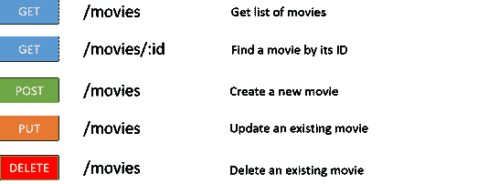
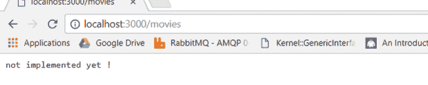
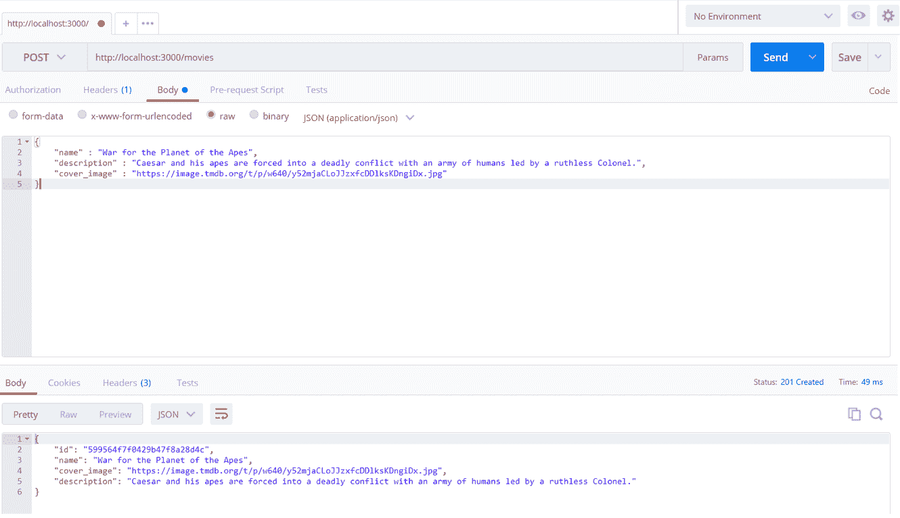
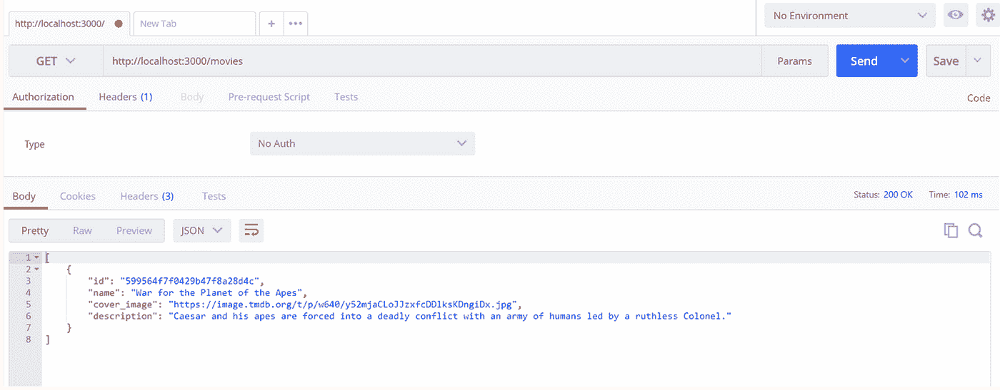
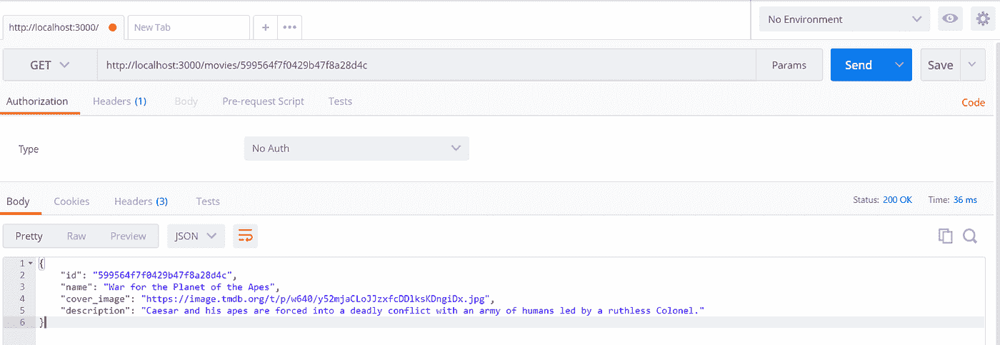
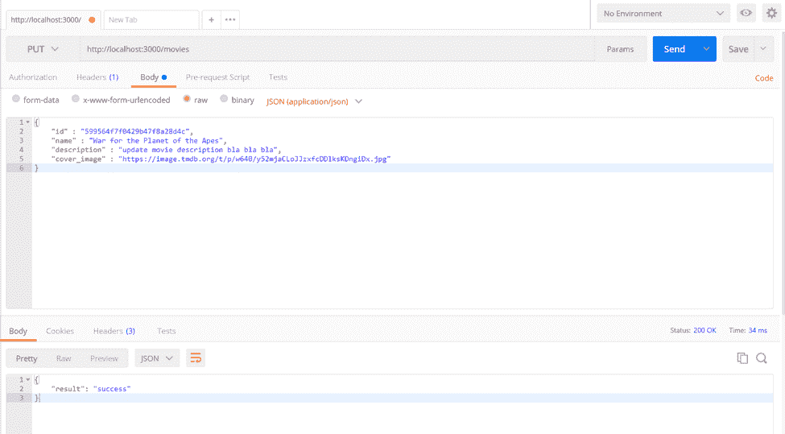
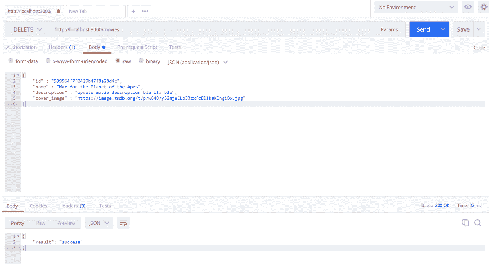

# 在 Go 和 MongoDB 中构建 RESTful API

> 原文：<https://medium.com/hackernoon/build-restful-api-in-go-and-mongodb-5e7f2ec4be94>

在本教程中，我将说明如何在 **Go** 和 **MongoDB** 中构建自己的 **RESTful API** 。这个演示中使用的所有代码都可以在我的 [Github](https://github.com/mlabouardy/movies-restapi) 上找到。

**1 — API 规范**

REST API 服务将公开端点来管理电影商店。我们的端点将允许的操作有:

**2 —获取依赖关系**

在开始之前，我们需要获得设置 API 所需的包:

> 去找 github.com/BurntSushi/toml·gopkg.in/mgo.v2·github.com/gorilla/mux

*   [**toml**](https://github.com/BurntSushi/toml) :解析配置文件( **MongoDB** 服务器&凭证)
*   [**mux**](https://github.com/gorilla/mux) :请求路由器和调度器，用于将传入的请求匹配到各自的处理程序
*   [**MgO**](https://github.com/go-mgo/mgo):**MongoDB**驱动

**3 — API 结构**

安装完依赖项后，我们创建一个名为“ **app.go** ”的文件，内容如下:

上面的代码为每个端点创建一个控制器，然后在端口 **3000** 上公开一个**HTTP**服务器。

注意:我们使用**获取**、**发布**、**放置**、**删除**。我们还定义了可以传入的参数

要在本地运行服务器，请键入以下命令:

> 去运行 app.go

如果你将浏览器指向[**http://localhost:3000/movies**](http://localhost:3000/movies)，你应该会看到:

**4 —型号**

现在我们有了一个最小的应用程序，是时候创建一个基本的**电影**模型了。在 **Go** 中，我们使用 **struct** 关键字创建一个模型:

接下来，我们将创建**数据访问对象**来管理数据库操作。

**5 —数据访问对象**

**5.1 —建立连接**

顾名思义， **connect()** 方法建立到 **MongoDB 数据库的连接。**

**5.2 —数据库查询**

实现相对简单，只包括使用**数据库发布权限方法。**c(集合)对象并返回结果。这些方法可以按如下方式实现:

**6 —设置 API 端点**

**6.1 —制作电影**

更新 **CreateMovieEndpoint** 方法，如下所示:

它将请求体解码成一个**电影**对象，赋予它一个 **ID** ，并使用**DAO**Insert 方法在数据库中创建一个**电影**。

让我们来测试一下:

同 [**邮差**](https://www.getpostman.com/) :

用**卷曲**

> curl-sSX POST-d ' { " name ":" Dunkirk "，" cover _ image ":"[https://image . tmdb . org/t/p/w640/cuqegop 6 kj 8 ykfnjjx 3tl 5 zh ccn . jpg](https://image.tmdb.org/t/p/w640/cUqEgoP6kj8ykfNjJx3Tl5zHCcN.jpg)，"描述":"二战电影" } '[http://localhost:3000/movies](http://localhost:3000/movies)| jq ' . "

**6.2 —电影列表**

下面的代码不言自明:

它使用 **DAO** 的 **FindAll** 方法从数据库中获取电影列表。

让我们来测试一下:

同 [**邮递员**](https://www.getpostman.com/) :

带**卷曲**:

> ' curl-sSX GET[http://localhost:3000/movies](http://localhost:3000/movies)| jq ' . '

**6.3 —查找电影**

我们将使用 **mux** 库来获取用户通过请求传入的参数:

让我们来测试一下:

同 [**邮递员**](https://www.getpostman.com/) :

带**卷曲**:

> ' curl-sSX GET[http://localhost:3000/movies/599570 faf 0429 b 4494 CFA 5d 4](http://localhost:3000/movies/599570faf0429b4494cfa5d4)| jq ' . '

**6.4 —更新现有电影**

更新 **UpdateMovieEndPoint** 方法，如下所示:

让我们来测试一下:

同 [**邮递员**](https://www.getpostman.com/) :

带**卷曲**:

> ' curl -sSX PUT -d '{"name":"dunkirk "，" cover _ image ":"[https://image . tmdb . org/t/p/w640/cuqegop 6 kj 8 ykfnjjx 3tl 5 zh ccn . jpg](https://image.tmdb.org/t/p/w640/cUqEgoP6kj8ykfNjJx3Tl5zHCcN.jpg)，" description ":"二战电影" } '[http://localhost:3000/movies](http://localhost:3000/movies)| jq ' . '

**6.5 —删除现有电影**

更新 **DeleteMovieEndPoint** 方法，如下所示:

让我们来测试一下:

同 [**邮递员**](https://www.getpostman.com/) :

带**卷曲**:

> ' curl-sSX DELETE-d ' { " name ":" Dunkirk "，" cover _ image ":"[https://image . tmdb . org/t/p/w640/cuqegop 6 kj 8 ykfnjjx 3tl 5 zh ccn . jpg](https://image.tmdb.org/t/p/w640/cUqEgoP6kj8ykfNjJx3Tl5zHCcN.jpg)，" description ":"二战电影" } '[http://localhost:3000/movies](http://localhost:3000/movies)| jq ' . '

更进一步吗？在我接下来的文章中，我将向你展示如何:

*   在 **Go** 中为每个端点编写**单元测试**
*   在 **Angular 4** 中构建一个 UI
*   用 **CircleCI** 设置一个 **CI/CD**
*   在 **AWS** 上部署堆栈等等…

敬请关注！