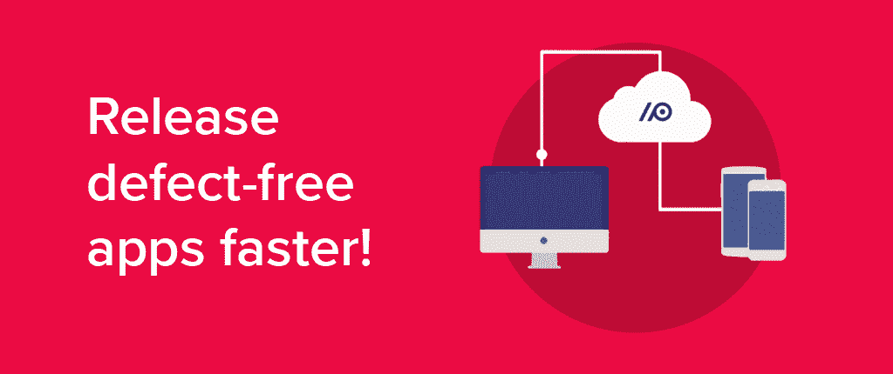
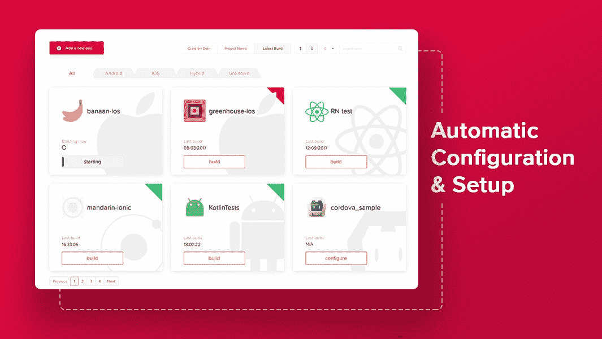
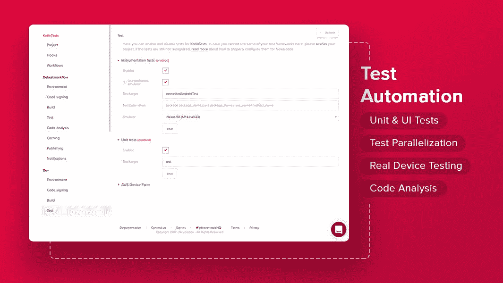
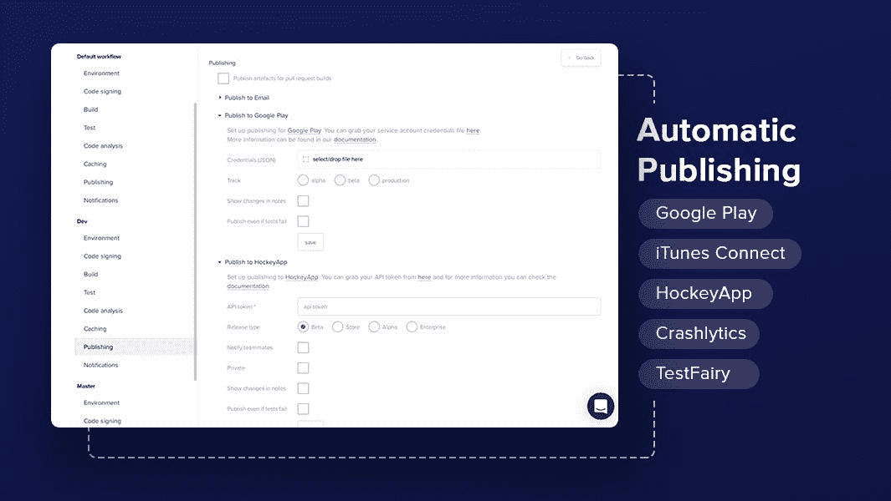

# 在不消耗资源的情况下构建、测试和发布五星级应用

> 原文：<https://medium.com/hackernoon/build-test-and-release-5-star-apps-without-burning-resources-c0d09d35996b>

[**Nevercode**](https://nevercode.io/) 帮助[移动应用](https://hackernoon.com/tagged/mobile-app)开发者更快地构建更好的应用。Nevercode 已经建立了一个基于云的持续集成服务，它自动化了[开发](https://hackernoon.com/tagged/development)过程中的关键步骤——构建、测试和分发。

[**凯文·威廉·大卫**](https://medium.com/u/8ea7bd91b1a4?source=post_page-----c0d09d35996b--------------------------------) 采访了 [**特里因·卡斯克**](https://medium.com/u/78f36db423de?source=post_page-----c0d09d35996b--------------------------------) ，CEO 于 [**Nevercode**](https://siftery.com/nevercode) 了解更多。

## 嗨，特里恩，我们开始吧！

## 给我们讲讲 Nevercode 吧？

Nevercode 是一个基于云的持续集成和交付平台，面向那些希望在不消耗资源的情况下更快发布无缺陷移动应用的团队。我们负责所有手工繁重的工作，比如整个 CI/CD 基础设施的内务管理，包括用最新的 SDK 更新构建器。这样开发人员就可以重新爱上编码，不受干扰地创造出令人敬畏的产品。

## 告诉我更多关于你为什么要建立这个的信息？

与开发人员共事多年，我总是注意到手动构建、测试和部署应用程序的重复性任务所带来的挥之不去的挫折感。最不幸的是，如果团队有合适的工具，这些任务可以很容易地自动化。我们自己的开发人员以前为像[**【Skype】**](https://siftery.com/skype)这样的公司开发移动应用程序，在这些公司中速度非常重要。所以这个问题与我们自身的痛苦直接相关。

这就是为什么我们构建了一个简单的基于云的 CI 服务来自动化整个移动应用程序开发流程。因此，在开发完美的应用程序时，没有什么会阻碍开发者。

## Nevercode 与市场上已经存在的有什么不同？

有自托管服务，也有像我们这样的基于云的解决方案。像 [**Jenkins CI**](https://siftery.com/jenkins) 这样的自托管工具需要大量的维护。首先，你需要购买昂贵的硬件(例如 iOS 的 Mac Minis)。其次，安装过程很麻烦，因为你需要安装&配置许多第三方插件才开始。更不用说每一次更新都有可能导致神秘的构建失败，而且你会花一整天的时间来找出是什么导致了它。

由于我们基于云，因此无需维护。我们还让所有的构建者 24/7 保持最新状态，让您可以毫无杂念地投入开发。使用 Nevercode，整个设置和配置都是自动的，所以您只需点击几下鼠标就可以完成第一次构建。

我们超级简单的设置也是我们区别于其他严重依赖配置文件的基于云的解决方案的地方。我们为各种规模的团队提供定制的解决方案。通过测试软件项目与用户合作，我们可以开发出用户既需要又喜欢的独特产品。

## 你能告诉我们一些关于使用 Nevercode 的不同客户群的信息吗？

每个团队都有独特的愿景，对我们来说，重要的是我们的产品完全符合他们独特的要求。我们的客户是大公司的专业移动应用团队，但我们也服务于全球各地的较小团队和自由职业者。

此外，许多客户来自不同的行业，如汽车、交通、教育、金融或卫生。随着移动行业继续快速增长，我们看到更多行业开始开发供内部使用的移动应用程序，例如在生产中。

我们的客户当然是开发人员，但通常是 CTO 和项目经理来找我们，帮助他们最大化团队的生产力并减少开销。

我们的一些长期客户有 [**【丰田】**](https://siftery.com/company/toyota)[**塞恩斯伯里**](https://siftery.com/company/sainburys)[**皮尔森**](https://siftery.com/company/pearson)[**JibJab**](https://siftery.com/company/jibjab)[**thunder head**](https://siftery.com/company/thunderhead)[**moonscade**](https://siftery.com/company/mooncascade)[**欧洲之星**](https://siftery.com/company/eurostar)

## 您的客户如何使用 Nevercode？你能分享一些不同的使用案例吗？

*月饼代码——用 Nevercode 替换 Jenkins*

[moomscade](https://mooncascade.com/)是一家领先的软件开发公司，他们在 iOS 开发项目中使用了 Jenkins。他们不得不为每次重大更新构建第二个构建服务器，并雇佣额外的 DevOps 工程师来测试兼容性。此外，管理 iOS 签名文件是一个经常困扰开发人员的难题。

切换到 Nevercode 基于云的 CI 让 Mooncascade 忘记了服务器更新问题，加上 Nevercode 的自动代码签名，iOS 上的签名文件管理变得毫不费力。

*TUYA——使用 Nevercode 自动化开发过程*

[TUYA Technologies](http://www.tuyatech.com/) 是一个物流平台，它严重依赖第三方供应商进行移动应用程序开发。没有自动化的构建、测试和发布流程，需要人工干预。

一旦他们使用 Nevercode 实现了流程自动化，他们不仅节省了大量的人工工作时间，还降低了成本。

## Nevercode 有没有你没有想到或预料到的独特用例？

我们的持续集成工具最初是为个人移动应用开发者和小团队设计的。突然，我们开始收到大公司的请求。很快发现，我们的许多爱好用户实际上参与了一些更大的企业，当他们在他们的个人开发项目中体验到我们产品的好处时，他们也向他们的团队成员和决策者介绍了我们的解决方案。

不知不觉中，Nevercode 也成为了企业的绝佳选择！

## 太棒了。

## 有什么早期的“成长秘诀”或策略促成了你现在的成功吗？

从一开始，我们就开始关注服务的质量和速度。我们看到我们的竞争对手开发了新功能，涵盖了移动应用开发过程中的所有附加步骤，但我们固执地将注意力放在我们的核心价值——质量——上，这对一家希望快速扩张的初创公司来说确实很难。现在我们看到了回报。一些曾经因为一些很酷的功能而去找其他人的客户现在又回来找我们了，正是因为我们服务的稳定性和质量。

## 在早期构建产品时，最大的挑战是什么？你是如何解决的？

一开始，我们根据自己作为移动应用程序开发人员的需求创建了第一个 CI 解决方案。当我们想为其他移动开发者发布产品时，我们不确定我们的解决方案是否也能满足他们的需求。因此，我们开始尽早收集 beta 测试人员的反馈，以确保我们的产品从发布的那一刻起就具有普遍的吸引力。

当我们的用户群开始快速增长时，我们面临着下一个挑战——可扩展性。大量数据流经我们的服务器，我们需要一个快速的解决方案来扩展我们的服务。长话短说，亚马逊网络服务正是我们所需要的。

## 你加入的最有趣的整合是什么？有什么对你特别有影响的吗？

我认为很难提出一个具体的集成，因为我们支持从 Git 库开始的所有流行的移动应用开发框架和集成，例如 [GitHub](https://medium.com/u/8df3bf3c40ae?source=post_page-----c0d09d35996b--------------------------------) 和[Bitbucket。这些无缝集成允许用户只需点击几下鼠标即可添加项目。Nevercode 当然支持 iOS 和 Android，也支持跨平台框架如](https://siftery.com/atlassian-bitbucket) [**Ionic**](https://siftery.com/ionic) ， [**Cordova**](https://siftery.com/apache-cordova) 和 [**React Native**](https://siftery.com/react-native) 。开箱即用的 Nevercode 自动检测所有主要的测试框架，比如[**Appium**](https://siftery.com/appium)[**Espresso**](https://siftery.com/espressojs)和 [**KIF**](https://siftery.com/kif-ios) 。说到部署，我们支持各种第三方服务，如 [**Slack**](https://siftery.com/slack) ， [**HipChat**](https://siftery.com/hipchat) ，Google Play，iTunes Connect， [**Testflight**](https://siftery.com/testflight) ， [**Crashlytics**](https://siftery.com/crashlytics) ， [**HockeyApp**](https://siftery.com/hockeyapp) ， [**TestFairy**](https://siftery.com/testfairy) 这些集成使用户能够使用他们喜欢的工具，从而简化开发过程。

最有趣的集成恰好是跨平台应用框架，如 Ionic、Cordova 和 React Native。这些框架为 web 开发人员打开了一扇门，让他们可以使用 JavaScript 等 web 技术涉足移动开发。事实上，我们看到许多团队从本地开发转向跨平台开发，因为这允许他们重用组件并更快地完成工作。能够适应最新的移动发展趋势使我们的用户能够在游戏中保持领先！

## 最后，你运营公司所依赖的顶级产品是什么&你如何使用它们？

*   [**懈怠**](https://medium.com/u/26d90a99f605?source=post_page-----c0d09d35996b--------------------------------) :真正把整个团队沟通联系在一起。自动通知和插件让我们随时了解最新动态。
*   ****:**我们开发团队的一个很棒的问题跟踪器和项目管理工具。**
*   **[**对讲机**](https://medium.com/u/7ca8972daf76?source=post_page-----c0d09d35996b--------------------------------) **:** 我们使用对讲机为我们的用户和潜在客户提供支持和沟通。**
*   **[**bit bucket**](https://siftery.com/atlassian-bitbucket)**:**这个很明显。我们选择的 Git 服务。**
*   **[**递归**](https://medium.com/u/6c53e29710d3?source=post_page-----c0d09d35996b--------------------------------) **:** 它帮助我们打理我们的订阅&账单。**
*   **[**Pipedrive**](https://medium.com/u/d79fb25c8c80?source=post_page-----c0d09d35996b--------------------------------) :帮助我们跟踪销售渠道的出色 CRM 工具。**
*   **[**Google G Suite**](https://siftery.com/g-suite-formerly-google-apps-for-work) :主要用于团队协作、共享文档等。**
*   ******:**我们在全球寻找优秀人才的首选平台。****

*****最初发表于*[*【siftery.com】*](https://siftery.com/stories/build-test-and-release-5-star-apps-without-burning-resources)*。*****