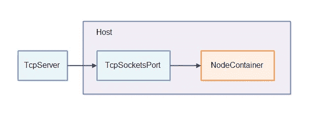
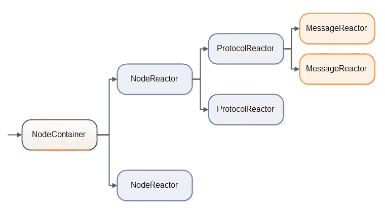
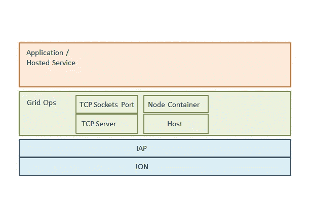

# 用网格操作构建多功能智能分布式系统—第 2 部分

> 原文：<https://medium.com/hackernoon/build-versatile-and-intelligent-distributed-systems-with-grid-ops-part-2-202fad4ff58f>

## **什么是网格 Ops？**

在帖子[ [1](https://hackernoon.com/versatile-and-intelligent-distributed-systems-with-grid-ops-part-1-8228bdfcb044#.7gg8e9we9) 中，我们介绍了 Grid Ops，它是一个用于创建高级分布式系统的开源 Java 工具包。我们还写道，Grid Ops 通常由一组实现分布式系统的核心工具和一组常用的分布式系统基础设施服务组成。

我们的使命是帮助开发人员只用几行代码就能建立并运行分布式系统。尽管我们从 Java 实现开始，但我们希望将来能够用其他语言实现，如 C#和 Grid Ops 的主要组件有:

*   **TCP 服务器**
*   **TcpSocketsPort**
*   **主持人**
*   节点容器

这四个组件构成了网格操作的基础，如下图所示:

1.`**TcpServer**` 是消息进入`**Host**`的方式之一。`**Host**`通过`**TcpSocketsPort**`读取信息，并将它们传递给`**NodeContainer**`。

2.`**TcpSocketsPort**`在内部管理一个或多个 TCP 套接字。这些 TCP 套接字可以来自一个`**TcpServer**`或者由应用程序作为客户端连接打开(传出连接)。因此,`**TcpSocketsPort**`可以用作传入和传出连接的接口，这意味着它既是服务器的接口，也是客户机的接口。

3.`**NodeContainer**`在内部将其接收的消息路由到正确的节点。您可以将节点反应器、协议反应器和消息反应器插入`**NodeContainer**`。这就是开发人员实现多租户和多协议应用程序的方式。

简而言之，Grid Ops 函数中的`**NodeContainer**`类可以将传入的消息路由到要处理它们的组件。`**NodeContainer**`将查看传入消息中的节点 id，并将消息转发给相应的`**NodeReactor**`。`**NodeReactor**`将查看语义协议 id +版本，并将消息转发给相应的协议反应器。协议反应器将查看传入消息的消息类型，并将消息转发给相应的消息反应器。

通常通过`**TcpServer**`和`**TcpSocketsPort**`从外部接收消息，然后将其发送给`**NodeContainer**`，后者在内部将消息路由到正确的`**MessageReactor**`(通过`**NodeReactor**`和`**ProtocolReactor**`实例)。

## **线程呢？**

Well a `**TcpServer**`有自己的线程，接受传入的连接。该线程不从传入的连接中读取任何内容。

`**Host**`也有自己的线程，它从`**TcpSocketsPort**`中提取消息，并将它们传递给`**NodeContainer**`。运行`**Host**`循环的同一个线程调用了`**NodeContainer**`的`**react()**`方法。这样，消息的读取和处理由同一个单线程完成。因此，开发人员可以采用单线程并发模型来编写他们的节点反应器、协议反应器和消息反应器。

## **网格运营堆栈概述**

这是目前为止，我们将继续在未来的职位更多的细节。如果你想玩 Grid Ops，请访问我们的 [Github 页面](https://github.com/nanosai/grid-ops-java)，代码请查看 [**这里**](https://github.com/nanosai/grid-ops-java-examples) 。我们正在准备推出一些服务，如果你想收到测试邀请，请`[**Subscribe here.**](https://goo.gl/forms/zXQe9k2es9iombdD2)`

> [黑客中午](http://bit.ly/Hackernoon)是黑客如何开始他们的下午。我们是 [@AMI](http://bit.ly/atAMIatAMI) 家庭的一员。我们现在[接受投稿](http://bit.ly/hackernoonsubmission)并乐意[讨论广告&赞助](mailto:partners@amipublications.com)机会。
> 
> 如果你喜欢这个故事，我们推荐你阅读我们的[最新科技故事](http://bit.ly/hackernoonlatestt)和[趋势科技故事](https://hackernoon.com/trending)。直到下一次，不要把世界的现实想当然！

