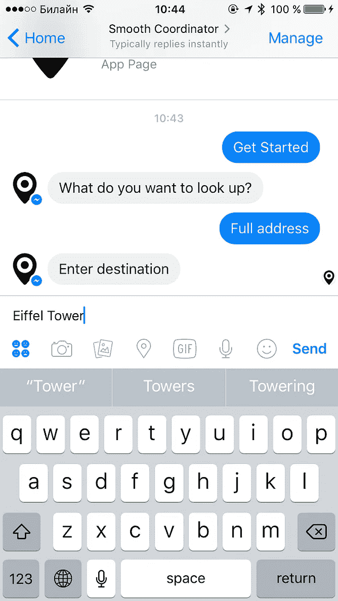
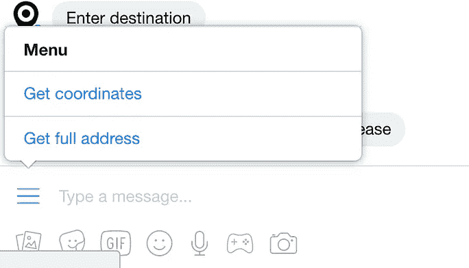
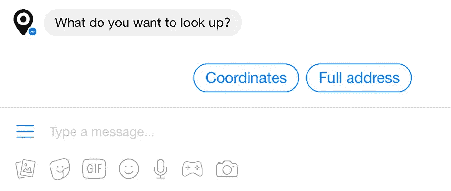
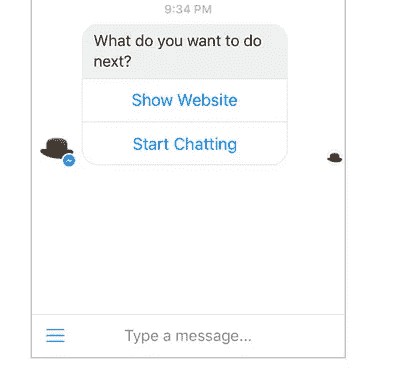
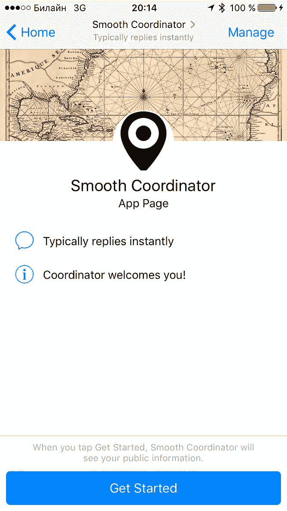
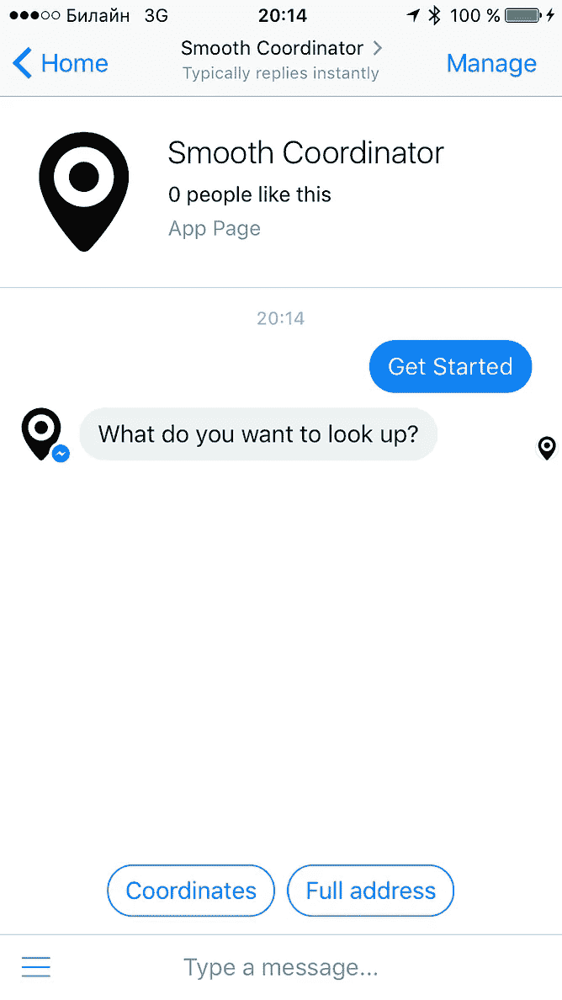
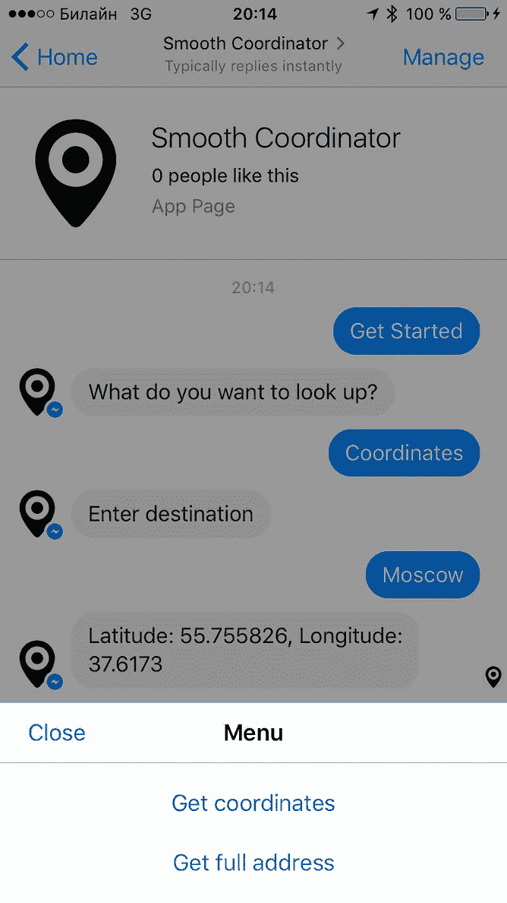

# 用 Ruby 和 Sinatra 构建你的第一个 Facebook Messenger 机器人(第 2/3 部分)

> 原文：<https://medium.com/hackernoon/build-your-first-facebook-messenger-bot-in-ruby-with-sinatra-part-2-3-b3d929a4606d>

## 跟上对话


A less obscure cultural reference

在本教程的第一部分中，我们在[脸书](https://hackernoon.com/tagged/facebook)上建立了我们的页面，并通过 [ngrok](https://ngrok.com/) 将其连接到运行在我们机器上的 [Sinatra](http://www.sinatrarb.com/) 服务器。然后我们介绍了[**Facebook-messenger**](https://github.com/hyperoslo/facebook-messenger)gem，由[hyperslo](http://www.hyper.no/)的家伙们开发。我们还教我们的机器人使用[谷歌地理编码 API](https://developers.google.com/maps/documentation/geocoding/intro) 来查找任何给定地址的 GPS 坐标。这就是我们的机器人在我们对其进行更多干预后的样子:



Chatting with the bot on mobile

# **跟我说话**

好了，让我们先把关于信使机器人的事情搞清楚。**他们遵守** [**维多利亚时代**](https://en.wikipedia.org/wiki/Victorian_era) **对小娃儿的礼仪**:

> “除非有人跟你说话，否则不要说话”

这是一个很好的规则，因为它有助于避免不请自来的消息，也就是垃圾邮件。但是我们如何提供请求的消息呢？在我们机器人的第一个极简版本中，我们只是假设用户会给我们一些东西，我们可以直接发送到谷歌地理编码 API，等待响应并显示结果。这假设用户事先知道我们的机器人的意图，这是一个非常糟糕的 UX 方式。此外，我们没有为用户输入任何没有 GPS 坐标的内容提供任何支持(令人惊讶的是，“Hello”会产生一个结果，因为谷歌只会假设我们正在寻找 [Hella，冰岛](https://en.wikipedia.org/wiki/Hella,_Iceland))——在这种情况下，我们的机器人将完全失去理智。我们需要某种**对话循环**。


[Poorly Drawn Lines](http://poorlydrawnlines.com/) by Reza Farazmand is licensed under a [CC BY-NC 3.0](https://creativecommons.org/licenses/by-nc/3.0/)

我在尝试用 **facebook-messenger** gem 实现它时学到的第一件事是:`Bot.on :message { |…| block }`调用只能在每个作用域内**调用一次，否则我们会面临各种各样的意外行为(如果我错了请*纠正我)。**所以** **我们需要创建更多的作用域**！好吧，让我们定义不同的方法来处理我们对话的不同方式，从最明显的开始。在 **bot.rb** 中，删除你的 Bot.on 方法，该方法使用一个块并替换为:***

现在我们需要添加一个在我们的`wait_for_user_input`中引用的`process_coordinates`方法。把这个放进你的 **bot.rb** :

现在在 **bot.rb 的底部**调用我们的等待方法。它将启动对话循环:

```
wait_for_user_input
```

从现在开始，如果用户在任何上下文中提到“坐标”(“coord”作为快捷方式)或“gps”，我们将只与他联系。然后，我们将要求用户提供一个查找的目的地，然后我们将调用谷歌和显示结果。如果没有找到结果，我们将通知用户并等待另一个命令。现阶段我们的 **code.rb** 看起来就像[这个](https://github.com/progapandist/coordinator-bot/blob/part-2-1/bot.rb)。在`rackup`运行的情况下点击标签中的`Ctrl-C`，重启服务器在 Messenger 中进行测试。

# 好吧，这似乎行得通。让我们添加功能！

如果我们深入研究从 Google 返回的 JSON，我们会发现有一个名为 T5 的键，它将返回 Google 可以找到的任何目的地的完整邮政地址。让我们把它作为一个特性添加到我们的机器人中。

首先，向我们的`wait_for_user_input`方法添加另一个`when`子句:

请注意，我们认为用户拼错了“地址”:如果他/她键入“我需要一个完整的地址”(这是我会犯的一种错误)，我们的 [regexp](https://en.wikipedia.org/wiki/Regular_expression) 仍然匹配，并且`show_full_address` 函数将被调用。也放在 **bot.rb** 里面:

最后，添加这个助手方法:

太好了。这是你在这个点的[代码。重启服务器并测试。](https://github.com/progapandist/coordinator-bot/blob/part-2-2/bot.rb)

# **该重构了！**

我们的机器人肯定可以工作，可以处理两种不同的命令，但是它的代码肯定可以使用一些重构:`process_coordinates`和`show_full_address`方法 80%相同，这意味着**我们可以做得更好**。


Refactoring can sure get messy

我们知道 [Ruby](https://hackernoon.com/tagged/ruby) 方法可以[接受块](http://rubylearning.com/satishtalim/ruby_blocks.html)。看起来我们可能会从这个语言特性中受益，让我们的代码[变得枯燥](https://en.wikipedia.org/wiki/Don't_repeat_yourself)-呃。让我们定义另一个方法，它将抽象出大多数 API 处理功能:

那么我们可以把`both process_coordinates`和`show_full_address`改成这样:

太好了。现在，我们的方法只做实际上特定于它们的目的的事情，其余的由我们处理 API 相关逻辑的通用方法来处理。

我知道，带有参数的 Ruby `yield`的概念可能很难理解，尤其是如果你像我一样是一个初学者，但是我喜欢把它想象成连接两个方法的**时空扭曲，你可以来回传递变量。**


This is how I imagine Ruby **yield** that takes an argument inside a method (Almost)

当我们这样做的时候，让我们也创建一个`IDIOMS`常量，这样我们就可以把我们的机器人的所有短语放在一个地方。将它添加到您的 **bot.rb** 的顶部:

```
IDIOMS = {
  not_found: 'There were no resutls. Ask me again, please',
  ask_location: 'Enter destination'
}
```

现在，将您的硬编码回复替换为对`IDIOMS`的引用，如下所示:

```
message.reply(text: IDIOMS[:ask_location])
```

这是你这个阶段的[代码](https://github.com/progapandist/coordinator-bot/blob/part-2-3/bot.rb)。重启你的服务器**测试测试**。

# **不只是说说而已**

很好，我们的机器人仍然工作，我们使用了一些聪明的红宝石，但它仍然不是最好的用户体验。用户应该如何知道该做什么？我们能引导他吗？对话式人工智能的承诺还没有真正实现，现在我们还停留在混合界面上。[大家都在](https://core.telegram.org/bots/2-0-intro)做[做](http://venturebeat.com/2016/07/06/until-a-i-gets-better-buttons-are-a-bridge-for-chatbots/)做[做](https://techcrunch.com/2016/07/01/shatbots/)。Facebook Messenger 目前有三种(据我所知)向用户显示“菜单”的方式:

1.  可以从文本输入字段旁边的图标中调用的持久菜单。
2.  一个“按钮”模板，让您可以将动作按钮绑定到一个消息气泡上。
3.  一套“快速回复”。



Three Facebook-approved ways of presenting button menus to user

我们将选择 [**快速回复**](https://developers.facebook.com/docs/messenger-platform/send-api-reference/quick-replies) ，因为我觉得它们更人性化。它们也被 API 视为常规消息，而其他按钮实现对 webhook 的[“回发”](https://developers.facebook.com/docs/messenger-platform/send-api-reference/postback-button)调用，这是一个有点不同的概念，我们将在后面看到。

首先，创建 constant 以将您的快速回复保存在一个地方:

“Payload”听起来令人困惑，但这实际上只是您可以分配给用户交互的另一个标识符。把它想成一个常数，所以我们用`CAPITAL_LETTERS`来表示我们的有效载荷。

好了，现在我们要写一个小方法，它将在将来帮助我们在编写机器人消息时采用更多的[声明性](https://en.wikipedia.org/wiki/Declarative_programming)方法。还记得我告诉过你机器人只会在别人跟他们说话的时候说话吗？嗯，在某种程度上这是真的。用户必须[做一些](https://developers.facebook.com/docs/messenger-platform/product-overview/entry-points#others)会**暴露其 ID** 的事情。比如，发送第一条消息或者使用一个链接到你的脸书的页面地址(你的机器人在那里生活和处理它的信使交互)。

因此，除了我们之前看到的`Bot.on :message { |…| block }`之外， **facebook-messenger** gem 的创建者还给了我们`Bot.deliver`方法，一旦我们有了用户的脸书 ID，就可以给用户发送消息。我们将把它包装成我们自己的`say`助手:

它将接受一个用户的 id，一个我们想要发送的消息的文本和一个快速回复数组的可选参数。如果提供了一个参数，消息将被发送并附有快速回复，如果没有，它将只是一个文本。

从[聊天机器人生活](https://chatbotslife.com/)中的这篇[精彩文章](https://chatbotslife.com/what-10-billion-messages-can-teach-us-about-making-chatbots-fb796781bb4a#.oy73pes67)中，我们知道大多数用户会以某种形式的“*嗨*”或“*你好*”与机器人交谈。我们希望我们的机器人尽可能快地呈现菜单上的内容，而没有任何不必要的 meet & greet，所以我们会稍微作弊:我们将引入`wait_for_any_input`方法，该方法将呈现我们对用户发送给我们的任何内容的快速回复，无论是“ *hi* ”、“ *bonjour* 还是“ *привет* ”。添加到 **bot.rb** :

`message.sender[‘id’]`是我们如何在用户打开对话后获取他的 ID。

此外，让我们将我们的旧`wait_for_user_input`方法的名称改为`wait_for_command`，以避免任何歧义。确保更改定义和所有可能的调用。

另外，确保在我们的 **bot.rb** 的最后，你现在给`wait_for_any_input`打电话:

```
# launch the loop
wait_for_any_input
```

让我们更新我们的`IDIOMS`:

```
IDIOMS = {
  not_found: 'There were no resutls. Ask me again, please',
  ask_location: 'Enter destination',
  unknown_command: 'Sorry, I did not recognize your command',
  menu_greeting: 'What do you want to look up?'
}
```

然后让我们定义我们的`show_replies_menu`方法:

它使用我们的`say`助手给用户发送菜单。然后它调用我们的`wait_for_command`来处理用户接下来做的任何事情。注意，我们选择了快速回复的措辞来匹配`wait_for_command`中所有可能的正则表达式。同时，用户没有义务选择任何快速回复。他可以对我们大喊，比如“给我坐标，你这个愚蠢的机器人！他的命令仍然会被处理，因为我们的正则表达式是不区分大小写的。现在让我们在 switch 语句中添加一个`else` 子句，以处理我们所知的命令都不匹配的情况。这是我们新改进的`wait_for_command`:

到目前为止，当 API 请求失败时，用户不得不再次键入类似“*坐标*或“*完整地址*”的内容来重新开始整个过程。这不是很酷，所以如果 API 没有返回任何结果，让我们更新我们的`handle_api_request`来重试最后一个命令。为此，我们将使用一些 [**元编程**](https://en.wikipedia.org/wiki/Metaprogramming) ( *这是我最喜欢 Ruby 的一点！*)。看:

# **通过螺纹**

现在你的机器人应该是可测试的了。最后，我们将调整一些**线程设置**，这样我们的用户会得到适当的问候，并显示“开始”按钮，允许开始对话。我们还将添加一个持久的菜单，让用户不断访问这两个功能，即使他正在做别的事情。下面是它的样子:



Making our bot nicer

这将需要我们使用 **facebook-messenger** 的`Bot.on :postback { |..| block }`功能。首先，进入你的脸书开发者控制台，在**“web hooks”**下点击**“编辑事件”**并启用 **messaging_postbacks** 。


将此添加到您的 **bot.rb** :

现在添加一些逻辑来处理回发事件:

# **第 2 部分到此结束！**

我们用不到 200 行纯 Ruby 代码编写了一个功能齐全的机器人(尽管为了吸引数百万风投，它可能并不特别吸引人)。 [**跟随本教程的第三和最后**](https://hackernoon.com/build-your-first-facebook-messenger-bot-in-ruby-with-sinatra-part-3-3-c1b9f55ae121#.kd4zd0ywf) 部分，看看我们如何添加一些最终的附加功能并部署到 Heroku，这样我们的**平滑协调器**就可以最终上线了。

> **在我的 Github** **上可以找到我们 bot 现阶段开发的所有代码** [**。您可以在同一个回购协议中找到一个**](https://github.com/progapandist/coordinator-bot/tree/part-two) [**完整项目**](https://github.com/progapandist/coordinator-bot) **(撰写本文时仍在 WIP 中)的代码，但在主分支中。随便叉，随便克隆，随便玩。**

# [转到第 3 部分](https://hackernoon.com/build-your-first-facebook-messenger-bot-in-ruby-with-sinatra-part-3-3-c1b9f55ae121#.nq73ya2oe)

**关于我** : *我是一名初学网页开发的人，曾是资深国际电视记者，也是一名年轻的父亲，正在寻找第一份合适的程序员工作。除了痴迷于编码风格和试图让我的头脑充满技术文献之外，我最近以全班第一名的成绩从巴黎的一个优秀的* [*Le Wagon*](https://www.lewagon.com/) *编码训练营毕业，并在那里作为一个毕业项目与人合著了* [*【半路忍者*](http://halfway.ninja) *。这是情侣机票的比较。去看看！你可以在*[*Github*](https://github.com/progapandist)*，*[*Twitter*](https://twitter.com/progapandist)*和*[*insta gram*](https://www.instagram.com/progapanda/)*上找到我。我也拥有这个* [*域*](https://progapanda.org/) *。我现在可以被雇佣，无论是鼓舞人心的实习，自由职业，甚至是全职工作。我会说英语、俄语、法语、Ruby、JavaScript、Python 和 Swift，目前在俄罗斯联邦莫斯科工作。有什么优惠可以直接写我*[](mailto:andybarnov@gmail.com)**。**

*[](http://bit.ly/HackernoonFB)**[](https://goo.gl/k7XYbx)**[](https://goo.gl/4ofytp)*

> *[黑客中午](http://bit.ly/Hackernoon)是黑客如何开始他们的下午。我们是 [@AMI](http://bit.ly/atAMIatAMI) 家庭的一员。我们现在[接受投稿](http://bit.ly/hackernoonsubmission)并乐意[讨论广告&赞助](mailto:partners@amipublications.com)机会。*
> 
> *如果你喜欢这个故事，我们推荐你阅读我们的[最新科技故事](http://bit.ly/hackernoonlatestt)和[趋势科技故事](https://hackernoon.com/trending)。直到下一次，不要把世界的现实想当然！*

**