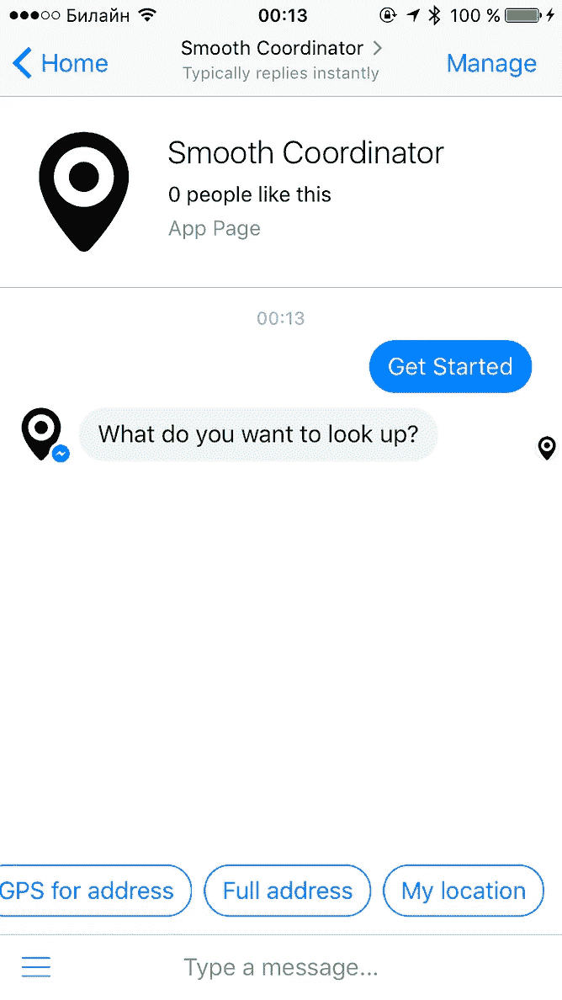
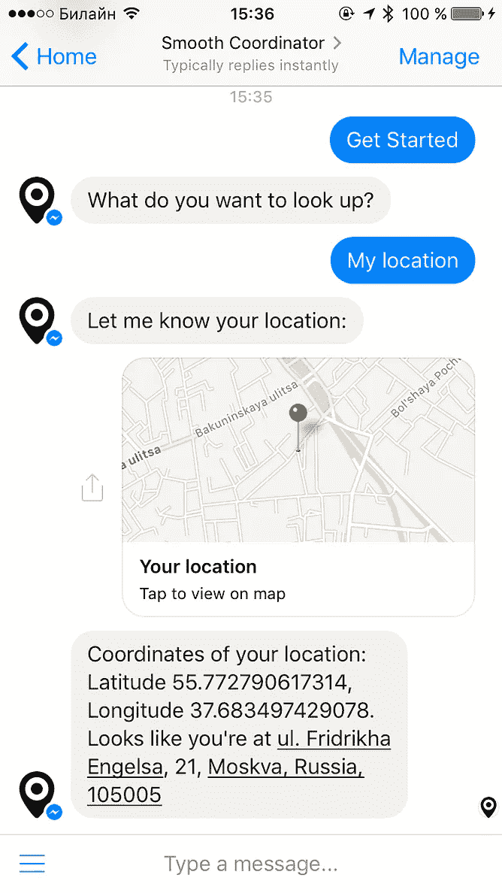
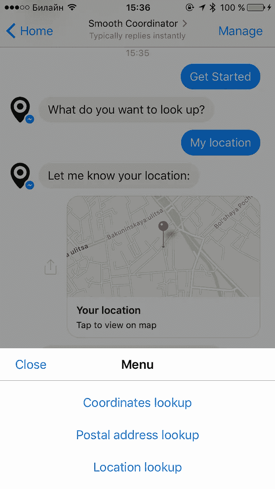
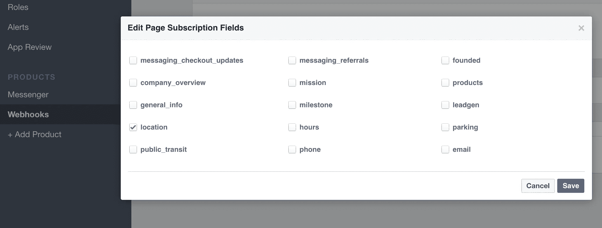
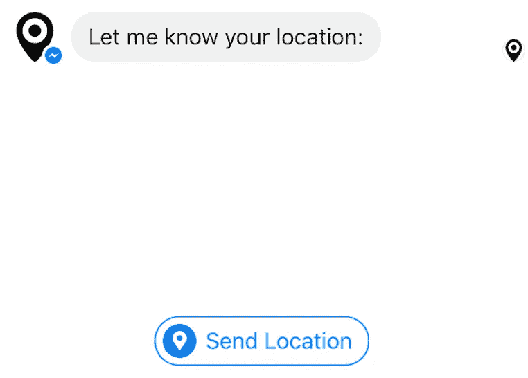
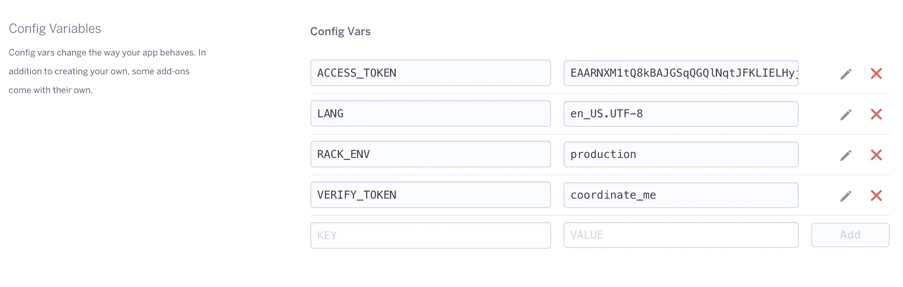
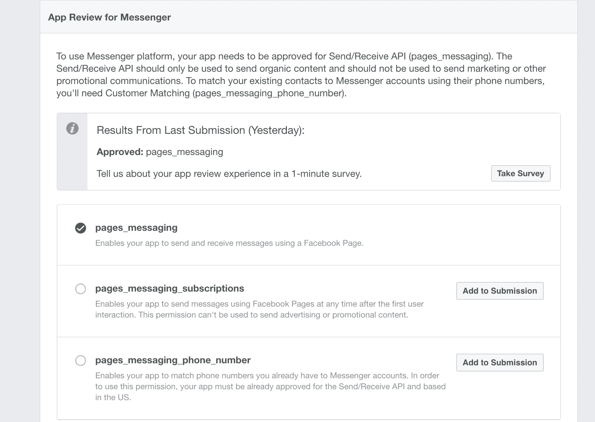
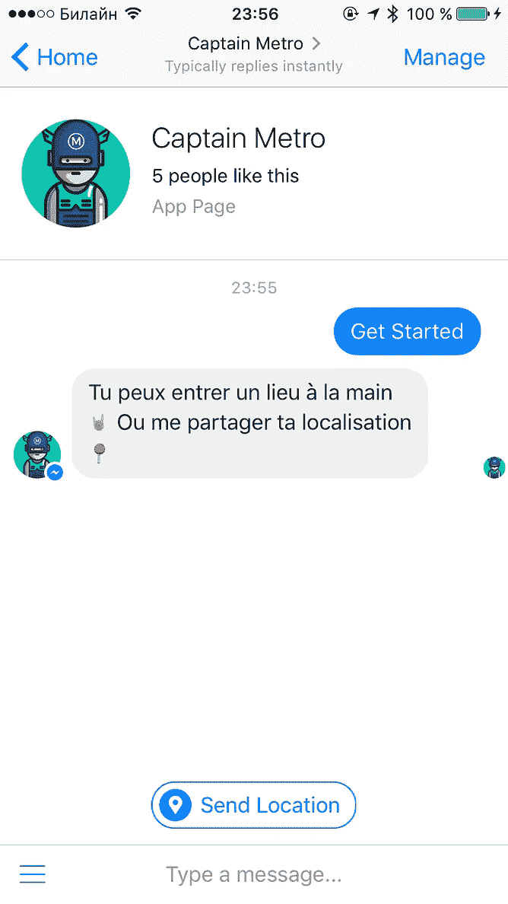
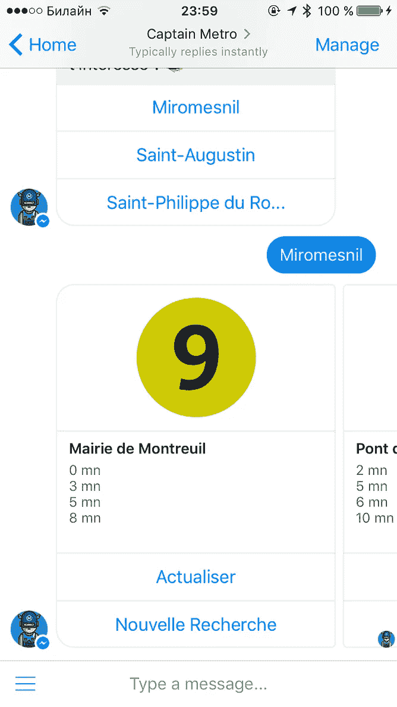

# 用 Ruby 和 Sinatra 构建你的第一个 Facebook Messenger 机器人(第 3/3 部分)

> 原文：<https://medium.com/hackernoon/build-your-first-facebook-messenger-bot-in-ruby-with-sinatra-part-3-3-c1b9f55ae121>

## 上线


*在本教程的* [***第一部分***](https://hackernoon.com/smooth-coordinator-1427dce17f00#.1die4td09) *中，我们在脸书上设置了我们的页面，并通过*[*ngrok*](https://ngrok.com/)*将其连接到运行在我们机器上的*[*Sinatra*](http://www.sinatrarb.com/)*服务器。我们从*[*hyperslo*](http://www.hyper.no/)*引入了*[*Facebook-messenger*](https://github.com/hyperoslo/facebook-messenger)*gem，并将我们的 bot 与*[*Google Geocoding API*](https://developers.google.com/maps/documentation/geocoding/intro)*挂钩。在* [***第二部分***](https://hackernoon.com/build-your-first-facebook-messenger-bot-in-ruby-with-sinatra-part-2-3-b3d929a4606d) *中，我们给我们的机器人添加了新功能，看到代码的复杂性增加了，所以我们不得不重构。我们添加了两组不同的菜单，使与机器人的交互更加容易。*

这次我们将教我们的机器人使用我们当前的位置。我们也将承认我们之前犯的一些设计错误，再次重构，并最终通过将我们的机器人部署到 [Heroku](heroku.com) 来将其从你的计算机的束缚中释放出来。你还将被引导通过**脸书验证过程**，这样你自己的机器人有一天就可以上线了。

如果您没有遵循上两部分的步骤，您可以从这里的开始代码。

这是我们今天要建造的:



Our bot by the end of this tutorial

## 保守秘密

还记得每次我们打开一个新的终端窗口在本地主机上启动我们的 bot 时，我们不得不手工输入我们的**环境变量**，比如`ACCESS_TOKEN` 或`VERIFY_TOKEN`吗？嗯，一些读者指出有一个 gem 可以解决这个问题，它可以用于任何 Ruby 项目(不一定非得是 Rails，就像流行的 [figaro](https://github.com/laserlemon/figaro) gem 一样)。遇见 [**dotenv**](https://github.com/bkeepers/dotenv) 。首先，在您的系统上安装它:

```
gem install dotenv
```

然后要求它在 `app.rb` 和`bot.rb`文件的**之上**

```
require 'dotenv/load'
```

在您的项目文件夹中创建一个名为`.env`的文件，并放置与您在终端中设置的完全相同的环境变量声明。(*提醒:这两个令牌都可以在您的脸书开发者控制台中找到，详见* [*第一部分*](https://hackernoon.com/smooth-coordinator-1427dce17f00#.23zwpjyhb)*)*

```
*VERIFY_TOKEN=here_comes_YOUR_verify_token
ACCESS_TOKEN=here_comes_YOUR_access_token*
```

*现在向您的项目文件夹添加另一个文件，名为`.gitignore`。把`.env`放在里面(对，只是的名字。env 文件),这样您的令牌就不会被推送到 Github 供全世界查看。我假设您使用 Git 跟踪您的项目，这对我们部署到 Heroku 是必不可少的。*

*太好了，现在你每次用一个`rackup`命令启动你的本地服务器时，你的环境变量都会被自动设置，不需要担心关闭和重新打开你的终端窗口。*

## *我在哪里？*

*你必须承认，我们机器人的[最后一次迭代](https://hackernoon.com/build-your-first-facebook-messenger-bot-in-ruby-with-sinatra-part-2-3-b3d929a4606d#.ahwolrald)不是很有用:你必须手动输入一个地址来查找 GPS 坐标。学习像埃菲尔铁塔的纬度这样随机的东西很好，但当你需要回答这个问题时，这并没有什么帮助，这个问题和人类本身一样古老，“我在哪里？”。*

**

*The question everyone asks oneself sometimes: “Where the hell am I?”*

*你的手机有 GPS，对吧？嗯，脸书[信使 API](https://developers.facebook.com/docs/messenger-platform/send-api-reference/quick-replies) 让我们使用它。这是一个关于如何实现位置共享的例子。*

```
*curl -X POST -H "Content-Type: application/json" -d '{
  "recipient":{
    "id":"USER_ID"
  },
  "message":{
    "text":"Please share your location:",
    "quick_replies":[
      {
        "content_type":"location",
      }
    ]
  }
}' "https://graph.facebook.com/v2.6/me/messages?access_token=PAGE_ACCESS_TOKEN"*
```

*但是我们没有直接访问脸书 JSON 端点，所有这些工作都是由我们使用的 Facebook-messenger gem 在幕后完成的。然而，我们能够进行演绎推理，通过查看这个原始 JSON，我们看到了什么？我们看到，使用户能够发送他/她的位置的部分是快速回复集中的`“content_type”:”location”`。这意味着，我们需要首先向用户发送任何消息，并附加一个位置查询。*

*您还需要在脸书开发者控制台的 *Webhooks* 选项卡下启用 *location* webhook。*

**

*我们已经有了一个 JSON 请求的包装器，其形式是我们在上一篇[文章](https://hackernoon.com/build-your-first-facebook-messenger-bot-in-ruby-with-sinatra-part-2-3-b3d929a4606d#.1sct23t8l)中介绍的`say` helper。它看起来是这样的:*

*如您所见，这个方法采用了一个可选的`quick_replies`参数，这是一个回复数组。我们用它来构建快速回复的“菜单”,向用户显示基本的命令。也就是说，我们可以将`[{ content_type: ‘location’ }]`(没错，在数组中散列)传递给这个方法，瞧，我们将把上面看到的完全相同的 JSON 发送给脸书 API。这就是代码重用！*

*另外，请记住，我们可以用`message.inspect`检查机器人发送给我们的任何消息。尝试将这一行添加到`bot.rb`中的`wait_for_any_input`方法的顶部，就在`sender_id = message.sender[‘id’]`行之前:*

```
*puts "Received '#{message.inspect}' from #{message.sender}"*
```

*现在，如果你在手机上打开 Messenger，连接到你的机器人，发送你的位置而不是文本，然后通过检查你的`rackup`日志，你可以看到位置信息在我们的 **facebook-messenger** 圣诞老人的小助手看来是什么样的。您应该会看到类似这样的内容:*

```
*Received '#<Facebook::Messenger::Incoming::Message:0x007fad3890be00 @messaging={"sender"=>{"id"=>"1295486190524658"}, "recipient"=>{"id"=>"1614495692193246"}, "timestamp"=>1484597226465, "message"=>{"mid"=>"mid.1484597226465:b335687852", "seq"=>59617, "attachments"=>[{"title"=>"Andy's Location", "url"=>"https://www.facebook.com/l.php?u=https%3A%2F%2Fwww.bing.com%2Fmaps%2Fdefault.aspx%3Fv%3D2%26pc%3DFACEBK%26mid%3D8100%26where1%3D55.772721087%252C%2B37.683347132677%26FORM%3DFBKPL1%26mkt%3Den-US&h=ATNEWzpLzUVPzSBK4oIF9rpOfG1IDaYzKtbNpDNcLAG9729MvTMvXETHmOTMdhnrQEw5Af2Pg8Ct2uTwXnQoTRI4DbmXWMH-p1ajjeAXhcvMLmMjvsyhCFgMDMM9xkHrFPVTTeg&s=1&enc=AZOftxHdpeOTr32oSlm8KEimjwBgrzLEPiUtBmE5a0pwZZ2BTsgizwnV6p3b8D3HvtE7dmT-hQuRh7Vn8x-vWNPe", "type"=>"location", "payload"=>{"coordinates"=>{"lat"=>55.772721087, "long"=>37.683347132677}}}]}}>' from {"id"=>"1295486190524658"}*
```

*如果我们挖得足够深，我们可以得到坐标，我们甚至不必再打电话给谷歌地理编码！通过反复试验，我们发现可以从我们的 [Ruby](https://hackernoon.com/tagged/ruby) 程序中访问包含经纬度值散列的`“coordinates”`键，如下所示:*

```
*message.attachments.first['payload']['coordinates']*
```

*太好了！让我们写一些新的方法。将此添加到`bot.rb`:*

*如你所见，我们使用`say`帮助器方法为你的消息添加附加“发送位置”标签。在界面中，它看起来像这样:*

**

*为了进一步处理，我们还必须确保在`lookup_location(sender_id)`中得到的任何回复确实是一个位置，而不是一个普通的旧文本。*

*将此帮助器方法添加到`bot.rb`:*

*现在让我们进入正题，把我们的主要逻辑放到另一种方法中:*

*很好，现在我们的机器人能够(理论上，我们还没有把这个方法与任何机器人对话逻辑联系起来)从你发送的位置提取你当前的 GPS 坐标。让我们更进一步。如果我们也可以根据位置猜测完整地址会怎么样？当然，我们可以！**谷歌地理编码 API** 也让我们做一些叫做[反向地理编码](https://developers.google.com/maps/documentation/geocoding/intro#ReverseGeocoding)的事情。听起来，这正是我们想要的！为了使用它，我们需要发送一个 GET 请求到不同的 URL，所以让我们在我们的`bot.rb`之上创建另一个常量，紧挨着我们声明`API_URL` 的地方。为了保持一致，我称它为`REVERSE_API_URL`，但我承认这不是最好的命名。*

```
*REVERSE_API_URL = 'https://maps.googleapis.com/maps/api/geocode/json?latlng='*
```

***注意:** *记住我们只使用地理编码 API，而不使用 API 密钥进行开发和测试。按照指示* *制作* [*。*](https://developers.google.com/maps/documentation/geocoding/get-api-key)*

*现在，让我们更新我们的`handle_user_location(message)`方法来对我们的坐标进行反向地理编码。注意，我们正在重用之前创建的`get_parsed_response` 和`extract_full_address`方法。*

*很好，我们已经拥有了这个特性所需要的一切，现在让我们把它添加到界面中。添加它最简单的地方是一个持久菜单，在`bot.rb`之上的线程设置中定义。更新它:*

*现在添加一个回发到`LOCATION`有效负载，它将调用我们的新功能。更新你的`Bot.on :postback`块。*

*此外，在文件顶部的某个地方添加这个常量，以避免在我们需要的任何地方重新键入`[{ content_type: ‘location’ }]`:*

```
*TYPE_LOCATION = [{ content_type: 'location' }]*
```

*现在，每当用户从持久菜单中选择“位置查找”时，我们会询问位置并邀请他/她发送给我们。*

*我们还通过快速回复与用户互动。更新它以包括对位置命令的引用:*

*我们从`wait_for_command`方法内部像处理任何其他用户命令一样处理快速回复。让我们考虑位置(并在这样做的同时更改以前的命名):*

*注意，我们开始将`TYPE_LOCATION`添加到所有的`say`方法调用中。那是因为我们想给所有的机器人功能添加“发送位置”标签。毕竟，对于邮政地址查找，用户可能希望键入部分地址，或者只发送他/她的当前位置。手动 GPS 查找也是如此。现在我们必须处理`show_coordinates`和`show_full_addres` 方法中的位置。我们将不得不重新审视我们已经做过的事情。*

## *保持简单*

**

*An important principle in code (and in life)*

*好的。是时候承认有时候你可以过度重构你的代码了。正如我的一些更有经验的读者向我指出的，在第 2 部分的[中的`handle_api_request`方法中引入带参数的`yield`是很糟糕的，因为即使它帮助我们去掉了大约 8 个重复行，它也使得我们的代码**很难推理出**。此外，如果在某些时候我们希望我们的特性开发更多独立的功能，我们希望能够独立地修改它们。让我们改正错误:去掉`handle_api_request`方法，重写两个特性。](https://hackernoon.com/build-your-first-facebook-messenger-bot-in-ruby-with-sinatra-part-2-3-b3d929a4606d#.1sct23t8l)*

> *外卖:过度思考是愚蠢的一种形式。*

*这里，我们将所有的条件逻辑放在我们的`Bot.on :message`块中，我们还为每个查找添加了一个单独的方法，以便遵循 [SRP](https://en.wikipedia.org/wiki/Single_responsibility_principle) 并减少嵌套。*

*代码太多了！每当你觉得失落的时候，就去[本教程的 Github](https://github.com/progapandist/coordinator-bot) 看看最新好版本的 [bot.rb](https://github.com/progapandist/coordinator-bot/blob/master/bot.rb) 文件。*

## *走向国际*

*You must have noticed the `encode_ascii` method that we haven’t yet introduced. As of [Part 2](https://hackernoon.com/build-your-first-facebook-messenger-bot-in-ruby-with-sinatra-part-2-3-b3d929a4606d#.1sct23t8l), our bot would just take whatever a user texted and append it to API URL, assuming all is good. But, if you try using international characters in your address (“Красная площадь“ or 東京都), your bot will throw this:*

```
*ERROR URI::InvalidURIError: URI must be ascii only "https://maps.googleapis.com/maps/api/geocode/json?address=\u{424}\u{440}. \u{42d}\u{43d}\u{433}\u{435}\u{43b}\u{44c}\u{441}\u{430}, \u{414}. 23"*
```

*这个错误来自于`HTTParty`(我们用来发出 HTTP 请求的 gem)使用的 Ruby 标准库`uri`模块。我们需要一种方法将来自用户的字符串转换成 URL 友好的 ASCII 格式。*

*为此，我们将使用 [**可寻址**](https://github.com/sporkmonger/addressable) 宝石。它有一个在 URL 上执行[百分比编码](https://en.wikipedia.org/wiki/Percent-encoding)的方法，但是你也可以在任何字符串上执行。将`gem ‘addressable’`线添加到`Gemfile`和`bot.rb`中的`require ‘addressable/uri’`。然后加上`ensode_ascii(s)`方法，这是一句俏皮话。*

*现在一串`“Красная площадь, д.1”`会变成`“%D0%9A%D1%80%D0%B0%D1%81%D0%BD%D0%B0%D1%8F%20%D0%BF%D0%BB%D0%BE%D1%89%D0%B0%D0%B4%D1%8C,%20%D0%B4.1”`。一旦你发出请求，Google API 足够聪明可以解码回来。*

*The alternative is to use [**unidecoder**](https://github.com/norman/unidecoder) gem that will try to **transliterate** any string so `“Красная площадь”` will turn into `“Krasnaia ploshchad’”`, which is close enough, but `“東京都”` will turn into `“Dong Jing Du“`, which has nothing to do with Tokyo (for which that three Japanese characters stood in the first place). Actually, for the transliterated version of `“東京都”` Google API will return some address in Florida. That’s probably not what you want.*

## *机器人虐待*

*你总是不得不假设你的用户会竭尽所能破坏你的机器人，要么是因为纯粹的好奇，要么只是偶然，因为你没有解释一些行为。目前，如果你向用户索要地址，而他/她给你发了一张图片或一段视频作为回复，而不是文本——你的机器人就坏了。为了解决这个问题，您需要引入一个微小的新方法:*

*然后在每个动作中执行这个检查，就像这样:*

**

*Why humans have to be so cruel?*

## *春季大扫除*

*好了，现在我们的机器人已经超过 200 行了。这使得我们的代码难以维护。是时候将一些常用的功能放到单独的文件中了。我们可以使用类或模块将我们的程序分成几个部分。我们将使用一个简单的类包装器和一个类方法来调用部分代码(*这是有争议的，我想在评论*中听到更多关于实际最佳实践的信息)。这个想法是这样的:*

*然后在你的`bot.rb`上方调用`Greetings.enable`。我把细节留给你，在[我的项目](https://github.com/progapandist/coordinator-bot/)中我创建了两个文件:`greetings.rb`和`persistent_menu.rb`来收集所有的`Facebook::Messenger::Thread.set`动作。*

## *开始倒计时，引擎启动*

**

*Our bot goes to Heroku cloud*

*现在，在我们在本地主机上测试了所有我们能测试的东西之后(*是的，我知道机器人测试是一种地狱*)，我们已经准备好将我们的机器人发布到世界上了。我们将使用 Heroku 进行部署。去 Heroku 的[网站](https://heroku.com)和**免费报名**。*

*然后，按照这些说明安装 **Heroku CLI** (如果你以前没有这样做过的话)。此外，确保您的项目文件夹被 Git 跟踪。如果没有，运行:*

```
*git init
git add . 
git commit -m "First commit"*
```

*然后使用`heroku login`验证您的机器，并通过运行以下命令创建您的 heroku 应用程序:*

```
*heroku create YOUR_BOT_NAME*
```

*它将以*YOUR _ BOT _ name . heroku app . com*的形式创建一个 web 地址，并将 heroku 添加为远程 Git 存储库。通过运行以下命令检查是否一切顺利:*

```
*git remote -v*
```

*您应该看到对您的 **heroku 遥控器**的两个新引用(获取和推送)。*

*现在，**这是重要的** : **注释掉`bot.rb`和`app.rb`中的** `require ‘dotenv/load’`行。gem 和 Heroku 不兼容(*有一个 fork 可以，你可以查一下，但是我发现直接在仪表盘上设置变量更容易些*)。然后在你的 [Heroku 仪表盘](https://dashboard.heroku.com/apps)中选择你新创建的应用，转到它的*设置*并滚动到 ***配置变量*** 。展示它们，然后像这样输入你的`ACCESS_TOKEN`和`VERIFY_TOKEN`:*

**

*现在，关键时刻到了。如果您遵循了所有步骤，那么`config.ru`文件的内容应该足以成功部署。运行:*

```
*git push heroku master*
```

*…看看 Heroku 根据您的代码创建一个功能性 web 应用程序的神奇之处。你现在所要做的就是去脸书开发者的控制台，把一个 webhook 的地址从你的 ngrok URL 改成你的新 Heroku 应用，就像这样:*

*[*https://your-bot-name.herokuapp.com/webhook*](https://your-bot-name.herokuapp.com/webhook)*

*如果 webhook 验证顺利— **您已经成功部署了您的 bot** ！*

> *万岁！*

*现在你可以自己测试你的机器人，或者在你的脸书开发者控制台的*角色*标签下添加其他脸书用户作为测试员。如果你真的准备好向全世界发布你的机器人，你需要通过**验证过程**。也就是说，脸书总部的真人会查看你的机器人(虽然是短暂的)并检查它是否没有做任何令人讨厌的事情。进入 *App Review* 标签，让你的机器人“活”起来。然后转到 *Messenger* 选项卡，在*Messenger 应用审查*下添加 *pages_messaging* 到提交。遵循提供的清单。*

**

*You just need to review your pages_messaging in our case*

*你需要为你的应用程序制定一个隐私政策，这个政策可以很容易地在很多网站上生成。我发现[这个](https://privacypolicygenerator.info/)最简单明了。此外，您需要为您的应用程序提供一个图标，它的分辨率必须正好是 1024x1024。*

*现在交叉手指等待。*

*在我的案例中，脸书的审查人员在不到 15 分钟的时间内审核通过了我的机器人(我是在东部时间周五早上完成的)。有时评论者可能会要求你录制一段机器人的**截屏视频**，使用 QuickTime 很容易做到这一点。*

## *嗨，船长！*

*当然，我们的协调机器人不能提供最好的用户体验，有些人可能会发现它的界面令人困惑。对话流程相当僵硬，如果你犯了一个错误，你必须重新开始。然而，我觉得一些功能，比如邮政地址查询或者仅仅通过一条信息就能找到你所在街道的名称，会被证明是有用的(至少，我发现自己会时不时地使用它们)。*

> *可以通过关注 [**此链接**](/hackernoon/m.me/smoothcoordinator) 来玩最新版本的本教程的 bot。*

*这个项目从一个人为的例子开始，把玩 Facebook-messenger gem 作为 Ruby 的个人练习。后来我意识到它可能对像我这样的初学者有所帮助，于是开始着手这个教程。*

> *我的工作是，最重要的是，激发你的想象力，启发你建造自己的东西。*

*所以我很高兴地得知，我的一个读者用这个教程创造了一个机器人来帮助导航巴黎地铁。*

******

*[Captain Metro](https://www.messenger.com/t/CaptainMetroBot/) bot, inspired by this very tutorial*

> ***如果你住在巴黎，可以在这里** **考地铁** [**队长。**](https://m.me/CaptainMetroBot)*

***关于我** : *我是一名初学程序员，曾任资深国际电视记者。* ***我正在寻找我作为开发人员的第一份正当工作*** *。目前，我在俄罗斯很难找到工作，那里的工程师非常优秀，而且似乎没有人愿意雇佣初学者。如果你想为你的团队找一个有良好人类语言技能的积极的程序员，我很乐意加入，即使是远程的。* ***也可以邀请我实习。****

**我最近以全班第一名的成绩从一个优秀的*[*Le Wagon*](https://www.lewagon.com/)*巴黎编码训练营毕业，并在那里合著了* [***半路忍者***](http://halfway.ninja) *作为毕业设计。这是情侣机票的比较。* ***去看看吧！*** *你可以在*[*Github*](https://github.com/progapandist)*[*Twitter*](https://twitter.com/progapandist)*和*[*insta gram*](https://www.instagram.com/progapanda/)*上找到我。我会说英语、俄语、法语、Ruby、JavaScript、Python 和 Swift，目前在俄罗斯联邦莫斯科工作。有什么优惠可以直接写我*[](mailto:andybarnov@gmail.com)**。****

***P.S .我也写* [*诗词*](https://45parallel.net/andrey_kirin/nachalo_vechnogo/) *(俄语知识必修)。***

**[](http://bit.ly/HackernoonFB)****[](https://goo.gl/k7XYbx)****[](https://goo.gl/4ofytp)**

> **[黑客中午](http://bit.ly/Hackernoon)是黑客们如何开始他们的下午。我们是 [@AMI](http://bit.ly/atAMIatAMI) 家庭的一员。我们现在[接受投稿](http://bit.ly/hackernoonsubmission)并乐意[讨论广告&赞助](mailto:partners@amipublications.com)机会。**
> 
> **如果你喜欢这个故事，我们推荐你阅读我们的[最新科技故事](http://bit.ly/hackernoonlatestt)和[趋势科技故事](https://hackernoon.com/trending)。直到下一次，不要把世界的现实想当然！**

****