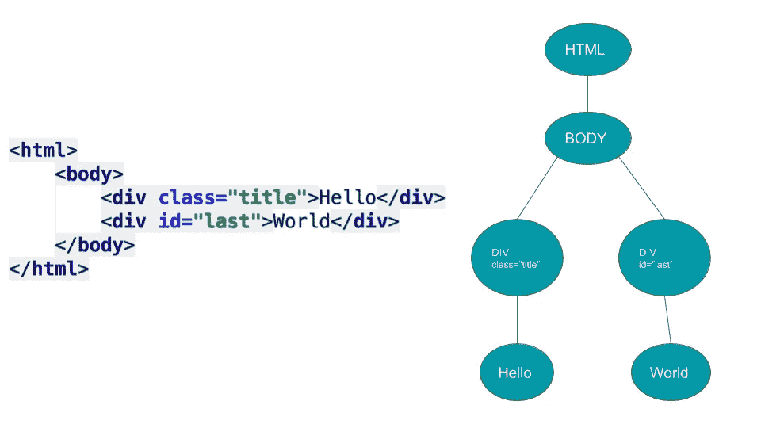

# 构建您自己的 React —逐步指南

> 原文：<https://medium.com/hackernoon/build-your-own-react-48edb8ed350d>


**摘要-** 在这篇文章中，我将一步一步地创建一个完整的工作版本 [react](https://hackernoon.com/tagged/react) 。这不会是一个有效的版本，但它让你一瞥反应如何在引擎盖下工作。如果你熟悉 react / web / dom 等..您可以直接跳到步骤 1。或者，如果你喜欢视频，你可以在 youtube 上查看我的演讲。

**简介**

在编写 react 应用程序之前，和许多其他人一样，我用 angular 编写。关于 angular 的事情是，如果你想成为一名优秀的 angular 开发者，你需要知道 angular 是如何工作的。你知道的越多，你就会越好。但是使用 react，情况似乎不是这样。您将了解类组件和无状态组件。你学习道具和状态，你永远不应该改变道具。然后你了解到，如果你想要一些动态的东西，你可以调用`setState`就差不多了。除了生命周期方法和其他小特性，你不需要太多来编写好的 react 应用。毫无疑问，react vs angular 的学习曲线要小得多。

但是，我成为了一名程序员，因为我喜欢了解事物是如何工作的。是什么让事情运转。不管是国际空间站、特斯拉汽车还是自动售货机。当我看到我感兴趣的东西时，在我开始质疑它的工作原理后不久。react 也是如此。我看到一个关于引擎盖下反应的精彩演讲，我心想..这看起来并不复杂..我可以试试。

**react 到底是什么？**

在我们开始写 react 之前，我们应该知道我们想要构建什么。在我看来，react 是一个构建动态树的库。在 web 用例中，react 将构建一个 DOM 树。然而，它不一定是 DOM。通过 [react native](https://facebook.github.io/react-native/) ，react 构建了 ui 控制器的原生应用层级。你甚至可以在 react 中编写 [arduino 应用](https://github.com/iamdustan/react-hardware)。

什么是 DOM 树？

DOM 代表文档对象模型。每个 html 文档都是由称为“dom 元素”的元素构建的。`*<html>*`是一个 dom 元素。还有`*<div>*`和`*<h1>*`等。树有一个根，通常是 html 标签。树中的每个节点都有自己的属性，并且可能有同样是 dom 元素的子节点。比如说。在下图中，您可以看到 html 文档的一部分及其作为对象树的表示形式。



**简单说说 react 和 jsx**

如果您已经熟悉 react，您可能会使用 jsx。因此，一个简单的组件可能是这样的:

```
const mySimpleComponent = () => {
 return <h1>Hello World</h1>;
}
```

运行 babel 或您喜欢的其他 transpiler 之后，这个组件将如下所示:

```
const mySimpleComponent = () => {
 return React.createElement(‘h1’, null, `Hello World`);
}
```

一个特殊的 babel 插件将把 jsx 调用传输到 react 提供的底层 js api。在我们的例子中，`<h1>`标记被转换成一个`React.createElement`调用，其中第一个参数是标记名，第二个参数是属性，第三个参数是它的孩子。

让我们看一个稍微复杂一点的 jsx 例子:

```
<div style={{color: yellow}}>
  <Title text=`I'm a title`/>
  <Person name=`moki`/>
</div>
```

这将导致:

```
React.createElement(`div`, {style: {color: yellow}},
  React.createElement(Title, {text: `I'm a title`}, null),
  React.createElement(Person, {name: `moki`}, null)
);
```

现在我们已经同步了，我们可以开始构建我们自己的 react。

# **步骤 1- DOM 元素(Hello World)**

首先，我将为我的应用程序创建一个主机 html 文档。它将加载我的`react.js`版本，`app.js`用于应用程序的逻辑，并且它将有一个 id 为`root`的 div 来附加我的 react 应用程序。

我们构建 react 的方式将会是我喜欢称之为 ADD 的方式。它类似于 TDD，但是它代表应用驱动开发，而不是测试驱动开发。在每一步中，我将显示我想要渲染的`app.js`。然后我在`react.js`文件中实现。

我的第一个`app.js`长这样:

step1-app.js

为了让这段代码工作，我需要实现`React.createElement`和`ReactDOM.render`

ReactDOM 是一个独立于 react 的模块，但是为了简单起见，我将它们放在一起编写。

我们开始吧。这是我的`react.js`:

我们的 hello world 正在运行！你可以在这里看到结果[](https://cdn.rawgit.com/ofirdagan/build-your-own-react/2e8bad05/v1-element/index.html)*。*

# ***第二步——渲染非 DOM 元素，或者我们喜欢在 react 中称之为“组件”***

*我们想增加对无状态组件的支持*

*`app.js`:*

*这里唯一改变的是现在`element`可以是一个函数。如果是的话，我们会调用它。*

*`react.js`:*

**** [*结果*](https://cdn.rawgit.com/ofirdagan/build-your-own-react/2e8bad05/v2-non-dom-element/v2-step1/index.html)*

*不是所有的孩子生来都一样。我们希望增加对非纯文本儿童的支持。让我们改进对待孩子的方式。*

*`app.js`:*

*`react.js`:*

*[**结果*](https://cdn.rawgit.com/ofirdagan/build-your-own-react/2e8bad05/v2-non-dom-element/v2-step2-dom-children/index.html)*

***2.3** -增加对类组件的支持*

*`app.js`:*

*就像我们处理无状态组件一样。我们将确定它是否是一个类，如果是，我们将创建一个新的类实例并调用它的渲染函数。*

*`react.js:`*

**** [*结果*](https://cdn.rawgit.com/ofirdagan/build-your-own-react/2e8bad05/v2-non-dom-element/v2-step3-classes/index.html)*

*是时候做一些旧的重构了。我们的`anElement`函数太长了。下面我们摘录一些方法出来。同样，让我们为其他函数创建一个`react-utils.js`，比如`isClass`、`isStatelessComponent`等..*

# ***步骤 3-道具和状态***

*概括地说，到目前为止，我们呈现了 dom 元素、无状态组件和类组件。让我们添加道具和状态*

***3.1-** 无状态组件道具*

*`app.js`:*

*这个很简单。我们只需要将道具传递给组件(函数)*

*`react.js`:*

**** [*结果*](https://cdn.rawgit.com/ofirdagan/build-your-own-react/2e8bad05/v3-props-and-state/v3-step1-stateless-comp-props/index.html)*

***3.2-** 类构件道具*

*`app.js`:*

*你应该注意到`Hello`类现在扩展了`React.Component`。我这样做是为了让我的所有 react 类都有一个公共的父类，以便在类实例上分配道具。*

*`Component`类别:*

*现在我们有了组件类，我们将在构造函数中传递属性，这样就完成了。*

***3.3-** 属性*

*这个简单的组件应该显示一个按钮点击警告。*

*`app.js`:*

*与子节点一样，我们将遍历属性，并将事件侦听器设置为以 on*开头的属性，并将其余属性设置为 attribute。*

*`react.js`:*

**** [*结果*](https://cdn.rawgit.com/ofirdagan/build-your-own-react/2e8bad05/v3-props-and-state/v3-step3-attributes/index.html)*

***3.4-** 重构。`handleHtmlElement`变得太大。我们将提取出`appendChild`和`appendProp`函数。我们也可以使用 lodash 稍微清理一下代码。*

***3.5-** 状态*

*我们已经准备好编写一个真正的 react 应用程序。我们来写一个计数器 app。它将有两个按钮来增加和减少计数器，并将显示当前值*

*`app.js`:*

*为了完成这项工作，我们需要实现`setState`函数。我的简单算法会在每次`setState`调用时删除整个 dom，并再次渲染它。为此，我需要保存对根 react 元素和根 dom 元素的引用。*

*`react.js`*

*接下来，我想保存我已经创建的类，这样当`reRender` 发生时，我就不会再创建它们并丢失我的状态。为了实现这一目标，我将采取以下措施:*

*   *保存实例化类的缓存*
*   *当处理一个类时。如果匹配，则返回缓存的实例*
*   *不要直接调用 render，而是返回一个带有特殊标志的对象，将它标记为 react 类。*
*   *追加子节点时。如果是 react 类，调用它的 render*

*`handleClass`:*

*`handleChild`:*

**** [*结果*](https://cdn.rawgit.com/ofirdagan/build-your-own-react/2e8bad05/v3-props-and-state/v3-step5-state/index.html)*

*就是这样。我们有自己的工作反应。不相信我？看看我从网上下载的这个待办事项应用程序。除了对 real react 和 react-dom 的引用，我没有做任何修改。*

*todo 应用没给你留下太多印象？[这款扫雷游戏](https://cdn.rawgit.com/ofirdagan/build-your-own-react/2e8bad05/v5-examples/v5-step2-minesweeper/index.html)怎么样？*

***现在怎么办？***

*让我们稍微思考一下我给你们展示的内容。我写的 react 版本…好像不是超级高效。每次调用`setState`时，我都清除整个 dom 并从头开始创建它。另外，当有人谈论 react 如何工作时，你首先听到的是神秘的虚拟 dom。我没有在代码中写任何虚的东西，也没有提到它。*

***是时候面对现实了***

*是时候进行一些性能分析了。我用我的反应和真实的反应计算了扫雷游戏第一次渲染的时间。结果会让你大吃一惊。*

*看起来我的 react 比真实的 react 做得好 2.5 倍。但是让我们耐心等一会儿。如果我们继续玩，我们可以看到每一个`setState`完成所花的时间。我的 react 需要 2-8 毫秒，而真正的 react 需要 0.01 毫秒。这种差异就是为什么我们喜欢 react 并经常使用它。除了超级直观，简单易学之外，它非常快，而且越来越快。*

***react 算法***

*首先是我的算法:每次重新渲染时*

*   *清除 dom*
*   *从头开始呈现 DOM*

*如果我们看代码，我们会发现我们写的所有东西都是 javascript。我们没有使用任何 html 或其他语言。如果我们不是直接创建 dom 元素，而是保留一个由 javascript 对象构成的 dom 树模型，那又会怎样呢？将我们的 DOM 表示为 javascript 对象非常容易，对吗？我们一开始就看到了。*

*所以更好的算法是:*

*   *在 js 树模型上调用 render*
*   *读取当前 dom*
*   *找出变化*
*   *仅在 dom 上应用这些更改*

*这会让事情变得更快。但我们比那更聪明。我们希望尽可能减少对 dom 的读写。我们已经有了一个 js 树模型(让我们从现在开始称之为虚拟 dom ),它反映了我们的 dom 应该是什么样子。*

*所以我们可以有一个更好的算法。在重新渲染时，这里的想法是有两个虚拟 dom，一个总是代表当前的 dom，另一个将代表未来的 DOM。在 reRender 上:*

*   *创建新的虚拟 dom*
*   *找出它和当前虚拟 dom 之间的区别(两个 js 树之间的区别可以很快完成)*
*   *仅应用真实 dom 上的更改*

*将差异合并到真正的 dom 树中的过程称为协调。这就是 react 真正的工作方式。*

***纤维***

*你可能听说过`fiber`。纤程是 react 的人正在研究的新的协调算法。应该很快就出来了。光纤背后的想法很简单。到目前为止，协调过程是线性的。一旦开始，你就无法停止。光纤旨在改变这种情况。它的动机是优先权。我们意识到有些变化比其他变化更重要。例如，如果您有一个需要更改的文本节点和一个需要绘制的动画。重要的是你要先画出动画，否则用户会注意到 ui 滞后。如果文本节点在几毫秒的延迟后改变，用户不会注意到。纤程有一个内置的中断机制。把它想象成一个暂停按钮。在和解期间的任何给定时刻。React 可以告诉 fiber 暂停，进行动画等其他计算，然后继续。这将使我们的应用程序看起来更加流畅。*

*它的美妙之处在于它对开发者完全透明。协调算法是一个实现细节。我们从我自己糟糕的实现中看到了这一点。这些应用程序工作正常，但不是很好..react API 的简单性和实现的复杂性使得它成为如此强大的工具。*

*你在这篇文章中看到的所有代码都可以在[这里](https://github.com/ofirdagan/build-your-own-react)找到。如果你有任何问题或只是想打声招呼，请在推特上联系我，电话:)*