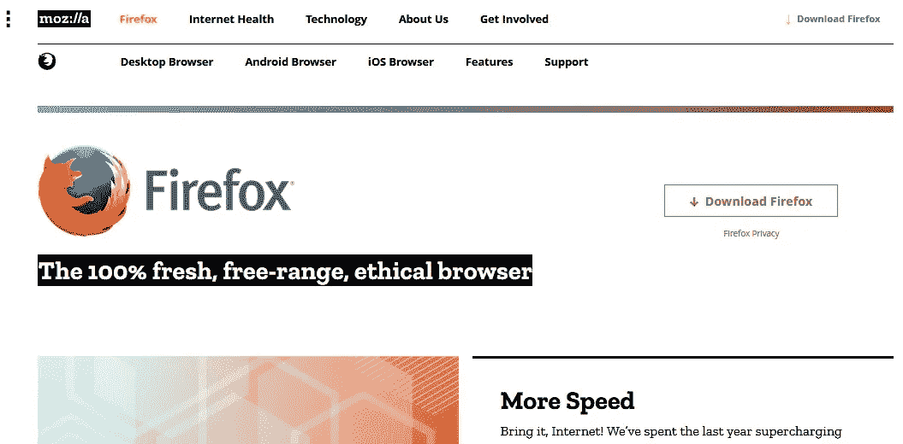
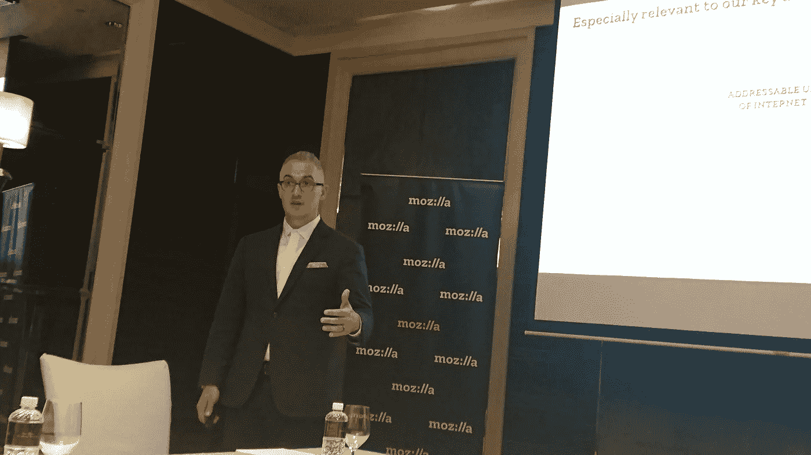
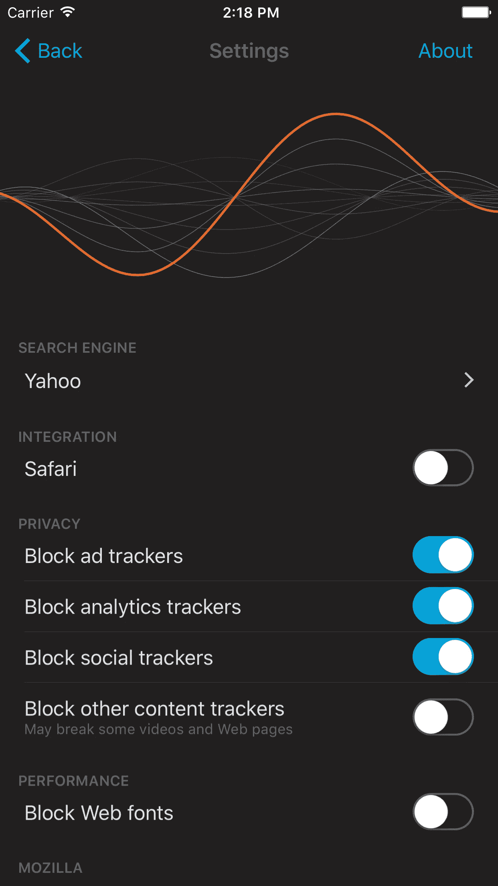

# 建立一个更好的网站

> 原文：<https://medium.com/hackernoon/building-a-better-web-3cf1a36a1f48>

Medium 的创始人 Ev Williams 最近在一份 [NYT 报告](https://www.nytimes.com/2017/05/20/technology/evan-williams-medium-twitter-internet.html?mcubz=2&_r=0)(2017 年 5 月)中分享了“互联网被打破了”。威廉姆斯还在博客中写道，广告支持的媒体在线背后的商业模式是一个“破碎的系统”(2017 年 1 月)。

首先，各种当前的平台可以被建立以允许和奖励有趣的并且可能是坏的用户行为，例如不准确的新闻报道和假新闻的传播以及不利于净正面利益的欺骗网站。其次，也是最重要的一点，Williams 认为，当前的生态系统以及互联网在内容创作、分发和货币化方面的工作模式可以做得更好。

对于公司来说，有没有更好的方法来帮助实现良好的用户行为，并建立和“运行”一个更好的网站？

Mozilla 是这么认为的。

**互联网健康状况**

在 Mozilla 的首份[互联网健康状况报告](https://internethealthreport.org/v01/)(2017 年 1 月发布)中，开源倡议旨在帮助防止勒索病毒感染和数据泄露，并帮助阻止不准确的新闻报道(或假新闻)的扩散。

2015 年，Mozilla 与多方合作推出了 *Let's Encrypt* 。 *Let's Encrypt* 提供了一个新的证书颁发机构，可以轻松免费地将 HTTPS 添加到任何网站，有助于保护用户的隐私，并为互联网用户提供一些保证，确保他们不会访问欺骗页面。通过这一举措，2400 万个网站现在被“认证”可以更安全地使用。

Mozilla 也有 *Rust* ，这是一种开源的[编程](https://hackernoon.com/tagged/programming)语言，它由 1500 名贡献者开发，专门用于确保防止几种主要类型的[安全](https://hackernoon.com/tagged/security)漏洞，例如臭名昭著的 Heartbleed 漏洞。

互联网协会新加坡分会的 Harish Pillay 分享了他对互联网和互联网安全状况的看法:“互联网很好，在端点保持智能的设计是成功的关键。终端的安全性—浏览器、服务器、笔记本电脑等需要继续成为教育和培训的重点。这是我们都必须面对的挑战。跳到下一个新的闪亮工具是一回事，但知道它是否真的构建正确且安全是另一回事。”

“容器技术和平台(OpenShift、Kubernetes 等)的快速发展将改变我们消费技术以提供价值的方式。通过自动检查安全凭证来了解您正在使用的容器中有什么，这意味着我们可以减少和阻止不良行为者，并减少不可避免的错误。”

**打造“最佳浏览器”**

作为一个非营利组织，Mozilla 相信倡导一个用户可以塑造自己的体验，每个人都被赋予权力、安全和独立的互联网——依靠开源平台以及信任和透明的价值观。

在这方面，以其 Firefox 浏览器而闻名的 Mozilla 继续追求让网络成为一个更好的网络，一个所有人都可以访问的网络，正如它在愿景中提到的那样，继续打造“最好的浏览器”。

“Firefox 是我所有设备上的默认浏览器，包括 Android、Fedora 笔记本电脑/台式机。我特别喜欢这个任务——他们在让网络变得更好方面做得很好。这并不容易。但是过去几年的许多战斗——使用 Flash 等——现在已经成为历史的注脚。我希望他们继续专注于做正确的事情，这将使 T2 成为我们所需要的与众不同的地方。

Mozilla 目前在全球可寻址互联网用户中占有 15%的市场份额，拥有 3 亿 Firefox 用户，“Mozilla 建立在在线隐私、数据保护和用户信任的原则之上。除了更快更稳定之外，火狐 53.0 版还为用户提供了更大的隐私和安全性，并有助于实现更健康的互联网，”Mozilla 首席营销官 Jascha Kaykas-Wolff 在最近的亚洲新闻发布会上表示。

在宣布其战略计划时，Mozilla 将依靠移动增长作为其核心战略，并通过投资新兴技术研究来摆脱仅仅因 *Firefox* 而闻名的局面。

【2015 年 11 月推出的 IOS 版火狐是其产品组合中增长最快的产品，拥有 155 个国家和 50 多种语言的用户，而 2012 年 12 月推出的安卓版*火狐*下载量超过 1.75 亿次，并以 80 多种语言进行了本地化，后者被评为安卓上的顶级浏览器和最可定制的移动浏览器。

作为反对数据跟踪和挖掘的坚定倡导者，其于 2016 年 11 月为 iOS 用户推出的 *Firefox Focus* 移动网络浏览器允许用户默认阻止广告追踪器，并删除一个人的浏览历史，包括密码和 cookies。它现在有 27 种语言版本，Android 版本将在未来几个月发布。Android 版本的小下载量是为新兴市场优化的。

2016 年末，Mozilla 启动了量子项目(Project Quantum)以开发 Mozilla 的下一代网络引擎，目标是在 2017 年底前为用户提供性能和其他重大改进。随着火狐 53.0 版本的发布，Mozilla 已经开始发布其浏览器引擎的核心部分，其中也包括 *WebAssembly* ，它允许 web 应用程序在没有插件的浏览器中运行。

Mozilla 为下一代开放网络开发的所有技术都有助于它努力为所有人建立一个更好、更安全的互联网。尽管如此，企业在这个生态系统中仍有一席之地——抛开“唯利是图”的利益，更多的行业领导者需要考虑主动承担责任，将建设更好的互联网作为其业务利益的一部分。

推特[@范拉德](http://www.twitter.com/vanradd)

凡妮莎·拉德是 XR 联盟的创始成员。**XR****联盟**建立技术联盟，推动行业在 VR/AR/XR 领域的发展 [@xrforce](http://www.twitter.com/xrforce) 。

撰写关于虚拟现实/增强现实/磁共振、新兴技术、智能国家、技术领先和合气道的文章

> [黑客中午](http://bit.ly/Hackernoon)是黑客如何开始他们的下午。我们是 AMI 家庭的一员。我们现在[接受投稿](http://bit.ly/hackernoonsubmission)并乐意[讨论广告&赞助](mailto:partners@amipublications.com)机会。
> 
> 如果你喜欢这个故事，我们推荐你阅读我们的[最新科技故事](http://bit.ly/hackernoonlatestt)和[趋势科技故事](https://hackernoon.com/trending)。直到下一次，不要把世界的现实想当然！

