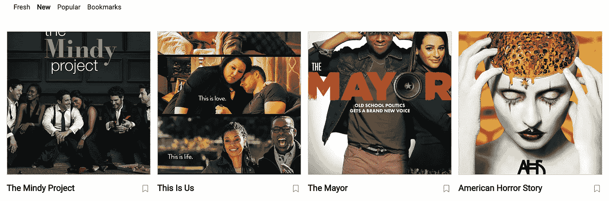

# 使用 truffle、React、Next.js 和 MobX 构建区块链 DApp(第二部分)

> 原文：<https://medium.com/hackernoon/building-a-blockchain-dapp-using-truffle-react-next-js-and-mobx-part-2-847193b497e4>



这是第二篇带领你使用 truffle、React、Next.js 和 MobX 构建一个[区块链](https://hackernoon.com/tagged/blockchain) DApp 的文章。

作为一个快速提醒，我们将使用区块链([以太坊](https://hackernoon.com/tagged/ethereum))作为一种有效的方式来处理用户和他们喜爱的电视节目的映射。

该应用程序显示了来自非官方 API 的烂番茄列表。分为三类:新鲜，新，流行。

应用程序“书签”中的一个特殊部分显示了当前存储在区块链上的用户最喜爱的节目列表。

用户可以在他们的书签部分添加或删除节目。每次用户添加或删除节目时，都会调用智能合约功能，并将更改存储在区块链上。

前端应用程序是由 [Next.js](https://github.com/zeit/next.js/) 支持的服务器端渲染 React 应用程序，对于状态管理，我们将使用 M [ob](https://mobx.js.org/) X，样式和布局将来自令人敬畏的 [tachyons](http://tachyons.io/) 项目，为了与区块链交互，我们将在 solidity 中编写一个智能联系人，用 JavaScript 为其编写测试，并使用 [truffle](http://truffleframework.com/) 在本地部署它。

在[上一篇文章](https://hackernoon.com/building-a-blockchain-dapp-using-truffle-react-next-js-and-mobx-part-i-c46d218f4bdf)中，我们回顾了充当我们的应用后端逻辑和存储的智能合约的实现。在本帖中，我们将重点讨论如何使用 React 构建 UI，以及如何在浏览器中调用智能合约上的操作。

在这篇文章中，我将详细介绍:

1.  设置开发环境
2.  编写我们的后端 API
3.  编写我们的 React 组件
4.  编写我们的 MobX 存储来处理应用程序状态的变化。
5.  编写将调用我们的智能契约公共 API 的区块链服务。

## 设置开发环境

在开始之前，请确保您已经安装了 node、git 和 nvm。

首先我们需要安装 TestRpc 和 Truffle:

*   `npm install -g ethereumjs-testrpc`
*   `npm install -g truffle`

现在克隆应用程序并安装依赖项:

```
//clone the repo
git clone [git@github.com](mailto:git@github.com):liors/tvdapp.git// Navigate to within the directory
cd tvdapp//install dependencies
yarn install//start the development server
yarn dev
```

在新的终端窗口中启动本地区块链网络:

```
testrpc
```

现在我们需要编译和迁移我们的智能契约运行:

```
yarn run blockchain
```

一旦你运行了以上所有的推荐，你就可以在[打开你的浏览器 http://localhost:3020/TV/fresh](http://localhost:3020/tv/fresh)并查看应用的本地版本。

## 我们的后端 API

Next.js 带有默认的 express 配置。在某些情况下，这很好，在我们的例子中，我想将路由添加到我们的 API 请求中，所以我使用了一个定制的 express 服务器。

在/server 下，您可以找到两个文件 index.js 和 api.js

让我们看一下 index.js

我们的 API 有 3 个端点:

1.  /api/shows/new
2.  /API/显示/流行
3.  /API/显示/新鲜

它们都使用我们从 api.js 导出的相同的 api.get 函数。此外，我们将一些 get 请求别名到我们的 main /tv/fresh 路由，因此当用户访问/ or /tv 时，我们将他重定向到我们的/tv/fresh 页面。所有其他请求，即' * '将由 next.js 默认路由处理。

我们后端代码的最后一部分是从[烂番茄](https://www.rottentomatoes.com/)获取内容，并用来自 [tvmaze](http://tvmaze.com) 的图像丰富返回数据。

让我们看一下 api.js

我们导出一个接收类型的 get 函数。然后，我们发出请求，并将结果映射到标题和 URL 的数组中。

IMO [tvmaze](http://tvmaze.com) 提供了质量更好的图像，所以让我们通过为每个节目获取一组图像来丰富我们的 API。

Async/await 语法有助于我们避免嵌套回调，并有望创建一个可读性更好、更干净的代码。

我们的 get 函数返回一个包含 JSON 对象数组的承诺，每个对象包含一个标题和一个 img 对象。

## 我们的 React 组件

Next.js 提供了一个非常简单的 routes API。您只需要创建一个 pages 文件夹，该文件夹下的每个文件都将成为为该路径呈现的主要 react 组件。例如/pages/index.js 将是您的应用程序主页，即默认路径/。

在我们的例子中，主页面路径位于/pages/tv/fresh.js 下

Next.js 还通过引入一个名为 [getInitialProps](https://zeit.co/blog/next) 的新生命周期函数，提供了一种在服务器和客户机上获取数据的方法。当实现它时，我们必须返回一个解析为 JavaScript 对象的`Promise`,然后这个对象填充组件的`props.`

我们首先调用我们的 API — /api/tv/fresh，并用结果显示启动我们的存储。然后，该函数返回我们的组件 props: shows，以及我们是否在服务器上渲染结果。

我们的渲染函数非常简单——我们只需渲染一个页面组件，并传递给它两个属性:type 和 store。

我们所有的页面/路线看起来非常相似，不同的是页面类型和商店，其中包含给定类型的相关节目。

让我们看看我们的页面组件。

该组件使用两个附加组件——我们的应用程序导航和节目网格。所选页面是当前的道具类型。我们的渲染功能是用 MobX 提供者包装的，因为这是我们应用程序的主要组件。

这个组件还有另一个职责。只有在客户端上运行时，即在 React 的`componentDidMount`函数中，我们才设置我们的 web3 实例，一旦完成，我们就向我们的智能合约发出请求，以获取已经被书签标记的节目。一旦这个请求被解决，我们更新我们的商店，这导致我们的应用程序重新呈现，如果需要的话。

让我们看看我们的主 UI 组件 shows.js

我们的渲染功能使用了来自 [tachyons.io](http://tachyons.io/components/collections/square-title-subtitle/index.html) 的“方形标题字幕”布局。为了让我们的应用程序识别这些 css 类(例如 cf、w-100、pa2-ns 等)，我们需要包含 tachyons css 文件。

Next.js 通过创建一个 _document.js 提供了一种定制由服务器生成的主 html 的方法，它允许您返回一个包含 head 标签的 html 块。

在我们的例子中，我们将设置视口并包含一些我们使用的外部资源——字体、css 文件和 web3 库。

```
<Head>
   <meta charSet='utf-8' />
   <meta name='viewport' content='initial-scale=1.0, width=device-width' />
   <link href='//fonts.googleapis.com/css?family=Roboto' rel="stylesheet" />
   <link href='//cdnjs.cloudflare.com/ajax/libs/tachyons/4.8.1/tachyons.min.css' rel='stylesheet' />
   <link href='//cdnjs.cloudflare.com/ajax/libs/nprogress/0.2.0/nprogress.min.css' rel='stylesheet' />
   <script src='/static/js/web3.min.js'></script>
</Head>
```

回到我们的节目组件——一旦我们呈现了我们的节目，我们需要为已经被书签标记的节目和没有被书签标记的节目显示不同的 SVG。我们通过查看我们商店中的书签展示系列来做到这一点:

```
isBookmarked = show => some(this.props.store.bookmarkedShows, show)
```

有些是一个 [lodash](https://lodash.com/docs/4.17.4#some) 函数，它检查在这个例子中的【identity 是否为**的任何**元素(在我们的例子中是我们的节目列表)返回 true。

现在我们需要实现书签操作。我们通过用锚标记包装 title/subtitle/bookmark SVG 元素并在其上定义 onClick 函数来实现这一点:

```
handleBookmark = show => this.props.store.bookmark(show)
```

我们的最后一个 react 组件是通知组件，它向用户提供一个指示，表明一个节目被添加/从区块链中删除，您可以在/components/notification.js 下找到它

## 我们的 MobX 商店处理应用程序状态变化

正如我们在组件实现中看到的，我们没有任何`this.setState()`调用来重新呈现组件或获取请求以获取/更改数据。我们的 MobX 商店为我们处理这个问题，并为我们提供 UI 所需的核心 API。

我们商店支持以下行动:

1.  书签——这充当我们的 UI 的书签/移除动作的切换。
2.  setBookmarkShows —设置来自区块链的初始书签显示。
3.  hideboorknotification——这有助于在需要时隐藏通知组件。

让我们更详细地看看我们的书签功能。

我们首先检查所提供的节目是否已经被书签标记——如果没有，我们使用 blockChainService 的 bookmarkContract 函数。作为一个参数，该函数获得一个 JSON，表示要添加书签的节目——该 JSON 将存储在区块链上。

一旦请求得到解决，我们就将节目添加到我们的 observable shows 数组中，打开通知标志并设置适当的动作类型——这将有助于通知组件显示适当的文本。

要删除/拒绝已经被书签标记的节目，我们调用 rejectBookmarkContract 并从我们的可观察节目数组中过滤掉该节目。

## 我们的区块链服务调用我们的智能契约公共 API

我们到了应用程序的最后一部分，这个服务使用以太坊的 web3 来调用智能合约上的远程功能。让我们看看服务 getBookmarks 是如何实现的:

```
let getBookmarks = function () {
   return new Promise((resolve, reject) => {
      let instance
      getBookmarkInstance()
         .then(result => ({instance} = result))
         .then(() => instance.getBookmarks.call())
         .then(bookmarks => {
            resolve(bookmarks && JSON.parse(bookmarks.toString()))
         })
      })
}
```

为了调用任何智能契约功能，我们需要获得可用的 web3 实例。我们通过从 truffle-contract 导入 BookmarkArtifact 和 contract 函数来实现这一点

```
import BookmarkArtifact from '../build/contracts/Bookmark'
import contract from 'truffle-contract'
```

然后，我们为工件提供契约函数，并将其提供者设置为当前的 web3 实例当前提供者。

```
const Bookmark = contract(BookmarkArtifact)
Bookmark.setProvider(web3Instance.currentProvider)
```

一旦我们这样做了，我们就可以获得帐户并返回第一个帐户的已部署实例。

```
web3Instance.eth.getAccounts((error, accounts) => {
   const account = accounts[0]
   Bookmark.deployed().then((instance) => {
      resolve({ instance, account })
   })
})
```

好了，回到 getBookmarks 函数。一旦有了实例，我们就可以调用我们的智能契约公共 API。在这种情况下，我们需要获得我们的书签显示，即调用 getBookmarks

```
instance.getBookmarks.call()
   .then(bookmarks => {
      resolve(bookmarks && JSON.parse(bookmarks.toString()))
   })
```

结果将是一个字符串，我们解析它并将其转换成一个 JSON 对象。

给一个节目做书签看起来非常相似。我们首先获取一个实例，然后调用我们的书签函数，在这种情况下，我们需要提供一些额外的信息——这个操作是从哪个帐户发生的。

```
instance.bookmark(JSON.stringify(blockchainBookmarks), { from: account })
    .then(showId => instance.getBookmarks.call())
    .then(bookmarks => {
        resolve({ data: JSON.parse(bookmarks.toString()) })
    })
```

就这样，我们的应用程序完成了。

总而言之，我们一直在使用 React、Next.js、MobX 和 truffle 来构建一个服务器端渲染 React DApp。我希望你可以利用这个简单的设置在区块链上开始自己的开发。

github 上有完整的代码，如果你喜欢，请开始回购！

该应用的一个实时版本部署在[这里](https://tvdapp.herokuapp.com)——请确保你的浏览器可以运行 DApps，我一直在使用 [MetaMask](https://metamask.io/) chrome 扩展。

感谢阅读。希望这对你有帮助。