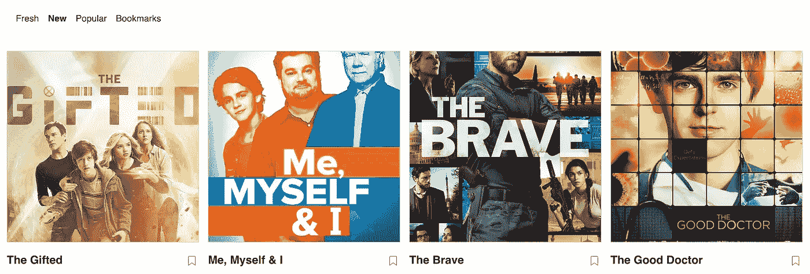

# 使用 truffle、React、Next.js 和 MobX 构建区块链 DApp(第一部分)

> 原文：<https://medium.com/hackernoon/building-a-blockchain-dapp-using-truffle-react-next-js-and-mobx-part-i-c46d218f4bdf>



Screenshot from the live app.

这篇文章将带领 React 开发者在[区块链](https://hackernoon.com/tagged/blockchain)上构建你的第一个分布式应用。

似乎科技行业的每个人(几乎每个人)都在谈论[、比特币](https://hackernoon.com/tagged/bitcoin)、区块链和分布式应用。这引起了我的兴趣，所以我想使用这种技术构建一些有用的东西，以更好地了解这一领域的挑战和机遇。这篇文章是描述我构建第一个分布式以太坊区块链应用程序的经历的两篇文章中的第一篇。

我将介绍构建智能合约所需的步骤，如何编译并将其部署到本地区块链网络，以及如何构建服务器端渲染 React 应用程序，以便与我们的合约进行交互。

在进入代码之前，我建议大家在继续之前，先浏览一下松露网站上的[以太坊概述](http://truffleframework.com/tutorials/ethereum-overview)。

在这篇文章中，我将回顾:

1.  设置开发环境
2.  编写和测试智能合同
3.  编译和部署我们的智能合同

## [我们的 DApp](https://tvdapp.herokuapp.com) ( *分散应用)*

由于秋季电视季刚刚在美国开始，我们希望使用区块链(以太坊)作为一种有效的方式来处理用户和他们喜爱的电视节目的映射。

该应用程序显示了来自非官方 API 的烂番茄列表。分为三类:新鲜，新，流行。

应用程序“书签”中的一个特殊部分显示了当前存储在区块链上的用户最喜爱的节目列表。

用户可以在他们的书签部分添加或删除节目。每次用户添加或删除节目时，都会调用智能合约功能，并将更改存储在区块链上。

前端应用程序是由 [Next.js](https://github.com/zeit/next.js/) 支持的服务器端渲染 React 应用程序，对于状态管理，我们将使用 M [ob](https://mobx.js.org/) X，样式和布局将来自令人敬畏的 [tachyons](http://tachyons.io/) 项目，为了与区块链交互，我们将在 solidity 中编写一个智能联系人，用 JavaScript 为其编写测试，并使用 [truffle](http://truffleframework.com/) 在本地部署它。

## 设置开发环境

在开始之前，请确保您已经安装了 node、git 和 nvm。

首先我们需要安装 TestRpc 和 Truffle:

*   `npm install -g ethereumjs-testrpc`
*   `npm install -g truffle`

现在克隆应用程序并安装依赖项:

```
//clone the repo
git clone [git@github.com](mailto:git@github.com):liors/tvdapp.git// Navigate to within the directory
cd tvdapp//install dependencies
yarn install
```

## 实施智能合同

我们的应用程序使用区块链来存储用户最喜欢的节目。为了做到这一点，我们需要实现一个智能契约，作为其后端逻辑和存储。

在/contracts 目录下，可以找到一个 Bookmark.sol 文件:

如果你是 solidity 的新手(像我一样)，他们的 docs [站点](http://solidity.readthedocs.io/en/develop/solidity-by-example.html)有一个“solidity by example”部分，我觉得非常有用。

关于合同的一些事情。我们首先声明一个我们称之为书签的契约。该契约有两个公共 API。

1.  书签——除了表示节目的字符串。我选择存储一个将在我们应用程序 UI 中重用的 JSON。作为另一种方法，可以将引用 ID 存储到某个外部存储器中。
2.  get bookmarks——它将返回每个帐户的节目数组。

## 测试智能合约

您可以用 solidity 或 JavaScript 编写智能合约的测试。

对于 JavaScript 测试，Truffle 使用 [Mocha](https://mochajs.org/) 测试框架和 [Chai](http://chaijs.com/) 进行断言。

在/tests 目录下，您可以找到 bookmark.js 文件:

为了运行测试，您首先必须有一个 testrpc 的本地实例。一旦您的 EthereumJS TestRPC 会话开始，您就可以执行测试:

```
yarn test
```

让我们来回顾一下我们想要涵盖的案例:

1.  一种情况是，客户请求为一个节目添加书签，在这种情况下，我们首先获取合同的实例，然后调用公共 API“bookmark ”,该 API 将一个字符串作为第一个参数，并调用一个包含“from”属性的配置对象。然后，我们调用第二个 getBookmarks 公共 API，结果我们得到一个承诺，该承诺在解析时应该包含我们传递给 bookmark 函数的 show (string)。
2.  一个客户请求为一个节目列表添加书签的例子——与我们的第一个用例相同，但是现在我们想确保我们可以存储一个节目列表，因此我们将首先通过传递一个 JSON 对象数组为一些节目添加书签，并调用我们的 get 书签函数来验证我们的智能合同是否有效。

## 将我们的智能合同部署到本地区块链

我们刚刚实现并测试了我们的 Bookmark Smart Contract，是时候编译它并将其迁移(部署)到我们的测试网络中了。

## 汇编

坚固性是一种编译语言，这意味着我们需要将我们的坚固性编译成字节码，以便以太网虚拟机(EVM)执行。

1.  启动一个新的终端窗口，并调用我们全局安装的 testrpc 模块:

```
testrpc
```

这将启动一个本地的区块链以太网实例。

2.现在，让我们编译我们实现的智能合同:

```
truffle compile
```

这将编译我们的。sol 文件。您应该在 build/contracts 文件夹中看到作为 JSON 文件的编译输出。

## 部署/迁移

我使用了您运行块菌初始化时提供的默认迁移文件。您可以在/migrations/1 _ initial _ migration . js 下找到它。

在/migration 文件夹下，您还可以找到 2_deploy_contracts.js。该文件需要我们的智能合同，即 Bookmark.sol，并将其部署:

```
const Bookmark = artifacts.require('./Bookmark.sol')module.exports = deployer => deployer.deploy(Bookmark)
```

要执行此脚本，请运行:

```
truffle migrate
```

我们刚刚将合同部署到本地 Blockchain 网络！

在下一篇文章中，我们将浏览一下我们的 React 应用程序，看看我们如何使用 Next.js、MobX 和 web3.js 构建一个与我们刚刚实现的智能合同交互的用户界面。

该应用程序的完整代码可在 [github](https://github.com/liors/tvdapp) 上找到。

该应用的实时版本已经部署在这里——请确保你的浏览器能够运行 dapp，我一直在使用[元掩码](https://metamask.io/) chrome 扩展。

谢谢你的阅读。希望这能有所帮助。