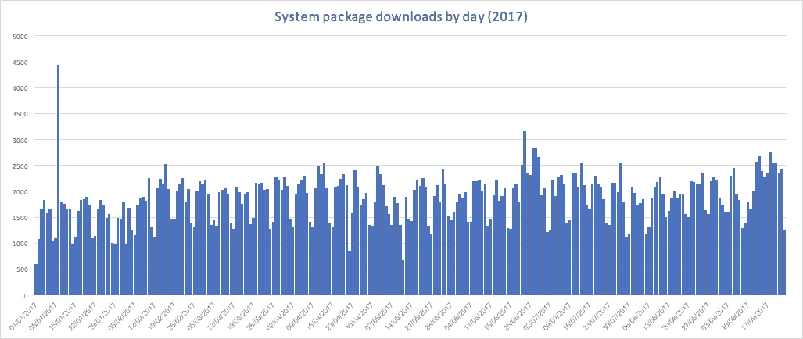
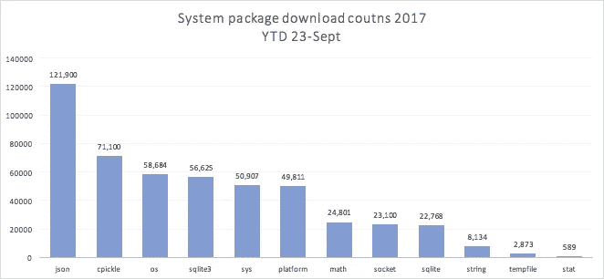
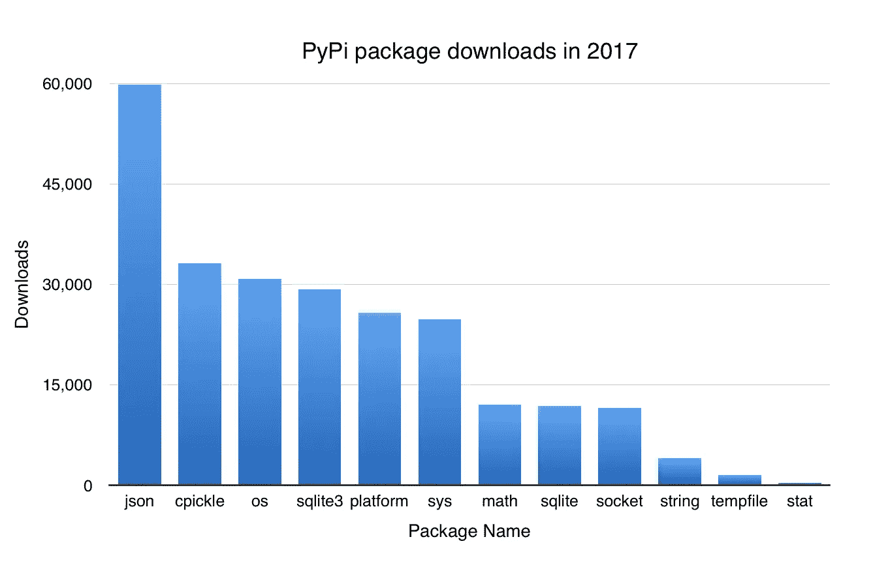

# 在 PyPi 上构建僵尸网络

> 原文：<https://medium.com/hackernoon/building-a-botnet-on-pypi-be1ad280b8d6>

*或者能够*

## 最新消息—2017 年 9 月

大约一周前，一些学生将这一概念应用于拼写错误(用与流行库相似的名称注册恶意包)的想法。通过让一所大学发布安全通知，他们产生了一些兴趣，并最终导致对 pypi/warehouse 进行一些更改来解决这些问题。

我决定再看一下我的包的下载量，看看我的恶意化身会造成什么样的损害。



在我托管的 12 个系统模块包中，通过 pip，我平均每天获得 1500 次下载。今年到目前为止，总共下载了 491，292 次。我希望在我的包被删除之前达到 50 万次下载！

从软件包来看，下载率与 5 月份的数据非常吻合:



有一个计划删除我的假包，现在已经增加了限制，以防止这种攻击，但它是有趣的，而它持续下去！

## 介绍


在去年 10 月的伦敦 python Dojo 上，我们发现 PyPi 允许用内置模块名注册包。

那又怎样？你可能会问。谁会安装系统软件包？故事大概是这样的:

1.  一个没有经验的 Python 开发者/部署者意识到他们需要 X 功能
2.  通过搜索/询问，他们发现人们使用`pip`来安装软件包
3.  开发人员愉快地输入例如`pip install sys`
4.  Baddie 已经注册了`sys` pip 模块，并且包含了一个恶意的有效载荷
5.  开发者现在被恶意包 pwn 了，但是 python 中的`import sys`起作用了，导入了一个功能 sys 模块，所以没人注意到。

当我们发现这一点时，我对它作为攻击媒介的可能性非常感兴趣，所以做了几件事:

1.  向 pypi 上列出的 pypi [安全](https://hackernoon.com/tagged/security)联系人发送电子邮件
2.  主动注册所有我能想到的通用系统模块名，作为包
3.  给他们每个人上传了一个空包，除了立即追溯之外，它什么也不做:

```
raise RuntimeError("Package 'json' must not be downloaded from pypi")
```

## 为什么要上传东西？

完全有可能蹲在 pypi 包上而不上传任何文件。但是通过添加一个空的包，我可以从 pypi 下载统计中跟踪下载。

Pypi 将他们的访问日志(sans 识别信息)上传到 [google big query](https://cloud.google.com/bigquery/) ，这非常棒，让我们可以很好地了解每个包最终在多少个系统上。

## 这种攻击媒介的效果如何？



大查询说，今年到目前为止(2017 年 5 月 19 日)，我的虚拟包已经被下载了~244k 次，幸运的是它们是良性的，否则就是 40 万台被感染的机器！

一些下载将是人们使用定制的刮刀，其他的可能是自动构建作业，一遍又一遍地运行，但是我使用了一些策略来衡量这些数据的质量:

1.  pypi 下载日志包括一个列`installer.name`，这看起来相当于一个 HTTP 用户代理字符串，通过只选择 installer.name 为`pip`的行，我们更有可能计算实际安装，而不是抓取器或其他机器人
2.  另一个专栏:`system.release`跟踪非常高级的系统版本信息(例如`4.1.13–18.26.amzn1.x86_64`)通过将此包括在计数中，我们可以看到许多不同类型的安装程序正在下载这些包，这表明不只是少数几个机器人在抓取网站。今年有 31k 个不同的系统版本下载了我的包，相比之下，整个 pypi 总共有 33k 个不同的版本

我使用的查询如下:

## 现在怎么办？

实际上，我从未收到过对我邮件的回复，所以过了一会儿，我在一月份的官方 [pypi github 问题跟踪器](https://github.com/pypa/pypi-legacy/issues/585)上提出了一个问题。这也没有得到答复。

我目前占用了所有看起来风险最大的系统包名称，并且是用良性包来这样做的，所以我现在看不到披露这些的风险。

[](http://bit.ly/HackernoonFB)[](https://goo.gl/k7XYbx)[](https://goo.gl/4ofytp)

> [黑客中午](http://bit.ly/Hackernoon)是黑客如何开始他们的下午。我们是 [@AMI](http://bit.ly/atAMIatAMI) 家庭的一员。我们现在[接受投稿](http://bit.ly/hackernoonsubmission)并乐意[讨论广告&赞助](mailto:partners@amipublications.com)机会。
> 
> 如果你喜欢这个故事，我们推荐你阅读我们的[最新科技故事](http://bit.ly/hackernoonlatestt)和[趋势科技故事](https://hackernoon.com/trending)。直到下一次，不要把世界的现实想当然！

