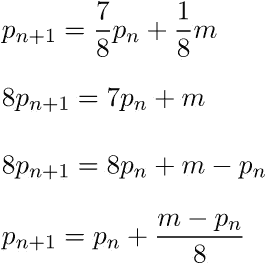
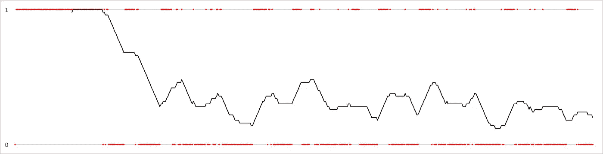
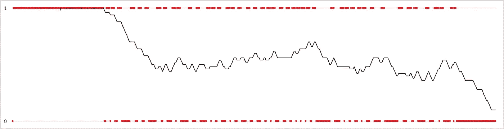
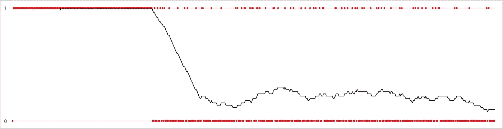

# 在 C++中构建混合自旋互斥体

> 原文：<https://medium.com/hackernoon/building-a-c-hybrid-spin-mutex-f98de535b4ac>

> 咚咚。“比赛条件。”“谁在那里？”

在加州大学洛杉矶分校的宿舍里洗衣服是赌博和冷战策略的一课。舞台上摆放着一百名大学生、两台洗衣机和两台烘干机。首先你注册了一个时间段。到时候，你注意到两个洗衣机都已经装满了别人的旧衣服。你发着牢骚，把它们从洗衣机里拖到烘干机里，然后开始洗衣服。然后你去吃午饭，希望回来时衣服还在。当你回来的时候，衣服还在，但是现在在其中一个烘干机上面是一团水滴，而且四台机器都在运转。你每半小时检查一次房间，直到有一个烘干机出来。三个小时，七趟之后，你的衣服洗干净了，还有一只你在路上不知怎么弄来的外国黄袜子。

我一点也不知道宿舍洗衣会让我为异步软件开发的世界做好准备。

在办公室，我正在教一只单线程狗一些多线程的技巧。这需要使用互斥锁来封锁关键部分，避免共享资源被占用。我一直在玩两种类型的互斥体，它们在线程等待锁定时的行为是不同的。

## 阻塞互斥

一个*阻塞*互斥体将会暂停线程，直到它被获取。它很有用，因为它在被阻止时消耗的计算机资源可以忽略不计。这使得 CPU 可以自由执行其他任务，包括当前拥有互斥体的任何其他任务。然而，所有这些好处并不便宜:阻塞线程需要相当长的时间。如果您的关键部分很简短，您可能会花费过多的时间来保护它，而不是运行它。

一般来说，当你的关键部分需要一段时间时，比如 I/O 操作，调用操作系统，或者在大学宿舍洗衣服，应该使用阻塞互斥。

## 旋转互斥体

一个*旋转*互斥体将进入一个无限循环(旋转)直到被获取。它很有用，因为一旦获得锁，它可以很快恢复，从而在保护关键部分的同时产生最小的开销。但是，由于线程在 CPU 上保持活动状态，它可以减少(或消除！)CPU 做其他工作的能力。如果您的关键部分很长，您可能会花费过多的时间来保护它，而不是运行它。

通常，当您的临界区很短时，应该使用 spin 互斥体，例如读取或写入驻留在内存中的数据结构。

## 找到中间立场

两种互斥行为之间的二分法让我不止一次陷入困境。如果我试图保护一个偶尔需要调用操作系统的全局资源，该怎么办？在这些情况下，阻塞互斥体并不适合，因为修改内存驻留结构非常快。然而，旋转互斥体同样不好，因为 I *确实*需要一次又一次地进入操作系统，而且在这样做的时候占用 CPU 是一件很麻烦的事情。

我们在找什么？理想情况下，我们应该有一个互斥体来完成这两项工作:它会运行一段时间以期待一个快速锁，但是如果时间太长，最终会阻塞线程，释放 CPU。对于我上面的场景，这将是一个完美的解决方案:大多数锁将在 spin 阶段获得，但是如果资源被延迟(比方说，因为 OS 调用是必要的)，线程将会阻塞。

能做到吗？当然可以。它被称为*混合*或*自适应*互斥体，它们已经存在很久了。

C++11 有吗？嗯，呃…不太好。即使线程指令是 C++11 的原生指令，许多实现还是直接进入了底层的原生线程(例如，macOS 上的`pthread`),因此不应该假设自动使用混合自旋锁。

此外，默认使用自旋锁是错误的——不管是混合的还是其他的。如果一个旋转的互斥体需要的时间和阻塞的一样长，那么阻塞互斥体是首选。由于操作系统不知道你的临界区有多大，它们假设最坏的情况，并(正确地)提供阻塞作为事实上的互斥行为。此外，如果您的应用程序曾经在单 CPU 系统上运行，一个旋转的互斥体将总是无意义地旋转，然后阻塞，使它比阻塞开始时要慢。

所以我想要一个混合互斥体，但是 C++11 只提供阻塞互斥体。我能把这匹马变成斑马吗？值得一试。幸运的是，`std::mutex`实现了`try_lock()`例程，这是一个非阻塞例程，它返回一个布尔值，表明成功锁定了互斥锁。我们可以使用`try_lock()` 来驱动混合互斥体的旋转阶段，然后在需要时使用`lock()`:

```
class spin_mutex_t {
    std::mutex _m;public:
    void lock();
    void unlock();
};
```

我们的类唯一需要的另一个成员变量是一个可调整的高水位标记，它决定互斥体何时应该阻塞:

```
class spin_mutex_t {
    std::mutex             _m;
    std::atomic<long long> _p{1};public:
    void lock();
    void unlock();
};
```

代码中最有趣的元素在`lock()`例程中，我将在此详述:

```
void spin_mutex_t::lock() {
    using clock_t = std::chrono::high_resolution_clock; auto      before = clock_t::now();
    long long measured{0}; while (!_m.try_lock()) {
        measured = (clock_t::now() - before).count(); if (measured >= _p * 2) {
            _m.lock(); break;
        }
    } _p += (measured - _p) / 8;
}
```

当例程开始时，它通过时间戳开始，这将用于决定是否/何时阻塞以及调整预测器。

自旋循环反复调用`try_lock()`。如果成功了，我们就锁定了旋转阶段，然后继续前进。如果没有，我们确定旋转时经过的时间。如果经过的时间是预测时间的两倍，我们就进入互斥锁的阻塞阶段，继续前进。

在例程的这一点上，互斥体被锁定，不管它是在哪个阶段被获取的。剩下的唯一一步是根据我们上次通过锁例程学到的东西来调整预测器。该技术通过前一个预测值和测量值的成比例组合得出下一个预测值:



Adjusting the predictor

# 结果

有了这样一个基本的实现，我决定看看它是如何表现的。我添加的第一件事是一个探测回调，在每次获取锁之后，根据互斥体的行为从互斥体中获取数字。然后我做了一系列测试。

## 测试 1:“0 慢”

然后我旋转了五个线程，每个线程尽可能快地锁定了`spin_mutex_t` 100 次，并绘制了结果图。



0 slow acquisition by phase

这需要一些解释。探测器回调被告知在哪个阶段获得锁:1 表示阻塞，0 表示旋转。红点代表每个数据点，而黑线代表最近 50 次锁定尝试的滚动平均值。可以清楚地看到，趋势开始非常高，这是可以预料的，因为预测器会立即调整锁定和解锁所需的时间。大约 70 次锁定后，预测器的精度达到旋转阶段锁定的程度，趋势线开始下降。测试快结束时，可以清楚地看到旋转阶段获得的锁比阻塞阶段获得的锁多。

## 测试 2:“1 慢”

下一个测试旨在模拟上述场景:大多数线程的临界区时间都很短，但有些可能会持续一段时间。我旋转了同样的五个线程，每个线程都立即解锁，只有一个线程有 3 毫秒的延迟:



1 slow acquisition by phase

行为是相似的，但是趋势线比 0-慢速测试稳定了大约 50%。

## 测试 3:“5-慢”

这是一个最坏的情况:每个线程将被施加 3 毫秒的减速。虽然它更适合阻塞互斥体，但我想确保这种行为至少是可以容忍的，即使这是一种伪行为:



5-slow acquisition by phase

有趣的是，随着更多的线程被延迟，趋势线的变化会下降。我怀疑这是由于操作系统的副作用(例如，屈服)随着预测值变大而变得更加柔和。

# 走向

我对实施过程中的几个问题和后续步骤很感兴趣:

*   减速时间合适吗？用什么数字来模拟现实生活中的用例会更好？
*   当旋转阶段超过阻塞所需的时间时自动检测，并在执行时自动检测。
*   微调锁的常数。调整阻塞时间乘数会使互斥体整体性能更高吗？用来调整预测器的乘数呢？
*   我们知道临界区以调用`unlock()`结束。这会被用来调整预测器，或者通过预测下一个临界区有多长来提高`lock()`的性能吗？例如，如果发现临界区比阻塞线程花费更多的时间，也许在下一次调用`lock()`时简单地阻塞是值得的？

## 开放源码

我已经在 GitHub 上发布了代码[。请让我知道你的想法，包括混乱或我可以改善的方式。](https://github.com/fosterbrereton/mutexpp)

# 脚注

对于外行来说，*临界区*是一段代码，其中一次不应运行多个线程。这可以通过线程首先获取(或锁定)一个保护临界区的互斥体来解决。互斥体是这样构建的，锁定是一个*原子操作* : 它一次只能在一个线程上完成，不管有多少个线程试图锁定。所有竞争的线程将无法继续，直到互斥体被解锁。和*蝇王*里的海螺没什么不同，只是少了点流血。

请注意，这两种类型的线程都受操作系统的约束，操作系统可以随时*抢先产生*它们。这类似于一个阻塞，但是是由操作系统而不是互斥结构强加的。我不会再详细讨论 OS 线程调度了。)

例如，参见来自原始实现者的`pthread`自适应互斥体的[描述](http://stackoverflow.com/a/25168942/153535)。

[](http://bit.ly/HackernoonFB)[](https://goo.gl/k7XYbx)[](https://goo.gl/4ofytp)

> [黑客中午](http://bit.ly/Hackernoon)是黑客如何开始他们的下午。我们是 T21 家庭的一员。我们现在[接受投稿](http://bit.ly/hackernoonsubmission)并乐意[讨论广告&赞助](mailto:partners@amipublications.com)机会。
> 
> 如果你喜欢这个故事，我们推荐你阅读我们的[最新科技故事](http://bit.ly/hackernoonlatestt)和[趋势科技故事](https://hackernoon.com/trending)。直到下一次，不要把世界的现实想当然！

