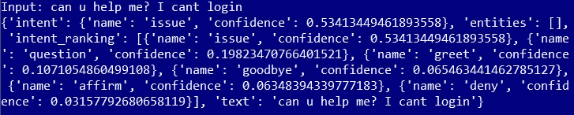
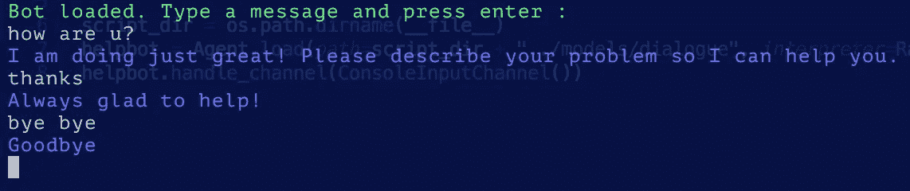

# 使用 Rasa 堆栈构建聊天机器人:介绍和提示

> 原文：<https://medium.com/hackernoon/building-a-chatbot-using-rasa-stack-intro-and-tips-c6d1057d8536>

# 为什么是拉莎？

大公司开发了大量易于使用的 bot 构建框架。有机会近距离观察了一下 [Dialogflow](https://dialogflow.com/) (原名 API。AI；Google 开发)和 [Bot 框架](https://dev.botframework.com/)(微软开发)。Dialogflow 和 Bot 框架都有预先构建的自定义语言理解模式。这些框架似乎是让你快速入门的好工具，尤其是如果你没有可以用作训练数据的聊天记录的话。


.

但是，在某些情况下，您可能希望避免使用在 Google 或 Microsoft 拥有的服务器上处理用户输入的闭源框架。例如，你想为一家企业开发一个[聊天机器人](https://hackernoon.com/tagged/chatbot)，这个聊天机器人将从用户那里接收潜在的敏感或机密信息。在这种情况下，你可能更愿意把聊天机器人的所有组件都放在家里。

这就是 Rasa 平台非常方便的地方。它是一个开源的 bot 构建框架。它在服务器上没有任何可以使用 API 调用的预建模型，这意味着要让它运行起来需要更多的工作。然而，我认为完全控制你的聊天机器人的所有组件是完全值得的。

[Rasa](https://hackernoon.com/tagged/rasa) 栈由两大部分组成: [Rasa NLU](https://nlu.rasa.ai/) 和 [Rasa 核心](https://core.rasa.ai/)。拉莎·NLU 负责聊天机器人的自然语言理解。其主要目的是，给定一个输入句子，预测该句子的*意图*，并从中提取有用的*实体*。意图决定了聊天机器人应该如何响应用户的输入。实体用于使响应更加个性化(例如，记住用户的姓名/年龄)。关于意图、实体的更多信息可以在 Rasa NLU 文件网站上的[教程](https://nlu.rasa.ai/tutorial.html)中找到。

第二个组件，Rasa 核心，是 Rasa 堆栈管道中的下一个组件。它以意图和实体的形式接受结构化输入(Rasa NLU 或任何其他意图分类工具的输出)，并使用概率模型选择机器人应该采取的行动(更具体地说，它使用在 Keras 中实现的 [LSTM 神经网络](https://core.rasa.ai/policies.html#generalising-to-new-dialogues))。



Typical output of Rasa NLU

Rasa 很酷的一点是，堆栈的每个部分都是完全可定制的，并且很容易互换。可以单独使用 Rasa 核心或 Rasa NLU(我最初只使用 NLU 组件开始使用 Rasa)。当使用 Rasa NLU，你可以选择几个后端 NLP 库。Rasa Core 用于动作预测的 LSTM 神经网络可以很容易地与任何其他网络交换，如果你对递归神经网络以及如何在 Keras 中实现它们有一点了解的话。到目前为止，默认的 LSTM 神经网络非常适合我的应用程序，并且可以相对快速地训练，所以我没有尝试改变它。

深入研究 Rasa 堆栈的更多细节没有什么意义。了解它的能力的最好方法是通过 [Rasa 核心](https://core.rasa.ai/tutorial_basics.html)和 [Rasa NLU](https://nlu.rasa.ai/tutorial.html) 文档网站上的教程。我发现教程和文档很全面，容易理解。

# 发展提示

在过去的几周里，我一直在做一个简单的帮助台聊天机器人。在这里，我想分享一些技巧，如果你刚刚开始使用 Rasa stack 开发你的第一个聊天机器人，这些技巧可能会有用。如果您熟悉 Rasa chatbot 的一般结构，这些提示会有意义(也就是说，最好先完成教程)。

如果你已经仔细阅读了 Rasa NLU 和 Rasa 核心的全部文档，你不会在这里学到任何新东西。

## 为您的域仔细选择插槽类型

在 Rasa 核心文件的*深度剖析*部分，有一段加粗的文字写道:

> **应小心选择插槽类型。**

当我第一次阅读文档时，我错过了这一部分，这导致了一个令人讨厌的错误。聊天机器人顽固地对用于训练它的一些输入做出不正确的反应。

假设你的聊天机器人识别的意图之一是一个`login problem`。当用户告诉机器人一个登录问题而没有提供任何细节时，您希望您的机器人提供一些通用的响应(或要求澄清)。除此之外，您还针对用户在使用电脑、手机或平板电脑时出现登录问题的情况准备了三种具体的应对措施。

在这种情况下，您应该将这些关键字定义为`domain.yml`中的槽，如下所示:

```
entities:
 - login_problem_typeslots:
 login_problem_type:
 type: categorical
 values:
 — computer
 — phone
 — tablet
```

很容易将这个插槽的类型定义为`text`，因为 docs 网站上的大多数教程都使用这个类型。`text`描述一个槽式说:

> 如果设置了任何值，则导致槽的特征被设置为`1`。否则，该特性将被设置为`0`(未设置任何值)。

这意味着该插槽将不会捕获用户是否对您列出的特定*设备有问题。它只会捕捉用户是否对您列出的*设备中的*有问题，而不会指明是哪一个。最有可能的情况是，聊天机器人会选择并给出您为它接收的任何设备类型准备的答案之一。*

现在，这里是对`categorical`类型的描述:

> 创建一个描述哪个`values`匹配的独热编码。

这意味着聊天机器人将能够区分涉及不同设备类型的登录问题。

## 不要忘记为插槽的值定义同义词

我在这里继续使用上一个例子中的插槽。预计有些人会把他们的电脑称为“台式机”或“笔记本电脑”。因此，我们需要将这些单词定义为`computer`槽值的同义词。有两种方法可以做到:

*   在包含 Rasa 核心解释器培训数据的`data/nlu.md`文件中，指定每个示例中出现的同义词，如下所示:

```
- I changed my [laptop](login_problem_type:computer) recently and cant login
- cant login from my new [macbook](login_problem_type:computer). Is there any additional software that i need to install?
```

*   在`models/nlu/current/entity_synonyms.json`中，将同义词添加到字典中，使用同义词作为键，使用 slot `value`作为值(全部使用小写就足够了)。示例:

```
{
 “laptop”: “computer”,
 “desktop”: “computer”,
 “machine”: “computer”,
 “pc”: “computer”,
 “macbook”: “computer”,
 “iphone”: “phone”,
 “ipad”: “tablet”
}
```

当您训练 Rasa 核心模型时，使用第一种方法指定的同义词将被添加到`entity_synonyms.json`中的字典中，因此添加同义词的两种方法最终是等效的。

## 写故事时使用检查点

当你发布你的聊天机器人时，你会很快开始聚集大量有价值的训练数据。这意味着需要频繁更新`data/nlu.md`和`data/stories.md`文件。随着您收集更多的训练数据并向 bot 添加更多的复杂性，这两个文件的大小(就行数而言)会增长得非常快。我不是说文本文件的磁盘大小是一个问题，但是由于这些文件是手动处理的，所以保持它们有组织是很重要的。

有了`data/nlu.md`文件就简单多了。我认为它是一个只附加的文件。因为它是用来训练解释器的，而且额外的训练数据不会影响性能，所以我只是将新的用户输入添加到该文件中相应的意图中。

跟`data/stories.md`完全是两码事。当你给你的机器人增加新的功能或者遇到一个引导一个有效但非常不可预测的对话的用户时，你可能需要对现有的故事做一些改变。`data/stories.md`通过使用检查点使其更加模块化，管理起来就容易多了。

假设您正在编写一个对话故事，其中用户讲述了一个登录问题，但没有提供任何细节，聊天机器人需要澄清这个问题:

```
## help with login (general)
* login_general
 — utter_login_specify
> clarify login problem
```

`>clarify login problem`在“故事模块”的末尾添加了检查点，因为上述交流是不同类型的更具体登录问题的常见开端。

然后我们可以为各种更具体的登录问题指定“故事分支”。

```
## help with login (computer)
> clarify login problem
* login_clarification{"login_problem_type":"computer"}
 — utter_login_computer_help## help with login (phone)
> clarify login problem
* login_clarification{"login_problem_type":"phone"}
 — utter_login_phone_help## help with login (tablet)
> clarify login problem
* login_clarification{"login_problem_type":"tablet"}
 — utter_login_tablet_help
```

显然，使用检查点可以使故事文件更有条理，并帮助您在编写新故事时节省一些时间。[检查点使用的另一个例子](https://core.rasa.ai/stories.html)是在文档中。

## 在将用户消息传递给机器人时，不要忘记指定`sender_id`

Rasa Core 的大部分功能都可以通过[代理类](https://github.com/RasaHQ/rasa_core/blob/master/rasa_core/agent.py)的方法来访问。`handle_message(text_message)`是该类的方法之一。它接受用户输入作为参数，然后通过我在引言中描述的管道运行该输入，并返回机器人想要响应的消息。

`handle_message(text_message)`方法的可选参数之一是`sender_id`。如果您有一个服务于多个客户端的代理实例，那么为每个客户端分配一个惟一的`sender_id`并将其与来自该客户端的每个输入一起传递给`handle_message(text_message, sender_id=some_unique_id)`是非常重要的。

文档中没有提到任何关于`sender_id`的内容，起初我也不清楚它的用途。最初，我认为代理实例跟踪单个对话。为了让聊天机器人同时服务于两个客户端，我认为我需要两个代理实例。然后为连接到服务器的每个新客户端创建一个新的，并在客户端离开时删除或重置旧客户端的状态。

如果指定了`sender_id`，就没有必要这么麻烦了。对于每个唯一的用户，代理实例的处理器创建一个跟踪器实例，该实例维护与该特定用户的对话状态。每个 tracker 实例都保存在 Tracker 存储区中，并根据会话的当前状态进行更新。使用单个代理实例时，无需担心聊天机器人会混淆与不同用户的对话！

你可以在这里了解 Rasa 核心组件是如何组装在一起的[。你可以在源文件](https://core.rasa.ai/plumbing.html) [processor.py](https://github.com/RasaHQ/rasa_core/blob/master/rasa_core/processor.py) 和 [tracker_store.py](https://github.com/RasaHQ/rasa_core/blob/master/rasa_core/tracker_store.py) 中找到更多关于如何处理`sender_id`的细节。

对我来说，开始使用 Rasa 非常容易。虽然我没有训练数据，但我能够用编造的数据成功地训练出第一个原型。我的聊天机器人现在可以非常准确地识别 15 种不同的意图，其中一些具有非常接近的含义和预期的句子结构。我用大约 300 个例子训练了解释器(`nlu.md`)，每个意图大约 10-20 个例子。我的`stories.md`文件大约有 150 行长，总共只有 25 个故事。在用相对少量的数据进行训练后，它对以前看不见的输入进行分类的准确性给我留下了非常深刻的印象。

Rasa 堆栈非常容易使用。无需编写一行代码，就可以创建一个可以在终端中与之交互的聊天机器人。从我上面的例子中你可能已经注意到，所有包含训练数据和领域规范的 Rasa 文件都是用 Markdown 编写的。当然，当你想让它为客户做好准备时，在为它设计后端和前端时会有大量的编程工作。



Testing the chatbot from the terminal

对我个人来说，开发聊天机器人最困难的部分是创建一个用户友好的前端，因为我在这方面几乎没有经验。如果你在开发一个好的前端方面有问题，我建议你看看 GitHub 上的 simple React 或 Angular 聊天室项目，然后选择你喜欢的(并且理解！)最多。你不需要改变很多东西，因为聊天机器人的前端几乎和普通聊天室的前端一样。虽然我没有探索这条道路，但我知道将 Rasa 聊天机器人与脸书信使联系起来是可能的；这样你就不用担心前端了。

我希望这些技巧能够帮助刚开始使用 Rasa 的开发人员更快地构建一个原型，并避免过程中的一些常见错误。

关于 Rasa 堆栈的最佳信息来源是文档。整篇文章中有很多相关的链接。Rasa 在 Medium 上也有他们的博客，你可以在这里找到。

## 编辑#1:

将故事中的意图格式更改为当前格式(在 Core 的 0.10.1 版本中引入)。