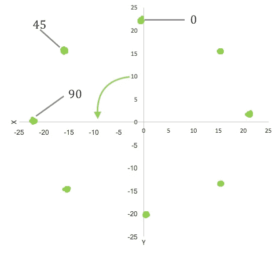
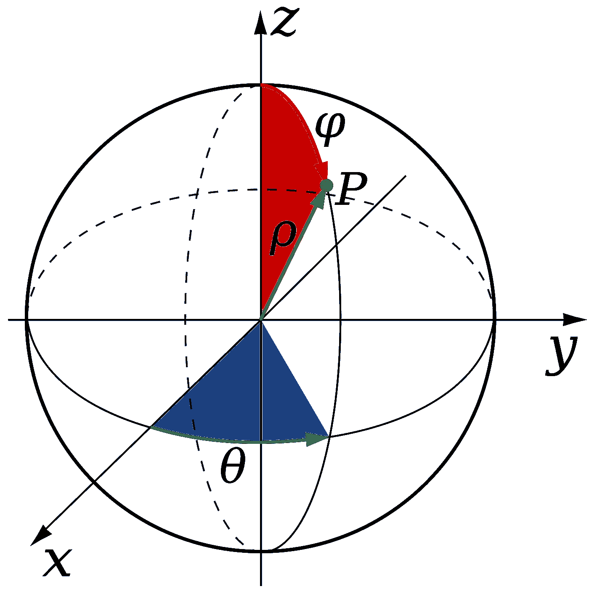
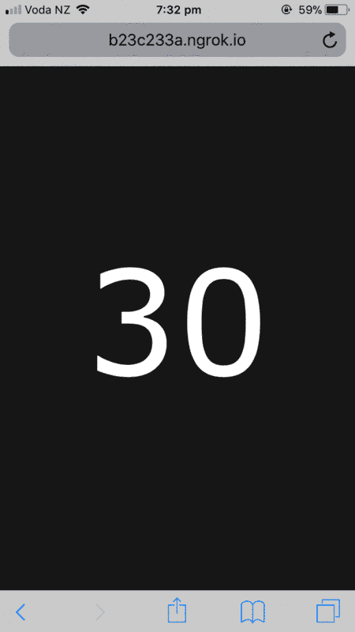

# 构建指南针网络应用程序

> 原文：<https://medium.com/hackernoon/building-a-compass-web-app-c79fec31e080>

我已经开始了一个项目，试图使用磁力计来检测用户的行为，所以为了开始了解如何使用它们，我制作了一个简单的指南针。

## 步骤 1 —原始磁力计数据:

使用 iPhone 上的 *PowerSense* 应用程序，我记录了不同罗盘方向和设备方位下的三轴磁力计读数。将设备限制在水平面上，可获得以下(非常有希望的)读数:



X & Y magnetometer readings at different headings

除了从 x 轴被逆转，这些点是非常有用的给我们一个罗盘航向！转换成球形坐标是为了使输出更有用:



From Maths Stack Exchange

由于 3D 空间中磁场矢量的幅度随着器件方向的改变而保持不变，因此在这种应用中可以忽略 r 值。在水平面上，由于 z 轴读数恒定，rho 值也是恒定的，因此现在也忽略不计。θ的计算公式如下:

```
def direction(vec): 
    #vec = [x,y,z] from imported data x = -vec[0] #negate x
    y = vec[1]
    z = vec[2]
    if y > 0 and x > 0:        #if in Q1
        theta = math.atan(x/y)
    elif y < 0:                #if in Q2 or Q3
        theta = math.atan(x/y) + math.pi
    else:                      #if in Q4
        theta = math.atan(x/y) + math.pi*2
    return theta
```

这给了我们一个与记录数据的角度一致的方向！现在所需要的就是从移动设备上获取磁力计数据。

## 第二步——意识到 iPhones 不会向网络应用程序提供原始磁力计数据……

或许应该先检查一下这部分。哦好吧。

## 步骤 3 —探索设备定向活动的奇妙之处

deviceorientation 允许网站收集设备如何被握持的数据，这些数据在 3 个不同的轴上报告:

**alpha** —绕 z 轴旋转，从 0 度到 360 度

**beta** —绕 x 轴旋转，从-180 度到 180 度

**gamma** —绕 y 轴旋转，从-90 度到 90 度

需要注意的是，在 iOS 和 Android 设备之间，这些信息的指定方式略有不同。在 chrome 50 之前，Android 设备会将 alpha 报告为一个'*绝对*值，在地球表面的参考系中是常数。这意味着 alpha = 0 对应于指向正北的设备，这非常方便。如磁力计数据所示，旋转方向相反。这可以通过取*航向= 360-α*来解决

```
function deviceOrientationListener(event) {
  var alpha    = event.alpha; //z axis rotation [0,360)
  var beta     = event.beta; //x axis rotation [-180, 180]
  var gamma    = event.gamma; //y axis rotation [-90, 90]
  var heading  = 360 - alpha; //heading [0, 360)
}if(window.DeviceOrientationEvent){ //Check if device is compatible
      window.addEventListener("deviceorientation", deviceOrientationListener);
    }
```

然而，现在 Android 已经走上了 iOS 的道路，将 alpha 报告为一个'*相对*'值，其中 0 被定义为页面加载时设备的方向。这使得它作为指南针的用处大大降低了…

幸运的是，隐藏在谷歌开发者页面深处的是一个解决方案！有些设备仍然会通过 event.webkitCompassHeading 以罗盘航向的形式报告绝对 alpha 值。应用程序检查设备是否会报告该值，如果是，则使用该值。否则，使用相对 alpha 值来显示页面，只是不指向北方。

```
...
if (typeof event.webkitCompassHeading !== "undefined") {
        alpha = event.webkitCompassHeading; //iOS non-standard
        var heading = alpha
        document.getElementById("heading").innerHTML = heading.toFixed([0]);
      }
      else {
        alert("Your device is reporting relative alpha values, so this compass won't point north! ");
        var heading = 360 - alpha; //heading [0, 360)
        document.getElementById("heading").innerHTML = heading.toFixed([0]);
      }
...if (window.DeviceOrientationAbsoluteEvent) {
      window.addEventListener("DeviceOrientationAbsoluteEvent", deviceOrientationListener);
    } // If not, check if the device sends any orientation data
    else if(window.DeviceOrientationEvent){
      window.addEventListener("deviceorientation", deviceOrientationListener);
    } // Send an alert if the device isn't compatible
    else {
      alert("Sorry, try again on a compatible mobile device!");
    }
```

所有的代码都在页面底部给出。

指南针可以在[这里](http://www.grantholtes.com/compass.html)测试，但是如果你的设备不工作，看看下面:



The compass in action

```
<!DOCTYPE html>
<html>
  <head>
    <style>
    p {
      font-family: verdana;
      font-size: 400px;
      color: #FFFFFF;
    }
    </style> <title>Compass</title> <script>
    // Get event data
    function deviceOrientationListener(event) {
      var alpha    = event.alpha; //z axis rotation [0,360)
      var beta     = event.beta; //x axis rotation [-180, 180]
      var gamma    = event.gamma; //y axis rotation [-90, 90] //Check if absolute values have been sent
      if (typeof event.webkitCompassHeading !== "undefined") {
        alpha = event.webkitCompassHeading; //iOS non-standard
        var heading = alpha
        document.getElementById("heading").innerHTML = heading.toFixed([0]);
      }
      else {
        alert("Your device is reporting relative alpha values, so this compass won't point north :(");
        var heading = 360 - alpha; //heading [0, 360)
        document.getElementById("heading").innerHTML = heading.toFixed([0]);
      }

      // Change backgroud colour based on heading
      // Green for North and South, black otherwise
      if (heading > 359 || heading < 1) { //Allow +- 1 degree
        document.body.style.backgroundColor = "green";
        document.getElementById("heading").innerHTML = "N"; // North
      }
      else if (heading > 179 && heading < 181){ //Allow +- 1 degree
        document.body.style.backgroundColor = "green";
        document.getElementById("heading").innerHTML = "S"; // South
      } 
      else { // Otherwise, use near black
        document.body.style.backgroundColor = "#161616";
      }
    }

    // Check if device can provide absolute orientation data
    if (window.DeviceOrientationAbsoluteEvent) {
      window.addEventListener("DeviceOrientationAbsoluteEvent", deviceOrientationListener);
    } // If not, check if the device sends any orientation data
    else if(window.DeviceOrientationEvent){
      window.addEventListener("deviceorientation", deviceOrientationListener);
    } // Send an alert if the device isn't compatible
    else {
      alert("Sorry, try again on a compatible mobile device!");
    }
    </script>
  </head> <body>
    <br><br>
    <p id="heading" style="text-align:center"></p>
  </body>
</html>
```