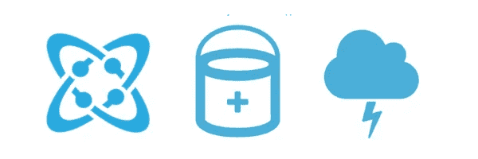
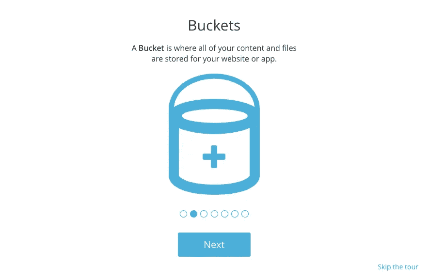
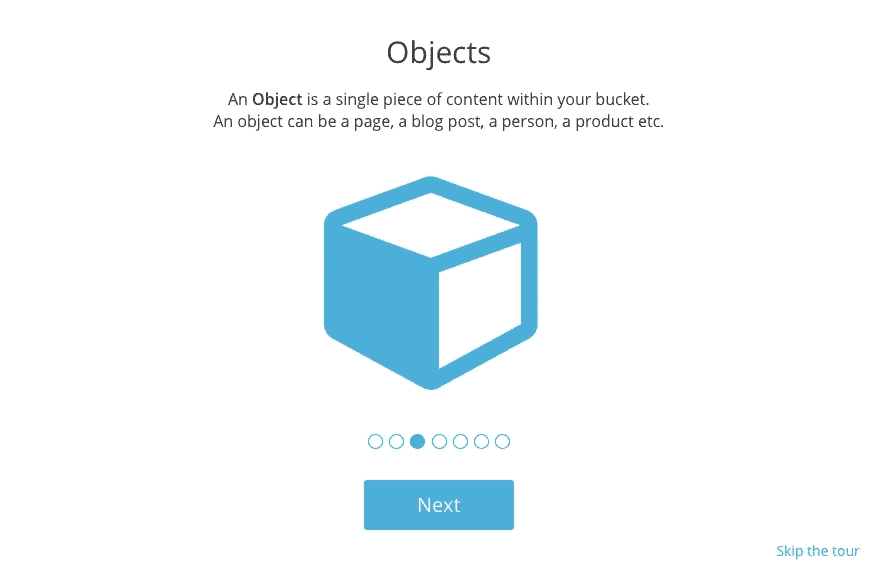
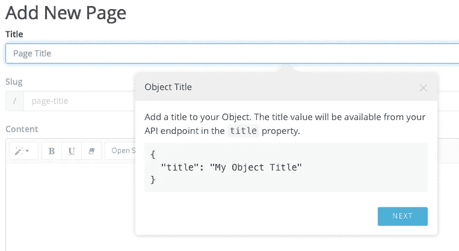
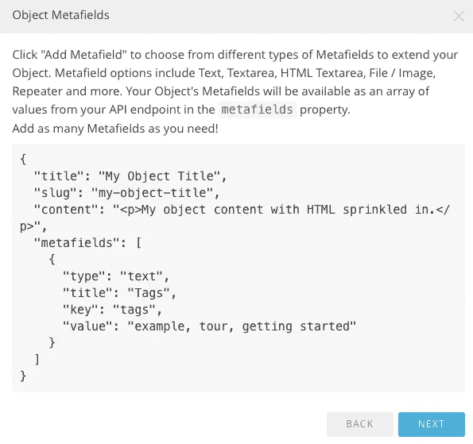
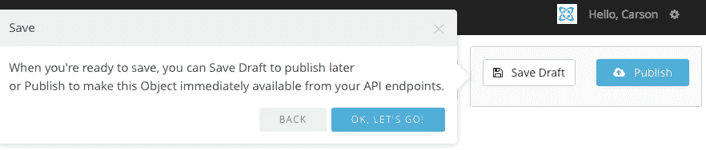
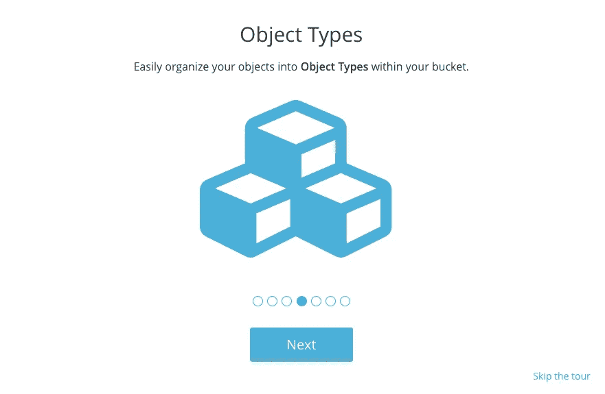
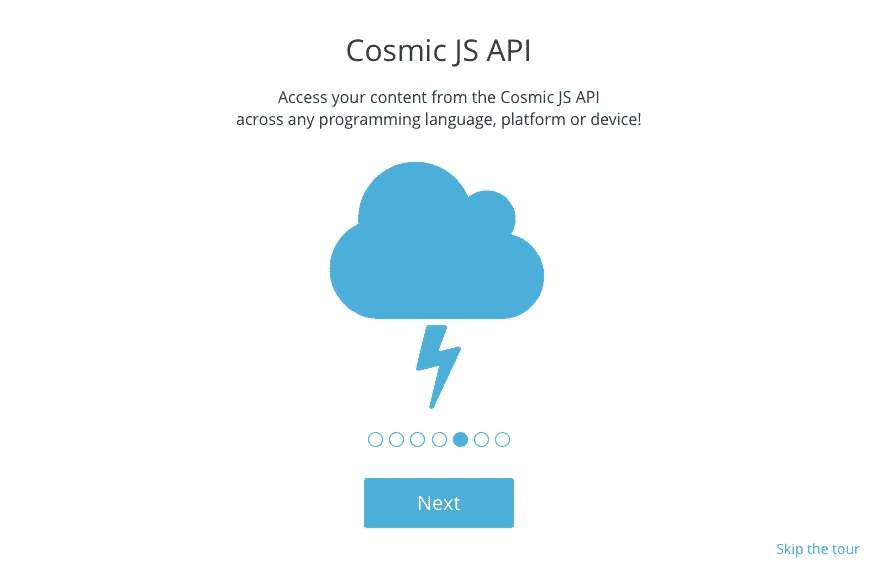
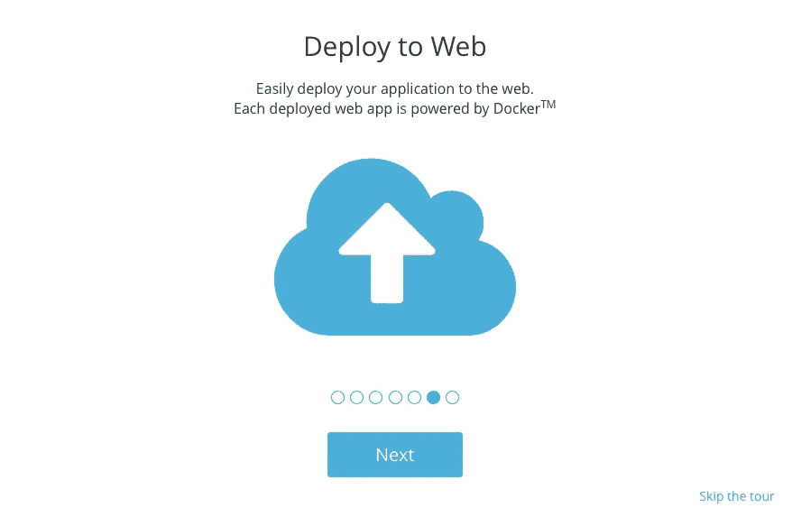

# 构建 JSON 内容桶—常见问题

> 原文：<https://medium.com/hackernoon/building-a-content-bucket-faqs-a3333bdbbe1f>



让我们简单浏览一下宇宙 JS 术语，这样你就可以更快更有效地构建应用程序。 [Cosmic JS](https://cosmicjs.com/) 是一个 API 优先的基于云的内容管理系统，它通过将内容与代码分离来工作，允许开发人员以他们喜欢的任何编程语言构建应用程序，同时还允许内容编辑人员在分离的内容 API 系统的宽容下主动规划和管理内容。阅读更多关于[解耦 CMS 架构的好处](https://hackernoon.com/benefits-of-a-decoupled-cms-architecture-6bc77b06961e#.drnu2yq56)。

## 考虑你的宇宙 JS 桶结构的一个基本方法是:

```
Bucket: Your website
Object Type: The blog posts on your website
Object: A blog post
Metafield: A picture on your blog post
Metafield: The author of your blog post
```

# 什么是水桶？



Bucket 是 Cosmic JS 内容结构中的主要部分。它非常灵活，可以为整个网站或网站的一部分内容提供动力。由于您的 Bucket 内容是通过 API 端点交付的，因此您的 Bucket 还可以为任何应用程序提供内容，包括 iOS、Android、tvOS、Apple Watch、IOT、AR/VR 或您想要分发内容的任何其他方式。

# 什么是对象？



一个对象可以是一个页面，一篇博客文章，或者任何你想让它成为的东西。Cosmic JS 让你可以自由地创建和管理内容，创建你自己的数据结构。每个对象都允许创建标题、辅助信息、内容和元字段。

# 添加对象—对象标题



# 添加对象-自动生成的 Slug


# 添加对象的内容


# 向对象添加元字段



元字段是非常强大的自定义数据，可以添加到可以递归嵌套的对象中。当前可用的元字段类型包括:文本、文本区、HTML 文本区、选择下拉、文件上传、日期、对象、单选按钮、复选框和重复项。您创建的元字段被转换成 API 端点中的键/值元数据。

# 保存对象草稿|发布对象



# 什么是对象类型？



对象类型是共享相似功能的对象的任何集合。页面、文章、项目等。

# 如何使用 Cosmic JS API？



导航到[入门](https://cosmicjs.com/getting-started)和[文档](https://cosmicjs.com/docs/rest)获取 API 端点、客户端库、教程等。

# 我可以展开我的铲斗吗？



Cosmic JS 使得从任何公共 Git 仓库部署你的 web 应用程序变得容易。只需点击几下鼠标，即可添加自定义域和 SSL。查看我们的[应用页面](https://cosmicjs.com/apps)，看看您可以在几分钟内创建和部署什么。宇宙 JS 是你的 API，内容管理和网站托管解决方案于一体！

[Cosmic JS](https://cosmicjs.com/) 是一个 [API 第一的基于云的内容管理平台](https://cosmicjs.com/)，使得管理应用和内容变得容易。如果你对 Cosmic JS API 有疑问，请联系 [Twitter](https://twitter.com/cosmic_js) 或 [Slack](https://cosmicjs.com/community) 上的[创始人](https://cosmicjs.com/about)。

[卡森·吉本斯](https://twitter.com/carsoncgibbons)是 [Cosmic JS](https://cosmicjs.com/) 的联合创始人& CMO，这是一个 API 第一的基于云的内容管理平台，它将内容与代码分离，允许开发人员用他们想要的任何编程语言构建流畅的应用程序和网站。

[](http://bit.ly/HackernoonFB)[](https://goo.gl/k7XYbx)[](https://goo.gl/4ofytp)

> [黑客中午](http://bit.ly/Hackernoon)是黑客如何开始他们的下午。我们是 T21 家庭的一员。我们现在[接受投稿](http://bit.ly/hackernoonsubmission)并乐意[讨论广告&赞助](mailto:partners@amipublications.com)机会。
> 
> 如果你喜欢这个故事，我们推荐你阅读我们的[最新科技故事](http://bit.ly/hackernoonlatestt)和[趋势科技故事](https://hackernoon.com/trending)。直到下一次，不要把世界的现实想当然！

