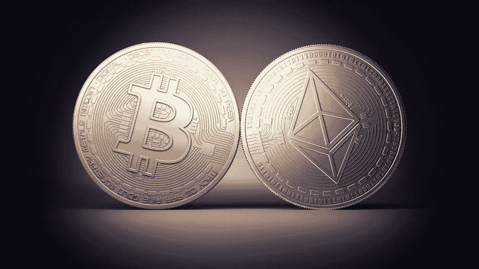
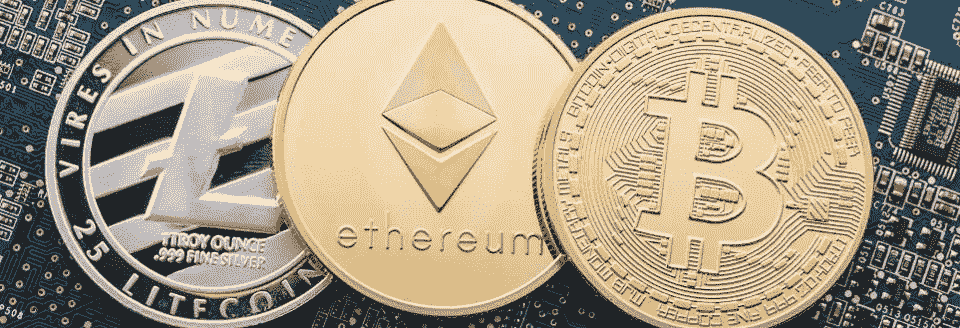

# 构建加密货币投资组合

> 原文：<https://medium.com/hackernoon/building-a-cryptocurrency-portfolio-14e46e99942e>

我喜欢加密货币。我喜欢他们的想法。我是一个自由主义者，支持市场而不是中央计划。我不相信美联储印的所有钞票都会有好下场。这可能是加密货币对我说话的原因。

随着加密货币市场的成熟，将大多数人用于投资股票和其他资产类别的一些相同的基本面纳入进来非常重要。分散投资是降低整体风险调整回报率的一个关键方面。当考虑加密货币时，我认为重要的是建立一个评估框架，然后使用该框架建立一个投资组合。

# 投资准则

投资时，重要的是制定一个如何评估潜在投资的框架。加密货币与投资其他资产类别没有什么不同。如果您希望您在加密方面的投资持续下去，它们需要在以下几个方面表现出色:

*   **产品/功能:**他们有自己的功能定位吗？他们有可防御的产品和独特的功能吗？
*   **社区规模/采用:**他们有狂热的用户追随者吗？他们有投资和感兴趣的社区吗？
*   **技术/护城河:**他们用新颖的方法解决问题了吗？他们实现了有趣的、可防御的技术吗？
*   **一致的激励/治理:**投资者是否系统地与激励一致？是否有适当的治理系统和流程？是否有采矿和/或其他刺激因素，或者他们一次就能生产出所有的硬币？
*   **市场机会:**试图解决的问题有多大？潜在市场的总量是多少？

我们将使用 1-10 分的非科学评分来评估以下几种货币。 **(P/C/T/I/O)** 评估(例如 10/4/7/3/7)。

# 加密货币组合

如果你在投资组合中使用加密货币进行更广泛的多样化，我会考虑开始投资 3-9 种加密货币。我建议这样做的原因和你投资多种资产类别的原因一样。它可以让你降低风险，提高风险调整后的回报。如果您想分析哪些货币是不相关的，[查看此表](https://cointrading.ninja/correlation)。

## 主要货币:核心资产

我认为每一种加密货币都应该从比特币(BTC)和以太(ETH)开始。比特币是其中的鼻祖，具有先发优势。事实证明，它是作为价值储存手段使用的货币，在市场上拥有最多的合作伙伴/供应商。以太坊已经建立了“智能合约”的概念，它允许未来 10 年使用区块链技术进行如此多的创新。作为核心，以太坊有很大的机会获取价值。我会把大部分加密投资放在这两种货币上。

*   比特币 (BTC)现为 9178.26 美元(9/10/8/9/9)
*   [以太坊](https://coinmarketcap.com/currencies/ethereum/) (ETH)现售价 745.35 美元(10/9/10/9/10)

## “僵尸”货币

我会小心我所谓的“僵尸”货币。这些货币在过去的某段时间可能很大或有潜力，但市场已经说话了，他们没有被选中。

请谨慎对待这三个产品，因为它们缺乏独特的价值主张。比特币现金正试图成为一种交易媒介，其交易速度比比特币快。这是一个脆弱的位置，矿工的采用已经稳定下来。以太坊经典(ETC)已经被抛弃，以太坊(ETH)成为这场战斗的赢家。莱特币应该是“比特币的黄金之银”，但有很多硬币在争夺这个位置。在他们能够证明自己是交易媒介(或其他独特价值)的主导力量之前，我不会投资它。投资僵尸货币要小心。它们可能会随着整个市场而上升，但在某个时候，由于缺乏独特的价值主张，它们的价值可能会急剧下降。

*   [比特币现金](https://coinmarketcap.com/currencies/bitcoin-cash/)(BCH)1，549.00 美元(2006 年 2 月 5 日 8 月 7 日)
*   [以太坊经典](https://coinmarketcap.com/currencies/ethereum-classic/) (ETC)售价 21.01 美元(2014 年 2 月 4 日/2014 年 7 月 8 日)
*   [莱特币](https://coinmarketcap.com/currencies/litecoin/)(LTC)153.77 美元(4/6/7/7/6)

## 平台加密货币

有一组加密货币是分散的平台，它们试图使用区块链技术最好地解决问题。Ripple 试图为金融公司应对国际支付汇款市场。EOS 是一个高度可扩展的高性能平台网络。NEO 提供了一个以编程方式扩展智能合约的平台。DASH 有一个试图以一种新颖的方式解决数字支付的社区。

*   9.55 美元(9/9/9/9/9/9)
*   [NEO](https://coinmarketcap.com/currencies/neo/) (NEO)售价 73.22 美元(9/6/8/7/9)
*   [涟漪](https://coinmarketcap.com/currencies/ripple/) (XRP)在 0.71 美元(7/7/8/4/8)
*   破折号为 447.63 美元(8/7/6/9/8)

## 匿名加密货币

有几种加密货币致力于在交易中提供更多隐私。他们每个人的工作方式都有所不同。由于隐私是为什么使用加密货币的一个重要卖点，我认为其中之一属于你的投资组合。

*   [Zcash](https://coinmarketcap.com/currencies/zcash/)(ZEC)273.24 美元(10/7/8/7/8)
*   [莫内罗](https://coinmarketcap.com/currencies/monero/) (XMR)售价 225.57 美元(2018 年 9 月 7 日 6 月 8 日)

## 礼宾币

由于我们正处于构建分散式和区块链应用程序的早期阶段，许多早期平台都专注于协议层。在未来，更多的硬币将集中在特定的应用层，但由于我们需要区块链基础设施的建设，我会投资至少一种货币。

*   [IOTA](https://coinmarketcap.com/currencies/iota/) (米欧塔)2.22 美元(9/6/8/9/8)
*   [思域](https://coinmarketcap.com/currencies/civic/) (CVC)售价 0.30 美元(2010 年 8 月 7 日/9 月 9 日)
*   [MaidSafe](https://coinmarketcap.com/currencies/maidsafecoin/) (女仆)0.36 美元(2010 年 9 月 6 日/8 月 8 日)
*   [球棒代币](https://coinmarketcap.com/currencies/basic-attention-token/)(球棒)0.38 美元(7/7/8/8/8)

## 其他未来的硬币和代币供您考虑

在我看来，下面列出的加密货币现在是投机性的，但显示出前景。下面的许多内容集中在基于我们上面讨论的协议构建的应用程序上。我可能会推迟投资，直到它们稍微成熟一点，直到你有时间建立一个核心加密货币投资组合。请留意以下内容:

*   [金属](https://coinmarketcap.com/currencies/metal/)报 4.47 美元
*   钢价为 3.37 美元
*   TNT 炸药价格为 0.11 美元
*   预示着 47.10 美元的价格
*   [TenX](https://coinmarketcap.com/currencies/tenx/) 报 1.31 美元
*   [0x](https://coinmarketcap.com/currencies/0x/)0.93 美元
*   0.025 美元的感觉
*   CRYPTO20 售价 1.67 美元

## 需要更多的审查

我不会投资 BitConnect，因为许多人认为这是一个骗局。BitConnect 的市值仍为 11 亿美元。很难相信，但实际上没有任何监管机构在执行，人们被它们的高回报保证迷住了。所有的事情都表明这是一个庞氏骗局。顾客小心上当。

## 避免 ico

除非你了解这个团队，否则我会尽量避开 ico。现在我们处在一个到处都是 ICO 骗局的泡沫中。大多数提供 ico 的公司都没有产品，更不用说收入了。如今，90%的 ico 都没有创造出明确的价值。在 ICO 之后，大多数硬币的交易价格低于 ICO 价格。

监管机构，就像美国的证券交易委员会，最终将会来“执行”监管。这对所有相关人员来说都是痛苦的。因此，在我们加强监管并明确表明 ICO 活动正在创造真正的价值之前，我建议避免 ICO。

## 模型投资组合

模型投资组合可能看起来像这样:

*   BTC (25%) —核心:储备货币，一级资产
*   ETH (25%) —核心:储备货币，一级资产
*   破折号(10%) —货币:交换媒介
*   XMR (5%) —货币:匿名/隐私
*   EOS (15%) —平台:构建高性能网络，巨大的市场机会，长期等待 1-2 年
*   IOTA (10%) —平台:构建物联网，巨大的市场机会，长期等待 1-2 年
*   CVC (10%) —实用令牌:分散识别和验证

拥有 3-9 种加密货币的初始投资组合将优化您的风险调整回报。随着投资组合的增长，你会增加投资组合中的硬币数量。分散赌注会降低你的风险。此外，你将拥有一些尚未像比特币和以太币那样大受欢迎的硬币。我可能会在投资前设定一个最低的硬币市值门槛。例如，我不会投资任何市值不超过 1 亿美元的硬币。

最后一点，这不是常青树的内容。由于市场和环境的动态性，此处描述的模型组合在未来可能不适用。这是一个非常新的市场，我预计在接下来的一年甚至更长的时间里会有很多快速的变化。所以，一定要把这里描述的原则应用到当前和未来的状态中。

狩猎愉快！

________________________________________________________________

*免责声明:以上内容仅代表一种观点，仅供参考。它无意成为投资建议。请自己做作业。*

[***杰克瑞恩***](/@jake_ryan) ***是 Tradecraft Capital 的创始人，创业顾问，天使投资人&投资方面的作家。如果你喜欢这篇文章，请“鼓掌”帮助别人找到它！欲知更多，敬请关注*** [***【脸书】***](https://www.facebook.com/WealthRituals/)*[***碎碎念***](https://twitter.com/TradecraftJake) ***。****