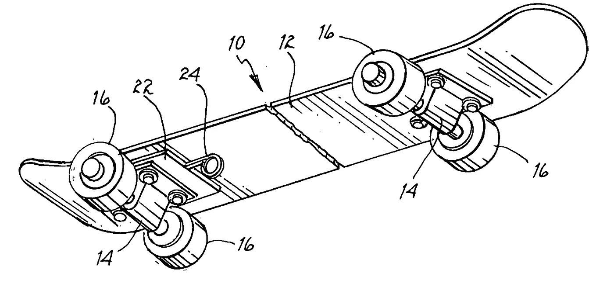
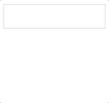
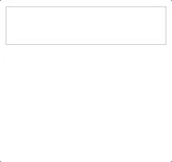
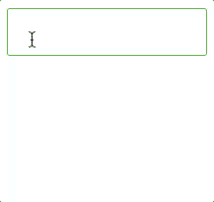
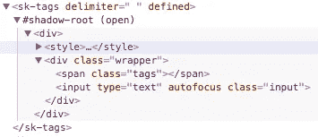
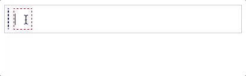

# 用 Skate.js 构建自定义标签输入

> 原文：<https://medium.com/hackernoon/building-a-custom-tag-input-with-skate-js-fbd4cdf744f>



您是否在尝试构建和使用 Web 组件时迷失了方向？Skate.js 使用该平台，并对其进行了一些阐释。

# 我们要建造什么？

一个类似输入的标签，它看起来像一个普通的文本输入，但是当用户点击空格时会将内容分成标签。请看组件[这里](https://zzarcon.github.io/skatepark.js/?selectedKind=Tags&selectedStory=Enter%20a%20space-separated%20list%20of%20tags&full=0&down=0&left=1&panelRight=0)和代码[这里](https://github.com/zzarcon/skatepark.js/tree/master/packages/tags)的现场演示，以便更好地理解和了解特性:



*   创建标签时自动对焦。



*   按 DEL 时自然删除。
*   UI 100%可定制，完全控制 shadowDom 中的元素。
*   允许用户按下按钮删除标签。
*   通过组件属性的初始值。
*   随着用户键入内容，输入会自动增加。
*   指定自定义分隔符。

# 介绍

Web 组件很棒，因为它们允许我们定义定制的 HTML 元素并封装它们的行为。但是今天我想向你介绍一个我最近一直在玩的库，它可能会改变你看待 web 组件的方式。

[Skate.js](https://github.com/skatejs/skatejs/) 它是一个轻量级的库(4k min+gz)，专注于 web 组件规范的使用，给你一个功能性的渲染管道。

Skate.js 使用两个最重要的 web 组件特性实现了这一点:

*   [自定义元素](https://developers.google.com/web/fundamentals/getting-started/primers/customelements)
*   [暗影 DOM](https://developers.google.com/web/fundamentals/getting-started/primers/shadowdom)

好吧，但是…这一切意味着什么？好了，让我们来看看代码。

## 注册组件📦

在第一行中，我们包含了 [skatejs-web-components](https://github.com/skatejs/web-components) 模块，它提供了 polyfills Skate.js 所需的所有功能，因此您不必担心浏览器兼容性。

后来我们创建了组件的框架，我们扩展了 [Skate 组件](https://skatejs.gitbooks.io/skatejs/content/docs/api/#extension)，它就像一个服用了类固醇的 web 组件，我们可以把它传递给`customElements.define` ✌.

️We 在 [renderCallback](https://skatejs.gitbooks.io/skatejs/content/docs/api/#rendercallback---supersedes-static-render) 中定义组件的布局，就像你在 [render 方法](https://facebook.github.io/react/docs/react-component.html)中使用 React.js 一样。最后，我们注册了 [**道具**](https://skatejs.gitbooks.io/skatejs/content/docs/api/#static-props) ，这些道具在变异时会重新渲染。

这将为我们提供一个包含 shadowDom 的组件:



添加行为:事件+道具🔩

现在我们有了一个完全正常工作的标签组件🎉，这是我们添加的内容:

*   标签属性:包含标签状态的属性，每次我们修改它的时候，Skate.js 会用最小的 DOM 修改重新渲染你的组件。这里好的一点是我们使用了 [props.array](https://skatejs.gitbooks.io/skatejs/content/docs/api/#array) 方法，这是一个内置的方法，将确保传递给属性的任何值都是一个数组，允许我们解析属性的值并设置一个初始值，如:`<sk-tags tags="[milk,bread,chocolate]" />`
*   Input resize:这是组件的一个关键部分，使其能够响应。方法 **adjustInputSize** 在每次值改变时设置实际输入的宽度，这样组件可以正确地换行。
*   分隔符处理:**on input**检查用户输入的最后一个字符是否与组件分隔符匹配(默认为空格)。



上图显示了我们如何使用 ***标签元素*** (蓝色)来添加标签，以及真实的 ***输入元素*** (红色)如何动态增长以使组件做出响应。

## 允许删除+自定义样式💅

这里的变化非常直接，2 个新道具*删除*和*样式，*只是连接默认样式+用户样式，允许他这样做:

```
<sk-tags styles=".tag{ background-color: red;} .wrapper{ border: 1px solid black; }" />
```

或者，如果您喜欢更容易维护的东西，您可以这样做:

仅仅使用一个 [10 行样式助手](https://github.com/zzarcon/skatepark.js/blob/master/packages/core/src/styles.js)，它将把对象转换成 css 内容。

# 结论

用 Skate.js 构建组件感觉很自然。我以前没有任何使用它的经验，但许多事情都按照我预期的方式工作，这足以让我意识到 Skate.js 提供的好处，而不是用 vanilla js 构建组件。

我敢肯定，如果你熟悉 web 组件，你可能会发现缺少一些东西，比如有一种不用手动改变 DOM 就能呈现组件的高级方法，或者有一种处理属性并保持 UI 与实际组件状态同步的机制，一个健壮的属性 api，等等。你可能会发现 Skate.js 固执己见的做事方式解决了这些问题。

简单回顾一下，我们已经从文档中介绍了[道具](https://skatejs.gitbooks.io/skatejs/content/docs/api/#static-props)和[扩展](https://skatejs.gitbooks.io/skatejs/content/docs/api/#extension)。在下一篇文章中，我将向您展示如何构建一个更高级的组件，并介绍库的其他有趣部分。

最后，我想给你推荐一个来自 [ChromeDevelopers](https://www.youtube.com/user/ChromeDevelopers) youtube 频道的好资源，即[增压系列](https://www.youtube.com/playlist?list=PLNYkxOF6rcIBz9ACEQRmO9Lw8PW7vn0lr)，在那里你可以看到今天如何构建 web 组件的精彩现场演示，并且你可以进行比较👀。

[](https://twitter.com/zzarcon)

You can follow me on Twitter or Github @zzarcon

[](http://bit.ly/HackernoonFB)[](https://goo.gl/k7XYbx)[](https://goo.gl/4ofytp)

> [黑客中午](http://bit.ly/Hackernoon)是黑客如何开始他们的下午。我们是 [@AMI](http://bit.ly/atAMIatAMI) 家庭的一员。我们现在[接受投稿](http://bit.ly/hackernoonsubmission)并乐意[讨论广告&赞助](mailto:partners@amipublications.com)机会。
> 
> 如果你喜欢这个故事，我们推荐你阅读我们的[最新科技故事](http://bit.ly/hackernoonlatestt)和[趋势科技故事](https://hackernoon.com/trending)。直到下一次，不要把世界的现实想当然！

