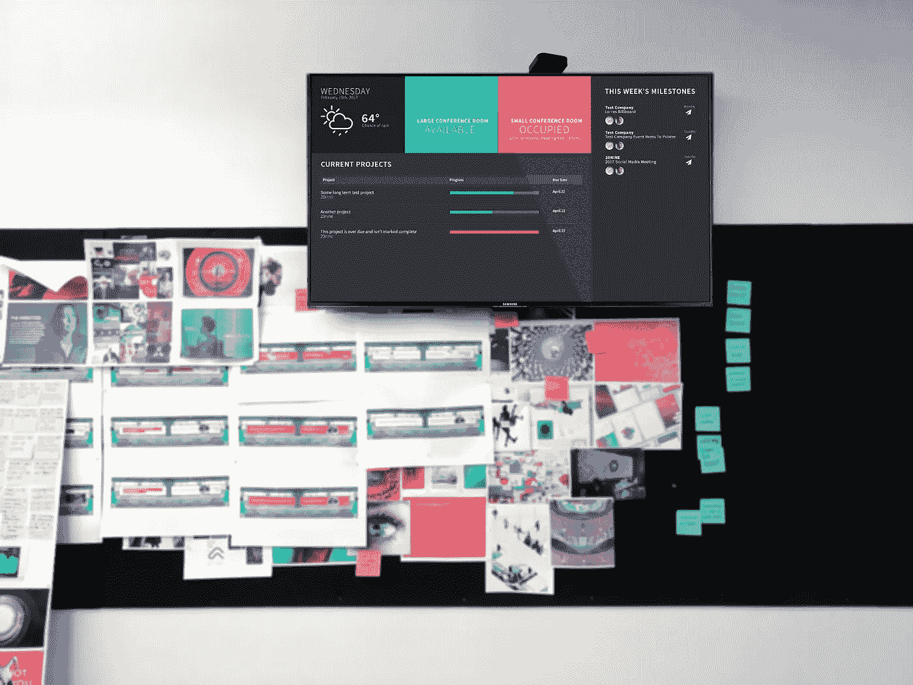
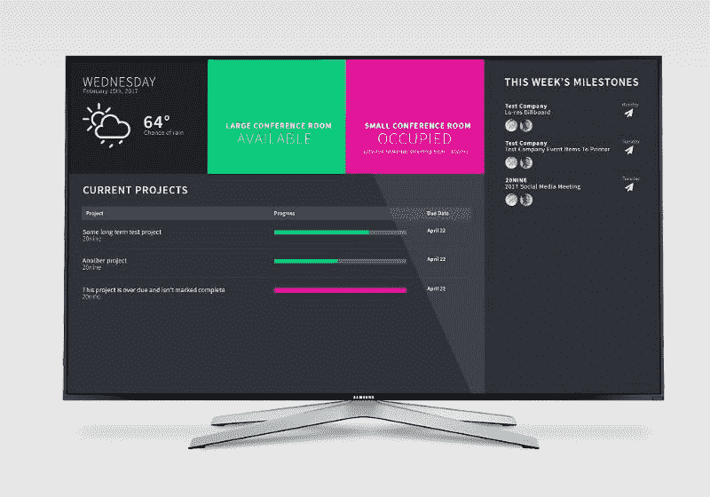
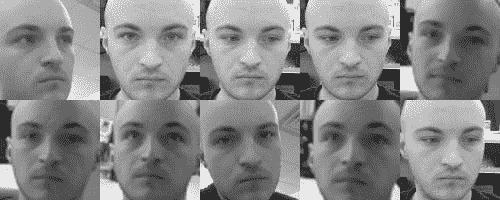

# 构建一个能够识别您的仪表板

> 原文：<https://medium.com/hackernoon/building-a-dashboard-that-recognizes-you-d000fb85f7d2>



在 20nine，我们最近在公共区域安装了一台大型壁挂式电视——主要用于我们的日常会议和偶尔的 YouTube 视频。但是我注意到，当它与我们的内部资源管理工具(我们称之为 Forge)连接时，它在 90%的时间里是关闭的。为了补救这一点，我认为创建一个实时仪表板将是一个令人兴奋的 R&D 项目，它将从我们的资源管理应用程序中获取数据，并显示到期的项目、谁正在处理它以及我们打开的项目的状态的高级每周概述。为了鼓励团队参与其中，我认为内置面部识别功能会很有趣，这样当有人靠近屏幕时，它会显示欢迎消息、状态更新和与他们相关的内容。

# 创建公共 API 和仪表板

Forge 是我们自己专有的定制资源管理工具，它主要在 NodeJS 上运行。它帮助我们管理诸如个人工作量、里程碑、可交付成果和项目时间表之类的事情。我需要创建一个公共 API，它不仅可以获取数据，还可以通过 Socket IO 进行连接，以便在有人进行编辑时进行实时更新。

我用 NodeJS 和 Angular 1 创建了仪表板，以无缝连接到主应用程序。我还从我们的会议室日历中获取信息，实时显示它们是否被使用、被谁使用以及用途。



A mockup of the dashboard layout

# 面部识别

经过一些研究，我决定使用 OpenCV 和 Python 来处理人脸检测和识别。我非常依赖 Bytefish 的教程和代码*(下面的链接)*来启动和运行一个基本系统，但基本思想是该程序首先检测人脸，然后根据训练好的模型进行检查。使用 Haar-Cascade 正面人脸检测可以在图像中找到人脸。一旦程序检测到人脸，它会根据训练好的模型进行检查，并使用 k-最近邻模型返回最接近的匹配，其中 k=1。k-最近邻是用于分类和回归的相对简单的算法。

 [## GitHub - bytefish/facerec:实现 MATLAB/GNU Octave 和 Python 的人脸识别算法。

### facerec -为 MATLAB/GNU Octave 和 Python 实现人脸识别算法。

github.com](https://github.com/bytefish/facerec/) 

我很早就意识到，为每个用户手动查找、裁剪和创建训练图像会非常耗时。为了避免这种繁琐的劳动，我使用了上面的方法来寻找脸，采取了每一个它找到的脸裁剪图片。我让团队几次站在摄像机前抓拍。下面是一些脸书的个人资料准备，我自己的质量例子。



What the OpenCV crop captures

为了构建训练数据，为 Forge 中的每个用户创建了文件夹，并以他们的用户 id 命名。如果检测到匹配，它将提取文件夹名称(用户 id)，向仪表板节点 API 发出 post 请求，并通过套接字 IO 向客户端发出一个事件。客户端向公共 API 发出 Get 请求，该请求只获取与该用户相关联的里程碑和项目，并通过 angular scope 更新屏幕。

在检测到一张脸之后，该算法被设置为总是返回一个匹配，不管它距离多远。通过反复试验，我设置了一个限制，如果匹配不太接近，就返回 false。在这种情况下，准确性比总是找到匹配更重要。

# 硬件

我拿了一个树莓 Pi 3 设置和一个 Pi 摄像头来安装仪表盘和面部识别应用程序。设置依赖关系肯定比我最初预期的更耗时，但大多数情况下一切都很顺利。我遇到的唯一问题是 OpenCVs 视频捕获和 pi 摄像头的兼容性。出于时间的原因，我最终将下面的编解码器添加到 Pi 启动脚本中，但我计划在将来使用 Pi Camera 实用程序。

```
sudo modprobe bcm2835-v4l2
```

Pi 首先通过 Forever(【https://github.com/foreverjs/forever】)运行节点应用程序，然后在开发模式下运行 chromium。我还安装了 XScreenSaver，作为一种简单的方法来防止 Pi 在一段时间后关闭屏幕。下面是一个测试仪表盘和面部识别的视频。

感谢阅读！如果您有任何问题，请随时联系 Twitter @joezeoli。