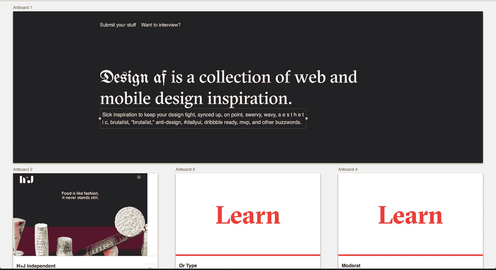
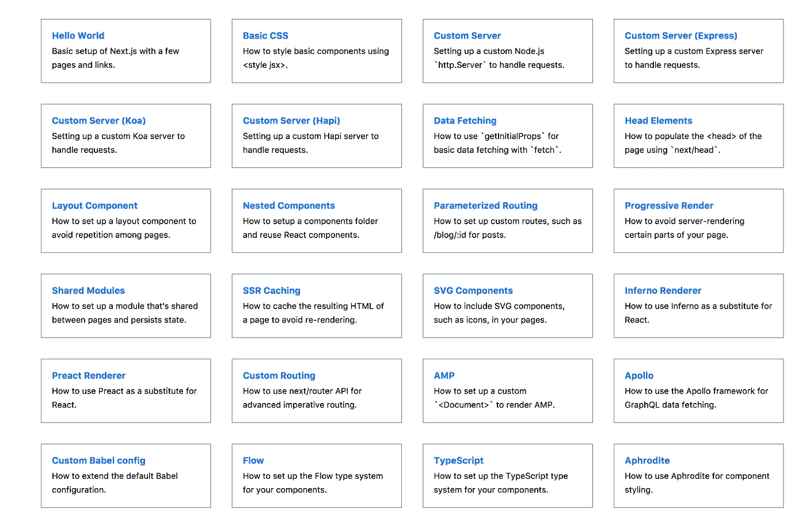
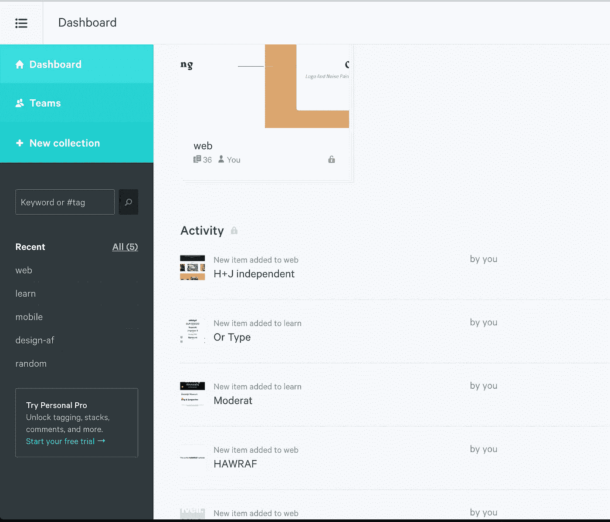
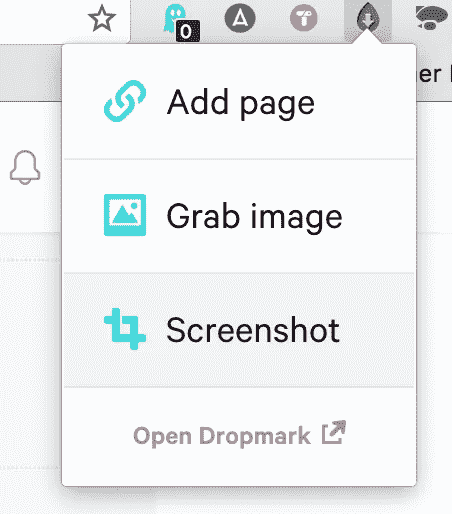
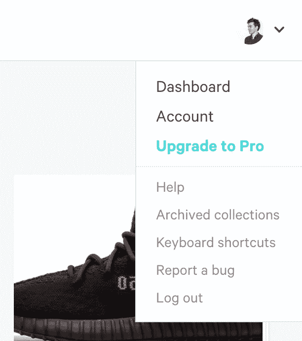

# 用 Next.js 搭建设计灵感板

> 原文：<https://medium.com/hackernoon/building-a-design-inspiration-board-with-next-js-9c0505ba954d>

我与我所在的团队分享了很多联系，这是我与他们保持联系的方式之一。更重要的是，我从中获得了很多满足感；分享一个让别人的工作更愉快和/或更有趣的工具是很棒的。我觉得保留一个公共区域是值得的，在那里我可以分享我所有的设计灵感和我收集的有用的网络花絮。通常我会在推特上发布这些内容，但我也将此视为测试 Next.js 的机会。在这里，我将带您使用该框架构建一个设计灵感板。



It’s called design af so it is.

## 为什么使用 Next.js

下一个。JS 是一个高性能的服务器端渲染节点应用，具有*流星*的简单性，没有性能问题*。*通常，它与 React 结合使用，但它是无限可插的；您可以根据自己的意愿进行任意多或少的配置(如 Sass…或 Redux ),相关文档非常丰富。它内置了大量的性能优化，这意味着您可以更少地考虑设置。



Buzzwords. Buzzwords everywhere.

# 入门指南

我们将创建一个单页应用程序，从 Dropmark feed 获取数据，并使用它来显示图像网格。这个数据是来自 Dropmark 的一个 API 端点的 JSON 响应。我们需要的是能够帮助我们轻松获取数据、对数据进行排序并显示出来的东西。

我们现在将在我的板上使用公共提要，稍后我将带您完成使用您自己的私有板所需的步骤。

创建新目录并安装该项目的依赖项:

```
mkdir design-inspo
cd design-inspo 
yarn inityarn install next moment react react-dom isomorphic-fetch
```

这些都是做什么的？

*   **下一个**处理节点部分和我们所有的资产(styles，js) [在这里阅读更多](https://zeit.co/blog/next2)。
*   **Moment** 处理时间计算，这样我们就可以显示我们什么时候发布了什么。
*   **React** 和 **React-dom** 帮助我们处理界面，这样我们可以用漂亮的 HTML 显示它。实际上，我们可以使用任何 JS 前端框架，甚至什么都不用。对于我们的例子来说，无框架有点棘手。
*   Ramda 帮助我们对数据进行排序，它是下划线和连字符的替代物。

将我们的启动脚本添加到您的`package.json`文件中

```
{
  "scripts": 
   { 
      "dev": "next" 
   } 
}
```

## 创建文件夹布局和初始“index.js”文件

根据下一个 API，我们需要一个`pages/`文件夹。在命令行中运行以下命令:`mkdir pages && touch pages/index.js`。我们将使用我们的`index.js`文件作为包装组件，获取我们所有的数据并将其传递给更小的组件。

我们将从 [Dropmark](http://twnsndco.dropmark.com/396720) 中为我的 *Web* feed 使用端点。我将它公开，这样我们就可以用它作为例子，但是稍后我将分解我们如何将环境变量用于私有板。

下面是我们在那个`index.js`文件中需要的内容:

总结一下，我们从 Dropmark 端点([http://twnsndco.dropmark.com/396720.json](http://twnsndco.dropmark.com/396720.json))异步“获取”数据。当请求完成时，我们返回 json 对象的`items`部分的`data`。这个`data`然后被传递给我们的`Feed`组件。

## 组件化我船长

让我们来处理较小的组件。创建一个`/component`文件夹，并在其中新建一个名为`Feed.js`的文件。这个组件将把我们的数据拉进`map`到一个更小的组件`Post`，我们稍后将创建这个组件。

我们的`Feed.js`文件:

我们向这个*功能组件*传递两个参数:`className`和`posts`。我们可能会使用 className 来设计所有`posts`的容器。`Data`是我们的 JSON 对象，`Feed`组件从我们的`index`组件(index.js 文件)接收该对象。使用数组`data`，我们可以将每个`post`对象`map`到一个`Post`组件。

## 邮报:让我们看看一些东西

在你的`components`文件夹中创建一个`Post.js`文件。我们将打开从`Feed`接收的`post`对象，并使用它来填充一组 HTML 元素。

# 打扮一下

要测试我们的应用程序，运行`npm run dev`并在浏览器中打开 localhost:3000 。您应该会看到一个没有样式的图像和文本流。有了 Next.js，您可以开箱即用地重新加载热模块，这意味着即时的视觉反馈。

因为你是设计师，我不会告诉你如何设计这个；现在，您拥有了制作设计板的所有原材料。我会推荐设置`[styled-components](https://github.com/zeit/next.js/blob/master/examples/with-styled-components)`(好用，ro 写的好看)或者`[cxs](https://github.com/zeit/next.js/blob/master/examples/with-cxs)`(好用，性能好)。

# 让它成为你自己的饲料

要制作自己的订阅源，请在[Dropmark.com](https://www.dropmark.com/)创建一个账户。为您想要共享的内容创建新的收藏。你所有的帖子都会在那里。



At the far left in the sidebar you can see “New Collection”

首先，我要在这个系列中添加几样东西。下载并设置 Dropmark chrome/safari 扩展或他们的 mac 应用程序。通常对于网站，我会截图，这样你就能看到网站的首页。



打开你的新收藏，点击该收藏版块侧边栏标题。从你的浏览器中复制网址。通常是类似于`yourusername.dropmark.com/102333`的东西，然后进入你最右边头像下面的账户设置。向下滚动到私人链接，获取/生成您的私钥。



把这个键也抄下来。在你的项目文件夹的根目录下，创建一个带有密钥`DROPMARK_API_KEY=XXXXXXXXXXX`的`.env`文件，这里你有你的密钥而不是 X。然后在根目录下添加另一个文件，名为`now.json`，内容如下:

```
{
  "dotenv": true
}
```

这让[现在](https://zeit.co/now)知道您已经包含了一个`.env`文件，并且需要访问那里的令牌。

打开你的`index.js`文件，把它改成使用你的新收藏 url 和你的 Dropmark 键。这里我们使用一个字符串模板在生成字符串之前插入我们的密钥。

```
import React from 'react';
import 'isomorphic-fetch';const postEndpoint = `http://<your-user-name>.dropmark.com/<collection-id>.json?key=${process.env.DROPMARK_KEY}`
```

使用`npm run dev`再次旋转你的项目，你现在应该会看到一个列表，上面有你到目前为止添加的图片/网站。

## 部署

要部署一个副本，全局安装带有`npm install -g now`的`now`，并从项目文件夹的根目录运行`now --dotenv` 以将其部署到一个临时 URL。有关自定义网址，请咨询 https://zeit.co/now。

# 有问题吗？造点牛逼的东西？

在 twitter [@twnsndco](https://twitter.com/twnsndco) 上联系我，我会非常乐意帮助你或者给你指出有用的文档。

[](http://bit.ly/HackernoonFB)[](https://goo.gl/k7XYbx)[](https://goo.gl/4ofytp)

> [黑客中午](http://bit.ly/Hackernoon)是黑客如何开始他们的下午。我们是 [@AMI](http://bit.ly/atAMIatAMI) 家庭的一员。我们现在[接受投稿](http://bit.ly/hackernoonsubmission)并乐意[讨论广告&赞助](mailto:partners@amipublications.com)机会。
> 
> 如果你喜欢这个故事，我们推荐你阅读我们的[最新科技故事](http://bit.ly/hackernoonlatestt)和[趋势科技故事](https://hackernoon.com/trending)。直到下一次，不要把世界的现实想当然！

