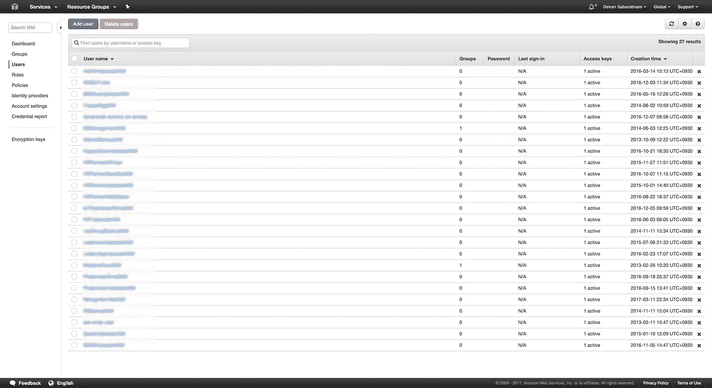
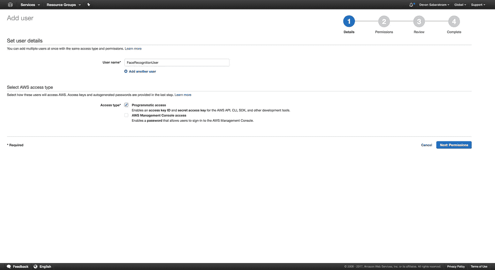
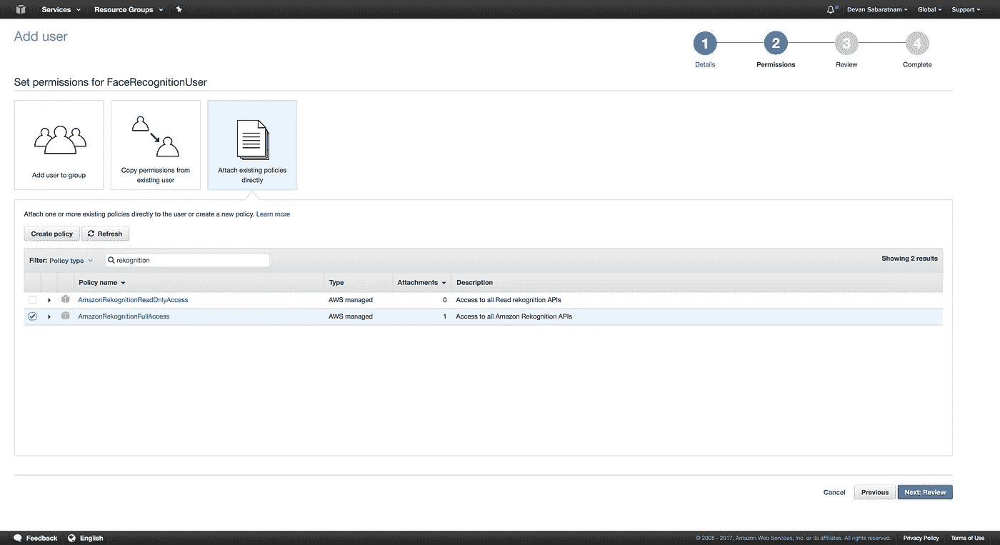
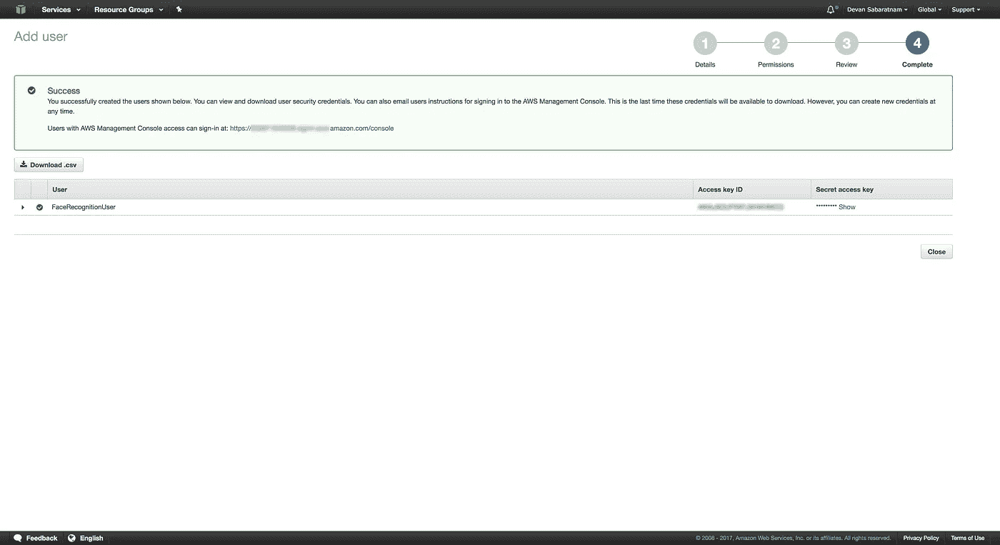

# 在不到一小时的时间内构建一个人脸识别网络应用程序

> 原文：<https://medium.com/hackernoon/building-a-face-recognition-web-app-in-under-an-hour-345aa91487c>


> [原载@ devan-sabaratnam.squarespace.com](https://devan-sabaratnam.squarespace.com/blog/2017/3/13/building-a-face-recognition-app-in-less-than-an-hour)。

上周末，我在浏览我的亚马逊 [AWS](https://hackernoon.com/tagged/aws) 控制台，我注意到上面有一项名为“ [Rekognition](https://aws.amazon.com/rekognition/) 的新服务。我猜这是引起我注意的拼写错误，但我想知道这项服务是什么？亚马逊习惯于以惊人的频率向他们的平台添加新服务，这一次不知何故逃过了我的注意。

所以我深入调查了一下，原来在 2016 年末，亚马逊在他们的平台上发布了他们自己的[图像识别引擎](https://aws.amazon.com/rekognition/)。它不仅可以进行面部识别，还可以进行一般的照片对象识别。它仍然是相当新的，所以细节是粗略的，但我立即兴奋地尝试它。长话短说，不到一个小时，我就完成了一个快速的样本网页，可以从我的电脑摄像头中抓取照片，并在上面进行基本的面部识别。想知道同样怎么做吗？请继续阅读…

我以前曾尝试过面部识别技术，使用第三方库，以及微软的 Face API，但是组装一个简单的原型充满了复杂性和陡峭的学习曲线。但是在浏览 Rekognition 文档时(尽管它们很薄)，我意识到 AWS API 实际上很容易使用，虽然看起来很强大。我等不及了，决定先动手做一个快速原型。

# 目标

我想要一个“快速而肮脏”的单一网页，允许我使用 iMac 相机拍摄照片，并对照片进行一些基本的识别——基本上，我想识别坐在电脑前的用户。

Amazon Rekognition 服务允许您创建一个或多个*集合*。一个集合就是，嗯，一个你告诉它保存的样本照片的面部向量的集合。注意:该服务不存储实际的照片，而是从参考照片获得的测量值的 JSON 表示。

一旦你在亚马逊上有了一个收藏，你就可以拍摄一张主题照片，让它将主题的特征与其参考收藏进行比较，并返回最接近的匹配。听起来很简单，不是吗？的确如此。老实说，编码该网页的前端以获取相机数据实际上比后端执行识别花费了更长的时间——相差 3 比 1！！

因此，简而言之，该网页允许你(1)在 Amazon 上创建或删除面部数据集合，(2)通过捕获的照片将面部数据上传到你的集合，以及(3)将新照片与现有集合进行比较以找到匹配。

哦，作为一个巧妙的附加(4)，我还在这个演示中添加了 Amazon [Polly](https://aws.amazon.com/polly/) 服务，这样在识别出一张照片后，页面就会向照片中的人发送一个口头的、定制的问候！


The simple app (Note: Not my real face! :D )

## 前端

我的第一个问题是用什么库来用我的 iMac 相机捕捉图像。在谷歌上快速搜索后，我在 GitHub 上找到了由 [amw](https://github.com/amw) 开发的惊人的 [JPEG 相机库](https://github.com/amw/jpeg_camera)，它允许你使用标准的 HTML5 画布来执行捕捉，或者回退到用于旧浏览器的 Flash 小部件。我很快拿到了这个库，并根据我的需要修改了示例 [javascript](https://hackernoon.com/tagged/javascript) 文件。

## 后端

对于后端，我完成了一个快速的 Sinatra 项目，这是一个基于 Ruby 的轻量级框架，可以完成 AWS 的所有繁重工作。我实际上广泛使用了 Sinatra(实际上是, [Padrino](http://padrinorb.com/) )来构建我所有的网络应用，并强烈推荐这个平台。

注意:Amazon Rekognition 示例实际上提倡首先将 API 中使用的源照片上传到 Amazon S3 bucket，然后处理它们。我想避免这个双重步骤，而是将图像数据直接发送给他们的 API，我设法做到了这一点。

我也设法用他们的波利问候做了一件类似的事情。我没有将音频保存到 MP3 文件中并播放，而是设法将 MP3 数据直接编码到页面上的标签中，并从那里播放！

## 代码

我已经把这个项目的所有代码放在我的 GitHub 页面上。随便抓，随便叉，随便改进。我将尽力在这里更详细地解释代码。

# 台阶

首先，你需要一个亚马逊 AWS 账户。我不会在这里详细介绍如何设置它，因为你可以在 Google 上找到很多这样做的文章。

## 创建 AWS IAM 用户

但是一旦你在 AWS 上设置好了，我们需要做的第一件事就是创建一个 Amazon IAM(身份和访问管理)用户，该用户拥有使用 Rekognition 服务的权限。哦，我们还将为亚马逊的 [Polly](https://aws.amazon.com/polly/) 服务设置权限，因为一旦我开始使用这些新服务，我就无法停止。

在亚马逊控制台中，点击左上角的“**服务**，然后从大量亚马逊服务列表中选择“ **IAM** ”。然后，在左侧菜单中，点击“**用户**”。这将显示您在控制台上创建的现有 IAM 用户的列表，如果您过去曾经这样做过的话。



单击该列表顶部的“**添加用户**”蓝色按钮，添加新的 IAM 用户。



给用户一个可识别的名称(更多供您参考)，并确保您勾选了“*编程访问*”，因为您将在 API 调用中使用这个 IAM。



接下来是权限设置。确保您单击屏幕上的第三个框，即“*直接附加现有策略*”。然后，在下面的“ *Filter: Policy Type* ”搜索框中，键入“ **rekognition** ”(注意亚马逊语的拼写)以仅过滤 rekognition 策略。从列表中选择“*amazonrecognitionfullaccess*”，勾选旁边的复选标记。

接下来，将搜索过滤器更改为“**波莉**”，并在“ *AmazonPollyFullAccess* ”旁边放置一个复选标记。

快到了。我们现在拥有 Amazon Rekognition 和 Amazon Polly 的 IAM 的完全权限。点击右下方的**下一步:复习**。


在 review 页面上，您应该看到 2 个托管策略，它们赋予您对 Rekognition 和 Polly 的完全访问权限。如果没有，请返回并按照上一步重新选择策略。如果是，则点击右下角的“**创建用户**”。



现在这一页很重要。记下您在此页面上获得的 AWS 密钥和密码，因为我们需要将其合并到下面的应用程序中。

> 这是您唯一一次看到这个用户的密钥/秘密，所以请将信息复制并粘贴到安全的地方，并从这个页面下载包含信息的 CSV 文件并妥善保存。

# 下载代码

下一步，从我的 [GitHub 页面](https://github.com/CyberFerret/FaceRekognition-Demo)下载示例代码，这样你就可以根据需要修改它。转到这个链接，或者下载代码作为 ZIP 文件，或者执行“git clone”将其克隆到您的工作文件夹中。

你需要做的第一件事是在你的工作文件夹中创建一个名为`.env`的文件，并输入这两行，在那里替换你的 Amazon IAM 密钥和秘密(注意:下面这些不是真正的密钥细节):

```
export AWS_KEY=A1B2C3D4E5J6K7L10
export AWS_SECRET=T/9rt344Ur+ln89we3552H5uKp901
```

可选:您也可以在命令行(Linux 和 OSX)上运行这两行代码，将它们设置为应用程序可以使用的环境变量。Windows 用户也可以运行它们，只需将“导出”前缀替换为“设置”。

现在，如果您的系统上安装了 Ruby(注意:不需要完整的 Ruby on Rails，只需要基本的 Ruby 语言)，那么您就可以运行

```
bundle install
```

安装所有先决条件(Sinatra 等)。)，然后就可以打字了

```
ruby faceapp.rb
```

来运行这个应用程序。这应该会在端口 4567 上启动一个 web 浏览器，这样您就可以启动浏览器并转到

```
[http://localhost:4567](http://localhost:4567)
```

查看网页并开始测试。

# 使用应用程序

网页本身相当简单。您应该会在顶部中间看到一个实时流图像，这是来自您的车载摄像头的反馈。

您需要做的第一件事是通过单击页面左下方的链接来创建一个收藏。这将在 Amazon 的服务器上创建一个空集合来保存您的图像数据。注意，这个集合的默认名称是`faceapp_test`，但是您可以在`faceapp.rb` ruby 代码中更改它(第 17 行)。

然后，要开始将面孔添加到您的收藏中，请几个人在您的电脑或桌子/手机前坐下，并确保他们的面孔仅出现在相框中(多个面孔会导致扫描失败)。准备就绪后，在文本输入框中输入他们的姓名，然后点击“**添加到收藏库**”按钮。您应该会看到一条消息，表明他们的面部数据已经添加到数据库中。

一旦你在数据库中建立了几个面孔，你就可以让随机的人坐在摄像机前，点击“比较图像”。希望对于已经加入收藏的人，你可以在屏幕上看到他们的名字，以及个性化的口头问候。

请注意，亚马逊 Rekognition 通常的工作方式是将 JPEG/PNG 照片上传到亚马逊 S3 桶，然后从那里运行处理，但我想绕过这两个步骤，实际上将照片数据作为 Base64 编码的字节流直接发送到 Rekognition。幸运的是，用于 Ruby 的 aws-sdk 允许您使用这两种方法。

现在让我们浏览一下代码。

首先，让我们看看原始 HTML 页面本身。

这是一个非常简单的页面，对于任何熟悉 HTML 创建的人来说都是一目了然的。只是一系列的名称 div，以及按钮和链接。请注意，我们使用 jQuery，还使用 [Moment.js](https://momentjs.com/) 进行自定义问候。值得注意的是`faceapp.js`代码，它完成了所有棘手的事情，以及到 JPEG 相机库的链接。

您可能还会注意到文件底部的`<audio>`标签，您可能会问这是怎么回事——嗯，这将是我们发送给用户的音频问候的占位符(见下文)。

我们来分解一下主 app js 文件。

这将设置 JPEG 相机库，以在屏幕上显示相机馈送，并处理图像的上传。

`add_to_collection()`函数很简单，它从相机获取捕获的图像，然后将用户名作为参数发送到`/upload`端点。该功能将检查您是否实际输入了姓名，否则将不会继续，因为您需要一个短名称作为此面部数据的唯一标识符。

上传功能只是检查对`/upload`的调用是否干净地完成了，如果没有完成，要么显示一条成功消息，要么显示错误。

`compare_image()`函数是当你点击**比较图像**按钮时调用的函数。它只是从相机中抓取一帧，并将照片数据发送到`/compare`端点。这个端点要么返回一个错误，要么返回一个 JSON 结构，其中包含找到的人脸的 id(名称),以及置信度百分比。

如果有一个成功的面部匹配，该函数将继续前进，并将找到的面部名称发送到`/speech`端点。该端点调用 Amazon Polly 服务将自定义问候语转换为 MP3 文件，该文件可以向用户播放。

Amazon Polly 服务以二进制 MP3 流的形式返回问候，因此我们获取该 IO 流并对其进行 BaseEncode64，然后将其作为编码的源链接放在我们的网页上的`<audio>`占位符标记中，然后我们可以对该元素执行一个`play()`，以便使用 HTML5 Web Audio API 通过用户的扬声器播放 MP3。

这也是我第一次将编码数据放在 audio src 属性中，而不是一个物理 MP3 文件的链接，我很高兴地告诉大家，它非常有效！

app js 文件的最后一个是`greetingTime()`函数。这只是根据用户一天中的时间来决定是否说“早上好/下午好/晚上好”。这么简单的东西有很多代码，但我想让他们听到的自定义问候适合他们一天中的时间。感谢[詹姆斯 1x0](https://gist.github.com/James1x0) 给我偷来的[代码片段](https://gist.github.com/James1x0/8443042)！

最后，让我们看看 Sinatra 应用程序的 Ruby 代码。

非常简单的辛纳特拉的东西。顶部是我们对各种 AWS SDK 和其他库的需求。

然后是设置 AWS 身份验证配置的块，以及我们将使用的默认集合名称(您可以随意更改)。

然后，代码的其余部分就是 Sinatra 将监听的端点。它监听 GET on '/'以便向最终用户显示实际的 web 页面，它还监听上面的 javascript 文件向其发送数据的/upload、/compare 和/speech 的 POST 调用。每个端点只有大约 3 或 4 行代码来实际执行面部识别和语音任务，所有这些都记录在 [AWS SDK 文档](http://docs.aws.amazon.com/sdkforruby/api/Aws/Rekognition/Client.html)中。

这是我目前能想到的所有分享内容。请享受这个项目，并让我知道你最终用它来构建什么。就我个人而言，我将这个项目作为一些令人惊叹的新功能的起点，我希望我们的主要网络应用程序[人力资源合作伙伴](https://hrpartner.io/)能够拥有这些新功能。

# 改进的想法

Amazon Rekognition 和 Polly 仍然相当新，所以示例应用程序和文档目前还有点基础，但是这可能是意料之中的，因为与他们的大多数其他服务相比，API 非常容易使用。

我希望他们能改进的一点是对这些服务的控制台支持——特别是检查当前图像集合以进行重新识别的能力。目前，如果不借助纯 API 调用，就不可能看到您有多少个集合，以及每个集合中有多少个图像描述符(或图像 id)。希望这将在未来得到改善。

哦，我还希望有一种更简单的方法在本地创建图像 JSON 概要文件，而不必将编码的图像 BLOB 一路发送到 Amazon 服务器进行解释。我希望 API 的未来版本可以有这样做的本地化功能，因为目前，点击“比较图像”后到服务器的往返可能需要 4 或 5 秒来完成识别。

祝你好运，享受你的面部识别/语音合成之旅。

[](http://bit.ly/HackernoonFB)[](https://goo.gl/k7XYbx)[](https://goo.gl/4ofytp)

> [黑客中午](http://bit.ly/Hackernoon)是黑客如何开始他们的下午。我们是 [@AMI](http://bit.ly/atAMIatAMI) 家庭的一员。我们现在[接受投稿](http://bit.ly/hackernoonsubmission)，并乐意[讨论广告&赞助](mailto:partners@amipublications.com)机会。
> 
> 如果你喜欢这个故事，我们推荐你阅读我们的[最新科技故事](http://bit.ly/hackernoonlatestt)和[趋势科技故事](https://hackernoon.com/trending)。直到下一次，不要把世界的现实想当然！