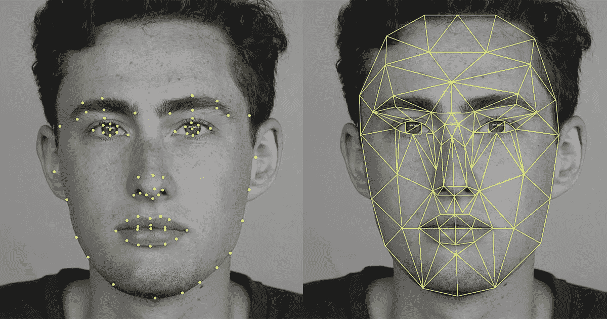
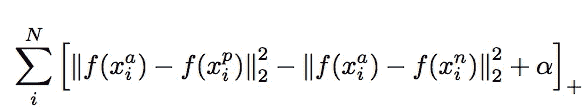
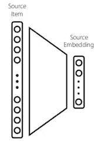
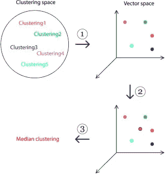
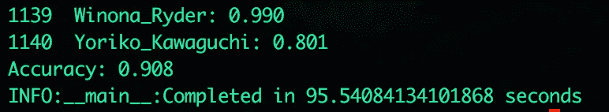

# 在 Tensorflow 中用深度学习构建面部识别管道

> 原文：<https://medium.com/hackernoon/building-a-facial-recognition-pipeline-with-deep-learning-in-tensorflow-66e7645015b8>



在我的[上一篇教程](https://hackernoon.com/deep-learning-cnns-in-tensorflow-with-gpus-cba6efe0acc2)中，你学习了卷积神经网络及其背后的理论。在本教程中，您将学习如何使用卷积神经[网络](https://hackernoon.com/tagged/network)来使用 Tensorflow、Dlib 和 Docker 执行面部识别。

# 概观

*   面部识别简介
*   使用面部检测和对准预处理图像
*   在 Tensorflow 中生成人脸嵌入
*   训练 SVM 分类器

## 先决条件

*   线性代数的基本理解
*   卷积神经网络的基本理解
*   基本张量流理解

# **面部识别系统简介**

面部识别是一种生物识别解决方案，可以测量一个人面部的独特特征。目前可用的应用包括[航班登记](http://www.npr.org/sections/alltechconsidered/2017/06/26/534131967/facial-recognition-may-boost-airport-security-but-raises-privacy-worries)，在照片中标记朋友和家人，以及[“量身定制”的广告。](https://www.theguardian.com/media/pda/2010/sep/27/advertising-billboards-facial-recognition-japan)

要执行面部识别，您需要一种唯一表示面部的方法。1960 年，伍德罗·布莱索使用了一种标记面部显著特征坐标的技术。这些特征包括发际线、眼睛和鼻子的位置。

2015 年，来自谷歌的研究人员发布了一篇论文， [FaceNet](https://arxiv.org/abs/1503.03832) ，它使用了一个依赖于图像像素作为特征的卷积神经网络，而不是手动提取它们。它在 [LFW 数据集](http://vis-www.cs.umass.edu/lfw/)上取得了 99.63%的新纪录准确率。

**FaceNet:** 在 FaceNet 的论文中，提出了一种卷积神经网络架构。对于损失函数，FaceNet 使用“三重损失”。三重损失依赖于最小化与正例的距离，同时最大化与负例的距离。



Triplet loss equation


Triplet loss Learning

从概念上讲，这是有道理的。相同身份的人脸看起来应该比另一个身份的人脸更接近。

**矢量嵌入:**对于本教程来说，重要的一点是将人脸表示为 128 维的**嵌入**。嵌入是将输入要素映射到矢量的统称。在面部识别系统中，这些输入是包含对象面部的图像，映射到数字向量表示。



Mapping input to embedding [source](https://www.slideshare.net/BhaskarMitra3/vectorland-brief-notes-from-using-text-embeddings-for-search)

由于这些向量嵌入在共享向量空间中表示，向量距离可以用于计算两个向量之间的相似性。在面部识别环境中，这可以应用向量距离来计算两张脸有多相似。此外，这些嵌入可用作分类、聚类或回归任务的特征输入。



Example of plotting embeddings in a 3D vector space

# 使用 Dlib 和 Docker 预处理数据

```
# Project Structure├── Dockerfile
├── etc
│ ├── 20170511–185253
│ │ ├── 20170511–185253.pb
├── data
├── medium_facenet_tutorial
│ ├── align_dlib.py
│ ├── download_and_extract_model.py
│ ├── __init__.py
│ ├── lfw_input.py
│ ├── preprocess.py
│ ├── shape_predictor_68_face_landmarks.dat
│ └── train_classifier.py
├── requirements.txt
```

## **准备数据**

您将使用 LFW(野外标注的人脸)数据集作为训练数据。该目录的结构如下所示。您可以按照相同的结构用您的数据集替换它。

```
# Download lfw dataset
$ curl -O [http://vis-www.cs.umass.edu/lfw/lfw.tgz](http://vis-www.cs.umass.edu/lfw/lfw.tgz) # 177MB
$ tar -xzvf lfw.tgz# Directory Structure
# ├── Tyra_Banks
# │ ├── Tyra_Banks_0001.jpg
# │ └── Tyra_Banks_0002.jpg
# ├── Tyron_Garner
# │ ├── Tyron_Garner_0001.jpg
# │ └── Tyron_Garner_0002.jpg
```

## **预处理**

下面，您将在将图像传递到 FaceNet 模型之前对其进行预处理。面部识别环境中的图像预处理通常解决几个问题。这些问题包括照明差异、遮挡、对齐、分割。下面，您将解决分段和对齐问题。

首先，您将通过找到图像中最大的人脸来解决分割问题。这是很有用的，因为我们的训练数据不需要提前为人脸裁剪。

其次，您将解决对齐问题。在照片中，脸部与图像中心不完全对齐是很常见的。为了标准化输入，您将根据眼睛和下唇的位置应用一个变换来使所有图像居中。


Segment, align, and crop

**环境设置**

在这里，您将使用 docker 来安装 tensorflow、opencv 和 Dlib。Dlib 提供了一个库，可以用于面部检测和对齐。这些库可能有点难以安装，所以您将使用 Docker 进行安装。

Docker 是一个简化部署的容器平台。它解决了在不同的服务器环境中安装软件依赖关系的问题。如果你是 docker 新手，可以在这里阅读更多[。要安装 docker，请运行](https://www.docker.com/)

```
curl [https://get.docker.com](https://get.docker.com) | sh
```

安装 docker 后，您将创建两个文件。一个 **requirements.txt** 用于 python 依赖关系，一个**docker 文件**用于创建您的 docker 环境。

Dockerfile

要构建这个映像，请运行:

```
$ docker build -t colemurray/medium-facenet-tutorial -f Dockerfile .# This can take several minutes depending on your hardware
# On MBP, ~ 25mins
# Image can be pulled from dockerhub below
```

如果您想避免从源代码构建，可以使用以下命令从 dockerhub 中提取图像:

```
docker pull colemurray/medium-facenet-tutorial # Recommended# A GPU supported environment can be found here
# nvidia-docker pull colemurray/medium-facenet-tutorial:latest-gpu
```

## 使用 Dlib 检测、裁剪和对齐

创建环境后，您可以开始预处理。

先下载 dlib 的人脸地标预测器。

```
$ curl -O [http://dlib.net/files/shape_predictor_68_face_landmarks.dat.bz2](http://dlib.net/files/shape_predictor_68_face_landmarks.dat.bz2)
$ bzip2 -d shape_predictor_68_face_landmarks.dat.bz2
```

您将使用此面部标志预测器来查找图像中面部的内眼和下嘴唇的位置。这些坐标将用于居中对齐图像。

align_dlib.py

这个文件来自 CMU，提供了检测图像中的人脸、寻找面部标志以及根据这些标志进行对齐的方法。

接下来，您将为数据集创建一个预处理器。这个文件会将每张图片读入内存，尝试找到最大的面，居中对齐，并将文件写入输出。如果在图像中找不到人脸，将会在控制台上显示日志记录和文件名。

由于每个图像可以独立处理，python 的多重处理用于在每个可用的 cpu 内核上处理一个图像。

**获取结果**

现在您已经创建了一个管道，是时候获得结果了。由于脚本支持并行性，您将看到多核运行带来的性能提升。您需要在 docker 环境中运行预处理器来访问已安装的库。

下面，您将把项目目录作为一个卷挂载到 docker 容器中，并对输入数据运行预处理脚本。结果将被写入由命令行参数指定的目录。

```
$ docker run -v $PWD:/medium-facenet-tutorial \
-e PYTHONPATH=$PYTHONPATH:/medium-facenet-tutorial \
-it colemurray/medium-facenet-tutorial python3 /medium-facenet-tutorial/medium_facenet_tutorial/preprocess.py \
--input-dir /medium-facenet-tutorial/**data** \
--output-dir /medium-facenet-tutorial/output/intermediate \
--crop-dim 180
```

> 到目前为止的代码可以在[这里](https://github.com/ColeMurray/medium-facenet-tutorial/tree/add_alignment)找到

## **回顾**

使用 Dlib，您检测到图像中最大的面部，并通过内眼和下唇对齐面部中心。这种对齐是一种标准化每个图像以用作特征输入的方法。

# **在 Tensorflow 中创建嵌入**

现在您已经预处理了数据，您将生成每个身份的矢量嵌入。然后，这些嵌入可以用作分类、回归或聚类任务的输入。

## **下载重量**

您将使用 Inception Resnet V1 作为您的卷积神经网络。首先，创建一个文件，将权重下载到模型中。

通过使用预先训练的权重，您能够将[转移学习](https://cs231n.github.io/transfer-learning/)应用于新的数据集，在本教程中为 LFW 数据集:

```
$ docker run -v $PWD:/medium-facenet-tutorial \
-e PYTHONPATH=$PYTHONPATH:/medium-facenet-tutorial \
-it colemurray/medium-facenet-tutorial python3 /medium-facenet-tutorial/medium_facenet_tutorial/download_and_extract_model.py \
--model-dir /medium-facenet-tutorial/etc
```

## **负载嵌入**

下面，您将利用 Tensorflow 的队列 api 并行加载预处理图像。通过使用队列，可以使用多线程并行加载图像。当使用 GPU 时，这允许在 CPU 上执行图像预处理，而在 GPU 上执行矩阵乘法。

## 训练分类器

输入队列就绪后，您将继续创建嵌入。

首先，您将从您创建的队列中加载图像。训练时，您将对图像应用预处理。这种预处理将向图像添加随机变换，从而创建更多的图像来进行训练。

这些图像将以 128 的批量输入到模型中。这个模型将为每个图像返回一个 128 维的嵌入，为每个批次返回一个 128 x 128 的矩阵。

创建这些嵌入后，您将使用它们作为 scikit-learn 的 SVM 分类器的特征输入，对每个身份进行训练。少于 10 个图像的身份将被丢弃。该参数可以从命令行进行调整。

train_classifier.py

```
$ docker run -v $PWD:/medium-facenet-tutorial \
-e PYTHONPATH=$PYTHONPATH:/medium-facenet-tutorial \
-it colemurray/medium-facenet-tutorial \
python3 /medium-facenet-tutorial/medium_facenet_tutorial/train_classifier.py \
--input-dir /medium-facenet-tutorial/output/intermediate \
--model-path /medium-facenet-tutorial/etc/20170511-185253/20170511-185253.pb \
--classifier-path /medium-facenet-tutorial/output/classifier.pkl \
--num-threads 16 \
--num-epochs 25 \
--min-num-images-per-class 10 \
--is-train # ~16 mins to complete on MBP
```

**评估结果**

现在，您已经训练了分类器，您将为它提供它没有训练过的新图像。您将从前面的命令中删除 is_train 标志来评估您的结果。

```
docker run -v $PWD:/$(basename $PWD) \
-e PYTHONPATH=$PYTHONPATH:/medium-facenet-tutorial \
-it colemurray/medium-facenet-tutorial \
python3 /medium-facenet-tutorial/medium_facenet_tutorial/train_classifier.py \
--input-dir /medium-facenet-tutorial/output/intermediate \
--model-path /medium-facenet-tutorial/etc/20170511-185253/20170511-185253.pb \
--classifier-path /medium-facenet-tutorial/output/classifier.pkl \
--num-threads 16 \
--num-epochs 5 \
--min-num-images-per-class 10
```

在对每个图像的推断完成后，你会看到结果打印到控制台。在 5 个时期，你会看到大约 85.0%的准确性。25 个时期的训练给出了结果:



90.8% @ 25 epochs

# 结论

在本教程中，您了解了机器[学习](https://hackernoon.com/tagged/learning)的历史以及如何实现最先进的流水线。您利用 docker 来管理您的库依赖项，提供了一个与平台无关的一致环境。您使用 Dlib 进行预处理，使用 Tensorflow + Scikit-learn 训练能够根据图像预测身份的分类器。

此处为完整代码:

[](https://github.com/ColeMurray/medium-facenet-tutorial) [## cole Murray/medium-face net-教程

### medium-facenet-tutorial -使用 Dlib 和 Tensorflow 的面部识别管道

github.com](https://github.com/ColeMurray/medium-facenet-tutorial) 

**下一步:**

*   在你自己的数据集上测试！
*   尝试不同的超参数
*   根据性别或年龄等其他标签进行培训
*   实现一个聚类算法来分组相似的脸

# 行动号召:

> 如果你喜欢这个教程，请关注并推荐！
> 
> 有兴趣了解更多关于深度学习/机器学习的知识吗？查看我的其他教程:
> 
> [-深度学习 CNN 的 Tensorflow 与 GPU](/p/cba6efe0acc2)
> 
> [-在谷歌计算引擎上使用 Keras 进行深度学习](/google-cloud/keras-inception-v3-on-google-compute-engine-a54918b0058)
> 
> [-在谷歌计算引擎上使用 Apache Spark 的推荐系统](/google-cloud/recommendation-systems-with-spark-on-google-dataproc-bbb276c0dafd)
> 
> 你可以在其他地方找到我:
> 
> ——推特:[https://twitter.com/_ColeMurray](https://twitter.com/_ColeMurray)