# 用 OpenCV/Python/iOS 构建气泵扫描仪

> 原文：<https://medium.com/hackernoon/building-a-gas-pump-scanner-with-opencv-python-ios-116fe6c9ae8b>

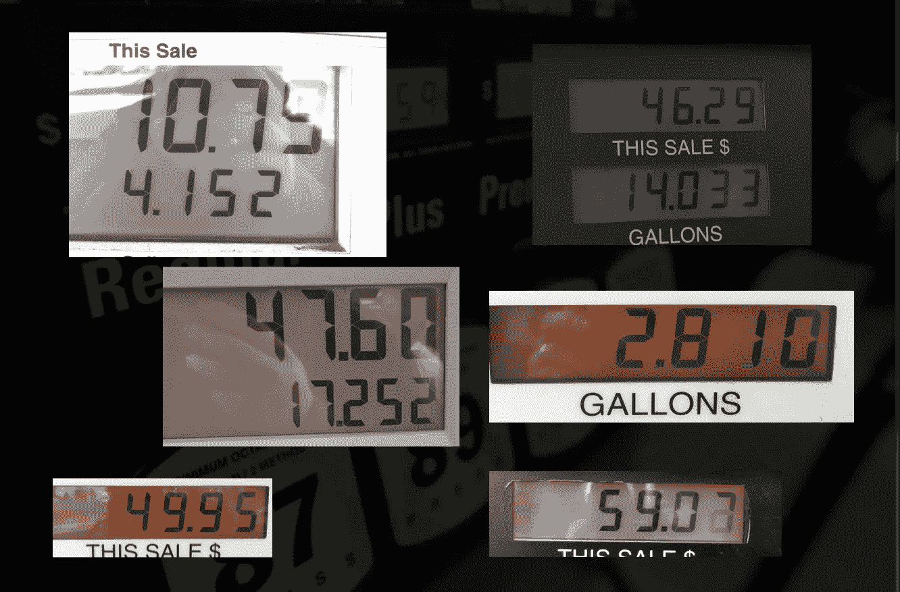

# 概观

去年，我参加了关于[机器学习](https://www.coursera.org/learn/machine-learning)的 [Coursera](http://coursera.com) 课程，我参加该课程的目标之一是，我想在我的一个个人项目中使用从该课程中学到的东西。回到 2012 年，在[学习](https://hackernoon.com/tagged/learning) iOS [开发](https://hackernoon.com/tagged/development)的一次练习中，我在 iOS 应用商店发布了一款名为 [FuelMate](http://fuelmateapp.com) 的气体追踪应用。您可以使用该应用程序来跟踪您的汽油里程数，并具有一些有趣的功能，如 Apple Watch 应用程序、 [vin.li](https://www.vin.li/) 集成以及基于您的趋势 mpg 的视觉效果。

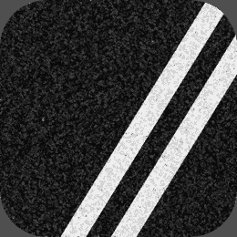

FuelMate

我有一个新的想法，增加一个功能，而不是在应用程序中输入燃料信息，你可以直接从泵中扫描它，怎么样？让我们深入探讨如何实现这一目标。

# 技术

我不想从更新 iOS 应用程序开始，而是想用更容易/更快的方法来证明这一点。我决定这个项目的第一个目标是编写一个简单的 Python 应用程序来拍摄一个气泵的图像，并尝试从中读取数字。一旦我证明了这个想法，我就会把它整合到 iOS 中。

OpenCV 是一个流行的跨平台库，用于计算机视觉应用。它包括各种各样的图像处理工具以及一些机器学习功能。因为它是跨平台的，我希望我可以先用 Python 做原型，然后将处理代码转换成 C++来运行在 iOS 应用程序上。

我的 Python 技能不是很高，所以这也是一次学习 Python 的练习。我已经在 GitHub 上发布了我为这个项目写的所有 Python 代码。本文不是对代码的技术代码审查，而是对进入这个项目的思维过程的高层次的描述。

## 目标

在接触 iOS 代码之前，我有两个主要想法要证明:

*   *我能从图像中分离出数字吗？*
*   *我能确定图像代表哪个数字吗？*

一旦我验证了这两个，我就会花时间更新 iOS 应用程序。从历史上看，每当我触摸我的 iOS 应用程序时，它都会变成比我通常预期的大得多的时间投资。

# 数字隔离

有多种方法可以确定图像中的数字，但我使用简单的[图像阈值](https://en.wikipedia.org/wiki/Thresholding_(image_processing))来尝试找到数字。

图像阈值处理的基本思想是将图像转换为灰度，然后假设任何像素的灰度值小于某个常数，那么该像素就是一个值，否则就是另一个值。最终你得到的是一个只有两种颜色的二进制图像，在大多数情况下是黑白的。

这个概念在 OCR 应用程序中非常有效，但主要问题是决定用什么作为阈值。您可以选择一些常量，或者使用 OpenCV，您有一些额外的选项。您可以使用自适应阈值处理，而不是使用常数，这将使用图像的较小部分，并确定不同的阈值供您使用。这在具有不同照明情况的应用中非常有用，尤其是在扫描气泵中。

一旦对图像进行了阈值处理，就可以使用 OpenCV 的`findContours`方法来查找图像中有白色像素连接部分的区域。一旦你有了轮廓，你就可以裁剪出那些区域，并确定它们是否可能是一个数字，以及它是什么数字。

# **基本图像处理流程**

这是我在测试图像处理时使用的原始图像。它有一些眩光点，但它是一个相当干净的图像。让我们一步一步地完成拍摄这张源图像的过程，并尝试将其分解为单个数字。

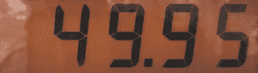

Original Image

## 图像准备

在开始图像处理流程之前，我决定在继续之前调整一些图像属性。这有点反复试验，但我注意到当我调整图像的曝光时，我能够获得更好的结果。下面是我用 Python 中的`cv::Mat::convertTo`调整曝光(alpha)后的图像，这只是图像垫`cv2.multiply(some_img, np.array([some_alpha])`上的一个乘法操作，你可以在这里看到代码

Adjusted exposure

## 灰度等级

将图像转换为灰度。

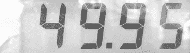

Converted to grayscale

## 虚化

模糊图像以减少噪点。我尝试了许多不同的模糊选项，但发现只有温和的模糊效果最好。

Slightly blurred

## 将图像转换为黑白图像的阈值

在下图中，我使用了带有`cv2.ADAPTIVE_THRES_GAUSSIAN_C`选项的`cv2.adaptiveThreshold`方法。这个方法接受两个参数，块大小和一个调整常数。确定这两个需要一些试验和错误，更多的在下面的优化部分。

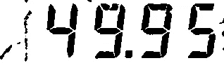

Thresholded to black/white

## 填补空白

由于大多数燃油泵使用某种 7 段液晶显示器，在数字中有轻微的差距，不会与轮廓方法一起工作，所以我们需要使这些部分看起来是相连的。在这种情况下，我们将对图像进行`erode`处理，以连接这些间隙。这可能看起来有些倒退，因为你可能期望使用`dilate`，但是这些方法通常在图像的白色部分工作。在我们的例子中，我们“侵蚀”掉白色背景，使数字看起来更大。

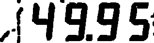

Eroded to bring out the digits

## 反转图像

在我们试图找到图像中的轮廓之前，我们需要反转颜色，因为`findContours`方法将找到白色的连接部分，而目前数字是黑色的。

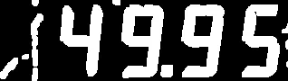

Colors reversed

## 找到图像上的轮廓

下图显示了我们的原始图像，它在上面的图像中找到的每个轮廓周围都有边界框。你可以看到它找到了数字，但也找到了一堆不是数字的东西，所以我们需要把它们过滤掉。

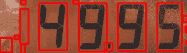

Red boxes show all found contours

## 轮廓过滤

现在我们有了一堆轮廓，我们需要找出我们关心的轮廓。在浏览了一堆气泵显示和场景后，我想出了一套适用于轮廓的快速规则。

1.  收集我们将归类为潜在小数的任何方形轮廓。
2.  扔掉任何不是正方形或高长方形的东西。
3.  匹配具有特定纵横比的轮廓。LCD 显示屏上十个数字中有九个的长宽比类似于下面的一个蓝框高亮显示。该规则的例外是数字“1”，它的长宽比略有不同。通过使用一些样本轮廓，我确定了 0–9！1 个方面为`0.6`，1 个方面为`0.3`。它将使用这些比率和一个+/-缓冲区来确定轮廓是否是我们想要的，并收集这些轮廓。
4.  对潜在的数字应用一组额外的规则，我们将确定轮廓边界是否偏离所有其他潜在数字的平均高度或垂直位置。由于数字应该是相同的大小，并在同一个 Y 上排列，我们可以扔掉任何它认为是数字的轮廓，但不像其他数字那样排列和大小。

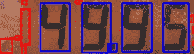

Blue rectangles show our digits/decimal, red are ignored

## 预测

使用两个轮廓桶，一个具有潜在的数字，一个具有潜在的小数，我们可以用这些轮廓边界裁剪图像，并将其输入到训练好的系统中，以预测其值。在“手指训练”一节中有更多关于这个过程的内容。

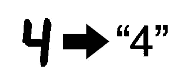

## 求小数

找到图像中的小数是一个需要解决的不同问题。因为它很小，有时会连接到它旁边的数字，所以使用我们对数字使用的方法来确定它似乎是有问题的。当我们过滤轮廓时，我们收集了可能是小数的方形轮廓。一旦我们有了上一步中验证过的数字轮廓，我们将找到数字最左边的 x 位置和最右边的 x 位置，以确定我们期望小数的空间。然后我们将循环这些潜在的小数，确定它是否在这个空间和这个空间的下半部分，并将它归类为小数。找到小数后，我们可以将它插入到前面预测的数字串中。

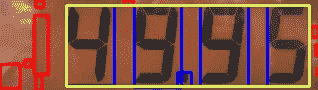

Only look for the decimal within the yellow section

# 数字训练

在机器学习的世界里，解决一个 OCR 问题是一个[分类问题](https://en.wikipedia.org/wiki/Statistical_classification)。我们建立了一组训练数据，例如来自图像处理的数字，将它们分类，然后使用这些数据来匹配任何新图像。一旦我得到了基本的图像隔离工作，我创建了一个脚本，可以循环一个文件夹的图像，运行数字隔离代码，然后将裁剪的数字保存到一个新的文件夹中，供我查看。运行之后，我会有一个未训练数字的文件夹，然后我可以用它来训练一个系统。

由于 OpenCV 已经包含了一个[k-nearest neighborhood](https://en.wikipedia.org/wiki/K-nearest_neighbors_algorithm)(k-NN)实现，我想我应该先尝试一下，这样我就不必引入任何额外的库了。为了训练这一点，我浏览了数字作物的文件夹，然后将它们放入标记为 0-9 的新文件夹中，因此每个文件夹中都有一个不同版本的数字集合。我没有太多这样的图片，但足以证明这是可行的。由于这些数字相当标准，我不认为我需要大量训练有素的图像才能相当准确。

k-NN 的基本工作原理是，我们将加载每幅黑白图像，将图像存储在一个数组中，数组中的每个像素都是开或关的，然后将这些开/关的像素与一个特定的数字相关联。然后，当我们有新的图像要预测时，它会计算出哪个训练图像与这些像素最匹配，并返回最匹配的值。

一旦我组织好了我的数字，我就创建了一个新的脚本来遍历这些文件夹，获取每个图像并将该图像与一个数字相关联。到目前为止，在大部分代码中，Python 和 C++中应用的一般图像处理概念是相同的，但在这里我遇到了一点不同。

在这类应用程序的大多数 Python 示例中，分类被写入两个文件，一个包含分类，另一个包含该分类的图像内容。这通常用 [NumPy](http://www.numpy.org/) 和标准文本文件来完成。然而，由于我想在我的 iOS 应用程序上重用这个系统，我需要想出一种方法来拥有跨平台的分类文件。当时，我找不到任何可以这样做的东西，所以最终编写了一个快速实用程序，它将从 Python 中获取分类数据，并将其序列化为一个 JSON 文件，我可以在 C++端使用 OpenCV 的`FileStorage`系统。这并不漂亮，但是我用 Python 写了一个简单的`Mat`序列化方法，它将为 OpenCV 创建合适的结构，以便在 iOS 端读取。现在，当我训练数字时，我将获得在 Python 测试中使用的 NumPy 文件，然后可以将一个 JSON 文档拖到我的 iOS 应用程序中。你可以在这里看到代码。

# 最佳化

一旦我验证了我的数字隔离和预测这两个目标，就需要优化算法来预测泵的新图像上的数字。

## 指南

在优化的初始阶段，我创建了一个简单的 playground 应用程序，它使用了 OpenCV 为您提供的一些简单的 UI 组件。使用这些组件，您可以创建一些简单的跟踪条来滑动和更改不同的值，并重新处理图像。我围绕`cv2.imshow`方法创建了一个小包装器，它将平铺显示的窗口，因为我厌倦了总是重新定位它们，你可以在这里看到[和](https://github.com/kazmiekr/GasPumpOCR/blob/master/DisplayUtils/TileDisplay.py)。

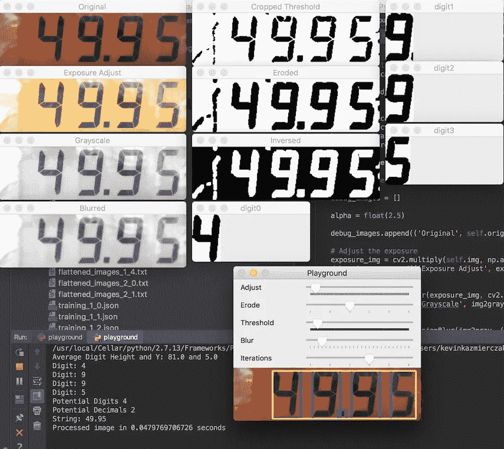

Playground to try different variables

使用操场，我能够加载不同的图像，尝试图像处理中变量的不同变化，并确定我认为的最佳组合。这让我更接近了，但我想更系统地验证这些参数。

## 自动化的

在每个图像上测试不同的变量是一个很好的开始方式，但是我想要一个更好的方式来验证如果我改变一个图像的变量，是否会对任何其他图像产生影响。为了做到这一点，我设计了一个系统来对这些图像进行自动测试。

我把我的每一张测试图片放在一个文件夹里。然后，我用图像中我期望的数字给每个文件命名，用“A”表示小数点。然后，应用程序可以加载该目录中的每个图像，并预测数字，然后将其与文件名中的数字进行比较，以确定是否匹配。这让我可以针对所有不同的图像快速尝试我的更改。

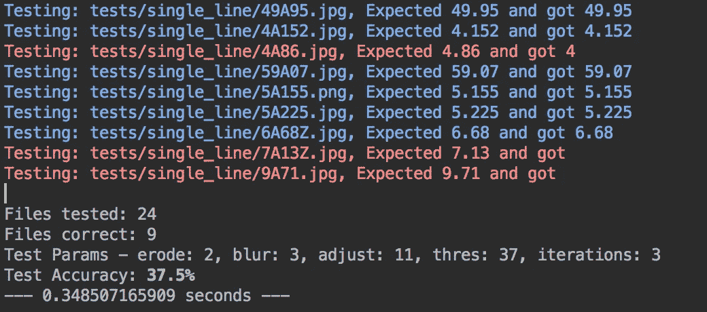

Automated test output

更进一步，我创建了这个脚本的不同版本，它将在这组图像上尝试模糊、阈值等变量的几乎每种组合，并找出具有最佳准确性的最佳变量集。这个脚本花了相当长的时间来运行，在我的机器上大约 7 个小时，但最后出现了一组不同的变量，我在手动测试时没有发现。

# iOS 转换

随着 Python 中的过程和代码的工作，是时候将这个逻辑转换成 C++(技术上客观的 C++)了，这样我就可以将这个逻辑嵌入到我的 iOS 应用程序中。令人欣慰的是，大部分代码很容易从 Python 移植到 C++，因为很多方法和签名都是一样的。其中一个主要区别是，在 C++中，对图像进行操作的方法是在指向图像的指针上工作，而 Python 代码返回的是图像。

我不会深入讨论如何将 iPhone 摄像头连接到图像处理的所有细节，但基本思想是，您可以使用`AVFoundation`类来设置一个`AVCaptureSession`，它将从手机摄像头获取输入，并将像素传输到一个缓冲区委托，在那里您可以运行您的处理逻辑。这种处理通常发生在调度队列上，以避免阻塞主线程。

在我的应用程序代码中，我获取原始像素数据并将其传递给处理器，处理器最终将返回一个预测的数字字符串、一个经过调试处理的可选原始图像以及其预测的基本置信度。一旦它对一个值相当有信心，它就会在屏幕上显示出来。

关于实现中的可用性的一个注意事项是，为了捕捉数字，用户必须点击屏幕上的按钮。我在测试中注意到，你的手按下按钮的动作有时会导致数字重新计算，你可能会得到你不想要的数字。因此，代码不是从你按下按钮的那一点开始取数字，而是取一段时间内最大计算值的移动平均值并显示出来。这有助于在点击按钮进行保存时出现的任何突然移动，也避免了处理器运行时读数的持续抖动。

这是应用程序运行的一个快速剪辑:

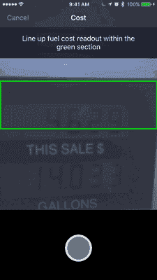

# 结论

这是否是一个任何人都会实际使用的功能还有待确定，但在实现一些机器学习概念和使用 OpenCV 时，这是一个有趣的练习。由于我在家工作，我并不经常给我的车加满油，所以我还没有在现实世界中测试过这一点，但在应用程序中，如果扫描不起作用，你可以给我发送你的燃油泵图像，我可以尝试在未来做得更好。

到目前为止，在我的测试中，该应用程序最大的问题是泵显示屏上的眩光。根据泵处的照明和手机的角度，可能会导致一些扫描不起作用。我仍在寻找处理这些问题的最佳方式。

对于未来的版本，我希望能够一次扫描整个泵显示，然后找到数字，并将它们自动分为成本和金额。由于泵的差异，这些数字并不总是一致的，有时会出现在各个液晶面板上。

我仍然在用不同的想法来分离数字，但我想我会分享我到目前为止所拥有的，看看它是如何进行的。也许有更好的方法来做到这一点；如果你知道任何提示/技巧，请告诉我！

> [黑客中午](http://bit.ly/Hackernoon)是黑客如何开始他们的下午。我们是 [@AMI](http://bit.ly/atAMIatAMI) 家庭的一员。我们现在[接受投稿](http://bit.ly/hackernoonsubmission)，并乐意[讨论广告&赞助](mailto:partners@amipublications.com)机会。
> 
> 如果你喜欢这个故事，我们推荐你阅读我们的[最新科技故事](http://bit.ly/hackernoonlatestt)和[趋势科技故事](https://hackernoon.com/trending)。直到下一次，不要把世界的现实想当然！

