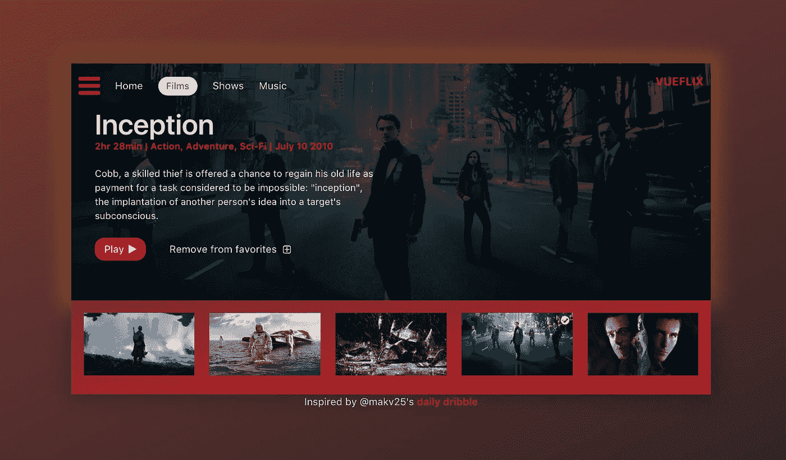
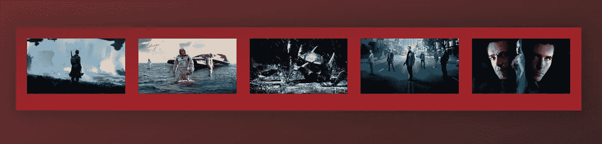
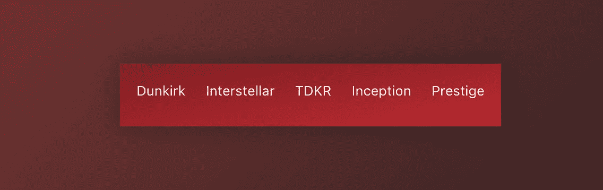
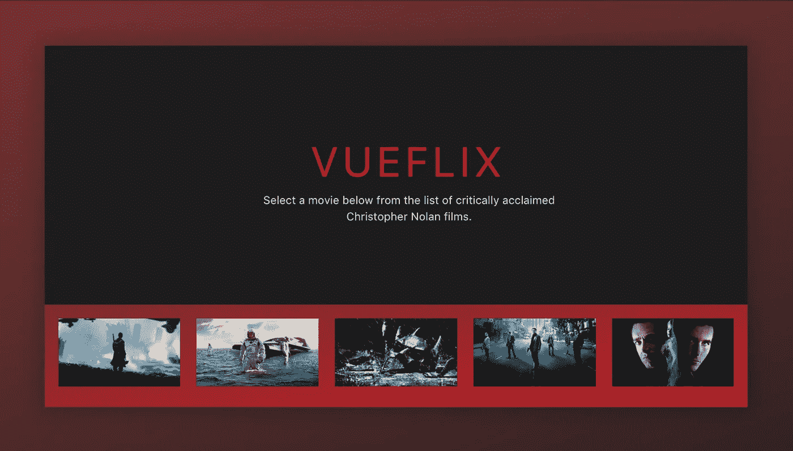
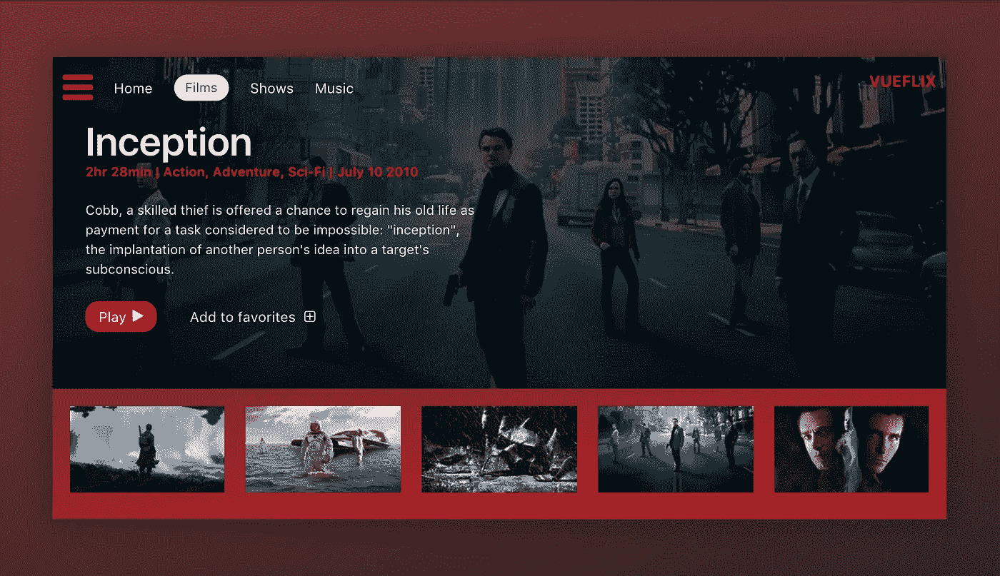

# 用 Vue.js 构建电影 app 界面

> 原文：<https://medium.com/hackernoon/building-a-movie-app-interface-with-vue-js-cdc8aeb5db0b>

## 作者[哈桑·吉尔德(@吉尔德)](https://twitter.com/djirdehh)



# 我们正在建造的东西

我们大多数人使用在线流媒体服务(例如网飞)来观看我们最喜欢的节目/电影。这篇文章将重点介绍如何用 Vue.js 2.0 构建一个类似风格的电影流界面(见上图)。

最终产品:[https://codepen.io/itslit/full/MvvjZr](https://codepen.io/itslit/full/MvvjZr)。

> 虽然[布尔玛](http://bulma.io/)被用作我的应用程序的 [CSS](https://hackernoon.com/tagged/css) 框架，这篇文章将主要关注 Vue.js 的使用，并将浏览任何样式/CSS。如果你想跟着来，我已经设置了一个启动笔，里面有所有的自定义 SCSS、初始数据对象和必要的外部 CDN 库(vue-router 等)。).首发笔:[https://codepen.io/itslit/pen/QMzRev](https://codepen.io/itslit/pen/QMzRev)

# 要求

让我们记下应用程序的要求。

*   介绍(登录)屏幕
*   允许用户选择他/她想要的电影的各种页脚
*   显示电影标题/描述和“立即播放”提示的电影屏幕
*   电影预告片屏幕，在电影“播放”时显示电影的预告片
*   将电影添加到收藏夹的功能

我们将创建一个应用程序，让页脚始终显示，而家庭、电影和电影预告片屏幕将共享相同的空间。

# 数据

为了简单起见，我们将从一个简单/可靠的数据对象(对象)开始，它将作为我们所有组件的主存储。商店将有我们需要的所有电影信息，并将围绕克里斯托弗·诺兰的精彩电影。这是数据对象的一部分:

```
const movies = {
  "dunkirk": {
   "id": 'dunkirk'
   "title": 'Dunkirk',
   "subtitle": 'Dunkirk',
   "description": 'Miraculous evacuation of Allied soldiers from     Belgium, Britain, Canada, and France, who were cut off and surrounded by the German army from the beaches and harbor of Dunkirk, France, during the Battle of France in World War II.',
   "largeImgSrc": `url('https://image.tmdb.org/t/p/w780/fudEG1VUWuOqleXv6NwCExK0VLy.jpg')`,
   "smallImgSrc': 'https://image.tmdb.org/t/p/w185/fudEG1VUWuOqleXv6NwCExK0VLy.jpg',
   "releaseDate": 'July 21 2017',
   "duration": '1hr 46min',
   "genre": 'Action, Drama, History',
   "trailerPath": 'https://www.youtube.com/embed/F-eMt3SrfFU',
   "favorite": false
 },
 "interstellar": {
   ...
 },
 "the-dark-knight-rises": {
   ...
 },
 "inception": {
   ...
 },
 "the-prestige": {
   ...
 }
}
```

# 让我们开始建造吧

现在我们已经创建了主商店对象，并且了解了所有组件的布局，我们可以开始构建界面了。

让我们首先创建 Vue 实例。我们将把实例挂载/附加到 DOM 元素`app`上，并返回全局存储`movies`作为实例数据对象的一部分，以便在 HTML 中访问。

```
const rootApp = new Vue({
  el: '#app',
  data() {
    return {
     movieChoices: movies 
    }
  }
})
```

我们现在可以开始处理每个单独的组件了。

## 页脚部分

让我们从固定页脚部分开始，它列出了数据存储中的所有电影。

```
<div **id="app"**>
 <section class="hero is-primary is-medium">
  <div class="hero-foot">
   <div class="columns is-mobile">
     <div **v-for="movieChoice in movieChoices"** class="column">
       <li class="movie-choice">
         
         <p class="mobile">**{{ movieChoice.subtitle }}**</p>
       </li>
     </div>
    </div>
  </div>
 </section>
</div>
```

处理上面代码片段中加粗的字段:

*   我们已经用`id="app"`创建了 DOM 元素，我们的 Vue 实例将挂载在这个元素上。
*   我们使用本机`v-for`指令来呈现来自数据源`movieChoices`的列表。
*   在每一个列出的`movieChoice` :
    -我们*将*一个图像`src`绑定到我们的电影对象中的`smallImgSrc` url(针对桌面浏览器)。
    -我们使用 [Mustache](https://vuejs.org/v2/guide/syntax.html#Text) 语法进行数据绑定，将`movieChoice.subtitle`显示为移动屏幕的文本。

应用了所有样式/CSS 魔法后，我们的应用程序现在应该是这样的:



Desktop Display



Mobile Display

## 介绍组件(和 Vue 路由器)

因此，我们已经创建了页脚，现在的目标是创建一个介绍组件，有我们的应用程序标题和描述。

我们已经提到，Intro 组件将与即将推出的 Movie 和 MovieTrailer 组件共享相同的空间(即，用户可以通过单击我们应用程序中的相应链接，从 Intro -> Movie -> MovieComponent 中找到自己)。

这是添加`vue-router`库的完美用例。`vue-router`是 Vue.js 的[官方路由器，深度集成允许基于组件的路由器配置、嵌套/视图映射等。](https://router.vuejs.org/en/essentials/getting-started.html)

我们将在 JS 文件中设置路由的基础:

```
**const Intro** = {
  template:
    `<div class="hero-body" style="background: #1e1d1d">
      <div class="container has-text-centered">
        <div class="columns">
          <div class="column is-half is-offset-one-quarter vertical-align">
            <h1 class="home-intro">
              VueFlix
            </h1>
            <p class="home-subintro">Select a movie below from the list of critically acclaimed Christopher Nolan films.</p>
          </div>
        </div>
      </div>
    </div>`
}**const routes** = [
  { path: '/', component: Intro },
]**const router** = new VueRouter({
  routes
})
```

在上面你可以看到我们已经定义了我们的第一个路由组件`Intro`，我们的组件`{ path: '/', component: Intro }`的路由，并实例化了我们的路由器`new VueRouter({ routes })`。

> **注意:**关于如何用 Vue 定义组件模板，有多种方法。Intro 和后续组件使用 ES6 的模板文字来定义跨多行的模板。这里有一篇 Anthony Gore 的精彩文章，重点介绍了在 Vue.js 中定义组件模板的 7 种方法>

我们现在需要将我们的`router`注入到 Vue 实例中，以使我们的整个应用路由器能够感知，并使用`<router-view></router-view>`在我们的 DOM 中呈现我们的 route 组件。

将我们的`router`注入 Vue 实例:

```
const rootApp = new Vue({
  el: '#app',
 **router: router,**
  data() {
    return {
     movieChoices: movies 
    }
  }
})
```

在 DOM 中呈现我们的路由组件:

```
<div id="app">
 <section class="hero is-primary is-medium">
   **<router-view></router-view>**<div class="hero-foot">
    <div class="columns">
     <div v-for="movieChoice in movieChoices" class="column">
       <li class="movie-choice">
         
         <p class="mobile">{{ movieChoice.subtitle }}</p>
       </li>
     </div>
    </div>
   </div>
 </section>
</div>
```

因此，我们已经成功地创建了第一个根路由`path: '/'`来显示我们的`IntroComponent`。添加了所有样式后，我们的应用程序应该是这样的:



Looking good 🎉

## 电影组件(和更多路由)

我们现在已经指定了我们的主要路线和页脚部分。让我们将路由扩展到一个显示特定电影所有信息的电影组件。

首先，让我们把导航设置好。如前所述，我们希望我们的页脚是允许用户在电影之间导航的部分。我们将使用`vue-router`的`router-link` [组件](https://router.vuejs.org/en/api/router-link.html)来启用导航并提供适当的目标位置。

回到我们的 HTML，对页脚部分做一个小小的编辑:

```
<div id="app">
 <section class="hero is-primary is-medium">
   <router-view></router-view> <div class="hero-foot">
    <div class="columns">
     <div v-for="movieChoice in movieChoices" class="column">
 **<router-link :to="`/${movieChoice.id}`" 
                    tag="li"    
                    class="movie-choice">**
         
         <p class="mobile">{{ movieChoice.subtitle }}</p>
 **</router-link>**
     </div>
    </div>
   </div>
 </section>
</div>
```

我们已经建立了``/${movieChoice.id}``的目标位置，它使用 ES6 模板文字将目标 url 标记为每部电影的 id(例如，《黑暗骑士崛起》的路径将是`/the-dark-knight-rises`)。`tag`参数表明我们希望我们的`router-link`呈现为`li`，同时仍然监听点击事件。

为了补充新的导航路径，我们需要为电影组件设置一个动态路径。回到我们设定路线的地方:

```
const routes = [
  { path: '/', component: Intro },
 **{ path: '/:id', component: Movie }**
]
```

我们用到同一个组件`Movie`的每条路由来表示一个动态段`:id`。我们现在将能够通过使用`$route.params.id`来读取组件中不同的动态段。

现在我们已经为电影组件设置好了路线，让我们快速起草组件并确保我们的路线正常工作。

电影组件的初稿:

```
const Movie = {
  template: 
    `<div>
      <div class="hero-body">
       <div class="container has-text-centered">
        <div class="columns">
         <div class="column is-half is-offset-one-quarter      vertical-align">
          <h1 class="home-intro">
           **{{ selectedMovie.title }}**
          </h1>
         </div>
        </div>
       </div>
      </div>
    </div>`,
  **data ()** {
    return {
      selectedMovie: movies[this.$route.params.id]
    }
  },
  **watch:** {
    $route () {
      this.selectMovie()
    }
  },
  **methods:** {
    selectMovie () {
      this.selectedMovie = movies[this.$route.params.id]
    }
  }
}
```

这里有几点需要注意。

```
data () {
 return {
   selectedMovie: movies[this.$route.params.id]
 }
}
```

`data`函数根据`$route.params.id`将组件中的`selectedMovie`属性设置为来自全局`movies`存储的对象。
所以假设电影选择是《黑暗骑士崛起》，那么`selectedMovie`属性就是`movies[the-dark-knight-rises]`。

```
watch**:** {
 $route () {
   this.selectMovie()
 }
},
methods**:** {
 selectMovie () {
  this.selectedMovie = movies[this.$route.params.id]
 }
}
```

我们使用`watch`属性来观察路由中的任何变化，然后调用组件的`selectMovie`方法。`selectMovie`方法只是用选择的新电影再次更新`selectedMovie`参数。当用户从一个电影组件改变到另一个组件(即切换电影)时，这是必须处理的。

测试完所有东西后，我们应该可以看到路线在工作:

It routes! 🎉

现在我们知道我们的路线工作正常，我们将更新我们的电影组件中的模板，以显示关于电影的所有所需信息。*(我只加粗了我将进一步处理的行)*

```
const Movie = {
 template: 
  `<div class="hero-body" 
    :style="{ 'background-image': selectedMovie.largeImgSrc }">
    <header class="nav">
     <div class="container">
      <div class="nav-left">
       <a class="nav-item">
        <i class="fa fa-bars" aria-hidden="true"></i>
       </a>
 **<router-link to="/" class="nav-item is-active">**
        Home
 **</router-link>**
       <a class="nav-item is-active">
        <span class="tag is-rounded">Films</span>
       </a>
       <a class="nav-item is-active">
        Shows
       </a>
       <a class="nav-item is-active">
        Music
       </a>
      </div>
      <div class="nav-right desktop">
       <span class="nav-item">
        <a class="title">
         VueFlix
        </a>
       </span>
      </div>
     </div>
    </header> <div class="container description-container">
     <div class="columns">
      <div class="column is-three-quarters">
       <h1 class="title">{{ selectedMovie.title }}</h1>
       <h4 class="subtitle">
        <p class="subtitle-tag">{{ selectedMovie.duration }}</p>
        <p class="subtitle-tag">{{ selectedMovie.genre }}</p>
        <p class="subtitle-tag">{{ selectedMovie.releaseDate }}</p>
       </h4>
       <p class="description">{{ selectedMovie.description }}</p>
       <div class="links">
 **<router-link 
          :to="{path: '/' + $route.params.id + '/trailer'}"   
          class="button play-button">
           Play <i class="fa fa-play"></i>
        </router-link>**
       </div>
      </div>
     </div>
    </div>
   </div>`,
}
```

我们在导航栏的主页链接中建立了一个`router-link`组件，将用户引导回根路径`/` (Intro 组件)。

我们在电影的播放按钮中引入了另一个`router-link`，它创建了一个目标位置`'/' + $route.params.id + '/trailer'`。这基本上用`/trailer`扩展了电影 id 的当前路径，并且是到我们最终电影预告片组件的导航。

到目前为止，我们应用程序中的电影组件应该是这样的:



🎥

太棒了。既然我们已经建立了适当的`router-link`来引导用户从电影到电影预告片，我们现在需要创建电影预告片组件和伴随的动态路线。

电影预告片组件:

```
const MovieTrailer = {
 template: `
  <div class="trailer-body" style="background: #1e1d1d">
   <div class="has-text-centered">
    <div class="columns">
     <div class="column vertical-align">
      <iframe
       allowFullScreen
       frameborder="0"
       height="376"
       **:src="trailerUrlPath"**
       style="width: 100%; min-width: 536px"
      />
     </div>
    </div>
   </div>
  </div>`,
  **data ()** {
   return {
    trailerUrlPath: movies[this.$route.params.id].trailerPath
   }
  }
}
```

我们使用一个简单的 iframe 来显示 YouTube 上的预告片。我们将 iframe `src`绑定到数据函数中设置的组件属性`trailerUrlPath`。`trailerUrlPath`简单地访问全局`movies`存储，并基于`$route.params.id`获得适当的预告片 url。

伴随的动态路线:

```
const routes = [
  { path: '/', component: Intro },
  { path: '/:id', component: Movie },
 **{ path: '/:id/trailer', component: MovieTrailer }**
]
```

我们此刻的应用程序:

It plays! 🎉

我们快完成了！我们将只处理一个简单的视觉指示器，将电影添加到收藏夹，然后就完成了。

## 添加到收藏夹

主`movies`存储器中的每个电影对象都有一个`favorite`布尔值。我们将用它作为触发器来表示电影是否被添加到收藏夹。

关于视觉显示，我们将有两个视觉提示:
-一个黄色框-电影组件周围的阴影
-页脚组件中列表项内的一个黄色复选标记

我们已经在 SCSS 开设了`favorite-shadow`和`favourite-check`课程来帮助我们解决这个问题。

```
.favorite-shadow {
  box-shadow: 0 0 50px 15px rgba(251, 255, 15, 0.25);
}.favorite-check {
  position: absolute;
  right: 5px;
  top: 5px;
  z-index: 1;
  color: #fcff4c;

  [@media](http://twitter.com/media)(max-width: $medium) {
   position: initial;
   display: block;
  }
}
```

现在，我们需要在电影组件模板和页脚部分应用[条件类绑定](https://vuejs.org/v2/guide/class-and-style.html)。我们还需要为电影组件中的 add to favorites 按钮创建事件处理程序。

对于我们的电影组件:

```
const Movie = {
 template: 
  `<div **:class="[{ 'favorite-shadow': selectedMovie.favorite }, 'hero-body']"**
    :style="{ 'background-image': selectedMovie.largeImgSrc }">
    <header class="nav">
     ...
    </header> <div class="container description-container">
     ...
     ...
     ... <div class="links">
<router-link 
       :to="{path: '/' + $route.params.id + '/trailer'}"   
       class="button play-button">
        Play <i class="fa fa-play"></i>
      </router-link> **<a 
       class="button is-link favorites-button"
       @click="addToFavorites">
      <span
       :class="[{ 'hide': selectedMovie.favorite }]">
       Add to
      </span>
      <span
       :class="[{ 'hide': !selectedMovie.favorite }]">
       Remove from
      </span>
       &nbsp;favorites 
       <i class="fa fa-plus-square-o"></i>
      </a>** </div>
    </div>
   </div>`,
 data() {
  ...
 },
 watch: {
 },
 methods: {
  selectMovie() {
  ...
  },
 **addToFavorites() {
   movies[this.$route.params.id].favorite =
   !movies[this.$route.params.id].favorite
  }**
}
```

上面指定的类绑定规定了`favorite-shadow`类由`selectedMovie.favorite`布尔决定，而`hero-body`类应该总是存在。

我们还在原来的播放按钮后引入了“添加/删除收藏夹”按钮。“添加到收藏夹/从收藏夹中移除”按钮监听`addToFavorites()`方法处理程序，该处理程序只需在点击时切换特定电影的`favorite`布尔值。根据电影是添加到收藏夹还是从收藏夹中移除，文本在“添加到”和“移除”之间切换(`hide`类是一个具有`display:none`属性的创建类)。

类似地，我们还需要为页脚中的复选标记引入条件类绑定:

```
<div id="app">
 <section class="hero is-primary is-medium">
  <router-view></router-view> <div class="hero-foot">
   <div class="columns is-mobile">
    <div v-for="movieChoice in movieChoices" class="column">
     <router-link :to="`/${movieChoice.id}`" 
                  tag="li" 
                  class="movie-choice">
      **<i :class="[{ 'fa fa-check-circle favorite-check':  movieChoice.favorite }]"></i>**
       
       <p class="mobile movie-title">{{ movieChoice.subtitle }}</p>
     </router-link>
    </div>
   </div>
  </div>
 </section>
</div>
```

现在我们应该可以将电影添加到收藏夹列表中了！

It favorites! 🎉

# 干杯！

谢谢你花时间来看这个。我希望这是有益的，你学到了一些东西。

如果你有任何问题/评论/意见，我很乐意听听！

————————♥————
如果你喜欢我的写作风格，并且对学习如何构建 Vue 应用程序感兴趣，我刚刚帮助发布了 [Fullstack Vue](https://www.fullstack.io/vue) ！Fullstack Vue 是一种项目驱动的学习 Vue.js 的方法，因为一切都是在构建更大的应用程序的背景下解释的。Fullstack Vue 目前可用，你可以从主网站[https://www.fullstack.io/vue](https://www.fullstack.io/vue)免费下载第一章