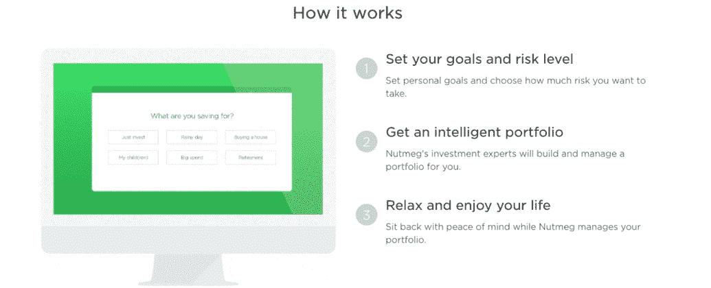

# 建立新企业——第 0 天

> 原文：<https://medium.com/hackernoon/building-a-new-business-day-0-b470b6bbf14a>

## 什么，为什么和如何。


As I started writing this story, I was reminded of Baby Groot. That’s what this business would be. Let’s see if we can help it grow.

> 注意—
> 
> 在我们开始之前，有件事我应该分享一下。
> 
> 这是一个实验，我会在公众的视野下建立这个企业——不管事情结果如何。那是什么意思？这意味着我将每天(或至少每隔一天)更新我们正在做的事情，以及这些事情对我们的影响——就在媒体上。我能公开披露的尽可能多的数据。不管事情进展得好不好，我都会把一切都暴露出来。
> 
> 在最后订阅时事通讯，获得每周更新—我们营销活动的结果等。
> 
> 让我们找点乐子，好吗？

我的 Quora 简历的题目是“企业家精神”。

这是我坚信的事情。这就是我如何学到今天我所知道和做的大部分事情。我实践我所宣扬的。

*这里有更多的背景故事，但也许我们会在其他时间浏览。现在，让我们跳过所有这些，直接跳到要点*。

昨天我们决定在 fin-tech 开始一些事情。我们中的一个人应该做一些基础研究，这将有助于我们缩小范围，以确定我们可以做些什么。不幸的是，他折叠起来比一套便宜的西装还糟糕。幸运的是，他面对的不是奥利弗·奎恩。


“You have failed this city.” — God, I can’t even think that in a normal voice.

让我们看看。我们今天将尝试挑选一个业务部分，决定行动计划等。

# 这里什么都没有。

我们首先需要确定五件事。我们已经建立了 fintech ( *不要问我为什么 fintech 刚刚*)的业务部门，以及印度的地理位置。

```
**#1\. The sector** : Fin-tech**#2\. Geography** : India (to begin with)**#3\. Product** : <yet to be determined>**#4\. Target audience** : <yet to be determined>**#5\. Marketing approach** : <yet to be determined>
```

那么，让我们从产品开始。企业会做什么？我们要解决的问题是什么。我们开始寻找一些有趣的、有挑战性的、有意义的东西——无论是对个人还是对我们的消费者。

# 我们可以做的一些事情。

## #1.点对点资金转移

优点:

*   很好的空间
*   利润丰厚
*   有很多创新的可能性
*   基于便利性运行— *一个伟大的价值主张*

缺点:

*   现在比较拥挤。Paytm、Citrus、Mobikwik 等。已经在那里了。通过 Bhim，政府也进入了这个领域。有一段时间，我一直在等待 Whatsapp 进军这一领域。如果真的发生了，真正的游戏将会开始。
*   产品开发将是一个漫长的周期
*   需要战略联盟
*   高 CAC

`**Verdict : May not be the best thing for us to get into.**`

## #2.跨境支付

优点:

*   大量创新的空间。传统上，这一领域一直由银行和西联汇款(Western Union)等公司主导。问题是它们都太慢，而且通常也很贵
*   汇款市场是一个 6000 亿美元的市场。 *#Cha-ching*

缺点:

*   产品开发——复杂、漫长、乏味。

`**Verdict : May not be the best thing for us to get into.**`

## #3.支付处理

想方设法。这个空间是令人兴奋的，有着庞大的无组织的各式各样的企业和企业主，潜力是巨大的。

但自 Square 以来，这个领域并没有太多创新。我们在印度有 mswipe 和其他公司，他们只是试图复制 Square 在美国的做法。

> 我们非常关注欧洲，与 Square 相比，我们处于完全不同的市场……我们是一家完全不同的公司
> 
> ——雅各布·德·吉尔，首席执行官——伊泽特尔

是啊没错。

更不用说，产品开发将是一场噩梦，走一条相当长的路，然后是需要利用的巨大的商业网络。

*也。我坚信应该把它下线。如果你可以允许离线处理支付——使用智能手机，那么你就是在做饭。这真的打开了空间。但是那个产品会更复杂。*

`**Verdict : Not the best thing.**`

## #4.基于云的贷款

把投资者和中小企业匹配起来，你就是在做菜。你正在为那些不得不依赖银行单一信贷额度的企业创造机会。空间是巨大的，有相当大的希望，可以有多种变化。

对于创业公司来说，你也可以用同样的理念来进行创业投资——至少在天使和种子阶段。你能承担多少投资并不重要，如果你想支持一家初创公司，现在就可以这么做。

对于教育来说，这可能是一个很好的教育贷款工具。我遇到过一些机构，它们向从精选的学校中追求高等教育的学生提供教育贷款(*担保和非担保*)。为什么只有一份精选名单？支持这些贷款的人是这些学校的校友。也许这是他们回馈社会的方式。它很有趣，有新意，是一种好的方法。

`**Verdict : Interesting, but I am not 100% sold.**`

## #5.会计制度

`**Verdict : No**`

*是的。我甚至不打算在这里讨论细节。只是不知道。几年前我试着想过。太复杂的过程。更不用说这样一个事实，除非你能整合来自银行、信用卡等的实时和丰富的交易细节，否则你没有增加多少价值。*

## #6.在线投资

这个——我喜欢。个人投资——无论是为了资本收益，还是为了减少纳税义务。我为什么喜欢？除了资本收益，人们还将“投资”视为增加税后收入的一种方式，尽可能减少他们的纳税义务。不管是你的房租补贴还是其他什么项目，只要能帮你省点税，你都听说过。

优点:

*   即时连接！

缺点:

*   玩家太多

`**Verdict : We have a winner. Will need to do it better than others, but can be worked out.**`

## #7.贸易

我一直很感兴趣的东西。

金融市场交易的整个过程是复杂、乏味、令人麻木和神秘的。用工具武装你的普通人，让事情变得简单，这将是一件有趣且非常令人满意的事情。可以把事情游戏化。这一直让我兴奋。

`**Verdict : The right thing to do. Not the right stage to get into it, though. So, with a heavy heart — No!**`

# 观众→…产品→(几乎)

既然我们已经确定了空间，我们就可以瞄准观众了。你的普通工薪阶层。

首先，低挂的水果。在大城市、大型企业和组织工作的人。

## 那么产品应该是什么呢？

*   理想情况下，它应该是帮助他们进行税务规划和投资的平台
*   它应该能够以完全无痛的方式完成这一切
*   信息和流程应该以一种不会让客户不知所措的方式结束



Nutmeg does something similar — albeit with a different intention. Slightly.

## 我们需要许可证、许可等吗？

是的。一大堆。但是我们现在不想谈这个。因此，目前，我们将在消除拥有这些许可证的必要性的参数范围内工作。

# 下一步？

1.  当然是 MVP
2.  建立一个社区——一个参与并连接到系统的社区
3.  正在为他们的生活增加价值。在那之前，我们不要浪费时间追逐金钱。还是去追我们的观众吧。；-)

# MVP？我们在打造一个产品？

不。我们将从能引出当前课程结束时的产品的东西开始。这只是整个旅程的第一阶段。

# 我们当前的产品会是什么？

嘘…这暂时是个秘密。；-)

那么现在的事情会是什么样子呢？

只是提供信息。我们将向我们的目标受众提供相关的上下文信息；并逐渐开始构建产品的不同部分。

我们将如何做到这一点？我们将每天持续更新我们的旅程。

现在让我们再看一下我们的清单。

看起来我们都准备好了。这应该很有趣，*我希望。*

# 今天到此为止。明天见。

```
**#1\. The sector** : Fin-tech**#2\. Geography** : India (to begin with)**#3\. Product** : Bang for your buck!
(Maximising returns for your investments / Intent-based investments)
*Starting with investments done with the intent of maximising income and reducing tax liability* ***Good god that's complicated. We will simplify it later.*****#4\. Target audience** :
(1) 22-27 year olds. Looking for tax saving
(2) 27-35 yr olds. Looking for long term investments + intent based savings (*a holiday, a car, a house, pre-planning for kids' education*)
(3) 35+ yr olds. Long term gain. Maximising wealth.**#5\. Marketing approach** : 
(1) Start with facebook - the community will be built there
(2) Focus on just segment 1 of the target audience for the time being.
(3) Create and curate meaningful content relevant to their goal
(4) In addition to building a sizeable following on facebook, (a) Build a strong email list (b) Drive pre-registrations for product launch.
(5) No facebook ads for the first 2 weeks. However, both ads as well as organic content would be served to a custom base only - the content tailored on those metrics.
(6) We will pick up one more social media platform - probably Twitter. Instagram/pinterest don't seem relevant. (*Will need to dive deeper before dismissing instagram entirely*)
```

有兴趣看这个故事展开吗？我会在旅途中发送每周更新。每周日订阅这些邮件——就在你的收件箱里(*哦，你可以回复任何一封邮件直接和我联系*)。

# 我们谈谈吧

`[Medium](/@abyshake) | [Twitter](http://twitter.com/@abyshake) | [Facebook |](http://facebook.com/abyshake) [Quora |](http://bit.ly/abyshake) [LinkedIn](http://in.linkedin.com/in/abyshake) | [E-mail](mailto:mail@abyshake.com)`

# [黑客中午](http://bit.ly/Hackernoon)是黑客们下午的开始。我们是 [@AMI](http://bit.ly/atAMIatAMI) 家庭的一员。我们现在[接受投稿](http://bit.ly/hackernoonsubmission)并乐意[讨论广告&赞助](mailto:partners@amipublications.com)机会。

如果你喜欢这个故事，我们推荐你阅读我们的[最新科技故事](http://bit.ly/hackernoonlatestt)和[趋势科技故事](https://hackernoon.com/trending)。直到下一次，不要把世界的现实想当然！

[](http://bit.ly/HackernoonFB)[](https://goo.gl/k7XYbx)[](https://goo.gl/4ofytp)

> [Hacker Noon](http://bit.ly/Hackernoon) is how hackers start their afternoons. We’re a part of the [@AMI](http://bit.ly/atAMIatAMI) family. We are now [accepting submissions](http://bit.ly/hackernoonsubmission) and happy to [discuss advertising & sponsorship](mailto:partners@amipublications.com) opportunities.
> 
> If you enjoyed this story, we recommend reading our [latest tech stories](http://bit.ly/hackernoonlatestt) and [trending tech stories](https://hackernoon.com/trending). Until next time, don’t take the realities of the world for granted!

