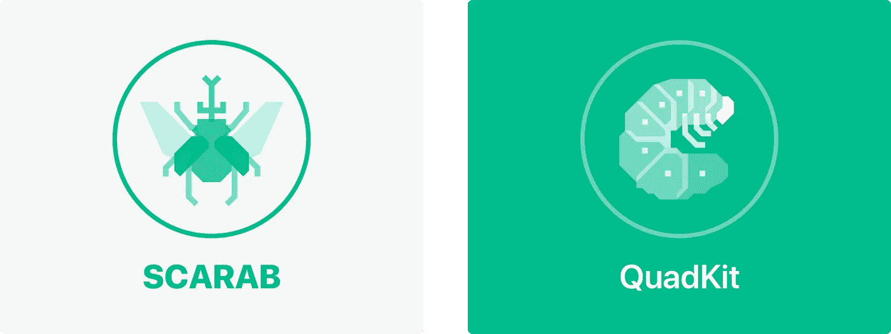
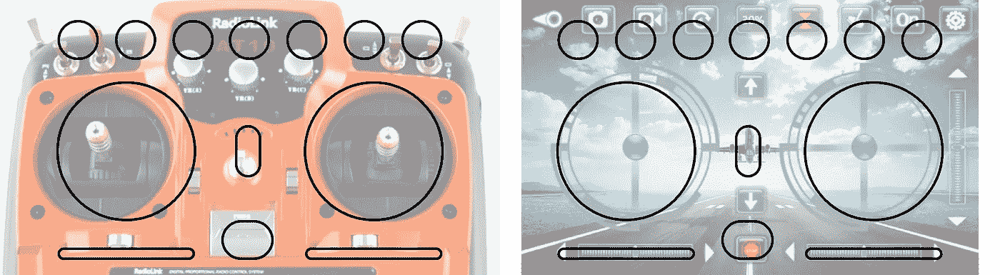
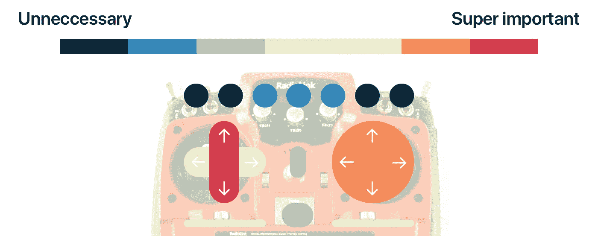
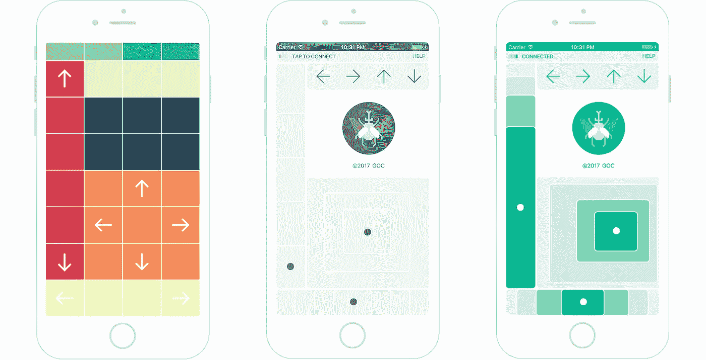
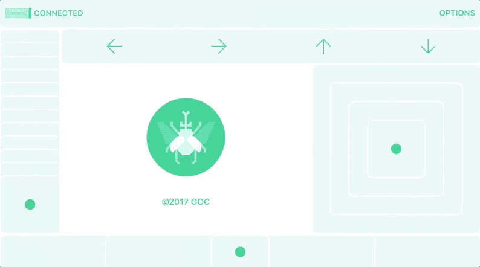
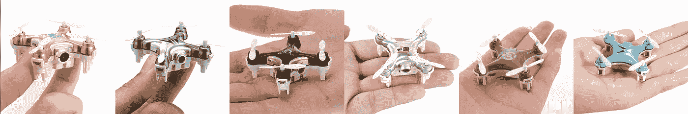
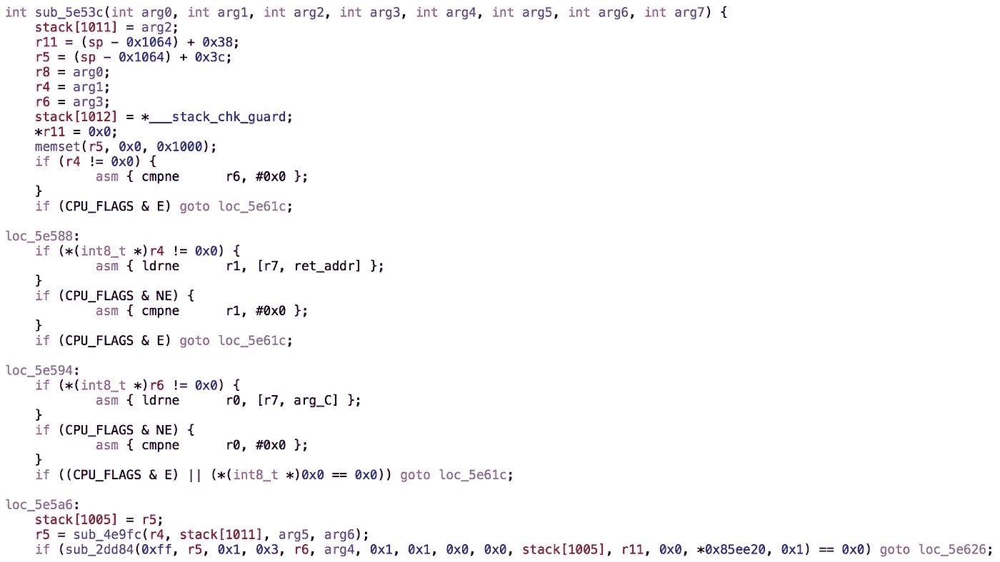

# 为 iOS 构建四轴飞行器控制器并开源内部组件

> 原文：<https://medium.com/hackernoon/building-a-quadcopter-controller-for-ios-and-open-sourcing-the-internals-3bbc7f526ed2>

## 我最近开始涉足无人机，像许多其他人一样，这一切都是从廉价的玩具四轴飞行器开始的

不到 50 美元，你就可以从亚马逊上买到一个响亮的小塑料飞行片，它们非常有趣。其中一些甚至配有摄像头和 Wi-Fi，可以通过手机应用程序进行控制。不幸的是，这些应用程序质量相当低——它们不可靠，使用起来令人沮丧，在 2017 年看起来不合适。

我使用这些应用程序越多，我就越沮丧，所以我开始思考如何提供更好的解决方案，两个月后我发现了两件事:

1.  一个用于飞行的 [iOS](https://hackernoon.com/tagged/ios) 应用[四轴飞行器](https://hackernoon.com/tagged/quadcopters)叫做 [**圣甲虫**](https://itunes.apple.com/us/app/scarab-rc-controller-for-quadcopters/id1205279859) ，以及
2.  一个用于构建 RC 应用程序的开源项目，名为 [**QuadKit**](https://github.com/gabrieloc/QuadKit/)

# 圣甲虫是什么？

四轴飞行器因在飞行时发出令人讨厌的高音调嗡嗡声而臭名昭著，所以以飞行甲虫命名该应用程序是有意义的，甲虫[既雄伟又响亮](https://youtu.be/IT8IOLkmQwE?t=53s)。

我在现有应用中遇到的最大问题之一是，人们普遍忽视了触摸输入，因为它是一种与物理输入完全不同的交互模式。这些应用的设计者没有从这个角度重新思考，而是或多或少地尽可能多地移植了硬件 RC 发射器:

A typical RC transmitter on the left, and the generic app on the right

物理模拟棒提供具有 z 轴的灵活性(即深度)，允许所有的东西更紧密地挤在一起。但是如果没有深度触觉，不看着它使用软件控制器几乎是不可能的。因此，我首先根据我认为最重要的内容对每个控件进行排序，优先考虑需要持续输入的控件(如三维运动)，重新优先考虑不需要一直处于最前沿的控件(如校准)。

在弄清楚输入优先级后，我在绘图纸上勾画了一些布局，这些布局让人感觉舒适，并且更容易在不看屏幕的情况下访问重要的移动控件，将不太重要的非绝对必要的控件推回。例如，开/关开关被故意做得很小，并被推到左上角，因为只有当四轴飞行器打开时，它才真正重要，然后当它着陆并将关闭时，它再次重要。这似乎是一个显而易见的决定，但我注意到常见的控制方案总是有开/关(或一个 killswitch)在前面和中间。

我想出的 UI 系统非常简单，依靠一种主导色调来指示连接状态(绿色表示连接，灰色表示断开)，以及具有不同程度不透明度的大型触摸友好型控制面板来暗示不存在的深度。是的，在很大程度上借鉴了[在制图学中如何描绘海拔](https://en.wikipedia.org/wiki/Contour_line)。

每个对照都是对数的(即在更大的值下指数地更高的灵敏度)，以便更容易提供细粒度和粗粒度控制。虽然很微妙，但用户界面通过利用深度效果来表明这一点，将较高“高度”的矩形放置在最靠近用户触摸的位置，将较低高度的矩形放置在更靠近控制面板边缘的位置。

在为 iOS 构建 SCARAB 后不久，我有了一个小而疯狂的想法:从我的 Apple Watch 上驾驶四轴飞行器会是什么样子？几个月前，我已经和 watchOS 合作开发了[一款 FPS 游戏](http://gabrieloc.com/2016/12/20/SAQQARA.html)，我认为这值得一试。

因此，我花了一个晚上的时间拼凑了一个 watchOS 扩展，它依靠加速度计来控制俯仰和滚动，数字表冠来控制偏航，屏幕上有一个按钮来控制推力。

最大的失败点(也是我应该事先调查的)是蓝牙。因为 watchOS 与四轴飞行器通信的最明显的方式是通过 WatchConnectivity framework(即蓝牙)，我发现太晚了，反馈回路太长，使体验除了沮丧。

下一个合乎逻辑的方法是完全移除手表连接，直接从手表与四轴飞行器通信。但经过一点研究后，很明显，苹果 flatout 不鼓励任何形式的设备联网，几乎不提供任何文档。

话虽如此，我还是乐观地认为总会有一个可行的解决方案，但这绝对需要一个晚上以上的研究！

这篇文章的下半部分将稍微更具技术性，集中在用于构建 SCARAB 的工具，以及我如何将它们打包并开源为 QuadKit。

# 什么是 QuadKit？

如果你在亚马逊上搜索“四轴飞行器”，并按 50 美元以下的[进行过滤，你会看到几乎无穷无尽的产品结果，这些产品几乎没有什么不同，要么是配色方案，要么是框架设计的细微差异。](https://www.amazon.com/gp/search/ref=sr_nr_p_36_1?rnid=386491011&keywords=quadcopter&rh=n%3A165793011%2Ck%3Aquadcopter%2Cp_36%3A1253560011&qid=1487585275&low-price=&high-price=50&x=0&y=0)

Six distinct brands

现在，如果你比较每个型号的应用程序，你会发现它们几乎是一样的。这表明硬件都来自同一个制造商，这意味着解锁一个型号实际上可能会解锁许多型号。QuadKit 是为与四轴飞行器通信而构建的，但如果我的一刀切假设失败，它采用的是不符合任何一个品牌或型号要求的通用方法。通过使其开源，开发者可以灵活地为单个模型提供他们自己的支持。

我的第一个方法是对移动应用程序进行逆向工程，看看它们是如何工作的。

从我所知道的开始，我尝试使用 class-dump 来获得一个类接口列表，从而了解应用程序的结构。通过 SSH 进入一个越狱设备，我可以使用各种工具，如 [dumpdecrypted](https://github.com/stefanesser/dumpdecrypted) 和 [Clutch](https://github.com/KJCracks/Clutch) ，在应用程序在内存中运行时产生一个解密的二进制文件，然后使用 [class-dump](http://stevenygard.com/projects/class-dump/) 获得一个完整的头文件列表。这让我对这个应用的架构有了一个很好的认识。

通过托管一个 [lldb-server](https://lldb.llvm.org/remote.html) 来远程调试运行在内存中的应用程序，我能够使用 class-dump 头来知道在哪里发送消息和在哪里记录结果。这让我了解了数据是在哪里以及如何发送和接收的。

使用 [Hopper](https://www.hopperapp.com) 反汇编解密的二进制文件，然后允许我查看类似于源代码的东西。这揭示了前端是用本机代码编写的，但所有有用的网络逻辑都是用 C 语言编写的(可能还有汇编，但那可能只是反汇编过程的一部分)。结果太混乱了，没有多大用处，大部分是像这样的噩梦:

在花了大约一个星期的时间尝试用 Objective-C 重写所有内容之后(并没有取得很大进展)，我决定做一些研究来寻找一种不需要源代码的方法。不出所料，硬件黑客社区已经遍布玩具四轴飞行器几年了，我发现大量优质资源基本上记录了我试图做的事情，通常是使用 Arduino 的[。通过找到正确的无线电频率，然后逆向工程通信协议，](http://dzlsevilgeniuslair.blogspot.kr/2013/11/more-toy-quadcopter-hacking.html)[迈克尔·梅尔基奥尔](https://mmelchior.wordpress.com/2016/06/06/qc-360-a1-p1/)能够使用 Wii 遥控器来飞行他的玩具四轴飞行器。

由于有大量可用的文档和指导，我能够按照 Jim Hung 关于[对 Hubsan X4 四轴飞行器](http://www.jimhung.co.uk/?p=1424)进行逆向工程的文章(以及他超级方便的[协议规范](http://www.jimhung.co.uk/wp-content/uploads/2014/11/HubsanX4_ProtocolSpec_v1.txt))来构建一个遵循相同协议的 Swift 框架，但不是通过无线电通信，而是通过套接字连接发送数据。

一个有趣的观点再次证实了之前的一刀切假设，即尽管他写的一切都是为了一个完全不同品牌的四轴飞行器，但它与我看到的数据完全一致。如果事实证明是这样的话，我想其他人使用 QuadKit 来帮助构建四轴飞行器软件的潜力会更大。

# 下一步是什么？

QuadKit 在 Github 上公开[可用，有如何贡献的逐步说明，以及如何使用免费工具记录来自四轴飞行器的数据。在未来，我想努力增加第一人称视频支持，特别是为带有摄像头的型号，这可能会使平台更加引人注目。](https://github.com/gabrieloc/QuadKit/)

至于 SCARAB，我想在不久的将来重新调查 watchOS，因为除了双模拟杆式控制方案之外，可能还有很多有趣的新方法来提供控制器输入。暂时可以从[应用商店](https://itunes.apple.com/us/app/scarab-rc-controller-for-quadcopters/id1205279859)免费下载。

如果您有任何问题或者喜欢/不喜欢这里的某些东西，请随时通过电子邮件联系我，地址是[hi@gabrieloc.com](mailto:hi@gabrieloc.com)或者在 Twitter 上联系我，地址是 [@_gabrieloc](https://twitter.com/_gabrieloc) ！

> [黑客中午](http://bit.ly/Hackernoon)是黑客如何开始他们的下午。我们是 [@AMI](http://bit.ly/atAMIatAMI) 家庭的一员。我们现在[接受投稿](http://bit.ly/hackernoonsubmission)并乐意[讨论广告&赞助](mailto:partners@amipublications.com)机会。
> 
> 如果你喜欢这个故事，我们推荐你阅读我们的[最新科技故事](http://bit.ly/hackernoonlatestt)和[趋势科技故事](https://hackernoon.com/trending)。直到下一次，不要把世界的现实想当然！

