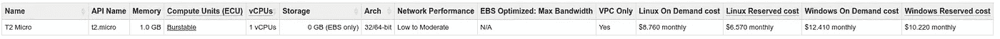
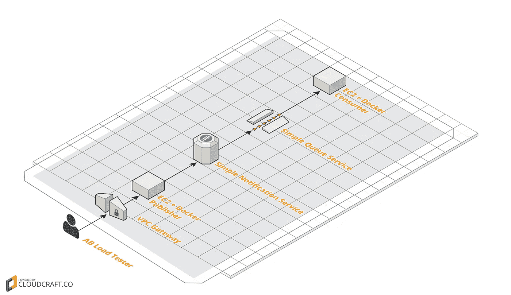
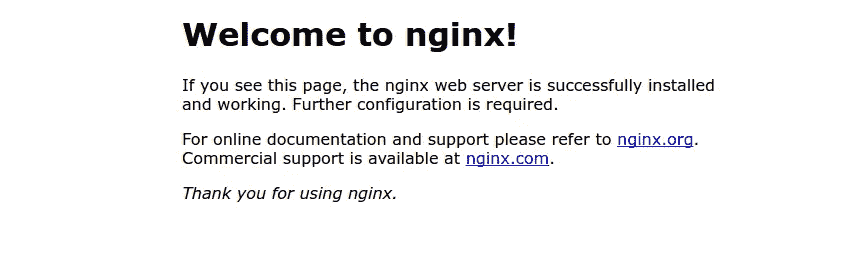
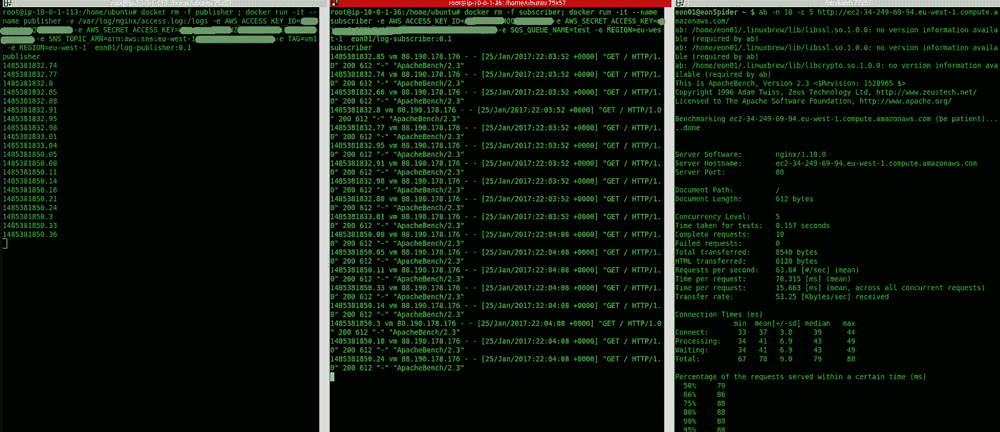
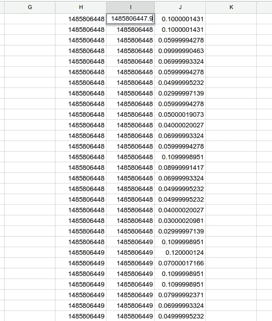
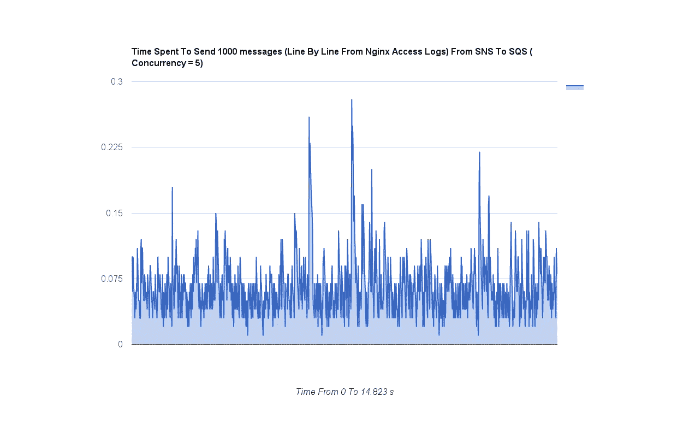
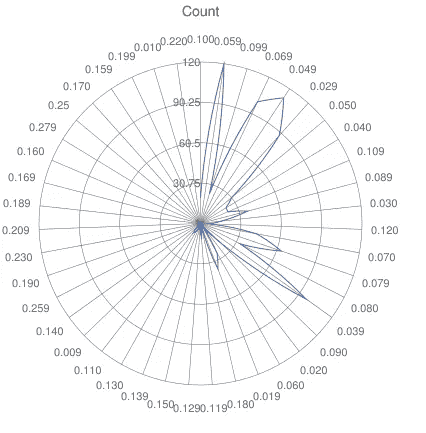
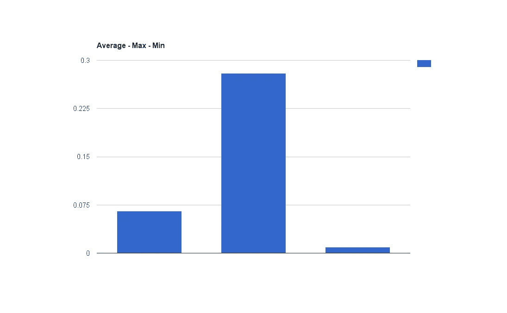

# 利用 Docker、Python、Amazon SNS 和 SQS 构建实时事件驱动的访问日志系统

> 原文：<https://medium.com/hackernoon/building-a-real-time-event-driven-system-using-docker-python-amazon-sns-sqs-985759e660eb>

## 放弃

此内容是我们在线课程/培训的一部分/灵感来源。在 2019 年黑色星期五期间，我们对这些材料提供高达 80%的折扣。

您可以在这里享受您的[折扣。](http://bf.eralabs.io)

[](http://bf.eralabs.io)

这篇文章是我撰写的一系列**实用**文章的**第二部分**，旨在帮助开发者和架构师理解和构建面向服务的架构和微服务。

我在同样的背景下写了其他的故事，比如这些链接:

*   [微服务从开发到生产使用 Docker，Docker Compose&Docker Swarm](/@eon01/microservices-from-development-to-production-using-docker-docker-compose-docker-swarm-3cf37f97706b)
*   [利用 Docker 1.12、AWS EFS 和 Swarm 模式实现简单的 Docker 编排](/@eon01/easy-docker-orchestration-with-docker-1-12-aws-efs-and-the-swarm-mode-87d51b6d5ad2#.59os1v6fd)

这篇文章也是我“精益出版”的书的一部分，名为[无痛码头工人:释放码头工人的力量&它的生态系统](http://painlessdocker.com)。无痛 Docker 是一个**实用的**指南，基于真实世界的例子来掌握 Docker 及其生态系统。

[](http://painlessdocker.com)

[http://painlessdocker.com](http://painlessdocker.com)

在我的上一篇文章中([对微服务架构中进程间通信的亚马逊 SNS & SQS 进行基准测试](https://hackernoon.com/benchmarking-amazon-sns-sqs-for-inter-process-communication-in-a-microservice-architecture-de0dfa8d6ac6#.68wr4qph3)，我使用 SNS/SQS 测试了消息机制，即使基准测试是在我的笔记本电脑上完成的(而不是 EC2 实例)，结果也很好。

上一篇文章出现在许多时事通讯上，所以我决定继续我的测试并发表这篇文章。

**事件驱动架构** ( **EDA** )(或**消息驱动架构)**，是一种软件架构模式，促进消息的生产和消费，同时唤起特定的事件/反应来响应消费的消息。

经典的系统架构会在将数据保存到数据存储(mysql、postgresql、mongodb)后促进数据读取和反应..但这并不是最好的做法，尤其是如果你正在做实时或接近实时的处理，除非你想花时间和精力建立一个即时反应系统，否则请不要使用数据库，而是流数据。

我创建了两台机器(您可以为发布者和订阅者使用一台机器，因为它不会改变网络中的任何东西)



Used EC2 Machines

这是简化的架构，我是 AB 负载测试人员。机器和服务都托管在欧盟-西方-1 地区。

为了最大限度地减少传输时间，建议在同一地区使用发布者和消费者机器。



# 负载测试？

让我们考虑一个 web 服务器将访问日志写入 EC2 磁盘的例子。

在第一台机器上，我安装了 Nginx:

```
apt-get -y install nginx
```



Tested Page

为了简单起见，我保留了默认的 Nginx 页面，我们的测试是关于网络的，而不是 Nginx 负载测试。

从左至右:

*   在第一台机器上，我启动了 publisher 容器，它将读取访问日志并将它们发送到 SNS。
*   在第二台机器上，我启动了消费者容器，它将读取从 SNS 发送到 SQS 的数据(它直接连接到 SQS 服务)
*   在第三台机器上，我的 localhost，我做了一个负载测试，可以看到我发出了 1000 个请求，并发级别为 5



我使用 Apache 基准测试对我的服务器进行负载测试:

```
ab -n 1000 -c 5 http://ec2-34-248-177-221.eu-west-1.compute.amazonaws.com/
```

再说一遍，我的测试主要是关于网络和从以下位置发送的数据:

```
publisher -> SNS -> SQS -> Consumer
```

如果我想测试 Nginx，我可能会设置更高的并发级别。

这是关于请求的另一个有用信息:

```
curl -I http://ec2-34-248-177-221.eu-west-1.compute.amazonaws.com
HTTP/1.1 200 OK
Server: nginx/1.10.0 (Ubuntu)
Date: Wed, 25 Jan 2017 22:17:27 GMT
Content-Type: text/html
Content-Length: 612
Last-Modified: Wed, 25 Jan 2017 21:53:57 GMT
Connection: keep-alive
ETag: “58891e75–264”
Accept-Ranges: bytes
```

当然还有我的测试:

```
Benchmarking ec2-34-248-177-221.eu-west-1.compute.amazonaws.com (be patient)
Completed 100 requests
Completed 200 requests
Completed 300 requests
Completed 400 requests
Completed 500 requests
Completed 600 requests
Completed 700 requests
Completed 800 requests
Completed 900 requests
Completed 1000 requests
Finished 1000 requestsServer Software:        nginx/1.10.0
Server Hostname:        ec2-34-248-177-221.eu-west-1.compute.amazonaws.com
Server Port:            80Document Path:          /
Document Length:        612 bytesConcurrency Level:      5
Time taken for tests:   14.823 seconds
Complete requests:      1000
Failed requests:        0
Total transferred:      854000 bytes
HTML transferred:       612000 bytes
Requests per second:    67.46 [#/sec] (mean)
Time per request:       74.114 [ms] (mean)
Time per request:       14.823 [ms] (mean, across all concurrent requests)
Transfer rate:          56.26 [Kbytes/sec] receivedConnection Times (ms)
              min  mean[+/-sd] median   max
Connect:       31   37  13.3     34     176
Processing:    32   37  10.2     34     141
Waiting:       31   37  10.2     34     141
Total:         63   74  17.7     69     209Percentage of the requests served within a certain time (ms)
  50%     69
  66%     71
  75%     73
  80%     75
  90%     85
  95%     98
  98%    150
  99%    180
 100%    209 (longest request)
```

为了运行 publisher 容器，我启动了我的容器日志——publisher:

```
docker run -it --name publisher -v /var/log/nginx/access.log:/logs -e AWS_ACCESS_KEY_ID=xxx -e AWS_SECRET_ACCESS_KEY=xxx -e SNS_TOPIC_ARN=arn:aws:sns:eu-west-1:xxxx:test -e TAG=vm1 -e REGION=eu-west-1  eon01/log-publisher:latest
```

对订户来说也是一样:

```
docker run -it --name subscriber -e AWS_ACCESS_KEY_ID=xxx -e AWS_SECRET_ACCESS_KEY=xxx -e SQS_QUEUE_NAME=test -e REGION=eu-west-1  eon01/log-subscriber:latest
```

您可以将输出重定向到一个文件中，因为这两个容器都很详细。

# 使用 Python/SNS 创建发布者

T 这是我使用 tailer lib 一行一行地将任何映射到/logs(从容器外部)的文件发布到 SNS 的主要代码。

因为 Docker 支持环境变量，所以我使用这个特性让我的程序也使用我在 Docker Run 命令中使用的相同变量。

```
import boto.sns, time, json, logging
from datetime import datetimeimport os
import taileraws_access_key_id = os.environ['AWS_ACCESS_KEY_ID']
aws_secret_access_key = os.environ['AWS_SECRET_ACCESS_KEY']
region = os.environ['REGION']
sns_topic_arn = os.environ["SNS_TOPIC_ARN"]
tag = os.environ["TAG"]file_path = "/logs"logging.basicConfig(filename="sns-publish.log", level=logging.DEBUG)
c = boto.sns.connect_to_region(region, aws_access_key_id = aws_access_key_id, aws_secret_access_key=aws_secret_access_key)while 1:
    for body in tailer.follow(open(file_path)):
        subject = str(time.time()) + " " + tag
        print str(time.time())
        publication = c.publish(sns_topic_arn, body, subject)
```

# 使用 Python/SQS 创建订阅者

T 他的这段代码也使用 boto 来连接到正确的 SQS，并在收到发送的消息后打印日期。

在这个脚本中，我对环境变量使用了与 Python/SQS 相同的东西。

```
import boto.sqs, time, json
import os
from datetime import datetimeaws_access_key_id = os.environ['AWS_ACCESS_KEY_ID']
aws_secret_access_key = os.environ['AWS_SECRET_ACCESS_KEY']
region = os.environ['REGION']
sqs_queue_name = os.environ["SQS_QUEUE_NAME"]conn = boto.sqs.connect_to_region(region, aws_access_key_id = aws_access_key_id, aws_secret_access_key=aws_secret_access_key)
queue = conn.get_queue(sqs_queue_name)x = 0while 1:
    try:       
        result_set = queue.get_messages()
        if result_set != []:
            message = result_set[0]
            print str(time.time())
            message_body = message.get_body()
            m = json.loads(message_body)            
            subject = m["Subject"]
            body = m["Message"]
            message_id = m["MessageId"]
            conn.delete_message(queue, message)
    except IndexError:
        pass
```

# 基准测试结果

我使用 Google Sheets 来计算两个时间戳之间的差异:

*   发送到社交网站之前的时间(H)
*   刚收到 SQS 消息的时间(一)



这是显示 I 和 J (J = I -HI)之间时间的图表。



测试持续了 **14.823 秒**，在此期间**发送了 1000 个请求**，并发级别为 **5 个请求**。IMHO，这是很好的结果，因为最高响应时间为 **0.28 秒**，最低为 **0.009 秒。**

下面是不同响应时间的分布情况:



Response Time Disctribution

这是另一张图表，我在上面标出了最高、最低和平均运输时间:



Average / Min / Max of SNS->SQS Networking Time

这是所有的乡亲，第三部分即将推出。F **或更多更新，使用这些链接关注我↓**

# 连接更深

Mmicro services 正在改变我们制作软件的方式，但它的缺点之一是网络部分有时会很复杂，消息传递会直接受到网络问题的影响。使用 SNS/SQS 和发布/订阅模型似乎是创建跨服务消息中间件的一个好的解决方案。我使用的发布者/订阅者脚本并没有真正针对负载和速度进行优化，但它们是一个很好的用例。

如果你对这篇文章产生了共鸣，请加入来自世界各地的 1000 多名热情的 DevOps 工程师、开发人员和 IT 专家，订阅 [DevOpsLinks](http://devopslinks.com) 。

你可以在 [Twitter](https://twitter.com/eon01) 、 [Clarity](https://clarity.fm/aymenelamri/) 或我的[网站](http://aymenelamri.com)上找到我，你也可以查看我的书籍和培训: [SaltStack For DevOps](http://saltstackfordevops.com) 、[实用 AWS](http://practicalaws.com) & [无痛码头工](http://painlessdocker.com)。

如果你喜欢这篇文章，请推荐并分享给你的追随者。

> 别忘了查看我的培训[实用 AWS](http://practicalaws.com)

[](http://practicalaws.com)