# 从头开始建立一个真正快速的网站

> 原文：<https://medium.com/hackernoon/building-a-really-fast-website-from-scratch-6c822b1ae1b0>


我喜欢构建工具来帮助解决问题。我也热爱编程。多亏了网络，我制作的[工具可以提供给所有的](/@martindrapeau/csvjson-self-rise-of-an-online-tool-3a91fef3a201)。更好的是，很容易建立一个网站*，这是*的工具。不需要下载。

在这篇文章中，我探索从零开始建立一个网站，考虑 UX，速度，移动，搜索引擎优化和 AMP。

# 要解决的问题

当我用法语写作时，我经常会碰到动词的变化。与英语不同，法语有着时髦的规则。它以“s”还是“t”结尾？有些语法规则人们会忘记。例如，动词“finir”在现在时会以“s”或“t”结尾，而在过去时则不会。

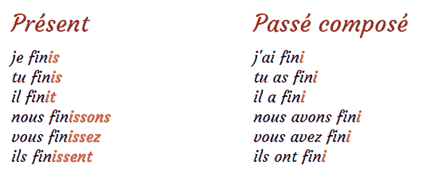

我的本能是用谷歌搜索“conjugaison finir”来找到正确的语法。有很多网站可以给你答案。然而，它们充斥着广告。例如，nouvelobs.com 甚至最终投放了一个大型视频广告，将答案推到了折叠线以下。多么令人沮丧！


当然，这是有解决办法的。我可以安装一个语法检查器。然而，我经常在法语和英语之间切换。检查者总是对纠正错误的语言感到困惑。因此，我避开它们。

在浏览器中，打开一个新标签并搜索“conjugaison finir”非常快。如果有一个干净，超快，无广告的网站给我答案就好了。

在这种困境中生活了几年后，我决定用法语动词变化创建自己的网站。我还想解决我在现有网站上看到的问题。这些是我为网站设定的要求:

1.  没有广告或多余功能的高效设计
2.  容易记忆的域名
3.  很快。非常非常快。低于 1 秒的页面加载。
4.  综合搜索
5.  移动友好
6.  在谷歌中快速查找

这篇文章记录了我建造[T5 的旅程。我认为这是从零开始建立网站的一个很好的练习。](http://conjugaison.xyz)

# 选择域名

选择域名总是很棘手。首先，也是最重要的，这是关于品牌和易于记忆。最终，我希望我的域名包含我要搜索的关键词。在这种情况下“共轭”。然后我会添加动词名称本身。查找动词“finir”的变化将产生这个搜索查询“conjugaison finir”。

不幸的是，conjugaison.com 已经被占用了。逻辑上的变体也是如此:laconjugaison.com*或 conjugaisonverbe.com*或*。我不得不离开网络域名。*

在我的研究中，GoDaddy 提出了一个替代方案:第一年只需 2 美元。我喜欢点 *xyz* 扩展。它听起来很好听，也很容易记住。2 美元，很划算。

SEO 考虑因素呢？Samuel Lavoie 指出，自 2012 年以来，谷歌不再给包含该关键词的网站额外的 SEO 分数。事实上，如果内容很差，他们会惩罚域名完全匹配的网站。EDM 是一个有趣的话题。布莱恩·哈尼什写了一本非常有启发性的关于 EDM 的[指南](https://www.searchenginejournal.com/google-algorithm-history/emd-update/)。简而言之，Samuel 认为有 3 个标准可以用来识别一个质量差的网站:域名中的连字符，精确的关键词匹配和时髦的域名。对我来说太糟糕了，因为*conjulio ison . XYZ*符合这三个标准中的两个。谷歌可能会认为它的质量很差，并降低其排名。

首先，这个网站是给我的。所以我不会担心这个。如果有一天我决定去竞争法语动词变位流量，我会考虑换个域名。然而现在，对于人类来说,*conjulio ison . XYZ*很容易记住。当我和人们谈论它时，他们很容易想起它。

# 简单高效的设计

大多数这些位点不仅仅是接合。比如单词定义，每日一词，最常用的单词等等。在我的情况下，我不在乎这些。我的网站只做一件事，而且要做好——动词的变化。考虑到这一点，我用最少的线绘制了这个线框。


## 页眉

页眉有一个到品牌的链接，该链接也作为到主页的链接；所有动词的列表。还有一个搜索框可以快速找到一个动词。最终，我希望这个搜索框使用谷歌搜索，并驱动到正确的页面。但是这是我将在后续文章中讨论的一个单独的主题。

## 内容

这一页的内容包含有问题的动词的变化。就是这样。没有边栏，没有广告，没有今天的动词或链接到其他动词。

## 页脚

很少有人到达页脚。这是放置作者(和版权)的标准做法。有道理。

## 设计

Bootstrap 相当普遍。我已经使用它很多年了，它是我使用的自然 CSS 框架。我决定只下载最基本的东西。 [Bootstrap 3 内置定制器](https://getbootstrap.com/docs/3.3/customize/)工具，下载你想要的。


最终缩小的 CSS 文件为 57kb，主题文件为 24kb。好的，不算太坏。此外，缩小的 CSS 文件不会改变。我绝对可以将这些资产推向 CDN。

这是最终的设计。

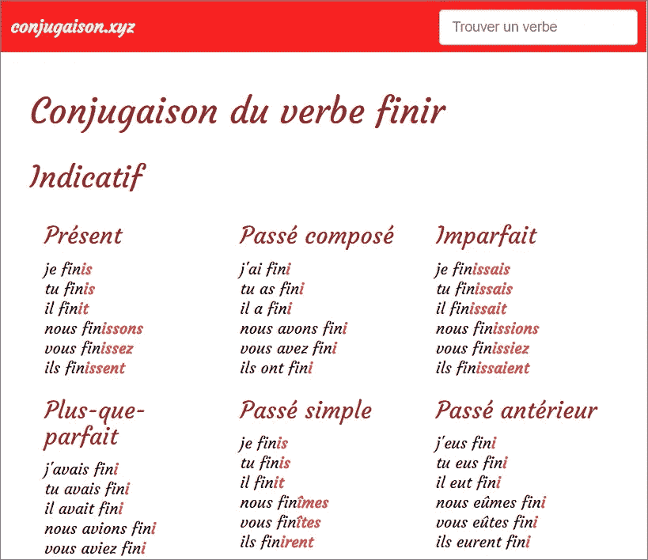

# 如何使它快速

速度应该永远被认为是一个特征。我努力不在速度上妥协。我相信，一个需要很长时间加载的网站是失败的。似乎我不是唯一一个。根据阿卡迈和 gomez.com 的一项研究，慢速网站的废弃率急剧上升。大多数用户希望网站在 2 秒内加载完毕。我会尽量在 1 秒钟内完成。

当一个开发者想到一个快速的网站时，不同的技术会出现在他们的脑海中。有后端语言:Java，python，node JS，C#，ruby，PHP。有数据库:MySQL，MS SQL，Mondo DB。有前端库和框架:React，Angular，Vue，plain jQuery。有裸机服务器，VPS(虚拟专用服务器)和 docker 容器。最后，人们还考虑使用 CDN(内容交付网络)来提供静态内容，如图像、Javascript 和 CSS 文件。

## 后端

对于纯粹的静态网站*来说，后端技术更多的是个人偏好和知识的问题。Java、Node JS 或 PHP 都可以完成这项工作。我选择 PHP 是因为我已经有了使用 LAMP (Linux Apache MySQL PHP)构建网站和应用程序的经验。*

2017 年 3 月[，我从 Rackspace 转到了亚马逊 Lightsail。我对 VPS 的质量和价格非常满意。我有一个 1GB 的内存服务器，每月花费 10 美元，我在上面运行我所有的个人项目。我选择了 Bitnami 供电的灯堆。](/@martindrapeau/goodbye-rackspace-hello-amazon-lightsail-bc7be0d8af3f) [Bitnami LAMP](https://bitnami.com/stack/lamp) 是 Ubuntu 预配置了 Apache，MySQL，PHP。它也有 [PageSpeed](https://en.wikipedia.org/wiki/Google_PageSpeed_Tools#PageSpeed_Module) 来缓存 JS、CSS 和图像资源。它还包括流行的 PHP 框架，如 Codeigniter、Laravel 或 Zend。总的来说，Bitnami 灯是有据可查的，易于使用。

[如今 HTTPS 至关重要](https://blog.malwarebytes.com/101/2017/09/google-reminds-website-owners-to-move-to-https-before-october-deadline/)多亏了 Let's Encrypt，安装 SSL 证书变得简单而且完全免费。Bitnami 提供了一个优秀的[让我们加密如何引导](https://docs.bitnami.com/bch/how-to/generate-install-lets-encrypt-ssl/)。

## 前端

在前端，我决定不使用任何东西——完全不使用 Javascript。没错，你没看错。**没有 JAVASCRIPT** 。*由静态网页组成。因此，我决定探索一下不加载任何 Javascript 能走多远。*

此时，我考虑是应该生成静态网页还是使用 PHP 动态构建页面。

# 解决方案 1——CDN 上的静态页面

我的第一个尝试是为每个动词创建一个静态页面，并将它们推送到 CDN。也就是 2000+静态网页。当我尝试构建静态页面时，我遇到了一个问题，即任何设计更改或任何 bug 修复都需要重新生成 2000 多个静态页面，并将它们重新推送到 CDN。更新 CDN 上的 2000 多个页面确实需要时间。即使有好的 CI(持续集成)工具，也没有办法克服更新这些页面的延迟。

静态页面解决方案看起来非常过时，原因有二。首先，它会非常低效。这让我想起了以前用 FTP 把文件传到服务器的日子。如今，在服务器上执行 git pull 要高效得多——只需获取更改。

其次，对于静态文件，我会失去动态构建页面的动力。比起静态页面，我更喜欢这个选项。

您可能会认为动态构建页面比提供静态网页要慢得多。这个问题的答案是肯定的，也是否定的，我将在下一节展示。

# 解决方案 2 —服务器生成的 HTML

我的第二个尝试是使用 PHP 动态生成 HTML。我在这里的假设是，我的服务器可以渲染 HTML 并足够快地发送它。我的目标受众在地理上集中在北美的东海岸，在讲法语的魁北克省。我的亚马逊 Lightsail 服务器位于俄亥俄州。我想网站会加载得很快。第一个字节的足够时间(TTFB)肯定是 40 毫秒。那相当快。总体来说，来自蒙特利尔的 HTML 文档不到 200 毫秒，有时甚至更快。我的假设被证明是正确的。

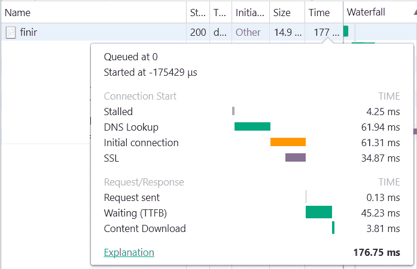

在这一点上不必担心 cdn 给了我最大的优势，能够在 prod 网站上实时入侵。改变网站只需要更新服务器上的 PHP 文件，瞧！

顺便提一下，没有什么能打败解释性语言的动态性和部署速度。在我的例子中，我简单地使用 git 作为我的 CI。在服务器上，我运行“git pull ”,一切都是最新的。简单是福。

当然，如果我的服务器每秒钟收到数千个请求，那就是另一回事了。CDN 提供了不打服务器的优势。我不认为法语动词变位有那么受欢迎。所以我不会担心这个。

# 集成搜索和用户体验

不需要下载、解析、解释和执行 Javascript 使得页面速度更快。如今，我们已经习惯了在页面上加载 Javascript。有了 React，Vue 或者 Angular，就没有办法了。幸运的是，我的网站不需要这些。只是 HTML。一些非常令人满意的返璞归真的东西。

我唯一的问题是关于综合搜索表单。


```
<form class=”search” action=”/recherche” target=”_top”>
  <input name=”term” type=”text” placeholder=”Trouver un verbe”
         value=”<?=isset($term) ? $term : ‘’?>” />
</form>
```

事实证明表单提交内置于 HTML 中(在使用 jQuery 和 Javascript librairies 多年后，我倾向于忘记这一点)。按回车键只是提交给服务器。由于我的页面很轻，加载速度很快，所以不需要客户端 AJAX。当执行搜索时，浏览器追加查询字符串`?term=miner`并从服务器加载新页面。例如，在搜索框中输入 miner 会加载页面[https://conjugaison.xyz/recherche?term=miner](https://conjugaison.xyz/recherche?term=miner)。

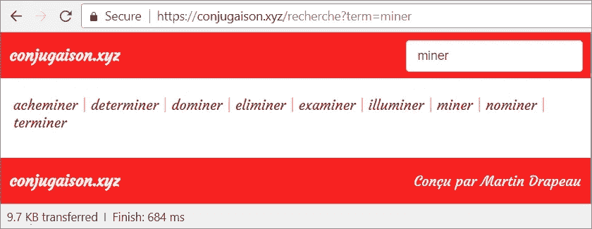

# 改善搜索用户体验

搜索涉及两次页面加载。第一个列出了搜索结果。然后用户点击想要的动词进行第二次页面加载。这能更快吗？为什么不在搜索结果下面显示最匹配的动词的完整变化。我修改了网站来做到这一点。现在，只要我们找到一个匹配项，你就可以保证在任何搜索之后都有动词变化。此外，当您单击另一个匹配的动词时，搜索词仍然存在。

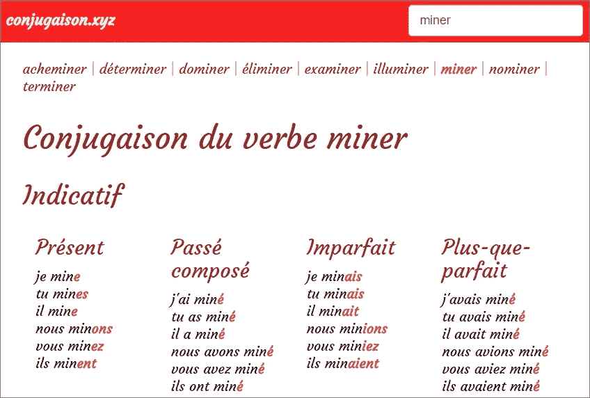

在后端，搜索页面`/recherche`简单地重定向到`/verbe`页面。在我们的特殊情况下，这是重定向:

呼叫 https://conjugaison.xyz/recherche?term=miner。

改道去 https://conjugaison.xyz/verbe/miner?term=miner。

我喜欢这个解决方案。它就像是谷歌的“我很幸运”的混搭，搜索结果直接嵌入页面，以避免点击浏览器页面。非常高效。

## 打开搜索

几年前，Chrome 直接在浏览器地址栏引入了搜索。我记得那天——那是一个啊哈！瞬间。它消除了输入框，从而改善了用户体验。也有一次，自动完成功能被添加到地址栏中，在你输入时显示过去的搜索和访问过的网站地址。

最近，我发现了地址栏的另一个很酷的地方——集成的站点搜索。打开一个新的浏览器标签，输入“conjugaison.xyz”。点击空格键，注意会出现一个竖线。你输入的任何内容都会调用我的网站上的综合搜索。

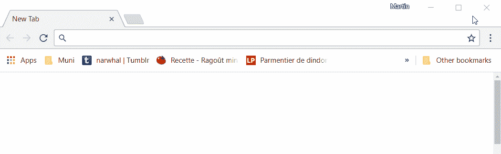

Integrated browser search via Open Search

多亏了[开放搜索](http://www.opensearch.org/Home)，这才成为可能。OpenSearch“是一个技术集合，它允许以适合联合和聚合的格式发布搜索结果”( [OpenSearch in Wikipedia](https://en.wikipedia.org/wiki/OpenSearch) )。RSS 和 Atom 提要就是其中的一部分。集成浏览器搜索也是如此。

为了在你的网站上启用 OpenSearch，你需要创建一个 [OpenSearch 描述文档](http://www.opensearch.org/Specifications/OpenSearch/1.1#OpenSearch_description_document)；一个 XML 文件，它告诉搜索引擎调用什么 URL 来执行搜索。这是我的网站上的 [opensearch.xml。](https://conjugaison.xyz/opensearch.xml)

```
<OpenSearchDescription xmlns=”http://a9.com/-/spec/opensearch/1.1/" xmlns:moz=”http://www.mozilla.org/2006/browser/search/">
  <ShortName>conjugaison.xyz</ShortName>
  <Description>Conjugaison des verbes en français</Description>
  <InputEncoding>UTF-8</InputEncoding>
  <Image width=”16" height=”16"
   type=”image/x-icon”>
    https://conjugaison.xyz/favicon.ico</Image>
  <Url type=”text/html” method=”get”
   template=”https://conjugaison.xyz/recherche?term={searchTerms}"></Url>
</OpenSearchDescription>
```

`Url`标签告诉浏览器使用指定的 URL 通过`HTTP GET`进行搜索。它说结果将是一个 HTML 文档。

除此之外，你必须在你的 HTML 文档中添加一个链接`meta`标签来通知浏览器并允许[自动发现你的搜索插件](https://developer.mozilla.org/en-US/docs/Web/OpenSearch#Autodiscovery_of_search_plugins)。

```
<link rel=”search” type=”application/opensearchdescription+xml” href=”/opensearch.xml”>
```

# 在移动设备上快速友好

Bootstrap 开箱即可响应，因此网站已经是移动的。一个必要的改变是防止导航栏在狭窄的屏幕上折叠。通过一点 CSS，我能够在 iPad 和 iPhone 4 上获得以下响应结果。在一个非常窄的屏幕上，标签行隐藏在导航栏中。搜索框位于品牌下方。我还缩短了标题，以确保重要内容在折叠上方。

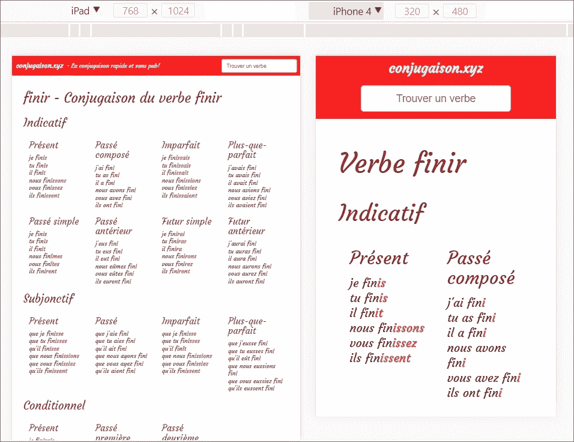

移动端的性能如何？我使用开发工具的[性能审计](https://developers.google.com/web/updates/2017/05/devtools-release-notes#lighthouse)进行了进一步的测试。它测量在典型的移动设备和 3G 连接上体验的性能(代码[通过将连接速度限制到 1.6Mbs](https://github.com/GoogleChrome/lighthouse/blob/master/lighthouse-core/lib/emulation.js) (平均 3G 连接速度)来模拟移动)。

这是审计结果:


98/100 的分数和 2.100 秒的互动时间，这已经很不错了，但是是我设定的 1 秒目标的两倍？进一步的分析指出了一件减慢页面速度的事情:我使用的自定义字体。根据审计，我们在加载和绘制西葫芦字体上损失了 570 毫秒。因此，我做了一个实验，去掉了自定义字体。我重新运行了审计:

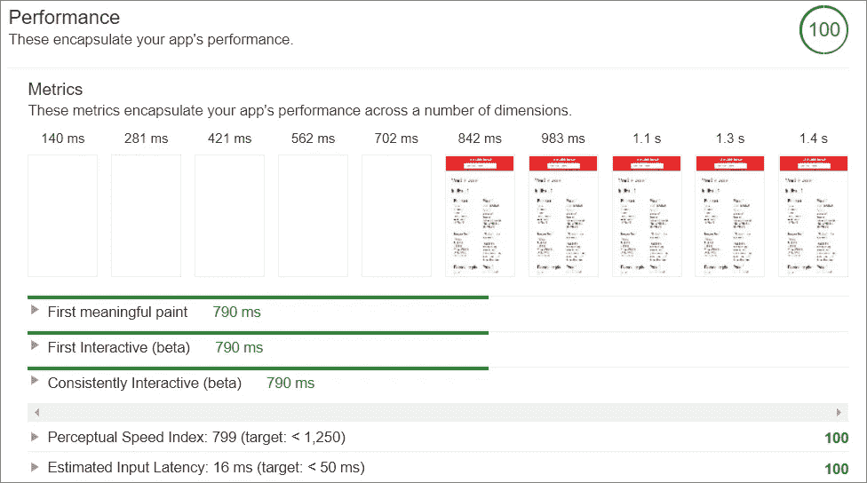

满分 100 分，互动时间 790 毫秒，相当可观！不加载自定义字体会减少 1200 毫秒——是审计报告的两倍！

等等，让我们围绕这一点展开讨论…

首先，性能审计模拟运行在 3G 上的普通移动设备。这不包括我在魁北克的目标受众，他们最近有 iPhones 和 LTE 连接。第二，它测量第一次加载，不考虑后续加载，从而缓存资产。

这一点很重要。浏览器将缓存自定义字体。尽管第一次加载可能需要 2 秒钟，但随后的加载应该不到 1 秒钟。

最后，我认为定制字体对*conju iason . XYZ*的设计很重要。因此，我决定让小胡瓜牺牲首次加载时间。

# 搜索引擎优化

SEO 或者说搜索引擎优化是一个很大的毛兽。通常它由两部分组成:站内 SEO vs 站外 SEO。[现场 SEO](https://moz.com/learn/seo/on-site-seo) 致力于使网站搜索友好。像 sitemaps，robots.txt，结构化数据，元标签(标题，描述)，关键词等等…

[站外 SEO](https://moz.com/learn/seo/off-site-seo) 是关于链接建设——让其他网站指向你的网站，以便[建立权威、相关性和信任](https://www.searchenginejournal.com/seo-guide/search-authority/)。

我不会在这篇文章中涉及站外 SEO。有一天，我可能会决定争夺流量，但目前来说，首先是我。

回到我的愿望清单，还有一件事要看:谷歌搜索。我希望能够谷歌“conjugaison finir”并迅速找到我的网站。正如我所提到的，有很多成熟的网站在争夺关键词“共轭”。然而，根据我的经验，谷歌会认为一个域名非常独特。因此，我可以将我的查询改为“conjugaison.xyz finir ”,希望我的网站的正确页面会出现在第一个结果中。以下是现场搜索引擎优化相关方面，我工作，以达到我的目标。

## 关键词

搜索引擎机器人抓取网页寻找关键词。然后索引器试图确定站点和页面的内容。对我来说，这非常简单——动词的变化。因此，我拥有的 2000 多页中的每一页都遵循这样的标题模式:“[动词]——动词的变化”。此外，我以一种逻辑方式构建了 URL 模式:conjugate ison . XYZ/verbe/[verbe]。

## 网站地图

最佳实践是构建一个包含页面列表的 [sitemap.xml 文件](https://www.sitemaps.org/protocol.html)。对于 conjugaison.xyz，我编写了一个 PHP 脚本来生成包含 2000 多页的 sitemap.xml。sitemap.xml 文件位于我的网站的根目录下。

## 网站链接搜索框

有没有注意到一些网站在谷歌搜索结果中直接集成了搜索框？这是一个叫做[网站链接搜索框](https://developers.google.com/search/docs/data-types/sitelinks-searchbox)的东西，如果你的网站已经有搜索引擎的话，它很容易实现。我只需要提供适当的标记来告诉 Google Search:

```
<script type="application/ld+json">
{
  "[@context](http://twitter.com/context)": "[http://schema.org](http://schema.org)",
  "[@type](http://twitter.com/type)": "WebSite",
  "url": "[https://conjugaison.xyz](https://conjugaison.xyz)",
  "potentialAction": {
    "[@type](http://twitter.com/type)": "SearchAction",
    "target": "[https://conjugaison.xyz/recherche?term={search_term_string](https://conjugaison.xyz/recherche?term={search_term_string)}",
    "query-input": "required name=search_term_string"
  }
}
</script>
```

请注意，谷歌特别声明 Sitelinks 搜索框标记应该[只出现在一个页面上](https://developers.google.com/search/docs/guides/sd-policies#location)。在我的例子中，它是主页——网站上所有动词的索引。

Google 还提供了一个[结构化数据测试工具](https://search.google.com/structured-data/testing-tool)来帮助你验证标记。

## 用谷歌搜索注册我的网站

为了出现在谷歌，谷歌必须知道你的存在。谷歌提供了一个名为谷歌搜索控制台的工具(原名谷歌站长工具)。你可以添加你的网络资产，提供一个网站地图，并要求谷歌索引你的网站。谷歌搜索控制台还将评估您的网站，显示您的统计数据，并为您提供优化您的网站，使其搜索引擎友好的提示。要了解更多信息， [Kissmetrics 有一篇关于谷歌搜索](https://blog.kissmetrics.com/beginners-guide-to-google-webmaster-tools)的好文章。

我在谷歌搜索控制台中添加了 conjugate ion . XYZ，让谷歌对网站进行索引，然后尝试在谷歌中搜索“conjugate ion . XYZ”。该网站出现在搜索结果中-耶！然后我试着搜索一个动词:“conjugaison.xyz finir”。我的网站没有出现在任何搜索结果的首页。废话。

## 站点特定搜索

然后我发现你可以强迫 Google 只搜索一个使用这种模式的网站:“site:conju iason . XYZ finir”。它被称为[站点特定搜索](https://www.google.com/intl/en_u/insidesearch/tipstricks/all.html#site-specific)。这个搜索结果只给了我一个结果——列出所有动词的主页。这个变化页面似乎不在谷歌的索引中。

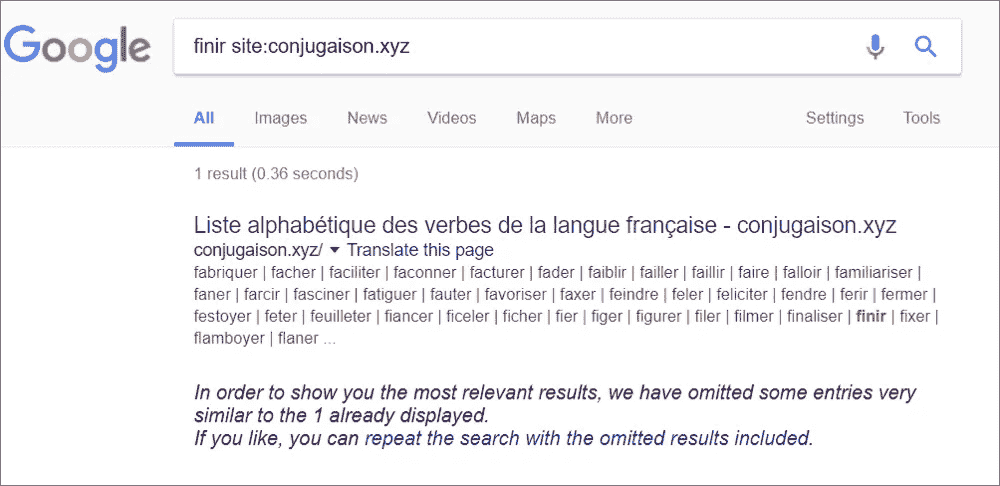

至此，我来告诉你 SEO 最重要的一点。它的耐心。你看，谷歌需要时间来抓取你的网站，并将其添加到搜索结果中。我等了 1 天，2 天，3 天，还是没有结果。一周后，只有几个动词出现。又过了一周，奇迹发生了——当我在自己的网站上搜索一个动词时，谷歌能够给我一致的结果。搜索查询“site:conju aison . XYZ finir”最后给了我这个:

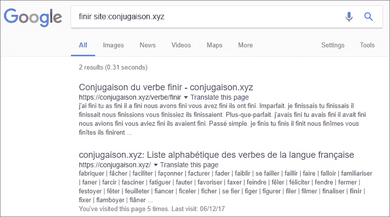

谷歌甚至把动词页面放在首页的前面作为第一结果。答对了。

# 包扎

我非常满意把[conjurison . XYZ](http://conjugaison.xyz)作为查看法语动词变化的个人工具。该网站速度很快，用户在浏览器、谷歌搜索和网站上查找动词的体验非常高效。我想我达到了我的目标。

更棒的是我发现的杀手锏——由于[开放搜索](https://developer.mozilla.org/en-US/docs/Web/OpenSearch)，集成了浏览器搜索。要查找一个动词，我只需打开一个新标签，输入“conjugaison.xyz”和空格进入搜索模式。如下面的视频所示，我花了 5 秒钟查找一个动词。大部分时间我都在打字和移动鼠标。搜索和网站加载不到 1 秒钟。

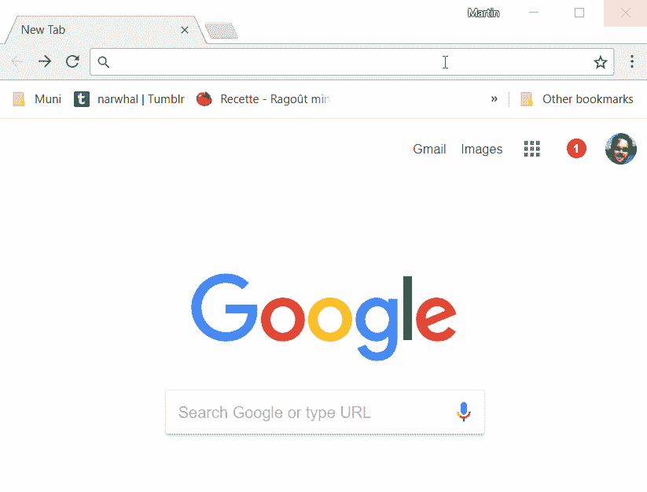

*特别感谢*[*Daniel Tousignant-Brodeur*](https://www.linkedin.com/in/daniel-tousignant-brodeur-78509710/)*[*Pierre-Luc Maheu*](https://www.infoq.com/profile/Pierre~Luc-Maheu)*[*Alexis Philippe*](https://www.linkedin.com/in/philippealexis/)*[*Samuel Lavoie*](https://www.samuellavoie.com/)*阅读草稿并提供反馈。****

**如果你喜欢这个故事，我建议你使用 GitHub 页面*[*快速免费的 RAD。*](/@martindrapeau/fast-and-free-rad-using-github-pages-3ff74c9ce1b7)***