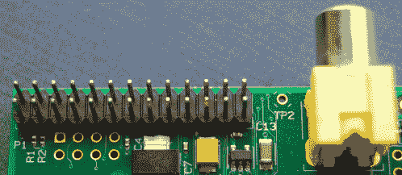
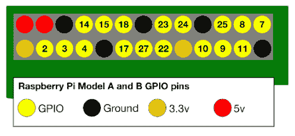
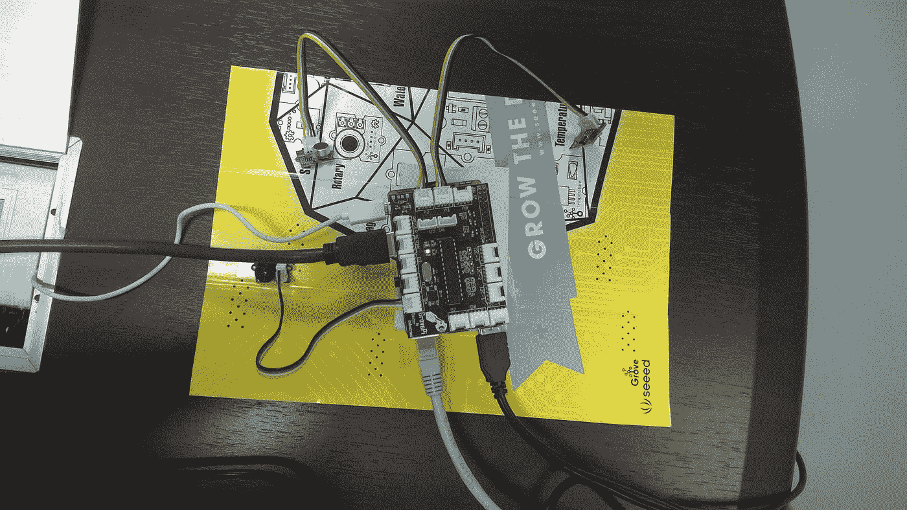
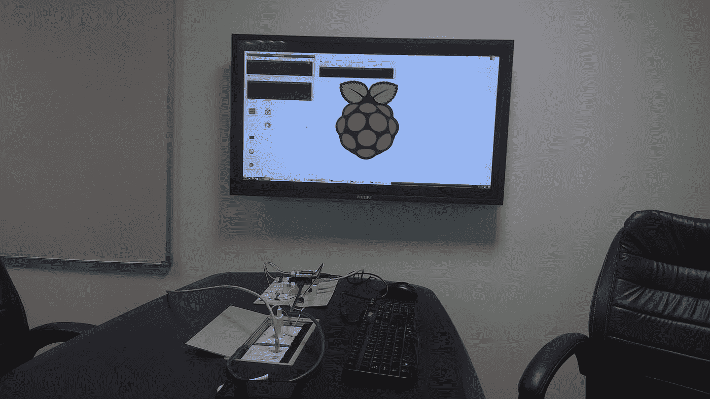
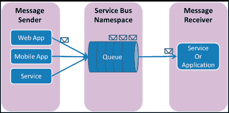
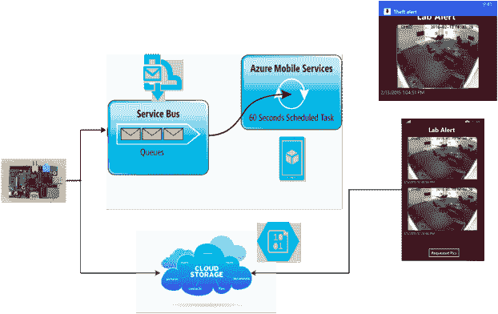

# 使用 raspberry pi 构建安全警报

> 原文：<https://medium.com/hackernoon/building-a-security-alarm-using-raspberry-pi-725a18f42e84>

物联网是当今的一个流行词，如果你是那些渴望开始使用它但无法这样做的人之一，这是一个尝试，以帮助你了解建立物联网系统所涉及的不同部分。我有机会在工作场所参与一个基于物联网的项目，希望在这里分享我的经验。

使用的资源:

1.  树莓 Pi 型号 B
2.  Grovepi 初学者工具包
3.  IP 摄像机
4.  [蔚蓝色](https://hackernoon.com/tagged/azure)服务总线
5.  Azure 移动服务
6.  Azure Blob 存储
7.  本机 Windows Mobile 应用程序

**(I)** 为了开始，我们用 raspbian 操作系统启动了我们的 pi 设备，这是一个针对 raspberry pi 硬件优化的 debian([安装](http://www.raspberrypi.org/documentation/installation/installing-images/windows.md))。

每个 pi 设备都有一排通用输入输出(GPIO)引脚，作为 pi 与外界的接口。我们可以将传感器连接到这些引脚，并根据我们的要求对它们进行编程。在 raspberry 的型号 A 和 B 中，gpio 引脚如下所示:

将传感器连接到 raspberry 有两种选择:

1.  使用试验板、电阻器、电线形成所需的电路。
2.  使用连接器为您完成上述工作。

我们选择了第二个选项，使用了一个名为 grove pi 的设备(现在升级到 grovepi +)，这是一个专门为 raspberry pi 设计的模块板[。这样，您只需将电路板插在 pi 上，然后将所需的传感器与电路板连接。在树莓装置上安装 grove pi 的步骤可以在](https://hackernoon.com/tagged/designed)[上看到，此处为](http://www.seeedstudio.com/depot/GrovePi-Starter-Kit-for-Raspberry-Pipreorder-p-2240.html)。一旦完成，我们就可以开始实验传感器了。

**(II)** **用例**:设置一个安全监视器来检测盗窃报警，并向用户发送带有事件图片的通知

下面是我们用例的任务分解:

1.  将声音传感器连接到 pi 设备。
2.  设置 azure 云服务。
3.  脚本使用声音传感器从周围读取声音输入，并在声音水平超过特定阈值时向队列发送消息(这将是防盗报警器工作的频率值)
4.  为发送的盗窃信息写一个消费者。
5.  显示通知与盗窃照片的应用程序，将由最终用户使用。

## **步骤 1:将声音传感器连接到 raspberry pi**

(i) Grove Pi 有单独的插槽用于连接模拟和数字传感器。模拟传感器端口标记为 A1-An，数字端口标记为 D1-Dm。由于声音传感器是模拟传感器，我们将其连接到模拟端口之一。

(ii)为了在 raspberry pi 上编码，我们将键盘、鼠标连接到它的 USB 端口上。HDMI 端口也连接到 LCD 监视器，LAN 电缆连接到 LAN 端口。完成后，我们的设置如下所示:

Raspberry pi + grove pi + sensors setup

## **第二步:设置 Azure 云服务**

我们需要在 azure 上设置以下云服务:

1.  Azure Blob 存储:Blob 可以是任何类型的文本或二进制数据，如文档、媒体文件或应用程序安装程序。
2.  Azure 服务总线队列:服务总线队列支持代理消息模型。当使用服务总线队列时，分布式应用的组件不直接交互，而是通过充当中介的队列交换消息([参考](https://docs.microsoft.com/en-us/azure/service-bus-messaging/service-bus-java-how-to-use-queues)

Azure Service bus queue architecture

3.Azure 移动服务(现在的移动应用服务) :这是一个移动后端服务，提供云存储，认证和推送通知服务。它基于 RESTful 编程接口来执行 CRUD 操作(使用 HTTP get/put/post/delete 方法)。我们将移动服务用于云存储，并在我们的移动应用程序中提供推送通知服务。

Our IOT system architecture

## **第三步:声音传感器脚本**

该步骤进一步分为以下子步骤:

1.  从外部环境读取声级的代码。
2.  每当声级超过声音阈值(防盗报警器工作的频率)时，我们需要:

> (I)在我们的位置连接到 IP 摄像机，并将当前帧图像保存在 raspberry 上。
> 
> (ii)将保存的图像上传到 azure blob 存储器。
> 
> (iii)在 azure 服务总线队列上发送带有图像名称和时间戳的消息。

## **步骤 4:为服务总线队列创建消费者**

为此，我们决定使用 azure mobile 服务，因为它为我们提供了一个 scheduler 功能，我们可以在某个时间间隔后安排任务连续运行。在我们的案例中，我们希望消费者做两件事:

1.  从队列中发送的消息中读取图像名称。
2.  将图像名称和时间戳存储在表存储器中。

## **第五步:创建移动应用**

我们需要一个移动应用来做以下事情:

1.  每当防盗警报响起时显示即时通知
2.  点击通知时显示盗窃图片。
3.  显示盗窃照片的过去历史。

我们的移动应用程序与 azure 移动服务连接，以使用它的推送通知功能，并从云存储中获取盗窃图片的名称。对应于表存储中的每个盗窃 pic 名称，有一张图片存储在 azure 上的 blob 存储中，应用程序最终从那里获取图像并将其显示给用户。

完成后，我们就可以用 raspberry pi 和基本传感器套件连接设置安全系统所需的不同部件。我们大约在一年前做了这项工作，现在大多数云服务，如 azure 和 amazon，都提供物联网框架，内部将上述服务打包在一起。

感谢您花时间阅读这篇文章，我希望它能帮助您理解设置物联网系统所涉及的不同组件。