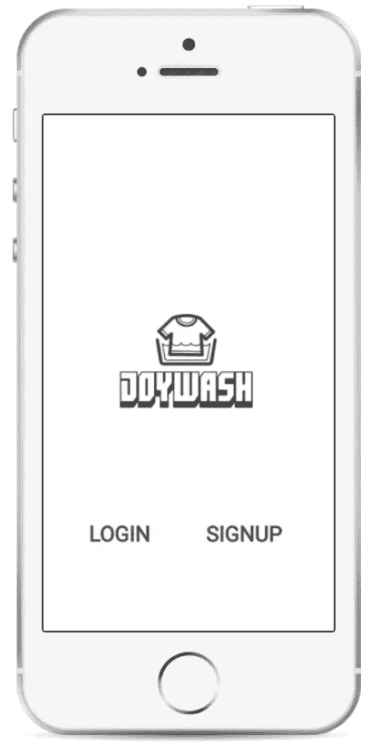
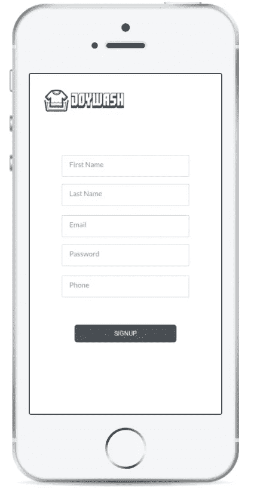
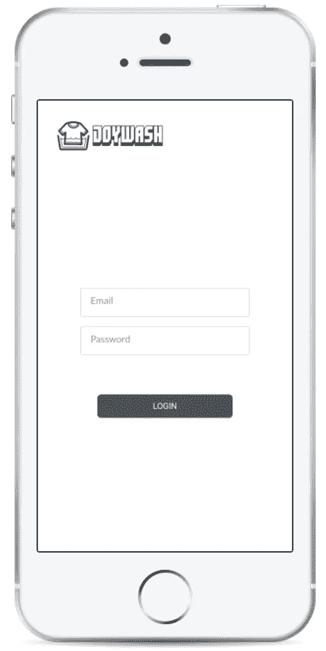
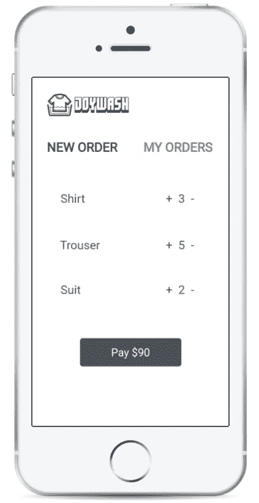
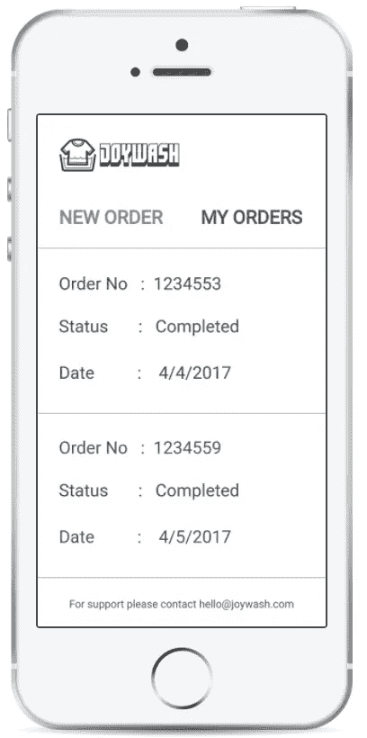
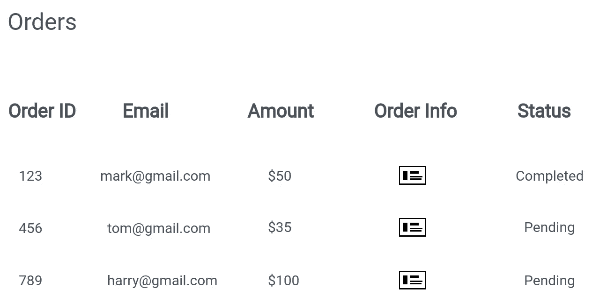
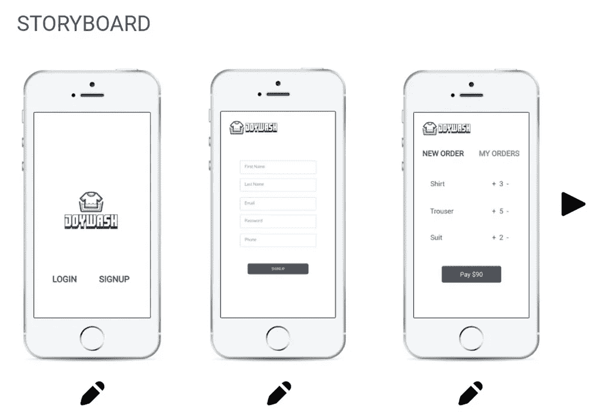

# 从零开始创建一个新公司第二部分:设计解决方案

> 原文：<https://medium.com/hackernoon/building-a-start-up-from-scratch-pt-2-designing-the-solution-a1419b011ebc>

这是[从零开始建立一家初创企业 Pt 1:识别问题](https://hackernoon.com/building-a-start-up-from-scratch-pt-1-identifying-the-problem-48cfbbc390b5)的延续。在本系列的第二部分，我将讲述我是如何着手设计解决方案的。确保你跟随[黑客农](https://hackernoon.com/)和我([费宾约翰詹姆士](https://medium.com/u/75a616711f4e?source=post_page-----a1419b011ebc--------------------------------))，这样你就不会错过系列的后面部分。

概述:我决定在创业的同时写下我的创业经历。上周，我发现了产品开发的高成本问题。我决定做一个工具，可以帮助非科技企业家通过点击几下鼠标来推出他们的产品。首先，我专注于服务业务。

我通过逆向工作设计了解决方案。我首先制作了我应该给用户的可交付物的原型。比方说，乔伊想开一家叫 Joywash 的洗衣店。下面是我的工具应该提供的内容。

所以，是的，我正在生成一个应用程序，可以帮助他的用户注册和订购。也是一个门户网站，他可以在那里处理订单。

现在，这是我的解决方案的样子。

所有的服务业务都有相同的模板。他们可以注册、登录、下订单和跟踪订单。你可以使用这个工具来定制应用程序，以满足你的需求，如更改徽标，添加/删除用户输入字段等。

我把它保持在最小限度，因为我的想法是快速启动它。之后，根据客户反馈改进解决方案。

***目前只有一个模板。但是，以后会有一个商店，开发者可以在那里出售他们的模板。我将在后面的系列文章中详细讨论这一点。下周产品应该会准备好，所以请继续关注。***

# 下周见👋🏻

从现在起一周后，你就可以期待这个系列的下一部分了。 [***你也可以在这里加入邮件列表***](http://eepurl.com/cHBwhL) ***。我会用这个通知你更多的故事，测试邀请等。这是我的私人邮件 jamesfebin@gmail.com 的电子邮件。***

如果你对在云上开发应用感兴趣，请在亚马逊上看看我的书[云是小菜一碟](http://amzn.to/2n03pzO)。

> [黑客中午](http://bit.ly/Hackernoon)是黑客如何开始他们的下午。我们是 [@AMI](http://bit.ly/atAMIatAMI) 家庭的一员。我们现在[接受投稿](http://bit.ly/hackernoonsubmission)，并乐意[讨论广告&赞助](mailto:partners@amipublications.com)机会。
> 
> 如果你喜欢这个故事，我们推荐你阅读我们的[最新科技故事](http://bit.ly/hackernoonlatestt)和[趋势科技故事](https://hackernoon.com/trending)。直到下一次，不要把世界的现实想当然！

