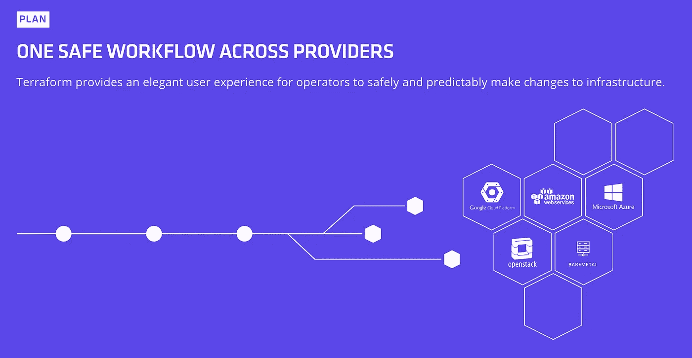

# 用 React、AWS Lambda 和 Terraform 构建静态网站生成器

> 原文：<https://medium.com/hackernoon/building-a-static-website-generator-with-react-and-terraform-823be0b24b12>

## 使用 Terraform 创建 AWS 云服务的指南

我周末的目标是最终发布一些东西到我的领域。我一直在玩[地形](https://www.terraform.io/)，一直在寻找一个借口来建立一个实际的项目，所以我决定扣动扳机，最终致力于它。

在思考到底要做什么的时候，我意识到我没有太多典型的作品集内容，但我在其他服务上分享工作，比如 Github 和 [Twitter](https://hackernoon.com/tagged/twitter) 。我知道我也不想花太多时间去考虑在上面放什么。

我最终建立的是一个自我更新的静态网站。web 服务从 [Github](https://hackernoon.com/tagged/github) 、Twitter 和 Medium 汇总我的最新活动，生成一个静态网站，并将内容发布到我的域。除了作为一个过度设计的、不可转让的名片，当添加到 iOS 主屏幕时，它还是我最常用的应用程序的便捷启动器[。](https://github.com/jschr/jschr.io/blob/master/app/components/Template.tsx#L24)

这是最终产品:

[jschr.io](http://jschr.io) — Add to iOS home screen

我用 React、Webpack 和 Terraform 搭建的。如果你想直接跳到代码，Github 上有[以及如何部署你自己版本的说明。](https://github.com/jschr/jschr.io)

如果您对所选堆栈和项目结构的深入概述感兴趣，请继续阅读。这些示例是用[类型脚本](https://www.typescriptlang.org/)编写的，并假设您对 [React](https://facebook.github.io/react/) 和 [Webpack](https://webpack.js.org/) 有所了解。

# 什么是 Terraform？

[Terraform](https://www.terraform.io/intro/index.html) 是一个用声明性配置文件创建基础设施代码的工具。将基础设施编写为代码的一个主要好处是免费的，您可以获得版本控制、代码审查和协作的所有功能。

有了 Terraform 的声明式配置文件，您可以使用[变量](https://www.terraform.io/docs/configuration/variables.html)和[模块](https://www.terraform.io/docs/configuration/modules.html)来轻松创建和管理您的基础设施。Terraform 类似于 AWS 的 CloudFormation，除了它有一个[不断增长的提供商列表](https://www.terraform.io/docs/providers/index.html)，你可以使用它在许多其他云服务中创建资源。

下面是一个地形配置的样子:

Terraform config to create an AWS S3 bucket.

查看[介绍文档](https://www.terraform.io/intro/index.html)了解更多使用案例和比较。Terraform 是由 Hashicorp 的团队建造的。

# 项目结构

让我们从应用程序结构的概述开始:

High-level view of the project structure.

# 创建 Webpack 配置

第一步也是最神奇的一步是创建 webpack 配置。如果没有这个棒极了的 webpack 静态网站生成器插件[,这个项目就不会这么简单。](https://github.com/markdalgleish/static-site-generator-webpack-plugin)

下面是一个使用插件的简单 webpack 配置:

Basic webpack config for generating a static website.

> **提示#1** :如果 Webpack 具有. ts 扩展名，并且在本地为您的项目安装了 [ts-node](https://github.com/TypeStrong/ts-node) ，那么它支持配置文件的 Typescript。

通过静态站点生成器插件的 locals 选项传递的每个属性都将被发送到服务器端的 render 函数。

Example server-side render function.

每当我们生成一个新的静态网站时，使用本地选项是我们将如何传递应用程序的道具。

为了让我们的网站更加动态，下一步是将它与一些真实的数据联系起来。您可以从本地 markdown 文件中提取数据，或者从 API 中获取数据。在能够获取任何内容之前，我们需要对 webpack 配置进行一些更改。

为了利用 [async/await](https://developer.mozilla.org/en-US/docs/Web/JavaScript/Reference/Statements/async_function) ,我们将转换我们的配置以导出一个异步函数，该函数与 webpack 一起开箱即用。然后，我们可以从 Github 获取最新的活动，并使用 getProps 函数呈现应用程序。

An async webpack config to fetch data for generating our static website, [view the full source](https://github.com/jschr/jschr.io/blob/master/app/webpack.config.ts).

Our getProps function to fetch the latest activity from Github, [view full the source](https://github.com/jschr/jschr.io/blob/master/app/getProps.ts).

> 提示#2 : Webpack 支持从配置文件中导出函数。它将接收您通过命令行设置的任何 env 选项。

webpack 配置的完整源代码可以在 repo 中找到[。相同的配置用于启动 dev 服务器，并在我们的 Lambda 函数中生成一个新的静态网站。](https://github.com/jschr/jschr.io/blob/master/app/webpack.config.ts)

# 服务器端渲染

服务器端渲染函数接收我们在 webpack 配置中获取的应用程序属性以及一个[统计对象](https://webpack.js.org/configuration/stats/)，我们可以用它将 javascript 包注入 html。

The server-side rendering function, [view the full source](https://github.com/jschr/jschr.io/blob/master/app/ssr.tsx).

该模板接收 html 字符串形式的初始应用渲染、客户端需要的来自服务器的任何数据(可通过[窗口对象](https://developer.mozilla.org/en-US/docs/Web/API/Window)访问)以及需要注入的任何 javascript 包。

The template component, [view the full source](https://github.com/jschr/jschr.io/blob/master/app/components/Template.tsx).

# 登上大教堂

在呈现初始页面负载后，浏览器需要使用与呈现 html 相同的属性来引导 React 应用程序。这发生在 mount 函数中，我们需要确保只有在浏览器中运行时**才会被调用。**

Bootstrapping React in the browser, [view the full source](https://github.com/jschr/jschr.io/blob/master/app/mount.tsx).

请注意，index.ts 在中运行，同时在**节点**和**浏览器上下文**中运行，因此[在导入依赖于浏览器 API 的库时，您需要格外小心](https://github.com/jschr/jschr.io/blob/master/app/components/App.tsx#L86)。

现在我们已经设置了服务器端渲染和浏览器客户端，让我们添加一些样式。

# 增添时尚魅力

我选择了使用 [glamor](https://github.com/threepointone/glamor) 进行造型，[一个](https://github.com/Khan/aphrodite) [的](https://github.com/styled-components/styled-components) [多个](https://github.com/rtsao/styletron) [伟大的](https://github.com/gajus/babel-plugin-react-css-modules) [选项](https://github.com/MicheleBertoli/css-in-js)进行 css 在 React。

为什么魅力？

*   它支持服务器端渲染，尽管[有些令人不快](https://github.com/jschr/jschr.io/issues/3)
*   CSS 模块[看起来更难设置服务器端](/@mattvagni/server-side-rendering-with-css-modules-6b02f1238eb1)
*   越来越喜欢用 js 编写 css，因为你拥有 javascript 的所有特性

为项目增添魅力包括两个步骤:

*   在服务器端呈现函数中生成 css 样式表，并将其传递给初始页面加载 css 的模板组件
*   复水 glamor 的服务器状态浏览器端

Glamor 有自己的渲染功能，用于服务器端渲染，返回应用程序的初始 html 和渲染过程中创建的任何样式。当使用 glamor 进行服务器端渲染时，需要注意与导入顺序相关的几个问题[。](https://github.com/threepointone/glamor/blob/master/docs/server.md)

Adds styling via glamor to the ssr function and template component.

现在我们只需要在浏览器中恢复服务器状态:

Rehydrate glamor state in the browser.

这里是你开始添加一堆组件的地方，但是我将跳过创建和样式化组件，转到实际的 Lambda 函数。如果你好奇的话，你可以在回购协议中看到我为我的网站[制作的组件。](https://github.com/jschr/jschr.io/tree/master/app/components)

# λ函数

对于我们的后端，我们将设置一个 [AWS Lambda](https://aws.amazon.com/lambda/details/) 函数来运行 webpack 编译器，并将结果上传到 S3 桶。Lambda 需要的只是一个 javascript 函数，AWS 将为您提供和管理资源。

这是整个 Lambda 函数:

The Lambda handler, [view the full source](https://github.com/jschr/jschr.io/blob/master/app/handler.tsx).

> **提示#3** :您可以使用 [memory-fs](https://github.com/webpack/memory-fs) 将 webpack 构建输出到内存，而不是文件系统

在编译步骤之后，Lambda 会将文件上传到 S3，并使 CloudFront 发行版失效。除了设置 CloudFront，您还可以[将 bucket 配置为一个静态网站](http://docs.aws.amazon.com/AmazonS3/latest/dev/WebsiteHosting.html)。

# 基础设施

现在，我们准备开始创建基础架构。我将使用 AWS Lambda、S3 和 CloudFront 托管网站，并使用 [Mailgun](https://www.mailgun.com/) 发送和接收电子邮件。

以下是地形结构的概述:

Terraform infrastructure overview.

Terraform 从您要部署的环境的目录中执行。在这种情况下，我们只有一个环境，从 env-dev 运行 *terraform apply* 将部署开发基础设施。

每次部署后，Terraform sill 会将所创建资源的状态保存到当前目录下的一个 [terraform.tfstate](https://www.terraform.io/docs/state/) 文件中。在大型团队中工作时，您可能希望使用[远程状态](https://www.terraform.io/docs/state/remote.html)。

## 设置环境

为了部署环境，我们需要创建它的[地形变量文件](https://www.terraform.io/intro/getting-started/variables.html#from-a-file)。这是我们的精简版:

Terraform variables for dev, [view the full source](https://github.com/jschr/jschr.io/blob/master/infrastructure/env-dev/vars.tfvars.sample).

当您运行 *terraform apply* 时，它将运行**当前目录下的每个配置文件**。因为我们从 env-dev 运行命令，所以只有一个文件——dev . TF。

dev 配置文件通过 AWS 和 Mailgun 认证，然后创建应用程序的基础设施。

Terraform environment config, [view the full source](https://github.com/jschr/jschr.io/blob/master/infrastructure/env-dev/dev.tf).

## 应用程序模块

[Terraform 模块](https://www.terraform.io/docs/modules/usage.html)让我们创建基础设施的可重用组件。Terraform 可以使用来自文件系统、Github 和[其他远程资源](https://www.terraform.io/docs/modules/sources.html)的模块。这个项目为整个应用程序使用一个本地模块，但是你可以根据你的需要用任意多的模块组成你的基础设施。

要创建 app 模块，我们将从定义其输入变量开始:

Terraform config for the app module’s variables, [view the full source](https://github.com/jschr/jschr.io/blob/master/infrastructure/modules/app/variables.tf).

这种设置使我们能够在未来轻松创建更多环境，如环境暂存和环境生产。

现在我们可以开始为我们的应用程序创建所有的资源。

## 添加 Lambda 函数

构建项目将打包我们的应用程序并上传到 Lambda。当我们部署时，Terraform 将使用包的散列来决定是否部署新版本的处理程序。

Lambda terraform config, [view the full source](https://github.com/jschr/jschr.io/blob/master/infrastructure/modules/app/lambda.tf).

## 添加 S3 桶

为我们的领域创建一个私人 S3 桶。

S3 bucket terraform config, [view the full source](https://github.com/jschr/jschr.io/blob/master/infrastructure/modules/app/s3.tf).

## 使用 CloudWatch 调度 Lambda

我们将使用 [CloudWatch 事件](http://docs.aws.amazon.com/AmazonCloudWatch/latest/events/WhatIsCloudWatchEvents.html)每 15 分钟触发一次我们的 Lambda。

CloudWatch terraform config, [view the source](https://github.com/jschr/jschr.io/blob/master/infrastructure/modules/app/cloudwatch.tf).

## 添加 CloudFront CDN

为我们的 S3 桶创建一个 CloudFront 发行版。

CloudFront terraform config, [view the full source.](https://github.com/jschr/jschr.io/blob/master/infrastructure/modules/app/cloudfront.tf)

## 添加 DNS 记录

假设您已经在 Route 53 中注册了您的域，我们将使用[数据源](https://www.terraform.io/docs/configuration/data-sources.html)按名称获取我们的域的托管区域，并为我们的网站创建 DNS 条目。

Route 53 terraform config, [view the full source](https://github.com/jschr/jschr.io/blob/master/infrastructure/modules/app/cloudfront.tf).

## 添加电子枪

通过我们的域名收发电子邮件的最快方式是创建一个 [Mailgun](https://www.mailgun.com/) 账户。从您的帐户配置文件中检索您的 api 密钥，并将其添加到 dev.tfvars。

感谢 Terraform 的 [Mailgun 供应商](https://www.terraform.io/docs/providers/mailgun/)，我们可以从配置文件中用 Mailgun 的 API 创建一个新的域资源:

Mailgun provider terraform config, [view the full source](https://github.com/jschr/jschr.io/blob/master/infrastructure/modules/app/mailgun.tf).

创建 Mailgun 域所产生的 terraform 输出将如下所示:

Mailgun domain output from running [terraform show](https://www.terraform.io/docs/commands/show.html).

理想情况下，我们可以告诉 Terraform 为每个接收记录和发送记录创建一个 DNS 条目，但是 [Terraform 目前不支持使用带有计算值的 count】。](https://github.com/hashicorp/terraform/issues/12570)

Mailgun route 53 count issue.

因为记录的数量是已知的，所以我们可以手动创建每个记录作为解决方法:

Mailgun route 53 terraform config, [view the full source](https://github.com/jschr/jschr.io/blob/master/infrastructure/modules/app/mailgun.tf).

现在，我们所有的基础设施都是仅使用 terraform 配置文件设置的，您现在可以运行 [*terraform 计划*](https://www.terraform.io/docs/commands/plan.html) 来预览更改，然后 [*terraform 应用*](https://www.terraform.io/docs/commands/apply.html) 来部署它们。

如果你不想在开始接收邮件前等待 24 小时，你需要在第一次部署后[触发 Mailgun 中的域验证](https://app.mailgun.com/app/domains)。

最后一步是添加一个 Mailgun 路由转发电子邮件到我们的主要帐户。这是我的样子:

Mailgun catch-all route for email forwarding.

# 最后的想法

使用 Terraform，对基础架构进行更改和构建新环境从未如此简单。我不认为我会很快登录 AWS 控制台。

非常欢迎您创建、修改和部署您自己版本的[源代码](https://github.com/jschr/jschr.io)。我很乐意听到你的任何改进建议或者我可以在后续文章中添加的酷功能。

> 黑客中午是黑客如何开始他们的下午。我们是这个家庭的一员。我们现在[接受投稿](http://bit.ly/hackernoonsubmission)并乐意[讨论广告&赞助](mailto:partners@amipublications.com)机会。
> 
> 如果您喜欢这个故事，我们建议您阅读我们的最新科技故事和[趋势科技故事](https://hackernoon.com/trending)。直到下一次，不要把世界的现实视为理所当然！

