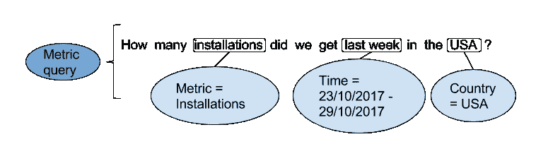
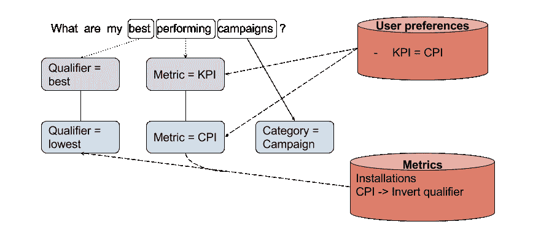
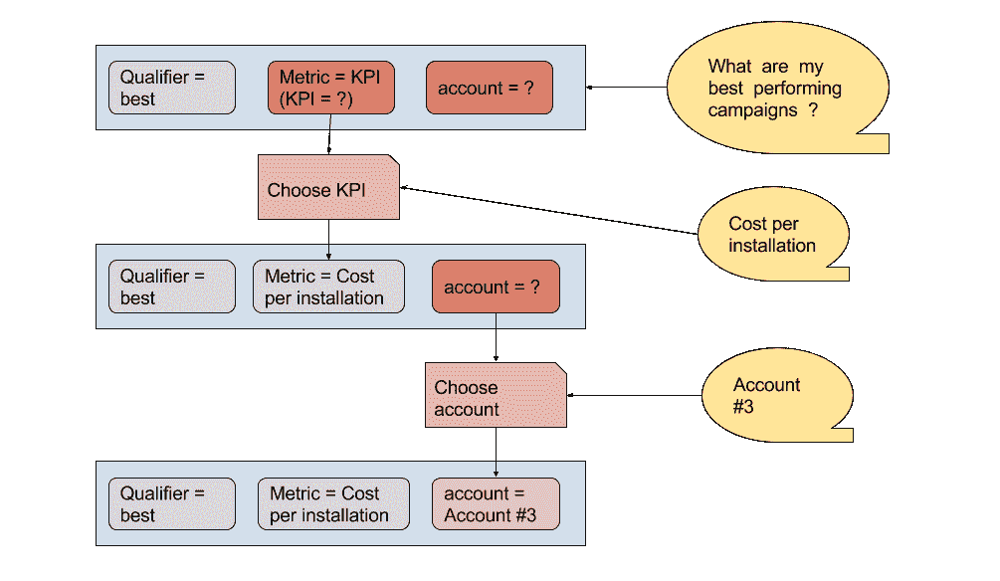
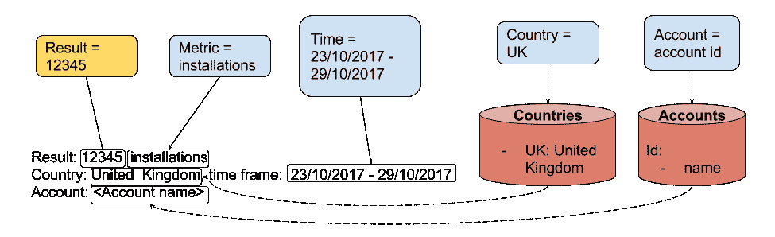
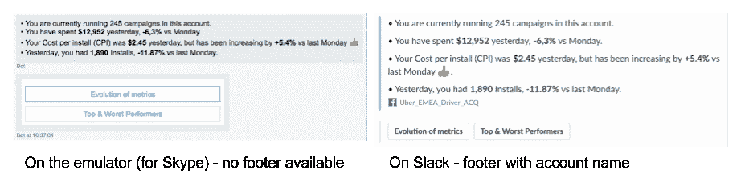

# 建立一个能理解你的意思，而不仅仅是你说的话的虚拟同事

> 原文：<https://medium.com/hackernoon/building-a-virtual-coworker-who-understands-what-you-mean-not-only-what-you-say-b7849465e69b>

## 为了建立一个虚拟分析师而不是机器人，我们的第一个挑战是解决对话管理。我们都在 Youtube 上看到过数百个视频，其中 Alexa 和 Siri 无法处理基本问题……的确:这很难。

# 那么我们如何解决这个问题呢？

Aiden 是一个专家系统，它可以智能地理解并使用我们从市场营销领域学到的知识来完成请求。你用普通语言与 Aiden 交流，而不是命令、关键词或按钮，就像你与任何同事交流一样。

我们的用户使用“自然语言”与艾登互动。大多数人认为它是从话语中提取意图和实体——它确实是一个关键的组成部分。然而，能够与用户进行真正的对话需要更多的步骤。事实上，提取实体只是复杂过程的开始。

简而言之，当用户提问时，我们从用户查询开始，用户查询是字符串短语，我们希望构建可以操作的类型化对象，并将它们路由到正确的操作处理程序。

我们构建的阶段摘要:

1.  提取意图和实体
2.  置于上下文中
3.  巩固
4.  执行
5.  撰写回答

# 1.提取实体

从输入短语中，我们提取原始数据，我们将能够操纵。我们的识别器是定制预处理器和微软 LUIS([https://www.luis.ai/home](https://www.luis.ai/home))的组合。

它返回一个 JSON 数据对象，带有已识别的意图、分数和带注释的实体。

# 2.置于上下文中

用户/Aiden 交互很少是单个的来回。艾登需要能够理解和跟踪整个对话的背景。

一个典型的例子就是我们所说的“跟进”，用户可以修改之前的查询，而不必完全重复它。

**处理后续查询**

如果有连接词或代词，如“*和*或“ *it* ”，识别器将分配意图后续，我们扩展先前的查询

**用户偏好**

每个营销人员都有自己的方式来评估他们活动的表现。他们可能会寻求数量，或者他们可能更喜欢控制他们的支出等。这将成为他们的“关键绩效指标(KPI)”，也是我们所说的用户“偏好”的一部分。

我们将它们存储在数据库中，因此当用户询问她的 KPI 或她在各种活动中的“表现”时，我们会根据存储在数据库中的用户偏好来解释查询。

Aiden 还允许用户对结果进行排序。例如，他们可以问:“*我表现最好的营销活动是什么*”。Aiden 需要对结果进行排序，并解释限定符。例如，就 CPI(单位安装成本)而言，“*最佳*”实际上意味着“*最低 CPI* ”。

# 3.巩固

聊天界面与其他网络或桌面应用程序的区别之一是导航是免费的，查询可能会遗漏一些要求。一些应用程序可以使用需要验证的表单。在我们的例子中，我们提示缺少的参数，直到可以处理查询。

保持与前面相同的例子，如果用户问“*我表现最好的活动是什么？**第一次，我们数据库里没有 KPI。我们提示输入 KPI，并从可供用户使用的指标中给出一个可能性列表。*

*然后，我们将存储给定的 KPI 值，并用选择的指标合并查询。*

**

*同样，帐户是必需的，如果用户有多个帐户设置，我们可以在新会话中询问哪个帐户。*

# *4.执行*

*我们将最终的查询发送到后端以获得结果。*

*一个用户请求可以转换成多个查询。例如，如果用户要求“账户概述”，Aiden 将其解释为:*

*   *对 3 个最具消费力的活动的质疑*
*   *对 cpi 最差的 3 个活动的查询*
*   *查询具有最佳 cpi 的 3 个活动*

*所有的查询都被发送到后端，Aiden 收集结果。*

# *5.撰写回答*

*结果被提供给一个消息生成器，它执行一些与解码器相反的操作。*

*例如，国家代码 UK 被转换为“*英国*”。*

*帐户名称也使用帐户数据库显示。*

**

# *输出*

*结果转换成微软 Bot 框架的消息对象([https://docs.botframework.com](https://docs.botframework.com))。*

*在需要或要求它的平台(如 Slack)中，我们用自定义功能增加了这个消息对象([https://docs . Microsoft . com/en-us/bot-framework/dot net/bot-builder-dot net-channel data](https://docs.microsoft.com/en-us/bot-framework/dotnet/bot-builder-dotnet-channeldata))。*

*例如，帐户名称可以显示在 Slack 的页脚中，([https://api.slack.com/docs/message-attachments](https://api.slack.com/docs/message-attachments))，因此我们在发送消息之前将其转换为自定义格式。*

**

*如果你也在处理 NLP，我们希望在评论中听到你的想法。*

*如果你喜欢我们做的工作，我们正在招聘！在[https://angel.co/aiden/jobs](https://angel.co/aiden/jobs)找到我们的招聘信息*